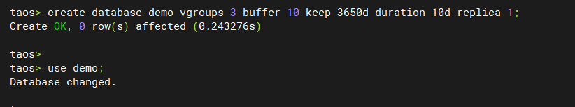
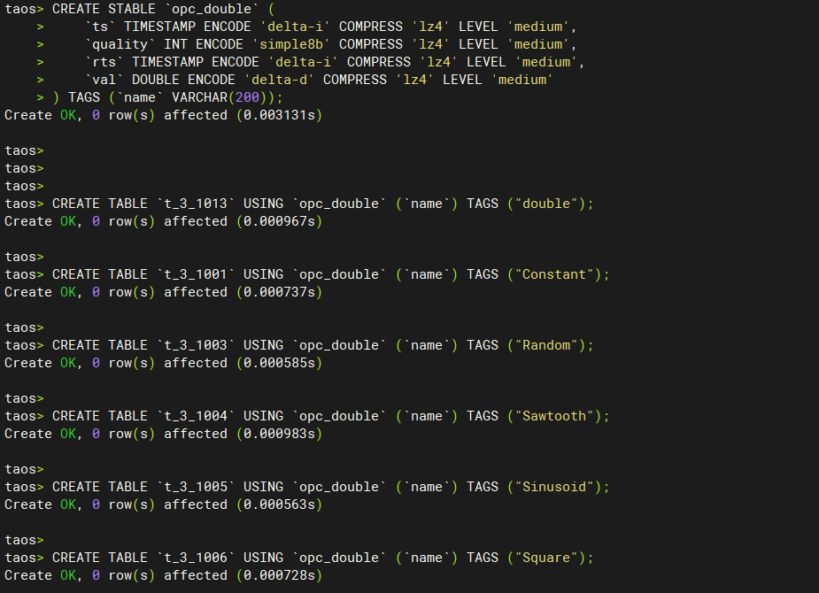
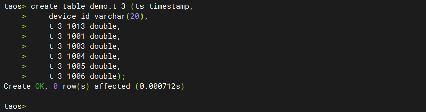
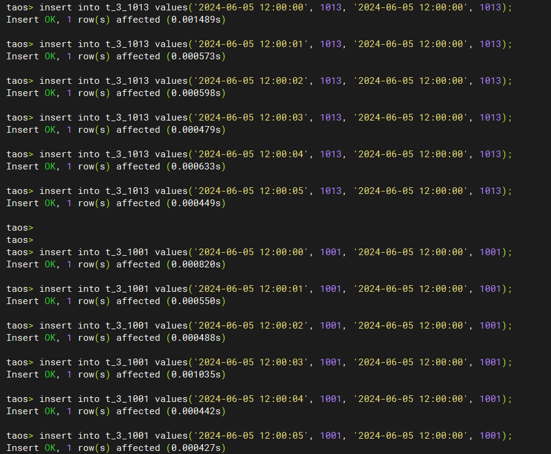
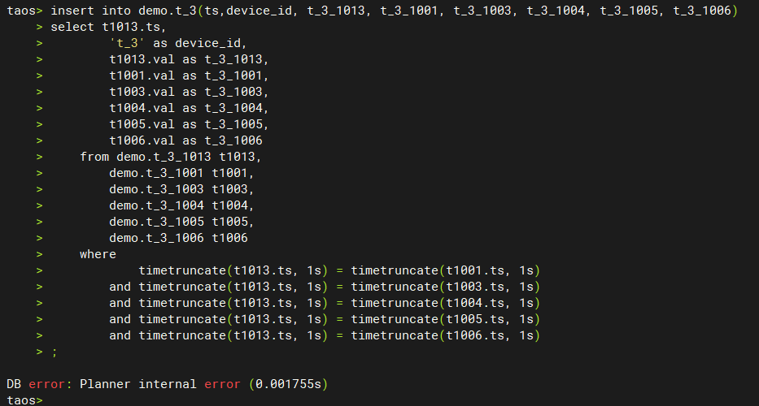
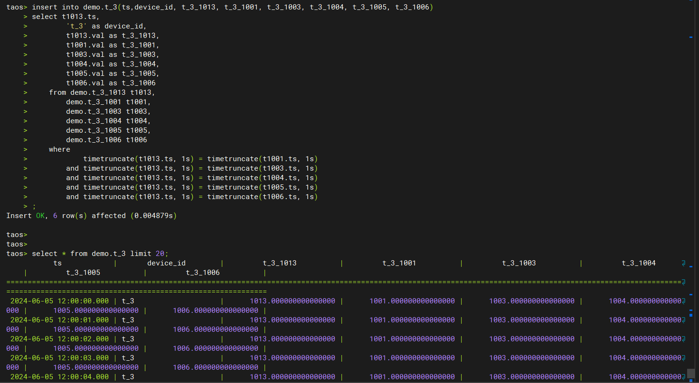

# TS-4955 执行 insert into (fields) subquery失败问题测试报告

## 1. 测试目标

验证insert into select子查询语句的执行，当子查询中有常量字段时，可以正常插入到目标表中。

## 2. 变更历史

| Date | Version | Owner | Memo |
| --- | --- | --- | --- |
| 2024/06/18 | 0.1 | Cris Pei | Draft |

## 3. 测试结论

问题修复，测试通过

## 4. 已知问题和限制

无

## 5. 测试资源及环境

测试平台：Linux x64
测试资源：本机虚拟机
测试版本：V3.3.2.0 
main 分支 commit 50f8a2ed1b9ab7b74b26a5e11dd6bfe229e9accc
3.0分支 commit 425990279eafb2d553af8d1463a2d8f29f5fe0c6
3.1分支 commit 1fcdf985de5ab7223977a4cbf71d47329472d731

## 6. 测试范围及方法

### 6.1 测试方法：

先使用 V3.3.0.8 复现，再按照同样的复现步骤验证修复版本

### 6.2 测试范围：

通过insert into select子查询语句向目标表插入数据，其中select子查询语句涉及多表关联和常量字段。

## 7. 测试数据

[TS-4955 测试数据](https://taosdata.feishu.cn/file/RsRRbWfXXoVL4IxeXpIckeFenTe)

## 8. 测试步骤：

### 8.1 复现步骤：

1. 下载并运行发现问题版本TDengine；
2. 运行taos，并创建demo数据库；

1. 创建select子查询语句相关的超级表和子表;

1. 创建insert目标表（普通表）;

1. 在select子查询语句相关的子表中插入测试数据；
仅列出插入的部分测试数据，全部测试数据见上边 7.测试数据 部分：

1. insert into select带有常量字段的子查询插入目标表失败

### 8.2 测试结果：

问题不再复现：使用各个修复版本，依次根据复现步骤进行测试，可以成功插入带有常量字段的select子查询数据，问题已经解决。

