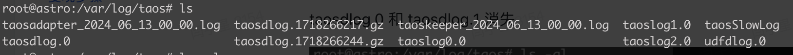
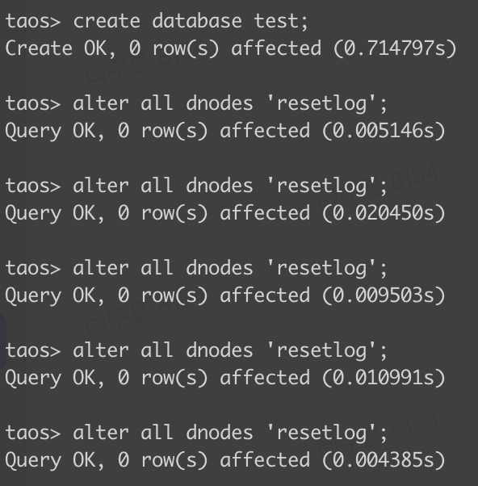
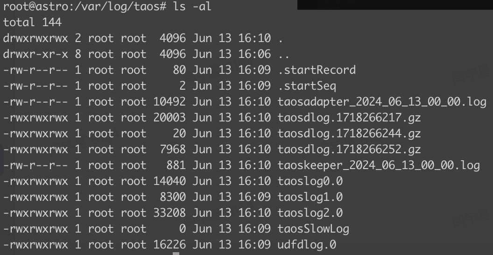
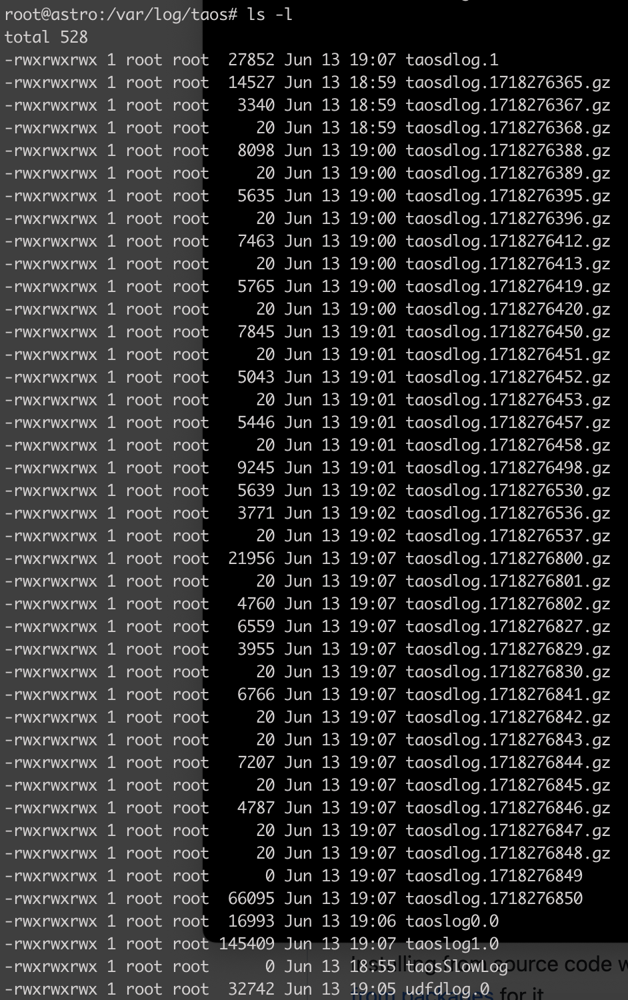
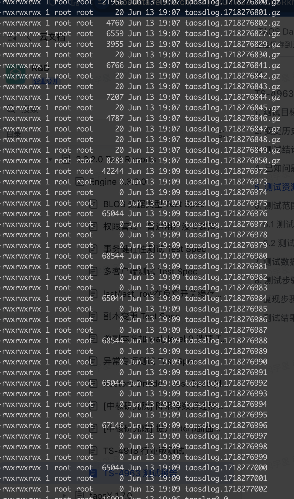
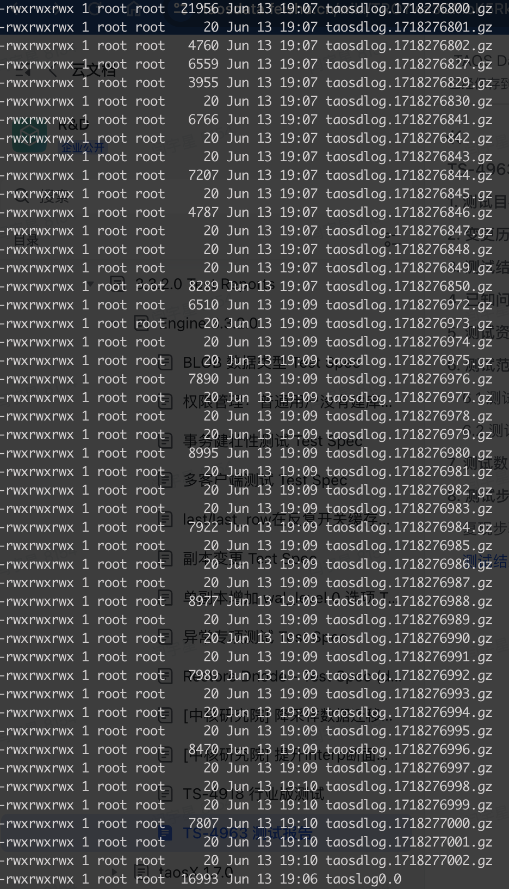

# TS-4963 taosdlog 丢失问题测试报告

## 1. 测试目标

验证使用 taosBenchmark 插入数据，并在taos 中执行 alter all dnodes 'resetlog'; 出现的 taosdlog 文件消失的问题修复

## 2. 变更历史

| Date | Version | Owner | Memo |
| --- | --- | --- | --- |
| 2024/06/13 | 0.1 | Astro |  |

## 3. 测试结论

未复现，测试通过

## 4. 已知问题和限制

无

## 5. 测试资源及环境

测试平台：Linux x64
测试资源：本机虚拟机
测试版本：V3.3.0.3 （复现）及 3.0 分支 commit 5f4b506777625fd144e2b981ff70da5c8a78f48b

## 6. 测试范围及方法

### 6.1 测试方法：

先使用 V3.3.0.3 复现，再按照同样的复现步骤验证修复版本

### 6.2 测试范围：

/var/log/taos 下文件变更

## 7. 测试数据

taosBenchmark json: 
<view type="1">

  > ⚠ 嵌入文件，需在飞书中查看 (token: XbnTbKlELodqb1x1CNfcMlnHnCg)

</view>

## 8. 测试步骤：

### 8.1 复现步骤：

1. 将 /etc/taos/taos.cfg 中的 logKeepDays 选项取消注释，值改为 1
2. 启动 taosd
3. 在 taos 中创建数据库 test;
4. 使用 taosBenchmark 插入数据，在 taos 中执行 alter all dnodes 'resetlog'; 
5. 多次执行 第四步，即可稳定复现
刚开始存在 taosdlog.0

执行 alter all dnodes 'resetlog' 并插入数据

taosdlog.0 消失

### 8.2 测试结果：

问题不再复现

但是频繁执行这条语句，会产生很多空日志文件

一段时间后就变成 .gz 文件了

