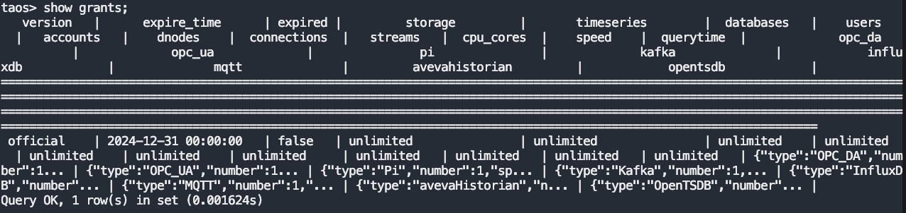
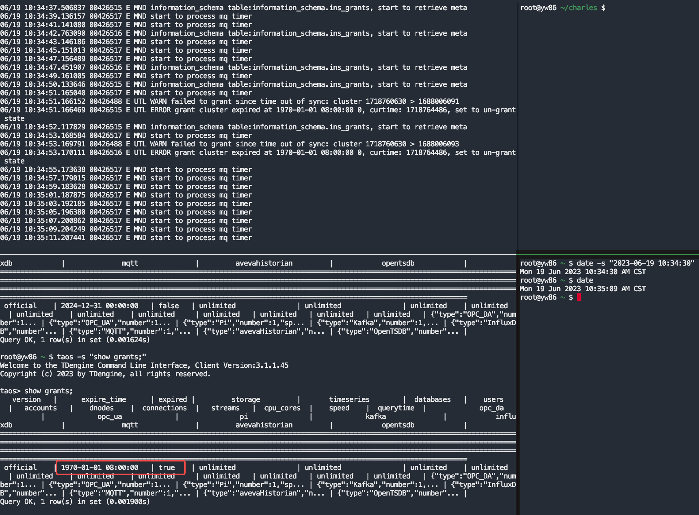
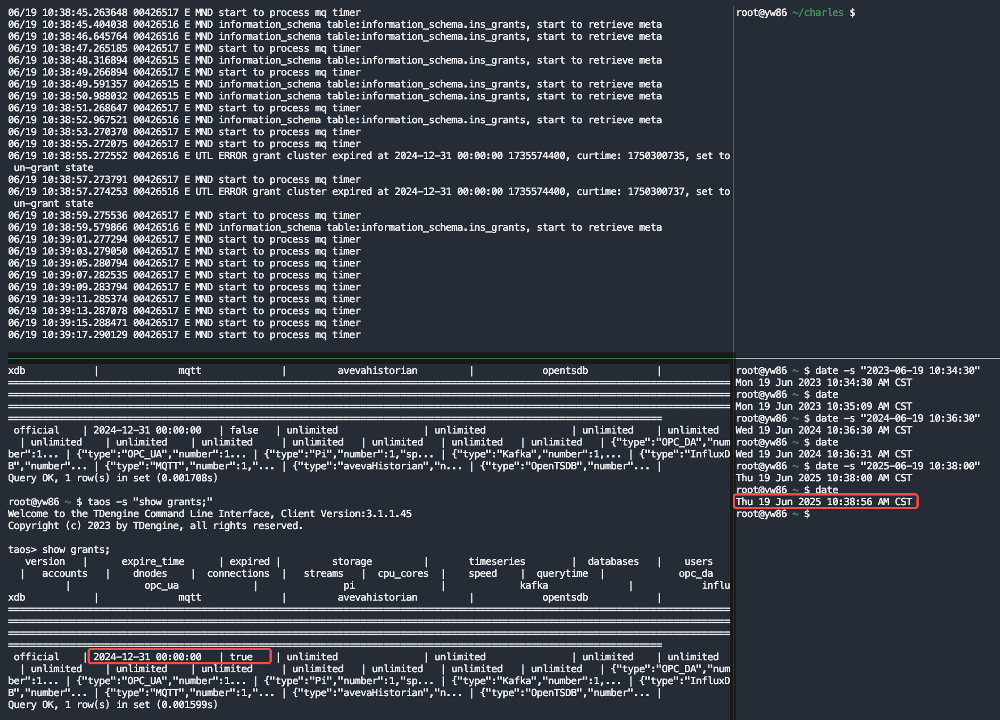
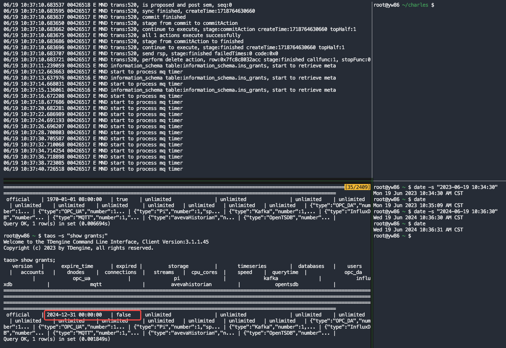
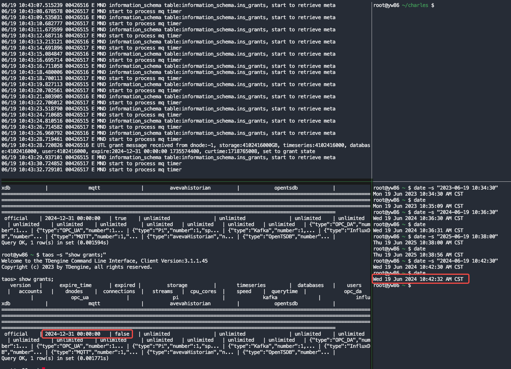
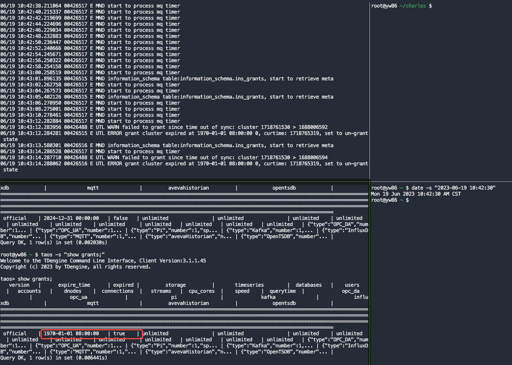
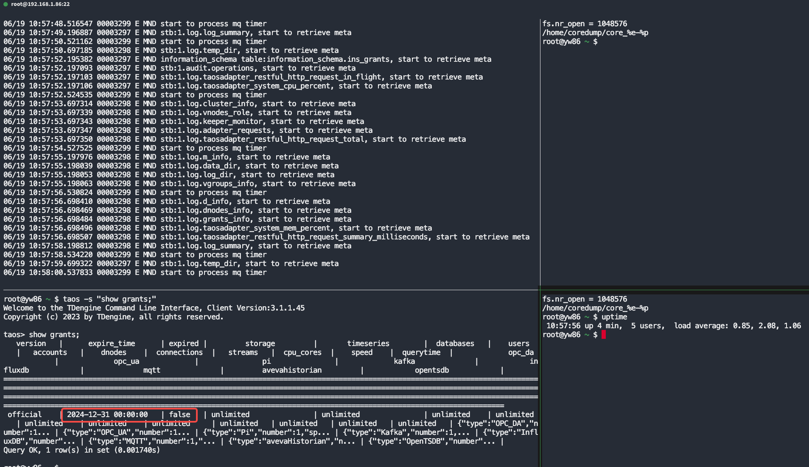
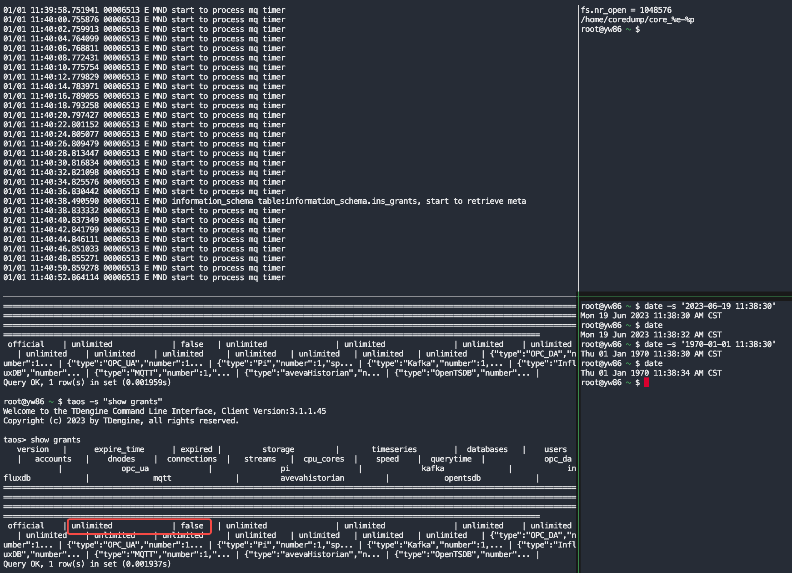
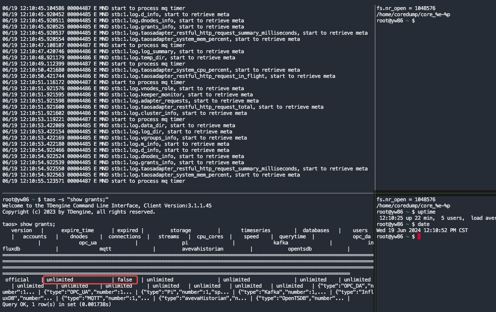

# TS-5034 复现中船永久授权失败测试

## 1. 测试目标

Jira：https://jira.taosdata.com:18080/browse/TS-5034?src=confmacro
本次测试目标是复现中船使用V3.1.1.45过程中出现的永久授权失败问题。

## 2. 变更历史

| Date | Version | Owner | Memo |
| --- | --- | --- | --- |
| 2024-06-19 | 0.1 | Charles |  |

## 3. 测试结论

经测试，使用TDengine V3.1.1.45企业版，授权状态在系统时间变化后，授权失效，待系统时间调整正确或系统重启完成后，授权状态恢复，未能复现授权失败问题。

## 4. 已知问题和限制

无

## 5. 测试资源及环境

测试平台：Linux x64
测试资源：192.168.1.86
测试版本：taosd version: 3.1.1.45 compatible_version: 3.0.0.0

## 6. 测试重点

本次测试的重点如下：
1. 新安装的系统授权后，多次向前/后修改系统时间，授权过期后，调整正确系统时间，授权是否恢复
2. 修改系统时间后，重启系统后，调整正确系统时间，授权是否恢复

## 7. 测试用例

| No. | 测试步骤 | 测试结果 |
| --- | --- | --- |
| 1 | 1. 安装V3.1.1.45 TDengine企业版并启动集群 1. 生成指定过期时间授权码并通过taos.cfg配置授权码激活集群 1. 通过命令date -s向前/后修改系统时间并查看授权状态 1. 通过命令date -s调整正确的系统时间并查看授权状态 1. 重复步骤3， 4 | 1. 安装并启动集群正常 1. 激活码激活集群正常  1. 集群授权过期   1. 集群授权恢复   1. 持续10次，结果一致 |
| 2 | 1. 安装V3.1.1.45 TDengine企业版并启动集群 1. 生成指定过期时间授权码并通过taos.cfg配置授权码激活集群 1. 修改系统时间后，检查集群授权状态，重启集群 1. 集群重启后，检查集群授权状态 | 1. 安装并启动集群正常 1. 激活码激活集群正常 1. 集群授权过期，重启集群  1. 集群重启完成后，系统时间恢复，授权状态恢复  |
| 3 | 1. 安装V3.1.1.45 TDengine企业版并启动集群 1. 生成永久授权码并通过taos.cfg配置授权码激活集群 1. 修改系统时间，重启集群并检查授权状态 1. 集群重启后，检查集群授权状态 | 1. 安装并启动集群正常 1. 激活码激活集群正常 1. 修改系统时间，重启集群  1. 集群重启完成后，系统时间恢复，授权状态不变  |

## 8. 问题 {folded="true"}

无

## 9. 测试计划  {folded="true"}

2024-06-17 -- 2024-06-19

## 10. 测试备忘 {folded="true"}

无

## 11. 参考文档 {folded="true"}

无
