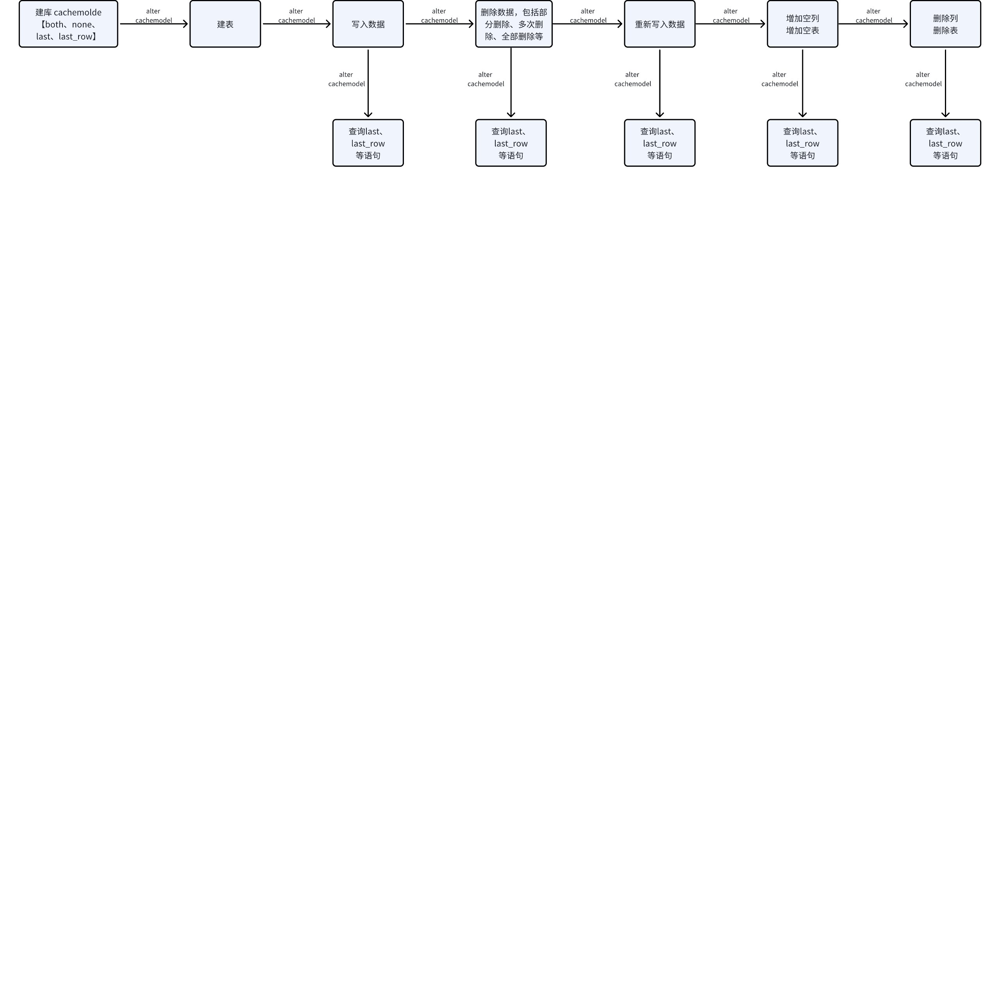

# last/last_row在反复开关缓存下正确性 Test Spec

## 一、测试目标

  测试的需求文档：[当前客户成功面临的挑战和举措](https://taosdata.feishu.cn/wiki/Eit4wdGLciwMzikhkoScvJXtnng) 的加强内部测试：last/last_row 在反复开关缓存下的正确性测试。
及[last 缓存行为优化](https://taosdata.feishu.cn/wiki/CvQewx9iLi1UESkDs3qcgCk9n1t)，此文未有明确的结论，从交付易用性看，重建缓存是有必要的。

## 二、变更历史

| Date | Version | Owner | Memo |
| --- | --- | --- | --- |
| 2024-05-28 | 0.1 | guoxy | 初稿 |
|  |  |  |  |

## 三、测试结论

 1、
 2、
整体测试结论：

## 四、开发质量报告

结论：本特性/优化的开发质量是（**优，**良，一般，差，很差）

| 统计指标 | 数量 |
| --- | --- |
| 提测被拒次数 | 0 |
| 基础测试用例不通过 | 0 |
| Bug 总数 | 0 |
| 严重 Bug 总数 | 0 |

## 五、已知问题和限制

- https://jira.taosdata.com:18080/browse/TD-30200?filter=-2
- https://jira.taosdata.com:18080/browse/TD-30154?filter=-2

## 六、测试资源及环境

   测试平台：Linux x64
   测试资源：192.168.1.44（普通版）、64（asan版本）
   测试版本：3.3.1.0

## 七：测试范围及重点

 本测试主要对缓存相关功能的重点测试，包含
  a：功能及正确性测试：基本功能测试，last、last_row在各种场景下的正确性
  b：可靠性测试：kill leader、restart leader、同时搭配异常测试专项
  c：性能测试：
  d：升级和兼容性测试：

此次测试的重点优先级：a、b、c、d。
a：重重点测试，问题高发区，重点覆盖。
b：重点测试，主要在异常测试专项中进行，见[异常专项测试 Test Spec](https://taosdata.feishu.cn/wiki/I6nXwNdbRiMZsAkDazucx0YsnPc)。
c：在翟坤进行写入性能场景中会记录10组性能查询sql的耗时，sql见测试用例3。
d：测试重点，但主要在浩然升级场景中覆盖，这里只做日常代码更新的升级测试。

## 八、测试数据 

这里用于描述性能、稳定性测试时的数据准备工作，包括但不局限于：
- field的数量、类型：默认taosBenchmark插入json的数量
- tag的数量、类型：默认taosBenchmark插入json的数量
- 数据写入方式，包括taosc、stmt、resetful、schemaless等多种组合.

## 九、测试用例

首先把数据在不同时间，缓存查询的几种场景进行了拆分，确保不遗漏。

| 分类 | 用例编号 | 测试场景 | 测试内容/步骤 | 预期 | 结果 | 备注 |
| --- | --- | --- | --- | --- | --- | --- |
| 1 【基础用例】 | 创建单副本数据库，包含多种数据写入（预计9种）方式。 | 1、Create db replica 1 2、单json包括各种写入方式，或者每种类型一种写入方式。 | 1、数据库创建成功。 2、数据写入成功。 |  | 因为stmt缓存问题，增加多种写入方式 |
| 2【基础用例】 | Alter cachemodel=none、both、last、last_row | 1、在上图中，一共有11处可以alter cachemodel的地方，修改成功，并搭配用例3验证查询结果 | 1、修改成功 |  | 提取出公共方法，在各个阶段可以执行 |
| 3【基础用例】 | 查询语句封装和验证 | 1、select last(*) from meters; 2、select last_row(*) from meters; 3、select count(*) from (select last(*) from meters group by tbname); 4、select count(*) from (select last_row(*) from meters group by tbname); 5、select last(ts) ts,tbname from meters group by tbname order by ts limit 5; 6、select last_row(ts) ts,tbname from meters group by tbname order by ts limit 5; 7、select last(ts) ts,tbname from meters group by tbname order by ts desc limit 5; 8、select last_row(ts) ts,tbname from meters group by tbname order by ts desc limit 5; 9、select last(ts) ts,tbname from meters where ts between start and end group by tbname order by ts limit 5; 10、select last_row(ts) ts,tbname from meters where ts between start and end group by tbname order by ts limit 5; 11、select last(ts) from meters; 12、select last_row(ts) from meters; 13、select last(column) from meters; 14、select last_row(column) from meters; | 1-10、查询数据正确 |  | 1、2：查询数据正确 3、4：查询缓存的字表数量正确 5、6、7、8：主要验证数据写入、更新、删除后的缓存重建时ts是否正确 9、10:在时间范围内查询缓存是否正确。 11、12、13、14:主要验证列非常多时查询单列的高效 问题重灾区 |
| 4、【基础用例】 | 数据写入 | 1、数据写入 2、数据更新写入 3、单表写入较大时间 | 1、数据写入成功，用例3查询正确 2、数据更新成功，用例3查询正确 3、数据写入成功，用例3查询正确 |  |  |
| 5、【基础用例】 | 数据删除 | 1、数据单表删除 2、数据多表删除 3、数据多表多次删除 | 1、数据删除成功，用例3查询正确 2、数据删除成功，用例3查询正确 3、数据删除成功，用例3查询正确 |  |  |
| 6、【基础用例】 | schema变更 | 1、超级表增加列 2、超级表减少列 3、超级表增加多列 4、超级表减少多列 | 1、列增加成功，用例3查询正确 2、列删除成功，用例3查询正确 3、多列增加成功，用例3查询正确 4、多列删除成功，用例3查询正确 |  | 空表，空列建表标记优化 |
| 7、【基础用例】 | 空表增加删除 | 1、超级表增加一个空表 2、超级表减少一个空表 3、超级表增加多个空表 4、超级表减少多个空表 | 1、空表增加成功，用例3查询正确 2、空表删除成功，用例3查询正确 3、多空表增加成功，用例3查询正确 4、多空表删除成功，用例3查询正确 |  |  |
|  |  |  |  |  |  |
| 11、双副本 | 创建双副本库 | 执行用例1-7 | 1-7用例测试通过 |  |  |
| 12、双副本 | 单副本变更双副本库 | 执行用例1-7 | 1-7用例测试通过 |  |  |
| 13、三副本 | 创建三副本库 | 执行用例1-7 | 1-7用例测试通过 |  |  |
| 14、三副本 | 单副本变更三副本库 | 执行用例1-7 | 1-7用例测试通过 |  |  |

## 十、问题(Optional)

这里用于记录需要讨论的问题：
- 暂无

## 十一、Jira

此feature相关的所有Jira, 标题中应包含统一的标签: last

## 十二、测试计划 

2024.06 -- 2024.07。

## 十三、参考文档 

[last 缓存行为优化](https://taosdata.feishu.cn/wiki/CvQewx9iLi1UESkDs3qcgCk9n1t)
