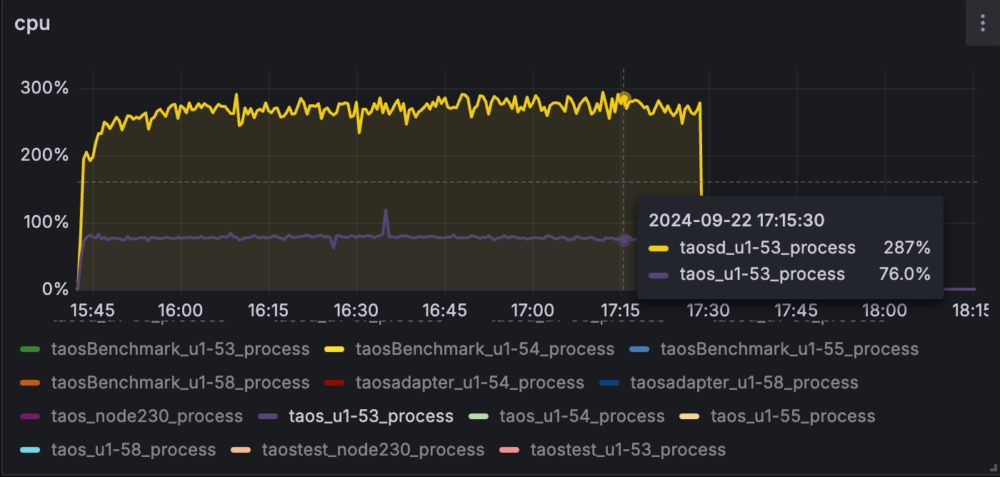
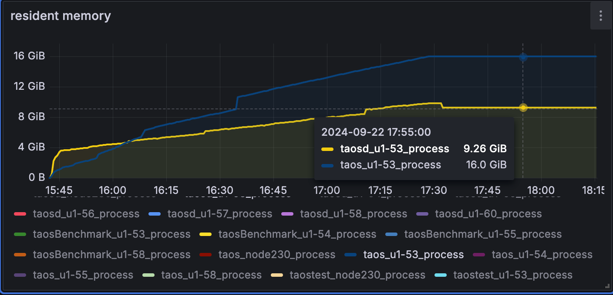
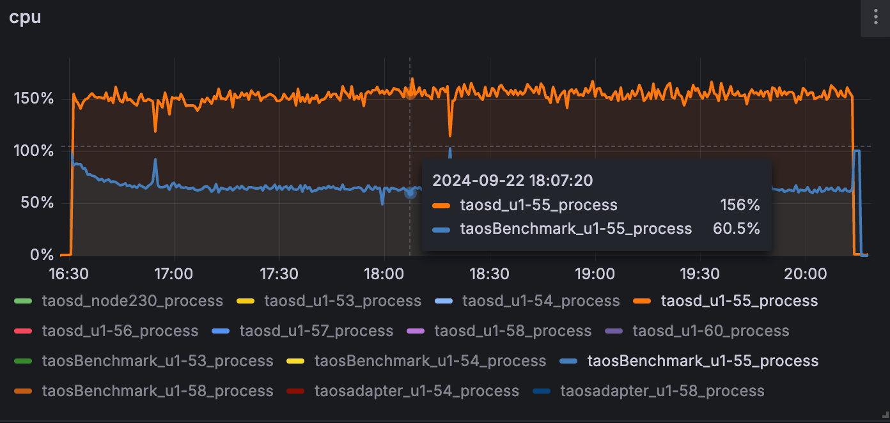
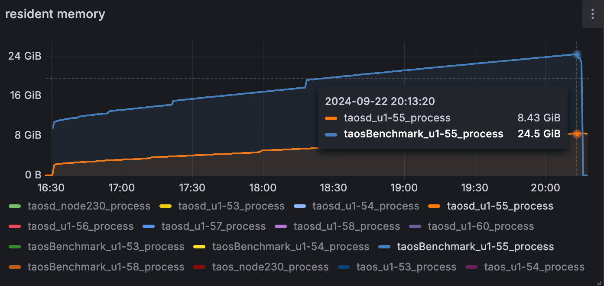
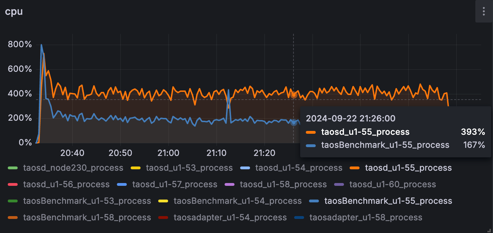
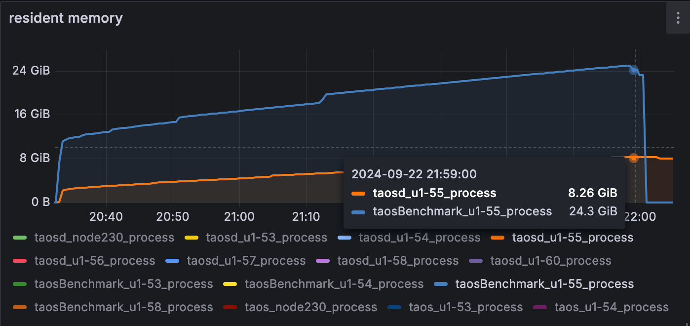

# 从 CSV 批量建表 Test Spec

## 1. 测试目标

对 CSV 批量建表功能进行测试；（[从 CSV 文件批量创建子表](https://taosdata.feishu.cn/wiki/QU74w0DqDiMw6UkO5HbccZ4pnTe)）

## 2. 变更历史

| Date | Version | Owner | Memo |
| --- | --- | --- | --- |
| 2024-06-20 | 0.1 | @贾靖斌 | New |
| 2024-06-25 | 0.2 | @贾靖斌 | 按照 review meeting，调整用例编号 7，分别测试顺序不一致的列 value 是否能满足对应类型的情况，调整用例编号 20，可以接受内容符合要求但扩展名为非 csv 的文件 |

## 3. 测试结论

1. （9.1章节）所有功能测试项已通过；
2. （9.2章节）性能方面，随着 tag 数量增加，建表性能几乎线性降低；
3. （9.2章节）性能方面，tag 数量为 96 时，随着建表数量从 10W -> 100W -> 1000W 增加，性能有所降低，且 10W -> 100W 降低较多，100W -> 1000W 反而降低较少，这里需要开发排查；（9610->8710->8584 tables/s）
4. （9.3章节）1 亿子表稳定性测试，对比 taosBenchmark 测试，taosBenchmark 配置单线程建表时，性能比 csv 建表低了一倍左右，taosBenchmark 配置 10 线程建表时，性能比 csv 建表高了 24 %，这时在当前环境磁盘 IO 已是瓶颈，分析原因：csv 建表是单线程解析，多线程建表，taosBenchmark 的线程由配置项决定，会有一些差异，单线程时 csv 解析是瓶颈，多线程时磁盘 IO 是瓶颈。

## 4. 开发质量报告

结论：本特性/优化的开发质量是**良**

| 统计指标 | 数量 |
| --- | --- |
| 提测被拒次数 | 0 |
| 基础测试用例不通过 | 0 |
| Bug 总数 | 12 |
| 严重 Bug 总数 | 1 |

## 5. 测试数据

| **测试项** | **tag/tbname** | **type** | **count** |
| --- | --- | --- | --- |
| **tag（所有类型）** | all | all*1 |
| **tag（边界）** | int | 128[129] |
| **tbname** | - | 10 |
| **tag** | int + double + varchar(4) | 3/6/12/24/48/96 |
| **tbname** | - | 10W/100W/1000W |
| **tag** | all | all*1 |
| **tbname** | - | 100000000 |

## 6. 已知问题和限制

参考[从 CSV 文件批量创建子表](https://taosdata.feishu.cn/wiki/QU74w0DqDiMw6UkO5HbccZ4pnTe)约束部分

## 7. 测试环境

- OS：Ubuntu 20.04.2 LTS
- Env：

| **硬件环境** | **IP** | 用途 | **CPU** | **内存** | **硬盘** |
| --- | --- | --- | --- | --- | --- |
| 192.168.1.53 | taostest |
| 192.168.1.55 | taosd |
| 192.168.1.56 | taosd |
| 192.168.1.57 | taosd |

```shell
软件版本：
root@u1-53 ~ $ taosd -V
TDengine Enterprise Edition
taosd version: 3.3.3.0.alpha compatible_version: 3.0.0.0
git: 841dc81ea98a711f0a4a4fe584a8550adf0a3474
gitOfInternal: aa7a7490f8f473684a5a7e69c830878b7284de73
build: Linux-x64 2024-09-22 14:40:41 +0800
```

## 8. 测试范围

- 测试 CSV 数据行含子表名称列和标签列时的批量建表功能
- 测试 CSV 数据行含子表名称列、不含标签列时的批量建表功能
- 测试 CSV 批量建表性能
- 测试 CSV 批量建表稳定性（大数据量）
- 测试历史功能是否被影响（跑历史用例）
- 异常场景测试

## 9. 测试用例

**测试脚本：**
taostest --setup=common_insert.yaml --case=taosc_insert/create_tables_by_csv.py --keep

### 9.1 功能

| **序号** | **测试点** | **测试步骤** | **期望结果** | **实际结果** | **基础场景(Y/N)** |
| --- | --- | --- | --- | --- | --- |
| 1 | CSV 数据行含子表名称列和标签列 | 1. 使用 Python 脚本生成符合规则的 CSV 文件，CSV 数据行含子表名称列和标签列; 1. 创建对应的数据库和超级表； 1. 批量建子表，field覆盖所有支持类型：create table using stbname (field......) file csv_file_path; 1. 校验结果； 1. 再次执行步骤 3 的命令； 1. 校验结果； | 3. 可以成功导入 1. 结果校验正确 1. 不做任何处理 1. 结果校验正确 | 通过 | Y |
| 2 | CSV 数据行含子表名称列、不含标签列 | 1. 使用 Python 脚本生成符合规则的 CSV 文件，CSV 数据行含子表名称列，不含标签列; 1. 创建对应的数据库和超级表； 1. 批量建子表，field覆盖所有支持类型：create table using stbname (field......) file csv_file_path; 1. 校验结果； 1. 再次执行步骤 3 的命令； 1. 校验结果； | 3. 可以成功导入 1. 结果校验正确，标签值设定为 NULL 1. 不做任何处理 1. 结果校验正确 | 通过 | Y |
| 3 | CSV 数据行含子表名称列和 128[129] 个标签列 | 1. 使用 Python 脚本生成符合规则的 CSV 文件，CSV 数据行含子表名称列和标签列; 1. 创建对应的数据库和超级表； 1. 批量建子表，field含有子表名称和 128 个标签列：create table using stbname (field......) file csv_file_path; 1. 校验结果； 1. 批量建子表，field含有子表名称和 129 个标签列：create table using stbname (field......) file csv_file_path; | 3. 可以成功导入 1. 结果校验正确 1. 报错退出 | 通过 |  |
| 4 | CSV 含有注释行 | 1. 使用 Python 脚本生成符合规则的 CSV 文件，CSV 中含有注释行; 1. 创建对应的数据库和超级表； 1. 批量建子表，field覆盖所有支持类型：create table using stbname (field......) file csv_file_path; 1. 校验结果； | 3. 可以成功导入 1. 结果校验正确，注释行被自动忽略 | 通过 |  |
| 5 | 未指定 if not exists 创建已存在的表 | 1. 使用 Python 脚本生成符合规则的 CSV 文件; 1. 创建对应的数据库和超级表，创建 1 个 CSV 中重复的子表； 1. 批量建子表，field覆盖所有支持类型：create table using stbname (field......) file csv_file_path; 1. 校验结果； | 3. 建立已存在的表时报错退出 1. 结果校验正确 | 通过 | Y |
| 6 | 指定 if not exists 创建已存在的表 | 1. 使用 Python 脚本生成符合规则的 CSV 文件; 1. 创建对应的数据库和超级表，创建 1 个 CSV 中重复的子表； 1. 批量建子表，field覆盖所有支持类型：create table using stbname (field......) file csv_file_path; 1. 校验结果； | 3. 建立已存在的表时忽略错误并继续执行 1. 结果校验正确 | 通过 | Y |
| 7 | Create table 的 field_name 顺序和 CSV 各列不一致 | 1. 使用 Python 脚本生成符合规则的 CSV 文件; 1. 创建对应的数据库和超级表； 1. 批量建子表，field覆盖所有支持类型，但各列类型不匹配，且不匹配的列存在越界情况：create table using stbname (field......) file csv_file_path; 1. 批量建子表，field覆盖所有支持类型，但各列类型不匹配，不匹配的列可以满足该类型：create table using stbname (field......) file csv_file_path; | 3. 报错退出 1. 可以成功导入 | 通过 | Y |
| 8 | 引用的超级表不存在 | 1. 使用 Python 脚本生成符合规则的 CSV 文件; 1. 创建对应的数据库； 1. 批量建子表，field覆盖所有支持类型，但引用的超级表不存在：create table using stbname (field......) file csv_file_path; | 3. 报错退出 | 通过 | Y |
| 9 | Create table 的 field_name 字段存在重复项 | 1. 使用 Python 脚本生成符合规则的 CSV 文件; 1. 创建对应的数据库； 1. 批量建子表，field覆盖所有支持类型，但 field_name 字段存在重复值：create table using stbname (field1, fileld1, ......) file csv_file_path; | 3. 报错退出 | 通过 | Y |
| 10 | Create table 的 field_name 字段不包含 tbname | 1. 使用 Python 脚本生成符合规则的 CSV 文件; 1. 创建对应的数据库； 1. 批量建子表，field覆盖所有支持类型，但 field_name 字段不包含 tbname：create table using stbname (field1, ......) file csv_file_path; | 3. 报错退出 | 通过 | Y |
| 11 | Create table 的 field_name 字段存在超级表不包含的标签列 | 1. 使用 Python 脚本生成符合规则的 CSV 文件; 1. 创建对应的数据库； 1. 批量建子表，field覆盖所有支持类型，但 field_name 字段存在超级表不包含的标签列：create table using stbname (field1, ......) file csv_file_path; | 3. 报错退出 | 通过 | Y |
| 12 | Csv 文件路径错误 | 1. 使用 Python 脚本生成符合规则的 CSV 文件; 1. 创建对应的数据库； 1. 批量建子表，field覆盖所有支持类型，但 csv_file_path 路径错误：create table using stbname (field1, ......) file csv_file_path; | 3. 报错退出 | 通过 |  |
| 13 | Csv 文件部分行格式错误 | 1. 使用 Python 脚本生成不符合规则的 CSV 文件，CSV 部分行存在格式错误的数据; 1. 创建对应的数据库和超级表； 1. 批量建子表，field覆盖所有支持类型：create table using stbname (field......) file csv_file_path; | 3. 报错退出 | 通过 |  |
| 14 | Csv 各字段未按 ',' 分割 | 1. 使用 Python 脚本生成不符合规则的 CSV 文件，CSV 部分字段未按 ',' 分割; 1. 创建对应的数据库和超级表； 1. 批量建子表，field覆盖所有支持类型：create table using stbname (field......) file csv_file_path; | 3. 报错退出 | 通过 | Y |
| 15 | CSV 文件中对应 `tbname` 的值和 TDengine 表名命名规则不相符 | 1. 使用 Python 脚本生成不符合规则的 CSV 文件，CSV 中部分 tbname 的值和 TDengine 表名命名规则不相符或 tbname 长度超过 192; 1. 创建对应的数据库和超级表； 1. 批量建子表，field覆盖所有支持类型：create table using stbname (field......) file csv_file_path; | 3. 报错退出 | 通过 |  |
| 16 | Csv 文件字符串类型校验 | 待扩展： 1. 字符串带单/双引号 1. 字符串含逗号 1. 字符串内嵌单/双引号（需测试转义） 1. 长度越界 | 3. 报错退出 | 通过 |  |
| 17 | Csv 文件布尔类型校验 | 待扩展： 1. True/False 1. 0/1 1. 'True'/'False' | 可以接受范围内的 bool 类型，True/'True'/1 返回为 True，False/'False'/0 返回为 False | 通过 |  |
| 18 | Csv 文件整数类型校验 | 1. 使用 Python 脚本生成符合规则的 CSV 文件，但 CSV 中待测试的 tag 列存在越界情况; 1. 创建对应的数据库和超级表； 1. 批量建子表，field覆盖所有支持类型：create table using stbname (field......) file csv_file_path; | 3. 报错退出 | 通过 |  |
| 19 | Csv 文件浮点数类型校验 | 1. 使用 Python 脚本生成符合规则的 CSV 文件，但 CSV 中待测试的 tag 列存在越界情况; 1. 创建对应的数据库和超级表； 1. 批量建子表，field覆盖所有支持类型：create table using stbname (field......) file csv_file_path; | 3. 报错退出 | 通过 |  |
| 20 | Csv 文件错误的文件扩展名 | 内容符合要求但扩展名为 .txt 或 .xlsx 的文件 | 3. ~~报错退出，~~可以接受内容符合要求但扩展名为非 csv 的文件 | 通过 |  |
| 21 | Csv 导入过程中数据库连接中断 | 1. maxInsertBatchRows 分别配置为 100 和 10W 1. 使用 Python 脚本生成符合规则的 CSV 文件; 1. 创建对应的数据库和超级表； 1. 批量建 10W 子表，field覆盖所有支持类型：create table using stbname (field......) file csv_file_path; 1. 建表过程中 kill -9 `pidof taosd`； | maxInsertBatchRows 配置为10W时，中途重启 taosd 后子表有 10W条，maxInsertBatchRows配置为 100 时，中途重启 taosd 后子表只有一部分 | 通过 |  |
| 22 | Csv 导入过程中系统资源不足 | 1. Kvm 模拟低配置环境； 1. Csv 导入过程中模拟 cpu 瓶颈情况； 1. Csv 导入过程中模拟内存瓶颈情况； 1. Csv 导入过程中模拟磁盘空间瓶颈情况； 1. Csv 导入过程中模拟磁盘IO瓶颈情况 | 2. 性能下降； 1. OOM/反压/性能下降？ 1. 退出； 1. 性能下降 | 2. 性能下降 1. OOM 1. 退出 1. 性能下降 |  |
| 23 | 多客户端并发导入 | 1. 使用 Python 脚本生成符合规则的多个 CSV 文件; 1. 创建对应的数据库和超级表； 1. 同时进行多客户端批量建表； 1. 校验结果； | 系统能够处理并发操作，确保数据不会丢失或混淆。 | 通过 |  |
| 24 | 用户体验测试 | 1. 报错信息是否友好 1. 上次批量建表人为或者异常中断后，如何继续创建或者重新创建 | 1. 参考上述用例人为制造各种异常； 1. 建表中途 ctrl + c，然后使用上条命令继续建表，分别有/无 if not exist | 1. 通过 1. 使用 if not exist可以继续建表，不实用 if not exist 报错Table already exists |  |

### 9.2 性能

- 对比 tag 数量分别为 3/6/12/24/48/96 时，批量建 10000 张表的性能（测试随 tag 数量增长的线性关系）
- 对比 tag 为 96 时，批量建 100000/1000000/10000000 张表的性能（测试随表数量增长，性能是否下降）

| **表数量** | **tag数量** | **耗时（s）** | **QPS（tables/s）** |  |
| --- | --- | --- | --- | --- |
| 3 | 4.60 | 21761 |
| 6 | 4.73 | 21147 |
| 12 | 5.01 | 19977 |
| 24 | 5.70 | 17558 |
| 48 | 7.14 | 13998 |
| 96 | 10.41 | 9610 |
| 100W | 96 | 114.81 | 8710 |
| 1000W | 96 | 1164.85 | 8584 |

### 9.3 稳定性

Tag 所有类型各一个，测试批量建 1 亿张表的稳定性，同时对比 taosBenchmark 建表：
csv 建表和 taosBenchmark 建表不管在线程分配还是 sql 拼接可能都有一定的差异性，从表中的结果初步可分析出一些原因：
- Csv 是单线程解析，发包后多线程建表，这里的瓶颈在于解析；
- taosBenchmark 解析线程和建表线程是一样的，但是先拼 sql 再发包，如果配了多个线程，那么解析效率会比 csv 建表方式高不少，这时磁盘 IO 是瓶颈。

|  | **表数量** | **tag数量** | **batch** | **耗时（s）** | **QPS（tables/s）** | **Taosd CPU** | **Taos CPU** | **taosBenchmark CPU** | **Taosd MEM** | **Taos MEM** | **taosBenchmark MEM** | **DISKIO** | **CPU（图）** | **MEM（图）** |
| --- | --- | --- | --- | --- | --- | --- | --- | --- | --- | --- | --- | --- | --- | --- |
| **CSV** | 1亿 | all*1 | 10000 | 6345 | 15760 | 287% | 76% | - | 9.26G | 16G | - | 7% |  |  |
| **taosBenchmark（1threads）** | 1亿 | all*1 | 10000 | 13367 | 7481 | 156% | - | 60.5% | 24.5G | - | 8.43G | 6% |  |  |
| **taosBenchmark（10threads）** | 1亿 | all*1 | 10000 | 5109 | 19571 | 430% | - | 180% | 24.5G | - | 8.43G | 90% |  |  |

测试运行日志：
```sql
taos> drop database if exists test;
Drop OK, 0 row(s) affected (0.001579s)
taos> create database if not exists test vgroups 10  replica 1 ;
Create OK, 0 row(s) affected (0.863404s)
taos> use test;
Database changed.
taos> create stable if not exists test.stb (ts timestamp, c1 timestamp, c2 tinyint, c3 
smallint, c4 int, c5 bigint, c6 tinyint unsigned, c7 smallint unsigned, c8 int unsigned
, c9 bigint unsigned, c10 float, c11 double, c12 varchar(64), c13 varbinary(64), c14 nc
har(64), c15 geometry(64), c16 bool) tags (t1 timestamp, t2 tinyint, t3 smallint, t4 in
t, t5 bigint, t6 tinyint unsigned, t7 smallint unsigned, t8 int unsigned, t9 bigint uns
igned, t10 float, t11 double, t12 varchar(64), t13 varbinary(64), t14 nchar(64), t15 ge
ometry(64), t16 bool);
Create OK, 0 row(s) affected (0.005399s)

taos> create table  using test.stb (t1,t2,t3,t4,t5,t6,t7,t8,t9,t10,t11,t12,t13,t14,t15,
t16,tbname) file "/root/taos-test-framework/TestNG/cases/taosc_insert/stb.csv";

Create OK, 0 row(s) affected (6345.485131s)
```


## 10. Jira

<!-- Unsupported block type: 999 -->
