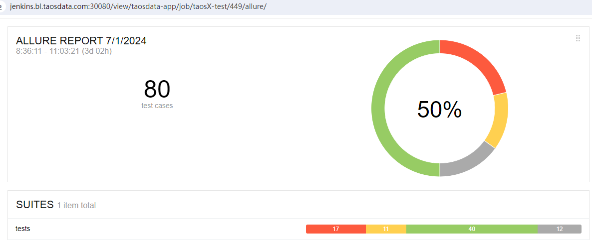
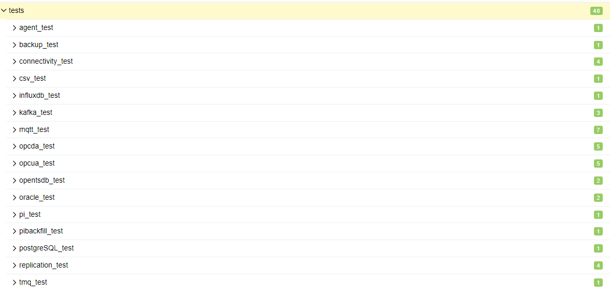
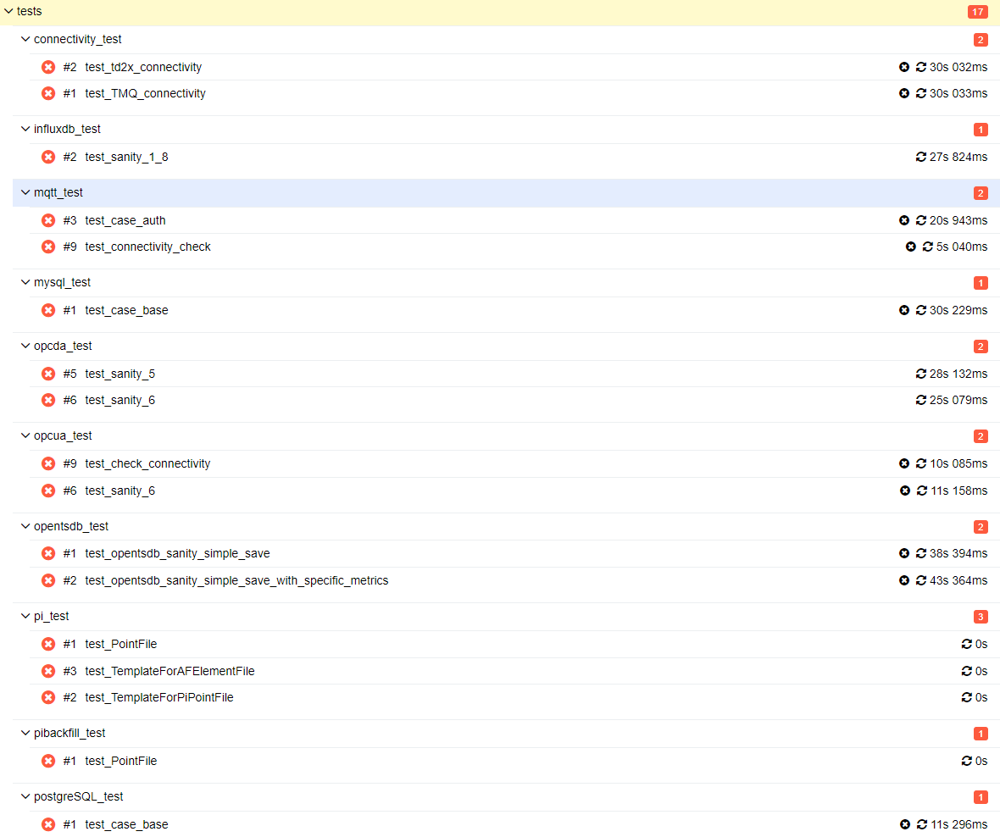
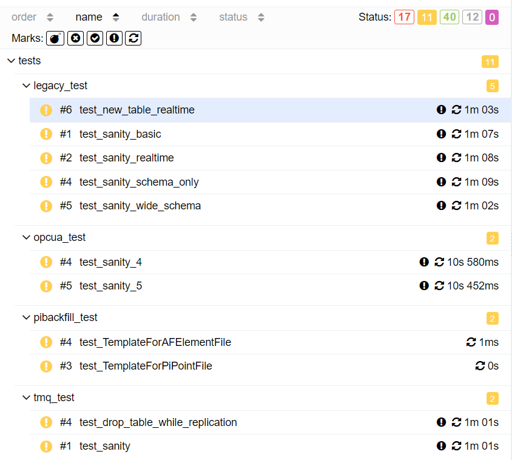
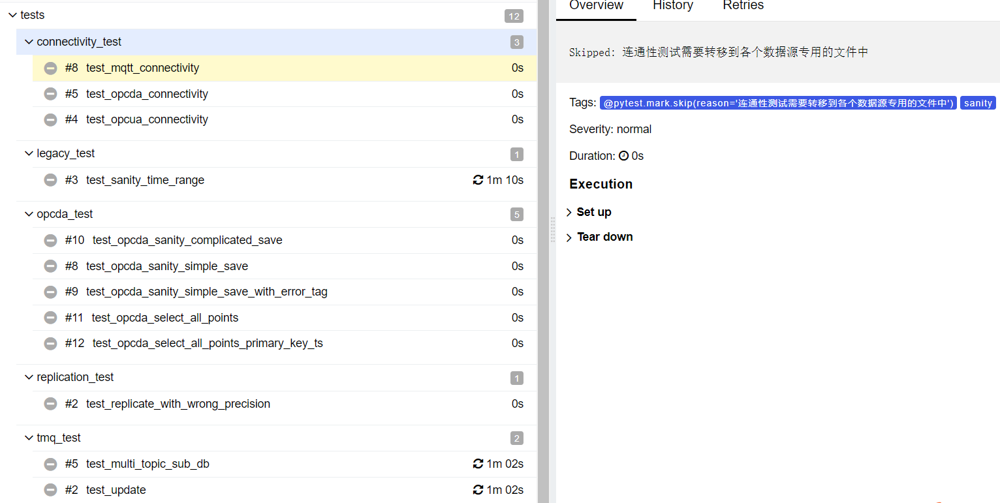

# TS-4869  [中核研究院] 信创兼容性【测试例8.2】Test Spec

## 1. 测试目标

Jira：https://jira.taosdata.com:18080/browse/TS-4869?src=confmacro
验证CI所有测试用例在Anolis + Hygon CPU环境运行是否正常

## 2. 变更历史

| Date | Version | Owner | Memo |
| --- | --- | --- | --- |
| 2024-07-01 | 0.1 | @宋正勤 |  |

## 3. 测试结论

经测试，80条 CI测试用例，有40条用例通过，有17条用例失败，11条用例被中断，12条用例是弃用的，失败原因参考测试结果。
使用V3.3.2.0版本进行taosX-test CI测试。

## 4. 已知问题和限制

无

## 5. 测试资源及环境

测试平台：Linux x86
测试资源：47.97.165.32（root/tbase125!)
测试版本：3.3.2.0  commit 959f95dd6f867db6ed6662b86150d46551ded757

## 6. 测试结果

#### 6.0.1 失败的测试用例 （17个）：

| No. | 分类 | 用例名称 | 失败原因 |
| --- | --- | --- | --- |
| 1 | test_td2x_connectivity | TD2.6数据源放置在内网，且不支持Agent跨网连接 |
| 2 | test_TMQ_connectivity | TD3.0数据源放置在内网，且不支持Agent跨网连接 |
| 3 | influxdb_test | test_sanity_1_8 | 测试脚本有问题，需要更新，手动建立的任务没有问题 |
| 4 | test_case_auth | 检查连接器日志失败 任务配置了agent，而agent启动在其他机器上，连接器的日志也在其他机器上。用例中检查连接器的日志处需要增强 （需要增强测试框架） |
| 5 | test_connectivity_check | 用例设计问题，没有添加agent，导致无法连接内网数据源 （需要修改用例） |
| 6 | mysql_test | test_case_base | 用例设计问题，没有添加agent，导致无法连接内网数据源，需修改测试用例 （需要修改用例） |
| 7 | test_sanity_5 | 用例中断言需要修改（需要修改用例） |
| 8 | test_sanity_6 | 用例中断言需要修改（需要修改用例） |
| 9 | test_check_connectivity | 该用例包含不使用agent的连通性检查, 所以无法连接内网数据源 |
| 10 | test_sanity_6 | 该用例设计意图是不使用agent, 所以无法连接内网数据源 |
| 11 | test_opentsdb_sanity_simple_save | 数据有积压，任务停止超时测试框架设计的时间 （需要增强测试框架） |
| 12 | test_opentsdb_sanity_simple_save_with_specific_metrics | 数据有积压，任务停止超时测试框架设计的时间 （需要增强测试框架） |
| 13 | test_PointFile | 用例已废弃 |
| 14 | test_TemplateForAFElementFile | 用例已废弃 |
| 15 | test_TemplateForPiPointFile | 用例已废弃 |
| 16 | pibackfill_test | test_PointFile | 用例已废弃 |
| 17 | postgreSQL_test | test_case_base | 重跑通过（需要增强用例稳定性） |

#### 6.0.2 被中断的测试用例（11个）：

| No. | 分类 | 用例名称 | 失败/被中断的原因 |
| --- | --- | --- | --- |
| 1 | test_new_table_realtime |
| 2 | test_sanity_basic |
| 3 | test_sanity_realtime |
| 4 | test_sanity_schema_only |
| 5 | test_sanity_wide_schema |
| 6 | test_sanity_4 | （需要修改用例）使用agent |
| 7 | test_sanity_5 | （需要修改用例）使用agent |
| 8 | test_TemplateForAFElementFile | 已废弃 |
| 9 | test_TemplateForPiPointFile | 已废弃 |
| 10 | test_drop_table_while_replication | 内网不支持agent跨域连接 |
| 11 | test_sanity | 内网不支持agent跨域连接 |


## 7. 测试计划 

2024-07-01 -- 2024-07-01

## 8. 测试备忘 

环境配置：
1. 在目标机（47.97.165.32）上安装v3.3.2.0正式发布版，分别创建linux和windows平台的agent
2. 在jenkins ci (192.168.1.42) 机器上运行taosX-test, 其中setenv.sh配置如下
```bash
#!/usr/bin/env bash

export HOST=47.97.165.32

export TAOSX_HOST=$HOST
export TAOSADAPTER_HOST=$HOST
export TAOSD_HOST=$HOST

export TAOSX_WINDOWS_AGENT_HOST=192.168.2.16
export TAOSX_LINUX_AGENT_HOST=192.168.2.13

export TAOSX_LINUX_AGENT_ID=1
export TAOSX_WINDOWS_AGENT_ID=2

export TAOSD_SOURCE_HOST=192.168.1.42
export TAOSBENCHMARK_HOST=$HOST

export RETRY_CHECK_METRICS=10

export DELETE_TASK=True
export DELETE_DB=True
```

## 9. 参考文档

TS-4869


## 10. 附录

### 10.1 所有测试用例 (80个)： [结果链接](http://jenkins.bl.taosdata.com:30080/view/taosdata-app/job/taosX-test/449/allure/)  (manager/Tbase126!)




#### 10.1.1 成功的测试用例 （40个）：[结果链接](http://jenkins.bl.taosdata.com:30080/view/taosdata-app/job/taosX-test/449/allure/#suites/e387fa4bb326b54ea8c19c2822aba374)



#### 10.1.2 失败的测试用例 （17个）：[结果链接](http://jenkins.bl.taosdata.com:30080/view/taosdata-app/job/taosX-test/449/allure/#suites/e387fa4bb326b54ea8c19c2822aba374)



#### 10.1.3 被中断的测试用例（11个）：



#### 10.1.4 被弃用的测试用例（12个），由于测试用例重新设计等因素：[结果链接](http://jenkins.bl.taosdata.com:30080/view/taosdata-app/job/taosX-test/449/allure/#suites/11b57f2c985c86afd7182771dd0f08b7/5973792eb876e481/)



v
