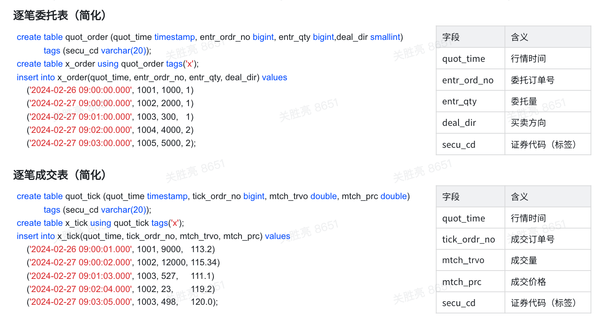
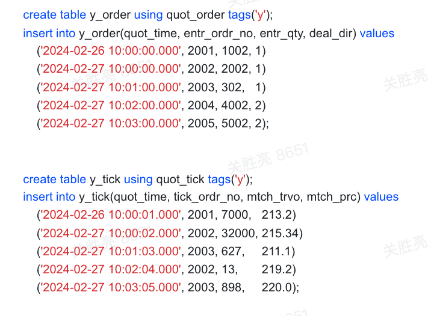

# 3.3.2.0 考试题目

#### 1. 第一部分，笔试题目，所有人回答

1. 那些场景下可能用到复合主键？
2. 什么是 ASOF Join？
3. 什么是 Window Join？
4. TDengine 有哪些窗口，对其进行简单解释
5. 什么是 TSMA，能解决什么问题？
6. TDengine 支持那些压缩算法，那种压缩算法最好，相比 LZ4 有多少提升？
7. TDengine 对 S3 的支持有哪些特点，适合哪些客户
8. TDengine 的双副本与 TDengine 的双活有哪些不同 ，各自用在那种场景？
9. TDengine 的数据库加密支持对那些数据进行加密，性能如何？
10. 如何和用户介绍企业版、社区版、行业版的不同点

#### 2. 第二部分，笔试题目，售前交付回答

1. taosX 可接入哪些关系型数据库，简单介绍工作原理
2. taosX 中的 UDT，能解决什么问题
3. 数据同步可用在什么场景，有哪些典型客户
4. 简要介绍 TDengine 的用户权限
5. 为什么要使用多级存储，当前支持多少块磁盘
6. 多级存储跨级挪数据不影响读写的原理是什么，使用什么配置参数
7. 书写特定 VGroup、Database 重新选主的语法
8. 白名单的使用方法和配置参数
9. 如何迁移账号、密码和权限数据
10. 为什么要使用 Websocket 连接，和原生连接相比有什么优缺点

#### 3. 第三部分，实操题目，售前交付回答（需要在一小时内完成、飞书会议）

1. 创建两个数据库，第一个数据库写 WAL 文件，第二个数据库不写 WAL 文件，使用 taosBenchmark 生成智能电表数据，1000 个子表，每个子表 1 万条记录，每条记录间隔 1 秒，记录写入性能的差异；将两个数据库修改为三副本，并通过 balance 命令移动 VGroup 的 leader
2. 配置两个 TDengine 3.0 的集群
   - A 集群使用 taosBenchmark 写入一千万条记录，创建一个仅允许访问某地区数据的用户，配置白名单功能，演示 taos-explorer 可访问与不可访问的两种场景
   - B 集群从 A 集群中迁移权限数据、白名单数据，并同步时序数据
3. 创建三个双副本数据库，第一个数据库有 TSMA，第二个数据库没有 TSMA，第三个数据库没有 TSMA 且使用 SM4 算法加密；每个数据库均使用 taosBenchmark 生成智能电表数据，1000 个子表，每个子表 1 万条记录，每条记录间隔 1 秒
   - 记录不同数据库的写入时间
   - 编写一个可以用到 TSMA 的查询语句，给出不同数据库的查询时间比较
   - 编写一个不能用到 TSMA 的查询语句，给出不同数据库的查询时间比较
   - 对第二、三个数据库，找到被加密过的数据文件，并展示这些数据文件的不同
   - 对第二个数据库，修改其压缩算法为 XZ 并使其生效，给出 LZ4 和 XZ 算法压缩比的不同
4. 思考一个业务场景，创建超级表和至少两张子表，写入若干记录，其中包含时间戳重复的记录，编写查询 SQL
   - 使用 interp 函数获取某一时刻两张子表某一字段的平均值（每个子表各有一条记录）
   - 使用 last 函数获取两张子表的最新数据（每个子表各有一条记录）
   - 使用滑动时间窗口做一个有业务价值的查询
   - 使用计数窗口做一个有业务价值的查询
   - 使用状态窗口做一个有业务价值的查询
   - 使用事件窗口做一个有业务价值的查询
   - 使用会话窗口做一个有业务价值的查询
5. 以如下数据模型为例，编写 SQL 语句，成交表和委托表通过 entr_ord_no 和 tick_ordr_no  关联
  

  

   - 查询每笔成交记录对应的委托记录
   - 查询每笔委托记录对应的成交记录
   - 查询成交量大于 5000 的委托单
   - 将查询范围扩大到整个超级表，即找到所有股票的查询成交量大于 5000 的委托单
   - 查询成交时间在 2 秒以内的所有委托单
