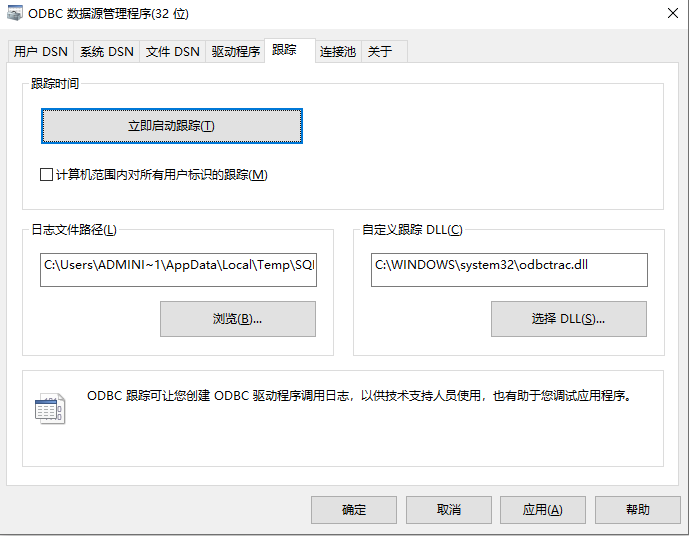

# ODBC 连接器支持 32 位

## 1. 背景

需求连接 
TS-5061

当前，客户面临一项挑战，即他们需要在64位Windows系统环境下，通过32位的工业自动化和监控系统程序调用ODBC接口连接到TDengine集群。然而，鉴于当前发布的版本中，仅配备了64位ODBC驱动程序，这直接导致了兼容性问题，无法满足客户现有的操作系统配置和业务需求。
为解决这一迫切需求，我们需特别定制并提供一款32位的ODBC驱动程序，以确保客户能够无缝、高效地在其64位Windows平台上的32位工业应用程序中连接并操作TDengine集群，从而保障业务的顺畅运行与数据的实时交互。此举将极大地拓宽TDengine的应用场景，提升用户体验，并巩固我们在客户心目中的技术支持与服务能力。

## 2. 变更历史

| 日期 | 版本 | 负责人 | 主要修改内容 |
| --- | --- | --- | --- |
| 2024/7/09 | 0.1 | 裴亚明 | 创建 |
| 2024/7/11 | 0.2 | 裴亚明 | 添加不支持的特性列表 |
| 2024/7/12 | 0.3 | 裴亚明 | 增加ODBC文件的命名规范 |
| 2024/7/13 | 0.4 | 裴亚明 | 将已支持特性和不支持特性列表合并，根据功能特性进一步细分 |
| 2024/7/14 | 0.5 | 裴亚明 | 新增在静态检测SCADA软件发现的ODBC 2.x API |

## 3. 定义

TDengine ODBC 32位驱动程序是一个中间件层，允许基于Windows中32位的应用程序通过ODBC标准接口与TDengine数据库进行通信。它实现了ODBC规范中定义的所有必需API，提供了一个统一的接口，使得应用程序无需关心底层数据库的具体实现细节，就能轻松访问本地部署或远程/云端的TDengine数据库。该驱动程序提供了灵活多样的连接选项，包括基于WebSocket的现代化连接方式和直接的原生连接模式，以满足不同应用场景下的需求。
备注：因为taosc不支持32位系统，且改造量较大，因此在第一个迭代版本中， ODBC 32位驱动程序仅支持WebSocket连接方式，WebSocket连接方式提供了高效、稳定的远程数据交互，跨越了传统网络连接的局限，为用户带来了更加便捷和强大的数据访问体验。更重要的，也避免了 Native 连接方式服务端升级需要客户端也同步升级的问题。

## 4. 行为说明

### 4.1 功能分类

#### 4.1.1 数据源和驱动程序管理

| **API名称** | **是否支持** | **描述** | **备注** |
| --- | --- | --- | --- |
| ConfigDSN | 已支持 | 配置数据源 |  |
| ConfigDriver | 已支持 | 用于执行与特定驱动程序相关的安装和配置任务 |  |
| ConfigTranslator | 已支持 | 用于解析DSN的配置，在DSN配置和实际数据库驱动程序配置之间进行翻译或转换 |  |


#### 4.1.2 连接管理

| **API名称** | **是否支持** | **描述** | **备注** |
| --- | --- | --- | --- |
| SQLConnect | 已支持 | 通过数据源名称、用户 ID 和密码连接到特定驱动程序 |  |
| SQLDriverConnect | 已支持 | 通过连接字符串连接到特定驱动程序，支持更多连接信息 |  |
| SQLBrowseConnect | 不支持 | 用于发现和枚举连接到数据源所需的特性和属性值。 每次调用 SQLBrowseConnect 都会返回属性和属性值的连续级别 |  |
| SQLDisconnect | 已支持 | 断开数据库连接 |  |
| SQLSetConnectAttr | 已支持 | 设置连接属性，当设置SQL_ATTR_AUTOCOMMIT属性时，用于控制自动提交模式 | 部分实现 |
| SQLGetConnectAttr | 已支持 | 返回连接属性的值 | 部分实现 |
| SQLSetConnectOption | 新增 | 在 ODBC 3.x 中，ODBC 2.0 函数 SQLSetConnectOption 已替换为 SQLSetConnectAttr | 静态检查SCADA发现 |

SQLSetConnectAttr 接口用来设置数据库连接的相关属性，TDengine ODBC 支持下列属性设置
```c
SQL_ATTR_LOGIN_TIMEOUT
SQL_ATTR_CONNECTION_TIMEOUT
```


#### 4.1.3 环境和资源管理

| **API名称** | **是否支持** | **描述** | **备注** |
| --- | --- | --- | --- |
| SQLAllocHandle | 已支持 | 分配环境、连接、语句或描述符句柄 |  |
| SQLFreeHandle | 已支持 | 释放与特定环境、连接、语句或描述符句柄关联的资源 |  |
| SQLGetEnvAttr | 已支持 | 返回环境属性的当前设置 |  |
| SQLSetEnvAttr | 已支持 | 设置控制环境的属性 | 部分实现 |
| SQLAllocEnv | 新增 | 在 ODBC 3.x 中，ODBC 2.x 函数 SQLAllocEnv 已替换为 SQLAllocHandle | 静态检查SCADA发现 |
| SQLAllocConnect | 新增 | 在 ODBC 3.x 中，ODBC 2.x 函数 SQLAllocConnect 已替换为 SQLAllocHandle | 静态检查SCADA发现 |
| SQLAllocStmt | 新增 | 在 ODBC 3.x 中，ODBC 2.x 函数 SQLAllocStmt 已替换为 SQLAllocHandle | 静态检查SCADA发现 |
| SQLFreeConnect | 新增 | 在 ODBC 3.x 中，ODBC 2.0 函数 SQLFreeConnect 已替换为 SQLFreeHandle | 静态检查SCADA发现 |
| SQLFreeEnv | 新增 | 在 ODBC 3.x 中，ODBC 2.0 函数 SQLFreeEnv 已替换为 SQLFreeHandle | 静态检查SCADA发现 |


#### 4.1.4 元数据管理

| **API名称** | **是否支持** | **描述** | **备注** |
| --- | --- | --- | --- |
| SQLDescribeParam | 已支持 | 返回语句中特定参数的描述 |  |
| SQLDescribeCol | 已支持 | 用于描述结果集中列的属性。它提供了关于列的数据类型、列名、列的最大宽度、小数位数和是否可为空等信息 |  |
| SQLNumResultCols | 已支持 | 返回结果集中的列数 |  |
| SQLColAttribute | 已支持 | 返回结果集中列的描述符信息,如标题、排序规则等 |  |
| SQLColumns | 已支持 | 返回指定表中的列名列表 | 部分支持 |
| SQLColumnPrivileges | 不支持 | 用于检索指定表中列的权限信息，如哪些用户或角色拥有对特定列的读取、插入、更新或删除权限 |  |
| SQLTables | 已支持 | 返回存储在数据源的当前数据库中的表信息 |  |
| SQLTablePrivileges | 不支持 | 返回用户在特定表上的权限，如SELECT、INSERT、UPDATE等 |  |
| SQLPrimaryKeys | 支持 | 返回构成表主键的列名列表 |  |
| SQLForeignKeys | 不支持 | 检索外键关系的详细信息 |  |
| SQLSpecialColumns | 不支持 | 返回数据库中特殊列的信息，如唯一键或索引列 |  |
| SQLStatistics | 不支持 | 返回关于表的统计信息，如行数、列数、平均行宽等 |  |
| SQLProcedures | 不支持 | 返回数据库中可用的存储过程信息，包括名称和类型 |  |
| SQLProcedureColumns | 不支持 | 返回存储过程的列信息，包括输入输出参数的详细信息 |  |
| SQLGetInfo | 已支持 | 返回有关数据库环境的详细信息，如数据库产品名称、驱动程序名、数据库的SQL语法特性、连接能力等等 |  |
| SQLGetTypeInfo | 已支持 | 返回有关支持的数据类型的信息 | 只实现VARCHAR、JSON INT、TIMESTAMP |
| SQLGetFunctions | 不支持|新增 | 用于查询驱动程序支持的函数 |  |
| SQLNumParams | 已支持 | 用于查询预编译SQL语句中的参数数量 |  |
| SQLColAttributes | 新增 | 在 ODBC 3.x 中，ODBC 2.0 函数 SQLColAttributes 已替换为 SQLColAttribute | SCADA连接Mysql数据库发现 |


#### 4.1.5 描述符管理

| **API名称** | **是否支持** | **描述** | **备注** |
| --- | --- | --- | --- |
| SQLCopyDesc | 不支持 | 用于将一个描述符的内容复制到另一个描述符 |  |
| SQLSetDescField | 不支持|新增 | 设置描述符字段的属性，如设置列的宽度或小数点精度 |  |
| SQLGetDescField | 不支持 | 获取描述符字段的属性 |  |
| SQLSetDescRec | 不支持|新增 | 设置描述符记录的属性，可以用来控制结果集的行为 |  |
| SQLGetDescRec | 不支持 | 返回描述符记录的属性。这些字段描述了列或参数数据的名称、数据类型和存储等属性 |  |


#### 4.1.6 语句管理

| **API名称** | **是否支持** | **描述** | **备注** |
| --- | --- | --- | --- |
| SQLPrepare | 已支持 | 用于预处理SQL语句，这通常是SQLExecute之前的一个步骤 |  |
| SQLExecDirect | 已支持 | 用于执行包含SQL语句的字符串 |  |
| SQLExecute | 已支持 | 用于执行之前通过 SQLPrepare 准备好的SQL语句 |  |
| SQLGetStmtAttr | 已支持 | 返回语句属性的当前设置 |  |
| SQLSetStmtAttr | 已支持 | 设置与语句相关的属性 |  |
| SQLGetCursorName | 不支持|新增 | 返回与指定语句关联的游标名称 |  |
| SQLSetCursorName | 不支持 | 设置游标名称，允许在查询中使用命名游标 |  |
| SQLCloseCursor | 已支持 | 关闭与当前语句句柄关联的游标，并释放游标所使用的所有资源 |  |
| SQLFreeStmt | 已支持 | 结束语句处理，丢弃挂起的结果，并且可以选择释放与语句句柄关联的所有资源 |  |
| SQLNativeSql | 不支持 | 用于将应用程序提供的SQL语句转换为数据库驱动程序的本机SQL语法 |  |
| SQLSetStmtOption | 新增 | 在 ODBC 3.x 中，ODBC 2.0 函数 SQLSetStmtOption 已替换为 SQLSetStmtAttr | 静态检查SCADA发现 |
| SQLParamOptions | 新增 | 在 ODBC 3.x 中，ODBC 2.0 函数 SQLParamOptions 已替换为 SQLSetStmtAttr。 | SCADA连接Mysql数据库发现 |

SQLSetStmtAttr 接口用来设置与SQL语句执行相关的属性，TDengine ODBC 支持下列属性设置
```c
SQL_ATTR_PARAM_BIND_TYPE
SQL_ATTR_PARAMSET_SIZE
SQL_ATTR_PARAM_STATUS_PTR
SQL_ATTR_PARAMS_PROCESSED_PTR
SQL_ATTR_ROW_ARRAY_SIZE
SQL_ATTR_ROW_STATUS_PTR
SQL_ATTR_ROWS_FETCHED_PTR
```


#### 4.1.7 参数绑定

| **API名称** | **是否支持** | **描述** | **备注** |
| --- | --- | --- | --- |
| SQLBindCol | 已支持 | 用于将结果集中的列绑定到应用程序缓冲区 | 只支持按列绑定模式 |
| SQLBindParameter | 已支持 | 用于将SQL语句的参数绑定到应用程序缓冲区 | 只支持按列绑定模式 |
| SQLParamData | 不支持|新增 | 用于从从参数数据流中获取下一个参数值 |  |
| SQLPutData | 不支持|新增 | 当使用流输入方式时，可以用于向输出参数发送数据块 |  |


#### 4.1.8 检索数据

| **API名称** | **是否支持** | **描述** | **备注** |
| --- | --- | --- | --- |
| SQLFetch | 已支持 | 用于从结果集中提取下一行数据，并返回所有绑定列的数据 |  |
| SQLFetchScroll | 已支持 | 用于从结果集中提取指定的数据行集，并返回所有绑定列的数据 | 只支持SQL_FETCH_NEXT |
| SQLExtendedFetch | 不支持|新增 | 在 ODBC 3.x 中， SQLExtendedFetch 已替换为 SQLFetchScroll |  |
| SQLGetData | 已支持 | 用于从结果集中的当前行获取特定列的数据 |  |
| SQLMoreResults | 已支持 | 多个结果集的sql语句执行后（例如：一个批处理或存储过程），移动到下一个结果集 |  |
| SQLRowCount | 已支持 | 返回受插入或删除请求影响的行数 | TDengine 无更新操作 |


#### 4.1.9 更新数据

| **API名称** | **是否支持** | **描述** | **备注** |
| --- | --- | --- | --- |
| SQLSetPos | 不支持 | 设置行集中的游标位置，并允许应用程序更新数据集中的行 |  |
| SQLBulkOperations | 不支持 | 执行批量插入和批量书签操作，包括更新、删除和按书签提取 |  |


#### 4.1.10 执行控制

| **API名称** | **是否支持** | **描述** | **备注** |
| --- | --- | --- | --- |
| SQLCompleteAsync | 不支持 | 用于检查和促使完成异步操作 | ODBC 3.8 引入 |
| SQLCancel | 不支持|新增 | 用于取消当前在语句句柄上执行的SQL语句 |  |


#### 4.1.11 事务管理

| **API名称** | **是否支持** | **描述** | **备注** |
| --- | --- | --- | --- |
| SQLEndTran | 已支持 | 用于提交或回滚事务，TDengine 不支持事务，因此不支持回滚操作 | TDengine不支持事务，仅是模拟 |
| SQLTransact | 新增 | 在 ODBC 3.x 中，ODBC 2.x 函数 SQLTransact 已替换为 SQLEndTran | 静态检查SCADA发现 |


#### 4.1.12 诊断信息管理

| **API名称** | **是否支持** | **描述** | **备注** |
| --- | --- | --- | --- |
| SQLGetDiagField | 已支持 | 返回附加诊断信息（单条诊断结果） |  |
| SQLGetDiagRec | 已支持 | 返回附加诊断信息（多条诊断结果） |  |
| SQLError | 新增 | 在 ODBC 3.x 中，ODBC 2.x 函数 SQLError 已替换为 SQLGetDiagRec | 静态检查SCADA发现 |


## 5. 性能

| 使用场景 | 类别 | 要求 |
| --- | --- | --- |
| 支持10个子表并发查询，每个查询5000条记录 【子表schema见下边备注】 | 查询 | 2秒内完成查询 |
| 支持10000个子表同时查询最新数据 【子表schema见下边备注】 | 查询 | 1秒内完成查询 |
| 支持10000个子表同时写入最新数据 【子表schema见下边备注】 | 写入 | 1秒内完成写入 |
| 支持写入事件记录数据，30个字段左右 【事件记录表schema见下边备注】 | 写入 | 每秒数据写入1000条 |
| 支持20个客户端并发执行，查询10000个子表的最新数据和写入10000个子表的最新数据【子表schema见下边备注】 | 稳定性 | 持续3*24小时压测，无异常 |

备注：建立的模型是通常是vqt形式，就是变量值，质量戳、时间戳，标签设置为factory、area、equipment、tagName、datasource、unit等6-10个字段。

事件记录表schema样例：

| 名称 | 类型 | 备注 |
| --- | --- | --- |
| AlarmValueDataType | 数字 |  |
| LimitValue | 文本 | 长度100以内 |
| LimitValueDataType | 数字 |  |
| AlarmType | 数字 |  |
| Pri | 数字 |  |
| Quality | 数字 |  |
| AlarmTime | 日期 |  |
| AlarmTimeMs | 数字 |  |
| EventTime | 日期 |  |
| EventTimeMs | 数字 |  |
| OperatorName | 文本 | 长度100以内 |
| OperatorDomain | 文本 | 长度100以内 |
| ResumeValue | 文本 | 长度100以内 |
| ResumeValueDataType | 数字 |  |
| EventType | 文本 | 长度100以内 |
| AlarmText | 文本 | 长度100以内 |
| ExtendField1 | 文本 | 长度100以内 |
| ExtendField2 | 文本 | 长度100以内 |
| ExtendField3 | 文本 | 长度100以内 |
| ExtendField4 | 文本 | 长度100以内 |
| ExtendField5 | 文本 | 长度100以内 |
| ExtendField6 | 文本 | 长度100以内 |
| ExtendField7 | 文本 | 长度100以内 |
| ExtendField8 | 文本 | 长度100以内 |
| OperationRemark | 文本 | 长度100以内 |
| MachineIP | 文本 | 长度100以内 |


## 6. 兼容性

- ODBC兼容：ODBC 3.8 及以前所有版本。
- 操作系统：支持windows server2016及其以上，需要支持windows7、10、11,桌面操作系统，64位操作系统兼容32位应用程序
- 应用兼容：任何使用ODBC接口的32位应用程序都应能够无缝使用此驱动程序。

需要为WebSocket（libtaosws.so/taosws.dll）组件编译32位版本，涉及少量不兼容32位的内部实现代码调整。如：解析json字符串需要使用sonic库，但该库不支持32位，将会改成serde_json库。

## 7. 运维

- 日志记录：记录关键事件和错误，便于问题追踪。

## 8. 使用场景

### 8.1 配置数据源

#### 8.1.1 Windows 配置数据源

##### 8.1.1.1 使用原生连接

暂不支持

##### 8.1.1.2 使用 WebSocket 连接

1. 【开始】菜单搜索打开【ODBC 数据源管理程序】
2. 选中【用户 DSN】标签页，点击【添加(D)】按钮弹出"创建数据源"窗口
3. 选择想要添加的数据源，这里我们选择【TAOS_ODBC_DRIVER】
4. 点击完成，进入 TDengine ODBC 数据源配置页面，填写如下必要信息
   - 【DSN】 :  Data Source Name 必填，为新添加的 ODBC 数据源命名
   - 【连接类型】 : 必选，选择 TDengine ODBC 的实现，这里选择 【Websocket】
   - 【URL】必填，ODBC 数据源 URL，例如: http://localhost:6041， 云服务的 url 示例：https://gw.cloud.taosdata.com?token=your_token
   - 【数据库】选填，需要连接的默认数据库
5. 点击【测试连接】测试连接情况，如果成功，提示“成功连接到......"
6. 点确定，即可保存配置并退出

#### 8.1.2 特殊配置项说明

在Windows ODBC 数据源管理界面，TDengine ODBC 有下边四个可选参数配置
1. UNSIGNED_PROMOTION  :  可配置 {0, 1}
对于unsigned 数据库字段类型进行signed 提升，比如unsigned tinyint提升为smallint。
1. TIMESTAMP_AS_IS : 可配置 {0, 1}
如果设置，对于TDengine timestamp字段，按SQL_DATETIME 类型处理返回，否则按SQL_WVARCHAR处理返回。如果按照SQL_DATETIME 类型返回，可能会丢失时间精度(比如在显示的时候)。按照SQL_WVARCHAR处理返回，则不会，但需要ODBC App/Tools自行处理时间串的解析(如果需要的话) 
1. CHARSET_ENCODER_FOR_PARAM_BIND : 配置编码格式，例如：UTF-8,   GB18030 等
对于入参(参数绑定时)，如果是字符串SQLCHAR*，则按指定的编码进行校验转换
1. CHARSET_ENCODER_FOR_COL_BIND
对于出参(参数绑定时)，如果是字符串SQLCHAR*，则按指定的编码进行校验转换
1. 参(参数绑定时)，如果是字符串SQLCHAR*，则按指定的编码进行校验转换

### 8.2 TDengine ODBC 使用示例

#### 8.2.1 PowerBI 使用 TDengine ODBC 数据源

1. 添加数据源：主页 -> 获取数据 -> 更多 -> 获取数据输入栏，搜索 odbc，选择 odbc 数据源，点击【连接】
2. 数据源名称（DSN）列表框中选择 TDengine ODBC 数据源：例如：TAOS_ODBC_WS_DSN，高级选项可以配置连接字符串
3. 确定并连接配置好的数据源，可进入导航器，浏览到对应数据库的数据
4. 选择对应的表加载即可在 Power BI 中处理相关数据

#### 8.2.2 TDengine ODBC 编程示例

##### 8.2.2.1 基本步骤

使用TDengine ODBC驱动的应用程序与TDengine服务器交互的基本步骤如下：
1. 配置TDengine ODBC DSN
2. 连接TDengine服务器：
  - 分配环境句柄并设置ODBC版本
  - 分配连接句柄并连接到TDengine服务器
  - 设置可选的连接属性
1. 初始化stmt：分配stmt句柄并设置可选stmt属性
2. 执行SQL语句：使用SQLPrepare, SQLBindParameter, SQLExecute等
3. 检索结果：取决于语句类型。 对于 SELECT/SHOW 语句，结果可能包括获取列数、列信息、获取行以及将数据放入缓冲区。 对于 DELETE/INSERT 语句，结果可能包括受影响的行数。涉及 SQLNumResultCols SQLMoreResults  SQLFetchScroll  SQLFetch  SQLGetData 等
4. 释放stmt句柄资源
5. 断开与服务器的连接：断开连接，并释放连接和环境句柄

##### 8.2.2.2 连接类型

- Windows：使用ODBC数据源管理器配置DSN。

##### 8.2.2.3 连接API接口

- 使用SQLConnect接口时，需要以下三个参数：
  - `dsn`：数据源名称
  - `user`：数据库用户名
  - `pwd`：数据库用户密码
- 使用SQLDriverConnect接口时：通过连接字符串建立连接，可指定服务器、数据库、用户名、密码等参数，无需预配置DSN。
  - Native方式示例连接字符串：（暂不支持Native方式）
  `~~"DSN=TAOS_ODBC_DSN;Server=127.0.0.1:6030;uid=root;pwd=taosdata;db=power"~~`
  - WebSocket方式示例连接字符串：
  `"DSN=TAOS_ODBC_WS_DSN;URL=http://192.168.1.98:6041;uid=root;pwd=taosdata;db=power"`

##### 8.2.2.4 c 语言使用 TDengine ODBC 示例

下边是 C 语言使用TDengine ODBC 示例，省略了异常处理。
```c
#include <stdio.h>
#include <string.h>
#include <stdlib.h>
#include <windows.h>
#include <sql.h>
#include <sqlext.h>

int main() {
    SQLHANDLE henv = SQL_NULL_HANDLE;
    SQLHANDLE hdbc = SQL_NULL_HANDLE;
    SQLHANDLE hstmt = SQL_NULL_HANDLE;

    SQLAllocHandle(SQL_HANDLE_ENV, SQL_NULL_HANDLE, &henv);
    SQLSetEnvAttr(henv, SQL_ATTR_ODBC_VERSION, (SQLPOINTER)SQL_OV_ODBC3, 0);
    SQLSetEnvAttr(henv, SQL_ATTR_CONNECTION_POOLING, (SQLPOINTER)SQL_CP_ONE_PER_DRIVER, 0);

    SQLAllocHandle(SQL_HANDLE_DBC, henv, &hdbc);

    // create a connection to tdengine data source
    SQLCHAR OutConnectionString[1024] = { 0 };
    SQLSMALLINT StringLength2 = 0;

    const char* conn_str = "DSN=TAOS_ODBC_WS_DSN; uid=root; pwd=taosdata; db=meter";
    printf(conn_str);
    SQLDriverConnectA(hdbc,
        NULL,
        (SQLCHAR*)conn_str,
        (SQLSMALLINT)strlen(conn_str),
        OutConnectionString,
        sizeof(OutConnectionString),
        &StringLength2,
        SQL_DRIVER_NOPROMPT);

    SQLAllocHandle(SQL_HANDLE_STMT, hdbc, &hstmt);

    const char* drop_stable = "DROP STABLE if exists meters";
    SQLExecDirectA(hstmt, (SQLCHAR*)drop_stable, SQL_NTS);

    const char* create_stable = "CREATE TABLE `meters` (`ts` TIMESTAMP, `current` FLOAT, `voltage` INT, `phase` FLOAT) \
         TAGS (`groupid` INT, `location` BINARY(24))";
    SQLExecDirectA(hstmt, (SQLCHAR*)create_stable, SQL_NTS);

    const char* drop_table = "DROP TABLE if exists d0";
    SQLExecDirectA(hstmt, (SQLCHAR*)drop_table, SQL_NTS);

    // create test table
    const char* create_table_sql = "CREATE TABLE `d0` USING `meters` TAGS(0, 'California.LosAngles')";
    SQLExecDirectA(hstmt, (SQLCHAR*)create_table_sql, SQL_NTS);

    // write data into test table
    char insert_sql[256];
    snprintf(insert_sql, sizeof(insert_sql)/sizeof(insert_sql[0]), "INSERT INTO `d0` values(now - 10s, 10, 116, 0.32)");
    SQLExecDirectA(hstmt, (SQLCHAR*)insert_sql, SQL_NTS);
    SQLLEN numberOfrows;
    SQLRowCount(hstmt, &numberOfrows);
    printf("insert count: %lld\n", numberOfrows);

    // reset cursor
    SQLCloseCursor(hstmt);

    // read data from table
    char select_sql[256];
    snprintf(select_sql, sizeof(select_sql) / sizeof(select_sql[0]), "select ts, current, voltage from d0");
    SQLExecDirectA(hstmt, (SQLCHAR*)select_sql, SQL_NTS);

    int row = 0;
    SQLSMALLINT numberOfColumns;
    SQLNumResultCols(hstmt, &numberOfColumns);

    while (SQLFetch(hstmt) == SQL_SUCCESS) {
        row++;
        for (int i = 1; i <= numberOfColumns; i++) {
            SQLCHAR columnData[256];
            SQLLEN indicator;
            SQLGetData(hstmt, i, SQL_C_CHAR, columnData, sizeof(columnData), &indicator);
            if (indicator != SQL_NULL_DATA) {
                printf("Row:%d Column %d: %s \n", row, i, columnData);
            }
        }
    }

    // close handle
    SQLFreeHandle(SQL_HANDLE_STMT, hstmt);
    SQLDisconnect(hdbc);
    SQLFreeHandle(SQL_HANDLE_DBC, hdbc);
    SQLFreeHandle(SQL_HANDLE_ENV, henv);

    return 0;
}
```

##### 8.2.2.5 python 使用 TDengine ODBC 示例

```python
import pyodbc
import os
import sys

if __name__ == "__main__":
    # Using a DSN, but providing a password as well
    cnxn = pyodbc.connect('DSN=TAOS_ODBC_WS_DSN;PWD=taosdata')

    # Create a cursor from the connection
    cursor = cnxn.cursor()

    cursor.execute("drop database if exists meter")
    cursor.execute("create database if not exists meter")
    cursor.execute("use meter")

    cursor.execute("drop table if exists d0")
    cursor.execute("create table d0 (ts timestamp, current FLOAT, voltage INT)")
    cursor.execute("insert into d0(ts, current, voltage) values (now(), 1.5, 220)")
    cursor.execute("insert into d0(ts, current, voltage) values (?, ?, ?)", 1682565350033, 1.52, 221)

    data = cursor.execute("select current,voltage from d0").fetchall()
    print(data, "\n")

    cursor.execute("drop stable if exists meters")
    cursor.execute(
        "create stable meters (ts timestamp, current FLOAT, voltage INT, phase FLOAT) tags (groupid INT, location BINARY(24))")
    cursor.execute(
        "insert into 'd000' using meters tags (0, 'California.SanFrancisco') values (1665226861289, 2, 200, 1.3)")
    data = cursor.execute("select ts, current, voltage, phase from meters").fetchall()
    print(data, "\n")

    cursor.execute("insert into ? using meters tags (?, ?) values (?, ?, ?, ?)", 'd001', 1, 'California.LosAngles',
                   1665226861289, 2.1, 201, 1.2)
    data = cursor.execute("select ts, current, voltage, phase from meters").fetchall()
    print(data, "\n")

    params = [('d002', 2, 'California.SanFrancisco', 1665226861289, 1.21, 202, 1.2),
              ('d003', 3, 'California.LosAngles', 1665226861299, 1.22, 203, 1.3)]
    cursor.fast_executemany = False
    cursor.executemany("insert into ? using meters tags (?, ?) values (?, ?, ?, ?)", params)

    data = cursor.execute("select ts, current, voltage, phase from meters").fetchall()
    print(data, "\n")

    cursor.close()
    cnxn.close()
```


## 9. 约束和限制

- 连接方式：仅支持WebSocket方式，暂不支持Native方式。

## 10. 常见错误和排查

- 连接失败：检查数据库服务是否启动，验证DSN配置。
- 查询超时：优化SQL语句，增加查询超时时间。
- 内存泄漏：定期检查和修复潜在的内存泄漏问题。

## 11. 可观测性

通过环境变量，可以配置日志的相关设置：  
- **设置日志等级**：利用`TAOS_ODBC_LOG_LEVEL`环境变量，可以指定日志的详细程度。该变量可设置为以下任一值：`VERBOSE`、`DEBUG`、`INFO`、`WARN`、`ERROR`、`FATAL`，这些值代表日志信息的详细程度由高到低。值越低，意味着输出的调试信息越详细。  
- **设置日志输出位置**：通过`TAOS_ODBC_LOGGER`环境变量，可以控制日志的输出位置。该变量支持两种设置：  
  - `stderr`：选择此选项，日志信息将被输出到标准错误窗口。  
  - `temp`：选择此选项，日志信息将被写入到临时目录中。在Windows系统上，这通常指的是`%temp%`目录；而在其他操作系统上，则可能是相应的临时文件存储位置。

也可以通过Windows系统自带的ODBC数据源管理程序开启日志跟踪：  
- 在Windows系统搜索框中输入：ODBC数据源，打开ODBC数据源管理程序
- 切换到【跟踪】Tab页，在【日志文件路径】中设置ODBC日志文件保存的路径
- 点击跟踪时间区域的【立即启动跟踪】




## 12. 安装和卸载

TDengine客户端/服务端安装时包含32位ODBC驱动，卸载时一并移除。
安装路径保持不变，ODBC 32位驱动和64位驱动使用后缀区分，命令风格与其他组件保持一致：
例如：在Windows平台
ODBC 32位驱动文件安装位置：C:\TDengine\taos_odbc\x86\bin\taos_odbc.dll
ODBC 64位驱动文件：C:\TDengine\taos_odbc\x64\bin\taos_odbc.dll

## 13. 文档

1. 需要修改官网文档，TDengine连接器章节增加支持 ODBC 32位驱动的描述
2. ~~需要修改企业版文档，~~~~TDengine~~~~ ~~~~连接器章节增加支持~~~~ ~~~~ODBC 32位驱动的描述~~

## 14. 参考文档

[TDengine ODBC 用户手册中文版](https://taosdata.feishu.cn/wiki/PihIwhhCFiNHhckaH64cqynOnJ3)
[ODBC Could Performance Test](https://taosdata.feishu.cn/wiki/NRmRwx412iRgzekbmbgcCqKdnEc)
[20231216](https://taosdata.feishu.cn/wiki/BdEjwnJWsiyQYEkjE6BcAGlVnJe)
[ODBC 和标准 CLI](https://learn.microsoft.com/zh-cn/sql/odbc/reference/odbc-and-the-standard-cli)
[ODBC 函数摘要](https://learn.microsoft.com/zh-cn/sql/odbc/reference/syntax/odbc-function-summary)

## 15. 附录
