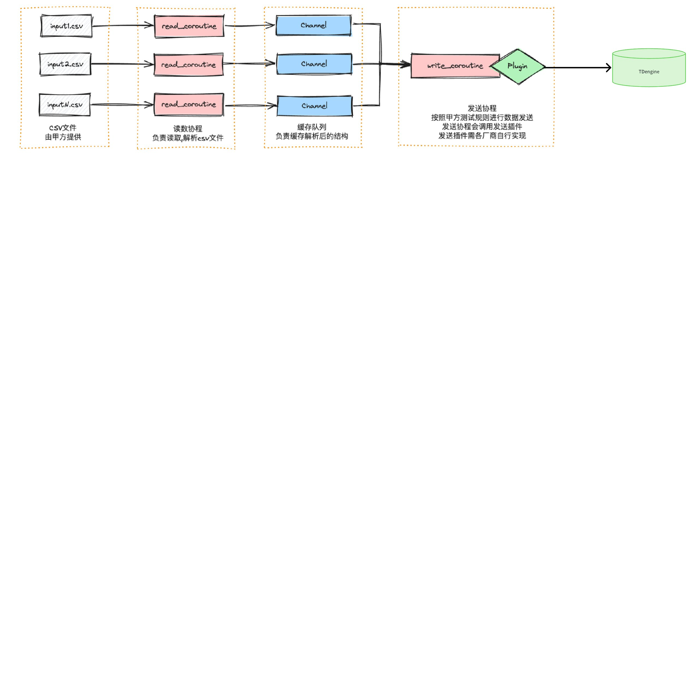
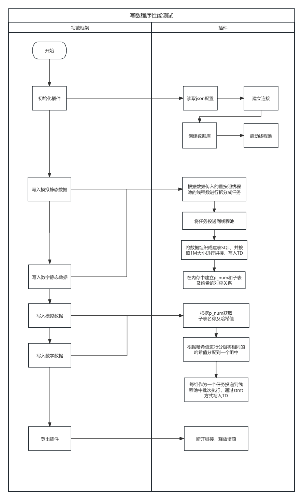
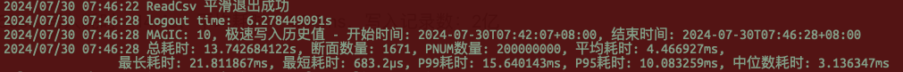

# [中核研究院] 过载压力测试写入工具

## 1. 背景

为满足中核研究院进行过载压力测试，需要在提供的测试框架中按照不同的测试场景将数据写入 TDengine。此次测试完成后，可以作为测试工具进行压力测试的验证。

## 2. 变更历史

| 日期 | 版本 | 负责人 | 主要修改内容 |
| --- | --- | --- | --- |
| 2024/7/08 | 0.1 | 门世斌 | 创建 |

## 3. 定义

**测点：**本文档中测点概念指由一个传感器采集的一组数据，类型分为模拟量测点和数字量测点，每个测点的数据分为随时间变化的数据和不随时间变化的数据。
**实时数据集：**模拟运行机组产生实时数据的形式，一个实时数据集模拟 1 个机组 3600 秒（1 小时）产生的数据。每个机组共有 20 万个测点。其中 500 个测点为快采点，1ms 变化一次；其余为普通点，400ms 变化一次。在所有测点中，数字量测点占 70%，模拟量测点占 30%。
**历史数据集：**共具备 100 个测点，其中数字量测点 70 个，模拟量测点 30 个，时间跨度共 1 年。
**静态数据：**用于建子表的数据，也就是 Tag 数据，其中有 PNUM 用于同检测数据的 PNUM 进行关联，明确写入那张子表。

## 4. 行为说明

### 4.1 写数程序框架图



注：**我们只需要实现 Plugin 中 c 接口部分即可，其他部分均由甲方提供。**

### 4.2 测试数据

测试数据来源于用户提供的 CSV 文件，数据提供方式是 静态数据（Tag） 作为一类文件，数据作为一类文件，之间采用 p_num 进行关联，红色背景是 Tag 字段，白色背景是数据字段。具体提供的数据结构形式如下：

|  |
|  |
| **编号** | **名称** | **数据表示内容** | **长度/字节** | **数据类型** | **描述及要求** |
| 1 | AV | 输出值 | 4 | float | 按长度要求随机给出浮点数据值，不同时间本值需要变化 |
| 2 | AVR | 采集实时值 | 4 | float | 按长度要求随机给出浮点数据值，不同时间本值需要变化 |
| 3 | Q | 信号质量 | 1 | bool | 随机给出 BOOL 数据值，不同时间本值需要变化 |
| 4 | BF | 强制开关 | 1 | bool | 随机给出 BOOL 数据值，不同时间本值需要变化 |
| 5 | FQ | 质量位强制值 | 1 | bool | 随机给出 BOOL 数据值，不同时间本值需要变化 |
| 6 | FAI | 强制输入 | 4 | float | 按长度要求随机给出浮点数据值，不同时间本值需要变化 |
| 7 | MS | 强制状态 | 1 | bool | 随机给出 BOOL 数据值，不同时间本值需要变化 |
| 8 | TEW | 实时值越限状态字 | 1 | char | 按长度要求随机给出 char 变量数据值，不同时间本值需要变化 |
| 9 | CST | 信号采集通道状态 | 2 | ushort | 按长度要求随机给出 ushort 变量数据值，不同时间本值需要变化 |
| 10 | TAGT | 设备挂牌类型 | 2 | ushort | 按长度要求随机给出 ushort 变量数据值，不同时间本值不需要变化 |
| 11 | FACK | 仪控故障确认状态 | 2 | ushort | 按长度要求随机给出 ushort 变量数据值，不同时间本值不需要变化 |
| 12 | L4AR | L4 报警抑制条件 | 1 | bool | 随机给出 BOOL 数据值，不同时间本值不需要变化 |
| 13 | L3AR | L3 报警抑制条件 | 1 | bool | 随机给出 BOOL 数据值，不同时间本值不需要变化 |
| 14 | L2AR | L2 报警抑制条件 | 1 | bool | 随机给出 BOOL 数据值，不同时间本值不需要变化 |
| 15 | L1AR | L1 报警抑制条件 | 1 | bool | 随机给出 BOOL 数据值，不同时间本值不需要变化 |
| 16 | H4AR | H4 报警抑制条件 | 1 | bool | 随机给出 BOOL 数据值，不同时间本值不需要变化 |
| 17 | H3AR | H3 报警抑制条件 | 1 | bool | 随机给出 BOOL 数据值，不同时间本值不需要变化 |
| 18 | H2AR | H2 报警抑制条件 | 1 | bool | 随机给出 BOOL 数据值，不同时间本值不需要变化 |
| 19 | H1AR | H1 报警抑制条件 | 1 | bool | 随机给出 BOOL 数据值，不同时间本值不需要变化 |
| 20 | CHN | 通道号 | 32 | string | 随机给出 string 数据值，不同时间本值不需要变化 |
| 21 | PN | 点名 | 32 | string | 随机给出 string 数据值，不同时间本值不需要变化 |
| 22 | DESC | 点描述 | 128 | string | 随机给出 string 数据值，不同时间本值不需要变化 |
| 23 | UNIT | 单位 | 32 | string | 随机给出 string 数据值，不同时间本值不需要变化 |
| 24 | MU | 量程上限 | 4 | float | 按长度要求随机给出浮点数据值，不同时间本值不需要变化 |
| 25 | MD | 量程下限 | 4 | float | 按长度要求随机给出浮点数据值，不同时间本值不需要变化 |


|  |
|  |
| **编号** | **名称** | **数据表示内容** | **长度/字节** | **数据类型** | **描述及要求** |
| 1 | DV | 输出值 | 1 | bool | 按长度要求随机给出 BOOL 数据值，不同时间本值需要变化 |
| 2 | DVR | 采集实时值 | 1 | bool | 按长度要求随机给出 BOOL 数据值，不同时间本值需要变化 |
| 3 | Q | 信号质量 | 1 | bool | 随机给出 BOOL 数据值，不同时间本值需要变化 |
| 4 | BF | 强制开关 | 1 | bool | 随机给出 BOOL 数据值，不同时间本值需要变化 |
| 5 | FQ | 质量位强制值 | 1 | bool | 随机给出 BOOL 数据值，不同时间本值需要变化 |
| 6 | FAI | 强制输入 | 1 | bool | 按长度要求随机给出 BOOL 数据值，不同时间本值需要变化 |
| 7 | MS | 强制状态 | 1 | bool | 随机给出 BOOL 数据值，不同时间本值需要变化 |
| 8 | TEW | 实时值越限状态字 | 1 | char | 按长度要求随机给出 char 变量数据值，不同时间本值需要变化 |
| 9 | CST | 信号采集通道状态 | 2 | ushort | 按长度要求随机给出 ushort 变量数据值，不同时间本值需要变化 |
| 10 | FACK | 仪控故障确认状态 | 2 | ushort | 按长度要求随机给出 ushort 变量数据值，不同时间本值不需要变化 |
| 11 | CHN | 通道号 | 32 | string | 随机给出 string 数据值，不同时间本值不需要变化 |
| 12 | PN | 点名 | 32 | string | 随机给出 string 数据值，不同时间本值不需要变化 |
| 13 | DESC | 点描述 | 128 | string | 随机给出 string 数据值，不同时间本值不需要变化 |
| 14 | UNIT | 单位 | 32 | string | 随机给出 string 数据值，不同时间本值不需要变化 |

### 4.3 框架行为：

#### 4.3.1 静态数据 Tag 写入

框架会将 CSV 数据（模拟，数字）全部读取出来，调用插件连接器接口进行写入。
**读取的文件是：**1。模拟静态 Tag CSV 数据。2.数字静态 Tag CSV 数据。

#### 4.3.2 实时极速写入

**测试目的：**
急速写入实时数据，测试平均入库耗时、所有任务完成总耗时、数据库入库吞吐量。
**数据量：**
一组数据是每张子表一条，多少张子表多少条数据
**模式说明：**
模式 1： 写入快采点 加 普通点，开启 4 协程读取：快采点模拟量数据，快采点数字量数据，普通点模拟量数据，普通点数字量数据。
模式 2：只写快采点，开启 2 协程分别读取：快采点模拟量数据，快采点数字量数据。
模式 3：只写普通点，开启 2 协程分别读取：普通点模拟量数据，普通点数字量数据。
**写入行为：**
根据不同的模式启动协程读取 CSV 文件，每个协程读取一组写入一组到 channel（容量 64），channel 的消费者会从中取出数据后，调用插件连接器接口进行写入。数据插入完成后，检查数据库中的数据条数是否与源数据条数一致，并选取最近 10 秒数据与源数据进行比对。统计数据平均入库耗时、峰值入库耗时、所有任务完成总耗时，计算数据库入库吞吐量。同时统计部署数据库节点的 CPU 占用率、内存占用率、IO 占用率的平均值和峰值。
**读取的文件是：**快采点模拟量数据，快采点数字量数据，普通点模拟量数据，普通点数字量数据。

#### 4.3.3 历史极速写入 78.8亿

除读取的文件不同外，其他的流程与实时极速写入一致。
读取的文件是：普通点模拟量数据，普通点数字量数据

#### 4.3.4 周期性写入

**数据量：**一组数据是每张子表一条，多少张子表多少条数据
**模式说明：**
模式 1： 写入快采点 加 普通点，开启 4 协程读取：快采点模拟量数据，快采点数字量数据，普通点模拟量数据，普通点数字量数据。
模式 2：只写快采点，开启 2 协程分别读取：快采点模拟量数据，快采点数字量数据。
模式 3：只写普通点，开启 2 协程分别读取：普通点模拟量数据，普通点数字量数据。
**写入行为：**
1. 根据不同的模式启动协程读取 CSV 文件，读取一组写入一组到 channel（容量 64）
2. 启动一个协程从 channel 中获取数据，1ms 写入一次，如果开启缓存满 100 组写入一次。
3. 再启动一个协程，过载保护时在一个测试周期前 2 秒普通点数据 50ms 插入一次，2 秒后恢复 400ms 插入一次，一个测试周期持续 30 分钟，非过载保护时，400ms 插入一次，一个测试周期持续 30 分钟。
4. 测试完成后统计平均入库耗时、峰值入库耗时。同时统计部署数据库各节点的 CPU 占用率、内存占用率、IO 占用率的平均值和峰值。
**读取的文件是：**快采点模拟量数据，快采点数字量数据，普通点模拟量数据，普通点数字量数据

### 4.4 历史周期性写入

除读取的文件不同外，其他的流程与周期性写入一致。
读取的文件是：普通点模拟量数据，普通点数字量数据

### 4.5 插件行为

#### 4.5.1 创建数据库

- 接口：void login（char *param）；
- 功能说明：写数测试程序初始插件时会调用此接口，此接口会完成如下操作：
  - 读取配置 json 配置文件，TD 服务器端 ip、端口号、用户名、密码、数据库名、vgroup 数量、副本数、保存多久（默认 36500）、时间精度（默认 ms）、BUFFER（一个 VNODE 写入内存池大小， 默认为 256MB）、重试次数（默认不重试）以及线程池的线程数量。
  ```json
  {
      "cluster_infos":[     //支持双活配置
        {
            "host": "192.168.1.98",   //主集群
            "port": 6030,
            "user": "root",
            "password": "taosdata"       
        },
        {
            "host": "192.168.1.98",  //备份集群
            "port": 6030,
            "user": "root",
            "password": "taosdata"         
        }
      ],
      "thread_count": 4,    // 建库建表线程数
      "analog_thread_count": 10,   // 写模拟量线程数，快采+普通
      "digital_thread_count": 10,   // 写数字量线程数
      "retry":1,   // 重试次数
      "retry_interval":1, //重试间隔，可以用于杀死主节点测试
      "dbname":"db",
      "db_option": "vgroups 5 replica 1 buffer 256 precision 'ms' keep 36500",
      "elements_per_packet": 600000,  // 整批写入条数
      "print_rate": false,//打印收到的数据的速率和写入db的速率（包括框架数据准备时间），默认关闭
      "print_interval":10, //定义打印间隔，默认10s
      "compress_type":"zstd", //压缩算法
      "compress_level":"medium" //压缩级别
  }
  ```

  - 删除数据库。
  - 根据配置创建数据库。

#### 4.5.2 写入静态模拟量（创建超级表和子表）

- 接口：void write_static_analog（int64_t unit_id， StaticAnalog *static_analog_array_ptr， int64_t count）；
- unit_id: 机组 ID
- static_analog_array_ptr: 指向静态模拟量数组的指针
- count: 数组长度
- 功能说明：
  - 根据机组 id 和模拟静态数据结构创建超级表，表名：a 机组 id。
  - 将数据按照线程数量进行分组，并将其投递到不同的线程中进行执行。
  - 每个线程开始生成子表， 子表名：a 机组 id+_PNUM。
  - 使用生成的表名进行一致性哈希的计算，并建立 PNUM 和表名，一致哈希的对应关系，目的将同属于一个 vgroup 的数据分配到同一个分组中，从而提升写入效率。
  - 按照 1M 的长度拼接建表 sql，发给 taosd。

#### 4.5.3 写入静态数字量（创建超级表和子表）

- 接口：write_static_digital（int64_t unit_id， StaticDigital *static_digital_array_ptr， int64_t count）；
- unit_id: 机组 ID
- static_digital_array_ptr: 指向静态模拟量数组的指针
- count: 数组长度
- 功能说明：
  - 根据机组 id 和数字静态数据结构创建超级表，表名：d 机组 id。
  - 将数据按照线程数量进行分组，并将其投递到不同的线程中进行执行。
  - 每个线程开始生成子表， 子表名：d 机组 id+_PNUM。
  - 使用生成的表名进行一致性哈希的计算，并建立机组 id+_PNUM 和表名，一致哈希的对应关系，目的将同属于一个 vgroup 的数据分配到同一个分组中，从而提升写入效率。
  - 按照 1M 的长度拼接建表 sql，发给 taosc。

#### 4.5.4 写实时模拟量

- 接口：void write_rt_analog（int64_t unit_id， int64_t time， Analog *analog_array_ptr， int64_t count）；
- unit_id: 机组 ID
- time: 断面时间戳
- analog_array_ptr: 指向模拟量数组的指针
- count: 数组长度
- 功能说明：
  - 根据机组 id+_PNUM 获取表名字及哈希值。
  - 根据哈希值进行分组，并将其投递到不同的线程中进行执行。
  - 每个线程将数据组织成 stmt 格式进行写入。
  - 因为数据为多表低频，需要使用最新优化后的 taosc 的 stmt 版本。

#### 4.5.5 写实时数字量

- 接口：write_rt_digital（int64_t unit_id， int64_t time， Digital *digital_array_ptr， int64_t count）；
- unit_id: 机组 ID
- time: 断面时间戳
- digital_array_ptr: 指向数字量数组的指针
- count: 数组长度
- 功能说明：
  - 根据机组 id+_PNUM 获取表名字及哈希值。
  - 根据哈希值进行分组，并将其投递到不同的线程中进行执行。
  - 每个线程将数据组织成 stmt 格式进行写入。
  - 因为数据为多表低频，需要使用最新优化后的 taosc 的 stmt 版本。

#### 4.5.6 写历史数字量

- 接口：write_his_digital（int64_t unit_id， int64_t time， Digital *digital_array_ptr， int64_t count）；
- unit_id: 机组 ID
- time: 断面时间戳
- digital_array_ptr: 指向数字量数组的指针
- count: 数组长度
- 功能说明：
  - 根据机组 id+_PNUM 获取表名字及哈希值。
  - 根据哈希值进行分组，并将其投递到不同的线程中进行执行。
  - 每个线程将数据组织成 stmt 格式进行写入。
  - 因为数据为多表低频，需要使用最新优化后的 taosc 的 stmt 版本。

#### 4.5.7 写历史模拟量

- 接口：write_his_analog（int64_t unit_id， int64_t time， Analog *analog_array_ptr， int64_t count）；
- unit_id: 机组 ID
- time: 断面时间戳
- analog_array_ptr: 指向数字量数组的指针
- count: 数组长度
- 功能说明：
  - 根据机组 id+_PNUM 获取表名字及哈希值。
  - 根据哈希值进行分组，并将其投递到不同的线程中进行执行。
  - 每个线程将数据组织成 stmt 格式进行写入。
  - 因为数据为多表低频，需要使用最新优化后的 taosc 的 stmt 版本。

#### 4.5.8 登出

- 接口：logout（）；
- 断开连接，释放资源

## 5. 性能

单个机组，20W 张子表，实时数据写入 50W/S，普通写入 40W/S，整体写入 STMT 写入 100W/S。
理想情况支持 10 个机组，整体写入 1000W/S。

## 6. 兼容性

无

## 7. 运维

不涉及运维。

## 8. 使用场景

性能测试环境共需要 4 个节点，其中 3 个节点用于部署待测数据库，另 1 个节点用于部署测试脚本或测试执行程序，并存储预先生成的测试数据 CSV 文件，本次测试的硬件环境由中国信通院机房提供。按测试用例要求从下表中提供的服务器中选用所需数量的服务器使用。

|  |
|  |
| 服务器 | 配置 | 说明 |
| CPU | 2*5218(2.3GHz/16-Core/22MB/125W)Cascade lake |
| 内存 | 256G |
| SSD 1.6T |
| HDD 8T |
| CPU | 2*Kunpeng 920 48-Core 2.6GHz |
| 内存 | 256G |
| 1200GB-SAS 12Gbps |
| 960GB-SATA 6Gbps |
| 单向网闸 | 单向网闸 | 单向网闸 |

## 9. 约束和限制

无。

## 10. 常见错误和排查

1. "Unable to establish connection" 或 "Unable to resolve FQDN"
   - **原因**：一般都是因为配置 FQDN 不正确。 可以参考[如何彻底搞懂 TDengine 的 FQDN](https://www.taosdata.com/blog/2021/07/29/2741.html) 。

## 11. 可观测性

不涉及

## 12. 安装和卸载

不涉及

## 13. 文档

无

## 14. 参考文档

<view type="2">

  > ⚠ 嵌入文件，需在飞书中查看 (token: AjWxbEtMXoErCexWIN2cpngVnOb)

</view>

## 15. 附录

插件实现流程示意图：


### 15.1 中核写数框架测试用例命令

| 用例名称 | 配置文件： |
| --- | --- |
| 空跑框架 |  |
| 参数含义 |
| 建表命令 |
| 写入命令 |
|  |
| 参数含义 |
| 建表命令 |
| 写入命令 |
|  |
| 参数含义 |
| 建表命令 |
| 写入命令 |
|  |
| 参数含义 |
| 建表命令 |
| 写入命令 |


## 7.29 写入指令调整

#### 15.1.1 历史周期写入

建表指令
```bash {wrap}
 ./rtdb_writer static_write --plugin=../plugin_taos/libcwrite_plugin.so --static_analog=../csv/1718350759143_HISTORY_NORMAL_STATIC_ANALOG.csv --static_digital=../csv/1718350759143_HISTORY_NORMAL_STATIC_DIGITAL.csv --unit_number=1 --type=2 --magic=10 --param=static_write
```

写入指令
```bash {wrap}
./rtdb_writer his_periodic_write  --plugin=../plugin_taos/libcwrite_plugin.so --his_normal_analog=../csv/1718350759143_HISTORY_NORMAL_ANALOG.csv --his_normal_digital=../csv/1718350759143_HISTORY_NORMAL_DIGITAL.csv --unit_number=1 --random_av=false --magic=10 --param=his_periodic_write
```

#### 15.1.2 历史快速写入

建表指令
```bash {wrap}
./rtdb_writer static_write --plugin=../plugin_taos/libcwrite_plugin.so --static_analog=../../rtdb_writer_data/test_normal_static_analog.csv --static_digital=../../rtdb_writer_data/test_normal_static_digital.csv --unit_number=1 --type=2 --magic=10 --param=static_write
```

写入指令
```bash {wrap}
./rtdb_writer his_fast_write --plugin=../plugin_taos/libcwrite_plugin.so --his_normal_analog=../../rtdb_writer_data/test_normal_analog.csv --his_normal_digital=../../rtdb_writer_data/test_normal_digital.csv --unit_number=1 --random_av=false --magic=10 --param=his_fast_write
```


192.168.1.65 测试记录【历史快速写入】
Shell script path: /data/go/src/rtdb_writer/writer/import_his.sh


总耗时：266s，写入耗时：14.2s，平均耗时：4.72ms，写入记录数：2亿


总耗时：266s，写入耗时：14.4s，平均耗时：4.85ms，写入记录数：2亿


总耗时：261s，写入耗时：13.7s，平均耗时：4.47ms，写入记录数：2亿


总耗时：264s，写入耗时：13.5s，平均耗时：4.30ms，写入记录数：2亿


总耗时：264s，写入耗时：13.2s，平均耗时：4.23ms，写入记录数：2亿

## 16. 中核测试结果

<view type="2">

  > ⚠ 嵌入文件，需在飞书中查看 (token: Wq6EbVgRQoSrG5x4E0AcRZRdnWd)

</view>
