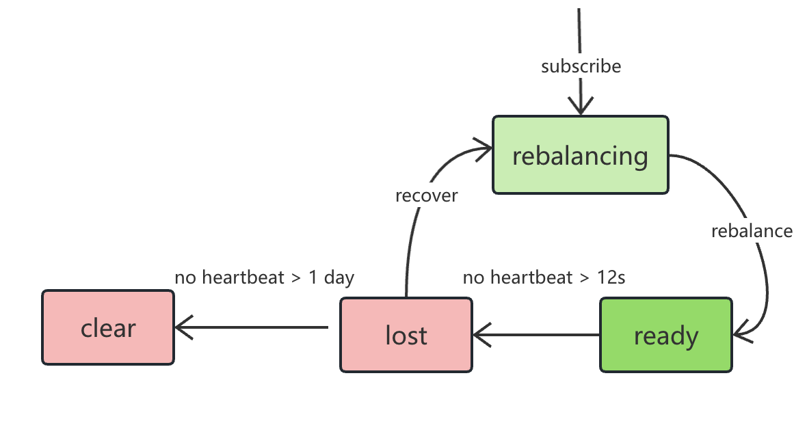

# Consumer 状态优化

## 1. 背景

TS-4592

中石化客户的 consumer 比较多，重启或者升级集群版本的时候，会出现很多 lost 的 consumer。加上 ready 的一共能达到 3500 个左右。期望可以增加清理 lost 状态的 consumer 的方法。
通过 taosadapter 订阅时，如果一个 consumer 停止消费时，忘记调用 close 关闭 consumer，就会导致 taosadapter 进程里一直有这个 consumer 在发送心跳，但是不 poll 数据，由于心跳的存在 taosd 认为该 consumer 仍然有效，所以该 consumer 分配的 vnode 会被一直占据，导致无法消费这些 vnode。

## 2. 变更历史

| 日期 | 版本 | 负责人 | 主要修改内容 |
| --- | --- | --- | --- |
| 2024/07/08 | 0.1 | 王明明 | 创建 |
| 2024/0709 | 0.2 | 王明明 | 基于 Wade Review 的意见修改，并参考 Kafka 设计超时参数 |
| 2024/7/10 | 0.3 | 王明明 | 基于线下 Review 意见修改 |

## 3. 定义

无。

## 4. 行为说明

### 4.1 Consumer 状态变化

#### 4.1.1 当前状态机

1. 目前consumer 的状态有四种，如下图所示：


#### 4.1.2 Kafka 行为

调研 kafka， consumer 在丢失心跳 session.timeout.ms 时间后，就会把这个 consumer 剔除掉，重新 rebalance，并没有 lost 和 recover 的过程。实际在 TD 订阅过程中也并未遇到 recover 的流程。

#### 4.1.3 新的状态机

最终状态转换行为如下图，去掉 consumer 的 lost 状态，只有 rebalancing 和 ready 两个状态，**当一个 consumer 被清除时会记录日志**。


### 4.2 Show Consumers

`show consumers` 的输出只显示 `rebalancing` 和 `ready` 两种状态，对因心跳超时而被自动清除的 consumer 不再显示，但可以通过日志观察到。

### 4.3 Consumer 配置变更

#### 4.3.1 新增配置

Consumer 增加如下初始化配置

| 参数名 | 类型 | 参数说明 | 备注 |
| --- | --- | --- | --- |
| session.timeout.ms | integer | consumer 心跳丢失后超时时间，超时后 ，会触发 rebalance 逻辑，成功后该 consumer 会被删除 | 单位ms，默认值12000，取值范围 [6000， 1800000] |
| max.poll.interval.ms | integer | consumer poll 拉取数据间隔的最长时间，超过该时间，会认为该 consumer 离线，触发rebalance 逻辑，成功后该 consumer 会被删除 | 单位ms，默认值 300000，[1000，INT32_MAX] |

说明：控制 mnode  rebalance 的间隔默认为 2s，consumer 状态检测是 rebalance 时执行的，所以 session.timeout.ms 和 max.poll.interval.ms 时间后 2s 内执行 rebalance 逻辑 。

#### 4.3.2 使用示例

上面两个新增的参数 ，以 c 语言接口为例，使用示例如下（红色代码）
```c
/* 根据需要，设置消费组 (group.id)、自动提交 (enable.auto.commit)、
   自动提交时间间隔 (auto.commit.interval.ms)、用户名 (td.connect.user)、密码 (td.connect.pass) 等参数 */
tmq_conf_t* conf = tmq_conf_new();
tmq_conf_set(conf, "enable.auto.commit", "true");
tmq_conf_set(conf, "auto.commit.interval.ms", "1000");
tmq_conf_set(conf, "group.id", "cgrpName");
tmq_conf_set(conf, "td.connect.user", "root");
tmq_conf_set(conf, "td.connect.pass", "taosdata");
tmq_conf_set(conf, "auto.offset.reset", "latest");
tmq_conf_set(conf, "msg.with.table.name", "true");
tmq_conf_set(conf, "session.timeout.ms", "12000");
tmq_conf_set(conf, "max.poll.interval.ms", "100000");

tmq_t* tmq = tmq_consumer_new(conf, NULL, 0);
tmq_conf_destroy(conf);
```

### 4.4 Consumer 超时机制

consumer 超时机制存在两种情况，第一是超过 session.timeout.ms 时间没有收到心跳，第二是 poll 接口超过 max.poll.interval.ms 时间没有继续调用，这两种情况任何一个满足都会触发consumer 离线被删除，然后重新 rebalance。
如果后面继续使用上面的 consumer 做操作，会报 consumer 不存在或 consumer 不匹配等错误。如果想继续消费，需要重新 subscribe。

## 5. 性能

无影响。

## 6. 兼容性

1. 对于之前 lost 状态的 consumer 会检测并清除掉，不影响之前的使用。**测试用例如果有涉及对 **`**lost**`** 状态的判断，要进行相应地修改**。
2. 对于旧的版本有订阅的情况，升级后会对存储最数据兼容。

## 7. 运维

无。

## 8. 使用场景

无。

## 9. 约束和限制

无。

## 10. 常见错误和排查

无。

## 11. 可观测性

无。

## 12. 安装和卸载

无。

## 13. 文档

Consumer config 配置参数需更新。（https://docs.taosdata.com/develop/tmq/#%E6%95%B0%E6%8D%AE%E8%AE%A2%E9%98%85%E7%9B%B8%E5%85%B3%E5%8F%82%E6%95%B0）

## 14. 参考文档

## 15. 附录

无。
