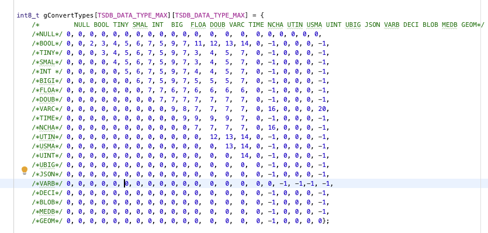

# TDengine 支持 Mysql 函数

## 1. 背景

###### 1.0.0.0.1 原计划：

在 20240530 公司产品规划会上，决定为 TDengine 增加一些函数，函数列表以 Hive 系统作为参照。
对 Hive 支持的函数列表进行整理后，形成文档 [函数列表](https://taosdata.feishu.cn/wiki/FFLzwPUhZiRlQzk9XuFcDvzQnie?sheet=8PlZAo)，其中列出了函数名称、函数参数、开发优先级、函数描述等信息，开发时作为参照。

###### 1.0.0.0.2 新计划：

1. TDengine 查询以支持 BI 软件为目标
2. 原计划优先支持 Hive 的函数，修改为优先支持 MySQL 函数
3. 参见 [FineBI 对接工作量分析](https://taosdata.feishu.cn/wiki/WLaOw0fdOiDwEokxmLDcfMG1nke)，以及 [Hive VS MySQL 函数](https://taosdata.feishu.cn/wiki/T3w5wJUHeitRQHkjIjhc8cD9nLb?sheet=Hc6VXj)
4. 本次 FS 只涉及用户在 PDF [TDengine场景梳理]([帆软BI兼容需求报告](https://taosdata.feishu.cn/wiki/J8bPwRNNziD4GDkht2KcPWeAnPh)) 中提及的函数

## 2. 变更历史

| 日期 | 版本 | 负责人 | 主要修改内容 |
| --- | --- | --- | --- |
| 2024/6/21 | 0.1 | 司马靖 |  |
| 2024/8/2 | 0.2 | 司马靖 | 修改关于多字节安全的描述 |
| 2024/8/12 | 0.3 | 司马靖 | 增加关于函数适用类型的说明 |
| 2024/8/15 | 0.4 | 司马靖 | 修改 TRIM 函数的语法说明 |
| 2024/8/16 | 0.5 | 司马靖 | 增加 TIMEDIFF 函数 time_unit 为 NULL 时的行为说明 |
| 2024/8/16 | 0.6 | 司马靖 | 增加时间函数在输入参数为 UNIX 时间戳时关于精度的描述 |
| 2024/9/11 | 0.7 | 司马靖 | 增加了 rand 函数在参数为 NULL 时的说明 |

## 3. 定义

#### 3.0.1 函数表达式

函数表达式中的 `epxr` 表示该参数支持表达式，参数名不包含 `expr` 表示该参数只接受常量值（暂定）。

#### 3.0.2 适用数据类型

函数中的适用数据类型表示参数只接受说明中描述的数据类型，其他的数据类型会导致函数报错。

#### 3.0.3 多字节安全

字符串函数的多字节安全（multibyte safe）指的是在处理多字节字符（比如中文字符）的时候，会把该字符当成一个整体来看待，而不是按照字节划分，将其划分成多个个体来看待。
比如多字节字符在匹配子串的时候，有一个中文字符 `你` 的十六进制表示为 `E4 BD A0`，此时假设有一个字符串的十六进制表示为 `E4 BD` ，该字符串并不会被认为是该中文字符的子串。
以及在计算字符串的字符长度（CHAR_LENGTH）的时候，会把多字节字符 `你` 的长度算做 1，而非 3。
目前只保证使用 UTF-8 编码的字符串的多字节安全

#### 3.0.4 不同数据类型比较规则

因为涉及到不同数据类型比较时的类型转换，在此定义比较规则。
- 函数中涉及的比较规则和比较运算符的规则相同。
- 如果有任意参数为 NULL ，返回 NULL。
- 如果输入参数都是同一类型，按照该类型比较，返回值也是该类型。
- 数值类型和字符串类型比较，按照数值类型进行比较，返回值是字符串类型。具体返回值的类型参见下表。
- 如果输入参数包含 VARBINARY 类型，那么其余的参数必须都是 VARCHAR 或 VARBINARY 类型，否则会报错，此时按照 VARBINARY 类型进行比较，返回值为 VARBINARY 类型。
- 类型转换表如下（这个类型转换规则不确定要不要暴露给用户）     



## 4. 行为说明

对于已经存在的函数，其描述与原先不同的地方会用红色字体标注。

#### 4.0.1 数学函数

##### 4.0.1.1 pi

```plaintext
PI()
```

**功能说明**：返回圆周率<equation>\pi
</equation>的值。
**返回结果类型**：DOUBLE。
**适用数据类型**：无。
**使用说明**：<equation>\pi \approx 3.1415926535
</equation>
**举例**：
```sql
-> select pi();
        +------------------+
        | pi()             |
        +------------------+
        | 3.141592653589793|
        +------------------+
```

##### 4.0.1.2 round(已有函数)

```plaintext
ROUND(expr[, digits])
```

**功能说明**：获得指定字段的四舍五入的结果。 
**返回结果类型**：与指定字段的原始数据类型一致。
**适用数据类型**：
- `expr`：数值类型。
- `digits`：数值类型。
**使用说明**：
- 若 `expr` 或 `digits` 为 NULL，返回 NULL。
- 若指定了`digits`，则会保留 `digits` 位小数，默认为 0。
- 若输入值是 INTEGER 类型, 无论 `digits` 值为多少，都只会返回 INTEGER 类型，不会保留小数。
- `digits` 大于零表示对小数位进行操作，四舍五入到 `digits` 位小数。若小数位数小于 `digits` 位，不进行四舍五入操作，直接返回。
- `digits` 小于零表示丢掉小数位，并将数字四舍五入到小数点左侧 `digits` 位。若小数点左侧的位数小于 `digits`位，返回 0。
- 由于暂未支持 DECIMAL 类型，所以该函数会用 DOUBLE 和 FLOAT 来表示包含小数的结果，但是 DOUBLE 和 FLOAT 是有精度上限的，当位数太多时使用该函数可能没有意义。
**举例**：
```sql
-> select round(8888.88);
        +----------------+
        | round(8888.88) |
        +----------------+
        |           8889 |
        +----------------+
-> select round(8888.88,1);
        +------------------+
        | round(8888.88,1) |
        +------------------+
        |           8888.9 |
        +------------------+
-> select round(8888.88,-1);
        +-------------------+
        | round(8888.88,-1) |
        +-------------------+
        |              8890 |
        +-------------------+
-> SELECT ROUND(8888.88, 3);
        +-------------------+
        | ROUND(8888.88, 3) |
        +-------------------+
        |           8888.88 |
        +-------------------+
-> SELECT ROUND(8888.88, -5);
        +--------------------+
        | ROUND(8888.88, -5) |
        +--------------------+
        |                  0 |
        +--------------------+
```

##### 4.0.1.3 truncate/trunc

```plaintext
TRUNCATE/TRUNC(expr, digits)
```

**功能说明**：获得指定字段按照指定位数截断的值。 
**返回结果类型**：与 `expr` 字段的原始数据类型一致。
**适用数据类型**：
- `expr`：数值类型。
- `digits`：数值类型。
**使用说明**：
- 若 `expr` 或 `digits` 为 NULL，返回 NULL。
- 截取指按保留位数直接进行截取，没有四舍五入。
- `digits` 大于零表示对小数位进行操作，截取到 `digits` 位小数，若小数位数小于 `digits` 位，不进行截取操作，直接返回。
- `digits` 等于零表示丢掉小数位。
- `digits` 小于零表示丢掉小数位，并将小数点左侧 `digits` 位置 `0`。若小数点左侧的位数小于 `digits`位，返回 0。
- 由于暂未支持 DECIMAL 类型，所以该函数会用 DOUBLE 和 FLOAT 来表示包含小数的结果，但是 DOUBLE 和 FLOAT 是有精度上限的，当位数太多时使用该函数可能没有意义。
**举例**：
```sql
-> select truncate(8888.88, 1);
        +----------------------+
        | truncate(8888.88, 1) |
        +----------------------+
        |               8888.8 |
        +----------------------+
-> select truncate(8888.88, 0);
        +----------------------+
        | truncate(8888.88, 0) |
        +----------------------+
        |                 8888 |
        +----------------------+
-> select truncate(8888.88, -1);
        +-----------------------+
        | truncate(8888.88, -1) |
        +-----------------------+
        |                  8880 |
        +-----------------------+
-> SELECT TRUNCATE(8888.88,3);
        +---------------------+
        | TRUNCATE(8888.88,3) |
        +---------------------+
        |             8888.88 |
        +---------------------+
-> SELECT TRUNCATE(8888.88,-5);
        +----------------------+
        | TRUNCATE(8888.88,-5) |
        +----------------------+
        |                    0 |
        +----------------------+
```

##### 4.0.1.4 exp

```plaintext
EXP(expr)
```

**功能说明**：返回 e（自然对数的底）的指定乘方后的值。
**返回结果类型**：DOUBLE。
**适用数据类型**：数值类型。
**使用说明**：
- 如果 `expr` 为 NULL，返回 NULL。
- 如果结果超出 double 类型范围，返回 NULL。
**举例**：
```sql
-> select exp(2);
        +------------------+
        | exp(2)           |
        +------------------+
        | 7.38905609893065 |
        +------------------+
```

##### 4.0.1.5 ln

```plaintext
LN(expr)
```

**功能说明**：返回指定参数的自然对数。
**返回结果类型**：DOUBLE。
**适用数据类型**：数值类型。
**使用说明**：
- 如果 `expr` 为 NULL，返回 NULL。
- 如果 `epxr` 小于等于 0，返回 NULL。
**举例**：
```sql
-> select ln(10);
        +-------------------+
        | ln(10)            |
        +-------------------+
        | 2.302585092994046 |
        +-------------------+
```

##### 4.0.1.6 mod

```plaintext
MOD(expr1, expr2)
```

**功能说明**：计算  <equation>expr1 \% expr2</equation>  的结果。
**返回结果类型**：DOUBLE。
**适用数据类型**：数值类型。
**使用说明**：
- 如果 `expr2` 为 0 则返回 NULL。
- 如果 `expr1` 或 `expr2` 为 NULL，返回 NULL。
**举例**：
```sql
-> select mod(10,3);
        +-----------+
        | mod(10,3) |
        +-----------+
        |         1 |
        +-----------+
-> select mod(1,0);
        +----------+
        | mod(1,0) |
        +----------+
        |     NULL |
        +----------+
```

##### 4.0.1.7 rand

```plaintext
RAND([seed])
```

**功能说明**：返回一个从 0 到 1 均匀分布的随机数。
**返回结果类型**：DOUBLE。
**适用数据类型**：
- `seed`：整数类型。
**使用说明**：
- 如果指定了 `seed` 值，那么将会用指定的 `seed` 作为随机种子，确保生成的随机数序列具有确定性。
- 如果 `seed` 为 NULL，`rand` 函数将按照没有 `seed` 的情况进行计算。
**举例**：
```sql
-> select rand();
        +--------------------+
        | rand()             |
        +--------------------+
        | 0.7484340907525588 |
        +--------------------+
-> select rand();
        +--------------------+
        | rand()             |
        +--------------------+
        | 0.5936534112260243 |
        +--------------------+
-> select rand(1);
        +---------------------+
        | rand(1)             |
        +---------------------+
        | 0.40540353712197724 |
        +---------------------+
-> select rand(1);
        +---------------------+
        | rand(1)             |
        +---------------------+
        | 0.40540353712197724 |
        +---------------------+
```

##### 4.0.1.8 sign

```plaintext
SIGN(expr)
```

**功能说明**：返回指定参数的符号。
**返回结果类型**：与指定字段的原始数据类型一致。
**适用数据类型**：数值类型。
**使用说明**：
- 如果 `expr` 为负，返回 -1 ，
- 如果 `expr` 为正，返回 1 ，
- 如果 `expr` 为 0 ，返回 0 。
- 如果 `expr` 为 NULL ，返回 NULL 。
**举例**：
```sql
-> select sign(-1);
        +----------+
        | sign(-1) |
        +----------+
        |       -1 |
        +----------+
-> select sign(1);
        +---------+
        | sign(1) |
        +---------+
        |       1 |
        +---------+
-> select sign(0);
        +---------+
        | sign(0) |
        +---------+
        |       0 |
        +---------+
```

##### 4.0.1.9 degrees

```plaintext
DEGREES(expr)
```

**功能说明**：计算指定参数由弧度值转为角度后的值。
**返回结果类型**：DOUBLE。
**适用数据类型**：数值类型。
**使用说明**：
- 如果 `expr` 为 NULL，则返回 NULL。
- <equation>degree = radian \times 180/\pi</equation>。
**举例**：
```sql
-> select degrees(PI());
        +---------------+
        | degrees(PI()) |
        +---------------+
        |           180 |
        +---------------+
```

##### 4.0.1.10 radians

```plaintext
RADIANS(expr)
```

**功能说明**：计算指定参数由角度值转为弧度后的值。
**返回结果类型**：DOUBLE。
**适用数据类型**：数值类型。
**使用说明**：
- 如果 `expr` 为 NULL，则返回 NULL。
- <equation>radian = degree \times \pi/180</equation>。
**举例**：
```sql
-> select radians(180);
        +-------------------+
        | radians(180)      |
        +-------------------+
        | 3.141592653589793 |
        +-------------------+
```

##### 4.0.1.11 greatest

```plaintext
GREATEST(expr1, expr2[, expr]...)
```

**功能说明**：获得输入的所有参数中的最大值。
**返回结果类型**：取决于输入参数类型。
**适用数据类型**：全部类型字段。该函数最小参数个数为 2 个。
**使用说明**：详见[比较规则](https://taosdata.feishu.cn/wiki/P8Y0w9S13icde2kFZj7c4DUQnIb#YEkhdNvmDoXyyBx2Tw7coYfPnOh)

##### 4.0.1.12 least

```plaintext
LEAST(expr1, expr2[, expr]...)
```

**功能说明**：获得输入的所有参数中的最小值，其余部分同 `greatest` 函数。

#### 4.0.2 字符串函数

##### 4.0.2.1 char_length(已有函数)

```plaintext
CHAR_LENGTH(expr)
```

**功能说明**：以字符计数的字符串长度。
**返回结果类型**：BIGINT。
**适用数据类型**：VARCHAR, NCHAR。
**使用说明**：
- 与 `LENGTH()` 函数不同在于，对于多字节字符，比如中文字符， `CHAR_LENGTH()` 函数会将其算做一个字符，长度为 1，而 `LENGTH()` 会计算其字节数，长度为 3。比如 `CHAR_LENGTH('你好') = 2`， `LENGTH('你好') = 6`。
- 如果 `expr` 为 NULL，返回 NULL。
**举例**：
```sql
-> select char_length('Hello world');
        +----------------------------+
        | char_length('Hello world') |
        +----------------------------+
        |                         11 |
        +----------------------------+
-> select char_length('你好 世界');
        +------------------------------+
        | char_length('你好 世界')      |
        +------------------------------+
        |                            5 |
        +------------------------------+
```

##### 4.0.2.2 char

```plaintext
CHAR(expr1 [, expr2] [, epxr3] ...)
```

**功能说明**：将输入参数当作整数，并返回这些整数在 ASCII 编码中对应的字符。
**返回结果类型**：VARCHAR。
**适用数据类型**：数值类型,VARCHAR,NCHAR。
**使用说明**：
- 输入的值超过 255 会被转化成多字节的结果，如 `CHAR(256)` 等同于 `CHAR(1,0)`, `CHAR(256 * 256)` 等同于 `CHAR(1,0,0)`。
- 输入参数的 NULL 值会被跳过。
- 输入参数若为字符串类型，会将其转换为数值类型处理。
- 若输入的参数对应的字符为不可打印字符，返回值中仍有该参数对应的字符，但是可能无法显示出来。
**举例**：
```sql
-> select char(77);
        +----------+
        | char(77) |
        +----------+
        | M        |
        +----------+
-> select char(77,77);
        +-------------+
        | char(77,77) |
        +-------------+
        | MM          |
        +-------------+
-> select char(77 * 256 + 77);
        +---------------------+
        | char(77 * 256 + 77) |
        +---------------------+
        | MM                  |
        +---------------------+
-> select char(77,NULL,77);
        +------------------+
        | char(77,NULL,77) |
        +------------------+
        | MM               |
        +------------------+
```

##### 4.0.2.3 ascii

```plaintext
ASCII(expr)
```

**功能说明**：返回字符串第一个字符的 ASCII 码。
**返回结果数据类型**：UNSIGNED TINYINT。
**适用数据类型**：VARCHAR, NCHAR。
**使用说明**：
- 如果 `expr` 为 NULL，返回 NULL。
- 如果 `expr` 的第一个字符为多字节字符，只会返回该字符第一个字节的值对应的 ASCII 码。
**举例**：
```sql
-> select ascii('testascii');
        +--------------------+
        | ascii('testascii') |
        +--------------------+
        |                116 |
        +--------------------+
```

##### 4.0.2.4 position

```plaintext
POSITION(expr1 IN expr2)
```

**功能说明**：计算字符串 `expr1` 在字符串 `expr2` 中的位置。
**返回结果类型**：BIGINT。
**适用数据类型**：
- `expr1`：VARCHAR, NCHAR。
- `expr2`：VARCHAR, NCHAR。
**使用说明**：
- 若 `expr1` 或 `expr2` 为 NULL，返回 NULL。
- 若 `expr`1 在 `expr`2 中不存在返回 0。
- 若 `expr`1 为空串，认为 `expr`1 在 `expr`2 中总能匹配成功，返回 1。
- 该函数是[多字节安全](https://taosdata.feishu.cn/wiki/P8Y0w9S13icde2kFZj7c4DUQnIb#HxE8dFjHJoGYNrxqKV3cylncnvg)的。
- 返回的位置是 1-base 的。
**举例**：
```sql
-> select position('a' in 'cba');
        +------------------------+
        | position('a' in 'cba') |
        +------------------------+
        |                      3 |
        +------------------------+
-> select position('' in 'cba');
        +-----------------------+
        | position('' in 'cba') |
        +-----------------------+
        |                     1 |
        +-----------------------+
-> select position('d' in 'cba');
        +------------------------+
        | position('d' in 'cba') |
        +------------------------+
        |                      0 |
        +------------------------+        
```

##### 4.0.2.5 trim

```plaintext
TRIM([{LEADING | TRAILING | BOTH} [remstr] FROM] expr)
TRIM([remstr FROM] str)
```

**功能说明**：返回去掉了所有 `remstr` 前缀或后缀的字符串 `epxr` 。
**返回结果类型**：与输入字段 `epxr` 的原始类型相同。
**适用数据类型**：
- `remstr`：VARCHAR,NCHAR。
- `epxr`：VARCHAR,NCHAR。
**使用说明**：
- 第一个可选变量[LEADING | BOTH | TRAILING]指定要剪裁字符串的哪一侧：
      - `LEADING` 将移除字符串开头的指定字符。
      - `TRAILING` 将移除字符串末尾的指定字符。
      - `BOTH`（默认值）价格移除字符串开头和末尾的指定字符。
- 第二个可选变量[remstr]指定要裁剪掉的字符串：
  - 如果不指定 `remstr` ，默认裁剪空格。
  - `remstr` 可以指定多个字符，如`trim('ab' from 'abacd')` ，此时会将 `'ab'` 看做一个整体来裁剪，得到裁剪结果 `'acd'`。
- 若 `epxr` 为 NULL, 返回 NULL。
- 该函数是多字节安全的。
**举例**：
```sql
-> select trim('        a         ');
        +----------------------------+
        | trim('        a         ') |
        +----------------------------+
        | a                          |
        +----------------------------+
-> select trim(leading from '        a         ');
        +-----------------------------------------+
        | trim(leading from '        a         ') |
        +-----------------------------------------+
        | a                                       |
        +-----------------------------------------+
-> select trim(leading 'b' from 'bbbbbbbba         ');
        +---------------------------------------------+
        | trim(leading 'b' from 'bbbbbbbba         ') |
        +---------------------------------------------+
        | a                                           |
        +---------------------------------------------+
-> select trim(both 'b' from 'bbbbbabbbbbb');
        +------------------------------------+
        | trim(both 'b' from 'bbbbbabbbbbb') |
        +------------------------------------+
        | a                                  |
        +------------------------------------+
```

##### 4.0.2.6 replace

```plaintext
REPLACE(expr, from_str, to_str)
```

**功能说明**：将字符串中的 `from_str` 全部替换为 `to_str`。
**返回结果类型**：与输入字段 `expr` 的原始类型相同。
**适用数据类型**：
- `expr`：VARCHAR, NCHAR。
- `from_str`：VARCHAR, NCHAR。
- `to_str`：VARCHAR, NCHAR。
**使用说明**：
- 该函数是大小写敏感的。
- 任意参数为 NULL，返回 NULL。
- 该函数是多字节安全的。
**举例**：
```sql
-> select replace('aabbccAABBCC', 'AA', 'DD');
        +-------------------------------------+
        | replace('aabbccAABBCC', 'AA', 'DD') |
        +-------------------------------------+
        | aabbccDDBBCC                        |
        +-------------------------------------+
```

##### 4.0.2.7 repeat

```plaintext
REPEAT(expr, count)
```

**功能说明**：返回将字符串重复指定次数得到的字符串。
**返回结果类型**：与输入字段 `expr` 的原始类型相同。
**适用数据类型**：
- `expr`： VARCHAR,NCHAR。
- `count`：整数类型。
**使用说明**：
- 若 `count < 1`，返回空串。
- 若 `str` 或 `count` 为 NULL，返回 NULL。
**举例**：
```sql
-> select repeat('abc',5);
        +-----------------+
        | repeat('abc',5) |
        +-----------------+
        | abcabcabcabcabc |
        +-----------------+
-> select repeat('abc',-1);
        +------------------+
        | repeat('abc',-1) |
        +------------------+
        |                  |
        +------------------+
```

##### 4.0.2.8 substring/substr

```plaintext
SUBSTRING/SUBSTR(expr, pos [, len])
SUBSTRING/SUBSTR(expr FROM pos [FOR len])
```

**功能说明**：返回字符串 `expr` 在 `pos` 位置开始的子串，若指定了 `len` ，则返回在 `pos` 位置开始，长度为 `len` 的子串。
**返回结果类型**：与输入字段 `expr` 的原始类型相同。
**适用数据类型**：
- `expr`：VARCHAR,NCHAR。
- `pos`：整数类型。
- `len`：整数类型。
**使用说明**：
- 若 `pos` 为正数，则返回的结果为 `expr` 从左到右开始数 `pos` 位置开始的右侧的子串。
- 若 `pos` 为负数，则返回的结果为 `expr` 从右到左开始数 `pos` 位置开始的右侧的子串。
- 任意参数为 NULL，返回 NULL。
- 该函数是多字节安全的。
- 若 `len` 小于 1，返回空串。
- `pos` 是 1-base 的，若 `pos` 为 0，返回空串。
- 若 `pos` + `len` 大于 `len(expr)`，返回从 `pos` 开始到字符串结尾的子串，等同于执行 `substring(expr, pos)`。
**举例**：
```sql
-> select substring('tdengine', 0);
        +--------------------------+
        | substring('tdengine', 0) |
        +--------------------------+
        |                          |
        +--------------------------+
-> select substring('tdengine', 3);
        +--------------------------+
        | substring('tdengine', 3) |
        +--------------------------+
        | engine                   |
        +--------------------------+
-> select substring('tdengine', 3,3);
        +----------------------------+
        | substring('tdengine', 3,3) |
        +----------------------------+
        | eng                        |
        +----------------------------+
-> select substring('tdengine', -3,3);
        +-----------------------------+
        | substring('tdengine', -3,3) |
        +-----------------------------+
        | ine                         |
        +-----------------------------+
-> select substring('tdengine', -3,-3);
        +------------------------------+
        | substring('tdengine', -3,-3) |
        +------------------------------+
        |                              |
        +------------------------------+
```

##### 4.0.2.9 substring_index

```plaintext
SUBSTRING_INDEX(expr, delim, count)
```

**功能说明**：返回字符串 `expr` 在出现指定次数分隔符的位置截取的子串。
**返回结果类型**：与输入字段 `expr` 的原始类型相同。
**适用数据类型**：
- `expr`：VARCHAR,NCHAR。
- `delim`：VARCHAR, NCHAR。
- `count`：整数类型。
**使用说明**：
- 若 `count` 为正数，则返回的结果为 `expr` 从左到右开始数第 `count` 次 出现 `delim` 的位置左侧的字符串。
- 若 `count` 为负数，则返回的结果为 `expr` 从右到左开始数第 `count` 的绝对值次 出现 `delim` 的位置右侧的字符串。
- 任意参数为 NULL，返回 NULL。
- 该函数是多字节安全的。
**举例**：
```sql
-> select substring_index('www.taosdata.com','.',2);
        +-------------------------------------------+
        | substring_index('www.taosdata.com','.',2) |
        +-------------------------------------------+
        | www.taosdata                              |
        +-------------------------------------------+
-> select substring_index('www.taosdata.com','.',-2);
        +--------------------------------------------+
        | substring_index('www.taosdata.com','.',-2) |
        +--------------------------------------------+
        | taosdata.com                               |
        +--------------------------------------------+
```

#### 4.0.3 时间函数

##### 4.0.3.1 timediff(已有函数)

```plaintext
TIMEDIFF(expr1, expr2 [, time_unit])
```

**功能说明**：返回时间戳 `expr1` - `expr2` 的结果，结果可能为负，并近似到时间单位 `time_unit` 指定的精度。
**返回结果类型**：BIGINT。
**适用数据类型**：
- `expr1`：表示 UNIX 时间戳的 BIGINT, TIMESTAMP 类型，或符合日期时间格式的 VARCHAR, NCHAR 类型。
- `expr2`：表示 UNIX 时间戳的 BIGINT, TIMESTAMP 类型，或符合日期时间格式的 VARCHAR, NCHAR 类型。
- `time_unit`：见使用说明。
**使用说明**：
- 支持的时间单位 `time_unit` 如下： 1b(纳秒), 1u(微秒)，1a(毫秒)，1s(秒)，1m(分)，1h(小时)，1d(天), 1w(周)。
- 如果时间单位 `time_unit` 未指定， 返回的时间差值精度与当前 DATABASE 设置的时间精度一致。若未指定 DATABASE，使用默认精度毫秒。
- 输入包含不符合时间日期格式的字符串则返回 NULL。
- `expr1` 或 `expr2` 为 NULL，返回 NULL。
- `time_unit` 为 NULL，等同于未指定时间单位。
- 输入时间戳的精度由所查询表的精度确定, 若未指定表, 则精度为毫秒.
**举例**：
```sql
-> select timediff('2022-01-01 08:00:00', '2022-01-01 08:00:01',1s);
        +--------------------------------------------------------+
        | timediff('2022-01-01 08:00:00', '2022-01-01 08:00:01',1s) |
        +--------------------------------------------------------+
        | -1                                                     |
        +--------------------------------------------------------+

-> select timediff('2022-01-01 08:00:01', '2022-01-01 08:00:00',1s);
        +-----------------------------------------------------------+
        | timediff('2022-01-01 08:00:01', '2022-01-01 08:00:00',1s) |
        +-----------------------------------------------------------+
        | 1                                                         |
        +-----------------------------------------------------------+
```

##### 4.0.3.2 week

```plaintext
WEEK(expr [, mode])
```

**功能说明**：返回输入日期的周数。
**返回结果类型**：BIGINT。
**适用数据类型**：
- `expr`：表示 UNIX 时间戳的 BIGINT, TIMESTAMP 类型，或符合日期时间格式的 VARCHAR, NCHAR 类型。
- `mode`：0 - 7 之间的整数。
**使用说明**：
- 若 `expr` 为 NULL，返回 NULL。
- 输入时间戳的精度由所查询表的精度确定, 若未指定表, 则精度为毫秒.
- `mode` 用来指定一周是从周日开始还是周一开始，以及指定返回值范围是 1 - 53 还是 0 - 53。下表详细描述不同的 mode 对应的计算方法：


| Mode | 每周的第一天 | 返回值范围 | 第 1 周的计算方法 |
| --- | --- | --- | --- |
| 0 | 周日 | 0 - 53 | 第一个包含周日的周为第 1 周 |
| 1 | 周一 | 0 - 53 | 第一个包含四天及以上的周为第 1 周 |
| 2 | 周日 | 1 - 53 | 第一个包含周日的周为第 1 周 |
| 3 | 周一 | 1 - 53 | 第一个包含四天及以上的周为第 1 周 |
| 4 | 周日 | 0 - 53 | 第一个包含四天及以上的周为第 1 周 |
| 5 | 周一 | 0 - 53 | 第一个包含周一的周为第 1 周 |
| 6 | 周日 | 1 - 53 | 第一个包含四天及以上的周为第 1 周 |
| 7 | 周一 | 1 - 53 | 第一个包含周一的周为第 1 周 |

- 当返回值范围为0 - 53时，第 1 周之前的日期为第 0 周。
- 当返回值范围为1 - 53时，第 1 周之前的日期为上一年的最后一周。
- 以`2000-01-01`为例，
      - 在 `mode=0`时返回值为 0，因为该年第一个周日为`2000-01-02`，从`2000-01-02`起才是第 1 周，所以 `2000-01-01`为第 0 周，返回 0。
      - 在 `mode=1`时返回值为 0，因为`2000-01-01`所在的周只有两天，分别是 `2000-01-01(周六)`和`2000-01-02(周日)`，所以`2000-01-03`起才是第一周，`2000-01-01`为第 0 周，返回 0。
      - 在 `mode=2`时返回值为 52，因为从`2000-01-02`起才是第 1 周，并且返回值范围为 1 - 53，所以`2000-01-01`算做上一年的最后一周，即 1999 年的第 52 周，返回 52。
**举例**：
```sql
-> select week('2000-01-01',0);
        +----------------------+
        | week('2000-01-01',0) |
        +----------------------+
        |                    0 |
        +----------------------+
-> select week('2000-01-01',1);
        +----------------------+
        | week('2000-01-01',1) |
        +----------------------+
        |                    0 |
        +----------------------+
-> select week('2000-01-01',2);
        +----------------------+
        | week('2000-01-01',2) |
        +----------------------+
        |                   52 |
        +----------------------+
-> select week('2000-01-01',3);
        +----------------------+
        | week('2000-01-01',3) |
        +----------------------+
        |                   52 |
        +----------------------+
```

##### 4.0.3.3 weekday

```plaintext
WEEKDAY(expr)
```

**功能说明**：返回输入日期是周几。
**返回结果类型**：BIGINT。
**适用数据类型**：表示 UNIX 时间戳的 BIGINT, TIMESTAMP 类型，或符合日期时间格式的 VARCHAR, NCHAR 类型。
**使用说明**：
- 返回值 0 代表周一，1 代表周二 ... 6 代表周日。
- 输入时间戳的精度由所查询表的精度确定, 若未指定表, 则精度为毫秒.
- 若 `expr` 为 NULL，返回 NULL。
**举例**：
```sql
-> select weekday('2000-01-01');
        +-----------------------+
        | weekday('2000-01-01') |
        +-----------------------+
        |                     5 |
        +-----------------------+
```

##### 4.0.3.4 weekofyear

```plaintext
WEEKOFYEAR(expr)
```

**功能说明**：返回输入日期的周数。
**返回结果类型**：BIGINT。
**适用数据类型**：表示 UNIX 时间戳的 BIGINT, TIMESTAMP 类型，或符合日期时间格式的 VARCHAR, NCHAR 类型。
**使用说明**：
- 等同于`WEEK(expr, 3)`，即在每周第一天是周一，返回值范围为 1 - 53，第一个包含四天及以上的周为第 1 周的条件下判断输入日期的周数。
- 输入时间戳的精度由所查询表的精度确定, 若未指定表, 则精度为毫秒.
- 若 `expr` 为 NULL，返回 NULL。
**举例**：
```sql
-> select weekofyear('2000-01-01');
        +--------------------------+
        | weekofyear('2000-01-01') |
        +--------------------------+
        |                       52 |
        +--------------------------+
```

##### 4.0.3.5 dayofweek

```plaintext
DAYOFWEEK(expr)
```

**功能说明**：返回输入日期是周几。
**返回结果类型**：BIGINT。
**适用数据类型**：表示 UNIX 时间戳的 BIGINT, TIMESTAMP 类型，或符合日期时间格式的 VARCHAR, NCHAR 类型。
**使用说明**：
- 返回值 1 代表周日，2 代表周一 ... 7 代表周六
- 输入时间戳的精度由所查询表的精度确定, 若未指定表, 则精度为毫秒.
- 若 `expr` 为 NULL，返回 NULL。
**举例**：
```sql
-> select dayofweek('2000-01-01');
        +-------------------------+
        | dayofweek('2000-01-01') |
        +-------------------------+
        |                       7 |
        +-------------------------+
```

#### 4.0.4 聚合函数

##### 4.0.4.1 stddev_pop

```plaintext
STDDEV_POP(expr)
```

**功能说明**：统计表中某列的总体标准差。
**返回结果类型**：DOUBLE。
**适用数据类型**：数值类型。
**使用说明**：
- 若 `expr` 为 NULL，返回 NULL。
- <equation>\sigma = \sqrt{\frac{1}{N} \sum_{i=1}^{N} (x_i - \bar{x})^2}</equation>
**举例**：
```sql
-> select id from test_stddev;
        +------+
        | id   |
        +------+
        |    1 |
        |    2 |
        |    3 |
        |    4 |
        |    5 |
        +------+
-> select stddev_pop(id) from test_stddev;
        +--------------------+
        | stddev_pop(id)     |
        +--------------------+
        | 1.4142135623730951 |
        +--------------------+
```

##### 4.0.4.2 var_pop

```plaintext
VAR_POP(expr)
```

**功能说明**：统计表中某列的总体方差。
**返回结果类型**：DOUBLE。
**适用数据类型**：数值类型。
**使用说明**：
- 若 `expr` 为 NULL，返回 NULL。
- <equation>\sigma^2 = \frac{1}{N} \sum_{i=1}^{N} (x_i - \bar{x})^2</equation>。
**举例**：
```sql
-> select id from test_var;
        +------+
        | id   |
        +------+
        |    1 |
        |    2 |
        |    3 |
        |    4 |
        |    5 |
        +------+
-> select var_pop(id) from test_var;
        +-------------+
        | var_pop(id) |
        +-------------+
        |           2 |
        +-------------+
```

##### 4.0.4.3 max/min(已有函数)

```plaintext
MAX/MIN(expr)
```

**功能说明**：统计表中某列的最大值/最小值。
**返回结果类型**：与输入数据类型一致。
**适用数据类型**：数值类型，VARCHAR，NCHAR
**使用说明**：
- max / min 函数可以接受字符串作为输入参数，当输入参数为字符串类型时，返回最大的字符串值。
- 若 `expr` 为 NULL，返回 NULL。

## 5. 性能

无。

## 6. 兼容性

函数行为变动及兼容性影响说明如下：
1. max/min 函数的输入参数较之前增加了 VARCHAR 和 NCHAR 类型，但对已经支持的数据类型行为无变化，没有兼容性问题。
2. timediff 函数由计算绝对值变为计算 expr1 - expr2 的值，可能会有负数结果，有兼容性问题。
3. char_length 函数计算多字节字符的时候会计算字符数而非字节数，该行为和原有预期行为一致，但原有实现有 bug，修复后针对同样的测试用例有可能产生不同的结果，具体参见行为说明。
4. round 函数新增一个参数，表示要四舍五入到哪一位，但该参数是可选参数，其默认值为 0 ，没有兼容性问题。

## 7. 运维

无。

## 8. 使用场景

具体使用方法已在行为说明章节中每个函数的**举例**部分写明。

## 9. 约束和限制

具体每个函数的约束和限制见行为说明章节中**使用说明**部分以及**适用数据类型**部分。

## 10. 常见错误和排查

无。

## 11. 可观测性

无。

## 12. 安装和卸载

无。

## 13. 文档

需要修改企业版文档
需要修改官网文档
行为说明章节中的内容需要更新到企业版文档和官网文档的**SQL手册-函数**部分

## 14. 参考文档

函数行为可参考 [Mysql Reference Manual](https://dev.mysql.com/doc/refman/9.0/en/aggregate-functions.html#function_max)

## 15. 附录

无。
