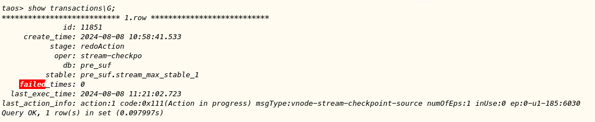
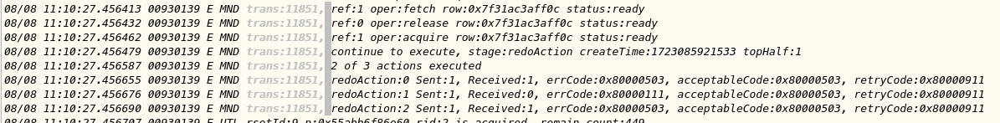
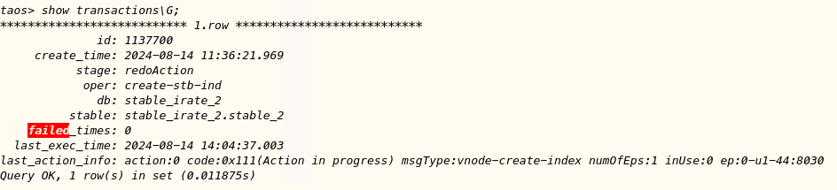
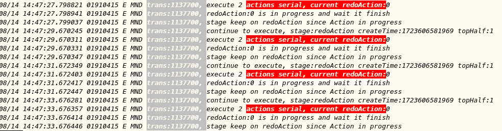
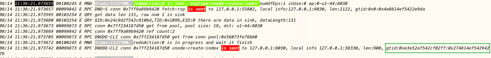
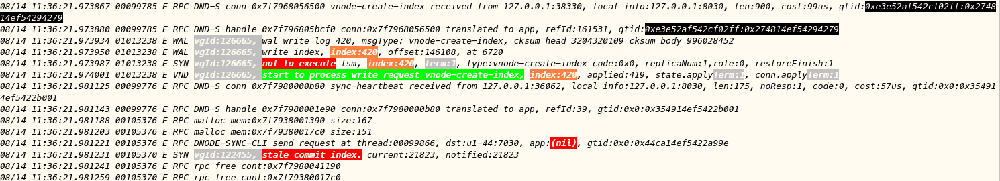

# 事务机制改进 -- 事务卡住问题的排障

1. code：0x111(Action in progress)

问题：
redoAction:2 sent:1, Received:0，action2没有收到receive
期望：
应该显示未收到response

1. code：0x111(Action in progress)
这种情况，遇到过，但是当时没有截图
问题：
一个action报错，错误是503，多次执行show transaction，有时显示错误0x111，有时显示的是0x503
期望：
错误码一直显示0x503

1. 不显示vgroupid

taos> show transactions\G;
*************************** 1.row ***************************
              id: 1120154
     create_time: 2024-07-30 19:43:15.605
           stage: redoAction
            oper: drop-index
              db: stable_lastrow_2
          stable:
    failed_times: 2673
  last_exec_time: 2024-08-12 15:35:25.820
last_action_info: action:0 code:0xffff(Unknown error 65535) msgType:vnode-drop-index numOfEps:1 inUse:0 ep:0-u1-44:7030 
Query OK, 1 row(s) in set (0.010761s)

08/12 14:47:04.762495 01882023 E MND trans:1120154, redoAction:0 is sent, msgType:vnode-drop-index numOfEps:1 inUse:0 ep:0-u1-44:7030
08/12 14:47:04.762511 01882023 E MND trans:1120154, redoAction:0 is in progress and wait it finish
08/12 14:47:04.762527 01882023 E MND trans:1120154, stage keep on redoAction since Action in progress
08/12 14:47:04.762541 01882023 E MND trans:1120154, send rsp, stage:redoAction failedTimes:1223 code:0xffffffff
08/12 14:47:04.763325 01882023 E MND trans:1120154, redoAction:0 response is received, code:0xffffffff, accept:0x0 retry:0x0

问题：
Show transaction中和日志中，都没有显示vnode-drop-index是发给那个vgroup的，在继续排查时比较难定位

期望：
应该显示发给哪个vgroup

1. 不显示消息的发送时间和消息id

追查mnode leader日志，发现如下日志，这是因为作为串行事务，redoAction的消息是在事务刚执行时发送的，后续就不再重复发送

按照事务启动的时间点，找当时的mnode日志，mnode已发生切换

找到mnode发送给vnode的消息id，按消息id到对应的dnode上搜索

发现vnode收到消息，进行了处理，但是没有返回response，估计发生了死锁

问题：
未显示消息的发送时间和消息id，没有消息id，分析对应vnode出现的问题非常困难

期望：
应该显示发送时间和消息id
