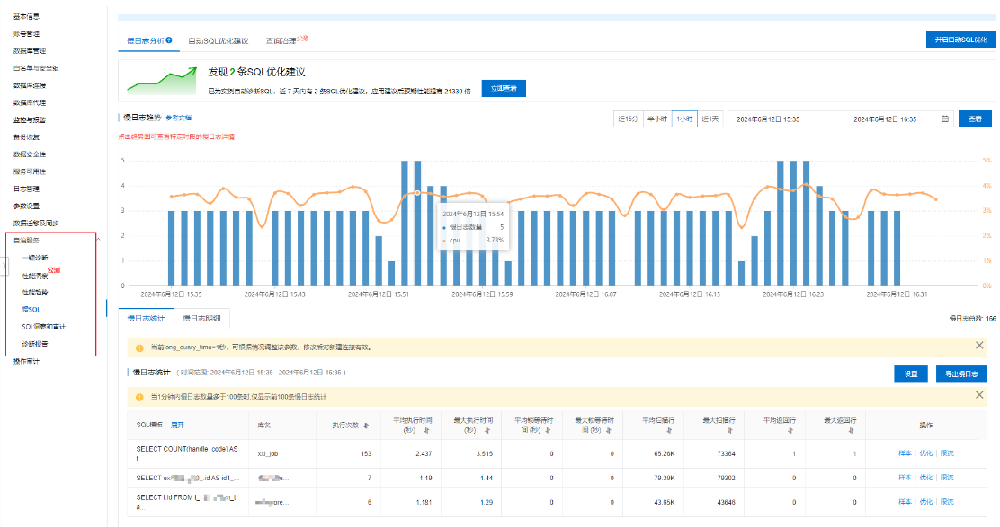
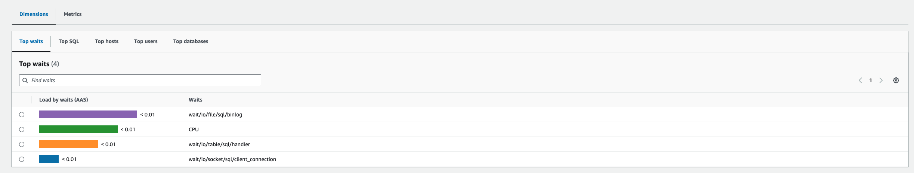
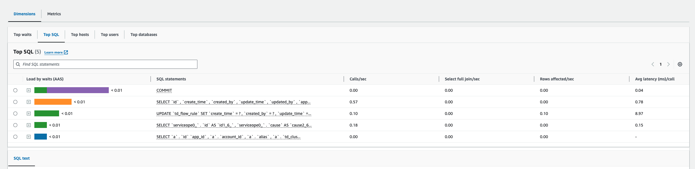
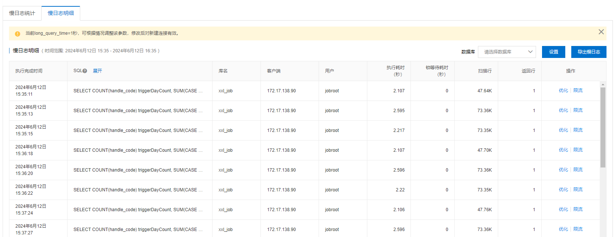

# 慢 sql 执行语句日志

## 1. 背景

需求连接 [需求说明：慢查询日志](https://taosdata.feishu.cn/wiki/DfyRwstuXiQjC3kmaiycvXm1nob)
出现慢 sql 的时候需要能看到慢 sql 执行的时间及具体 sql 语句
1. 目前的 monitor 监控方案只能看到慢 sql 数量。
2. 客户端日志 taosSlowLog 里可以查询具体的慢 sql。
本次设计考虑尽可能多的合理的筛选条件，以及通过慢 sql 日志排查性能问题的足够信息。

## 2. 变更历史

| 日期 | 版本 | 负责人 | 主要修改内容 |
| --- | --- | --- | --- |
| 2024/5/13 | 0.1 | 任新胜 | 创建 |
| 2024/6/11 | 0.2 | 王明明 | 增加具体的行为说明等 |
| 2024/6/12 | 0.3 | 王明明 | 根据 Meeting Review 上的建议修改细节行为 |

## 3. 定义

从发起请求到执行完成超过一定时间完成的 sql 语句，定义为慢sql日志。

## 4. 行为说明

### 4.1 上报逻辑

1. 客户端将日志发送给 mnode，由 mnode 发送给 taoskeeper，再记录到某个集群（也可以是本集群）。
2. 为了提高上报效率，慢 sql 日志上报方式为定时上报，时间间隔通过配置参数 monitorInterval 控制。

### 4.2 配置参数：

1. 慢 sql 配置参数：

| 参数名 | 如何配置 | 生效范围 | 含义 | 可选值 | 默认值 | 补充说明 |
| --- | --- | --- | --- | --- | --- | --- |
| slowLogScope | 仅服务端可配置 | 所有连接的客户端 | 指定启动记录哪些类型的慢 sql VARCHAR | ALL,QUERY, INSERT,OTHERS,NONE （不区分大小写） | QUERY | ALL 表示记录所有类型的慢 sql，OTHERS 表示除下查询写入以外的 sql 语句，比如建库建表语句等。参数之间可以通过或操作符（|）取并集。 该参数之前 slowlog 已在使用，本次复用。 该参数对慢 sql 日志和慢 sql 上报同时有效。 |
| slowLogThreshold | 仅服务端可配置 | 所有连接的客户端 | 指定慢 sql 门限值，大于等于门限值认为是慢 sql int32_t，单位 s | [1, **INT32_MAX**] | 10 | 该参数之前 slowlog 已在使用，本次复用。 默认值之前为3，单位为s ，本次改为 10。 该参数对慢 sql 日志和慢 sql 上报同时有效。 |
| slowLogMaxLen | 仅服务端可配置 | 服务端 | 指定记录 SQL 语句的最大长度 int32_t，单位 byte | (0, 16384] | 4096 | 超过长度的 sql 将截断。 |
| monitor | 仅服务端可配置 | 服务端和所有连接的客户端 | 是否打开监控开关 bool | 1/0 | 1 | 该参数之前在客户端服务端都配置，本次改为只服务端配置，然后下发到客户端 |
| monitorInterval | 仅服务端可配置 | 服务端和所有连接的客户端 | 监控数据上报间隔 int32_t，单位 s | [1, 86400] | 30 | 该参数之前在客户端服务端都配置，本次改为只服务端配置，然后下发到客户端 |
| monitorFqdn | 仅服务端可配置 | 服务端 | taoskeeper 的地址 |  | 空 | 该参数只在服务端有用 |
| monitorPort | 仅服务端可配置 | 服务端 | taoskeeper 的端口 |  | 空 | 该参数只在服务端有用 |

注意：
- 配置参数在服务端配置生效，然后通过 Mnode 和 client 端的心跳（约1.5s）发送给所有 client 端使用。
- 对于多节点集群，每个 dnode 上的配置必须一致，否则启动报错。
- add dnode 时也会检测配置是否一致。否则报错。
- monitor 打开，才可以上报慢 sql 日志。

### 4.3 超级表 taos_slow_sql_detail 

新增超级表记录慢查询详细数据，其 schema 如下表。该超级表及其所属子表由 taosKeeper 创建。

| 字段名 | 数据类型 | 描述 | column/tag |
| --- | --- | --- | --- |
| start_ts | TIMESTAMP | 语句开始执行的时间，单位ms，主键 | column |
| request_id | UINT64_T | 本次请求的request id，为hash生产的随机值 | column |
| query_time | INT32_T | 执行该语句花费的时间, 单位ms | column |
| code | INT32_T | 语句执行返回码，0表示成功 | column |
| error_info | VARCHAR(128) | 当语句执行失败时，记录错误信息 | column |
| type | INT8_T | 该 SQL 语句的类型（1-查询，2-写入，4-其他） | column |
| rows_num | INT64_T | 结果集中的记录数目 | column |
| sql | VARCHAR(16384) | 该 SQL 语句的字符串 | column |
| process_name | VARCHAR(32) | 进程名称 | column |
| process_id | VARCHAR(32) | 进程 ID | column |
| db | VARCHAR(1024) | 所属数据库 | TAG |
| user | VARCHAR(32) | 执行 SQL 语句的用户 | TAG |
| ip | VARCHAR(32) | 如有可能，记录执行 SQL 语句的 IP 地址。（通过 taosadapter 执行的 SQL 其 IP 相同，设计时看有无办法特殊处理） | TAG |
| cluster_id | VARCHAR(32) | 集群 id | TAG |
| Sub table name |

### 4.4 子表名规则

TaosKeeper 提供了 http 接口，其参数为 json 格式， 因 start_ts  有概率重复，因此用 sql 建表，增加 request_id 做复合主键。如果 vachar 列超过长度，将会被自动截断。 子表名规则见上表最后一行。

#### 4.4.1 接口地址

| 接口地址 | POST /slow-sql-detail-batch |
| --- | --- |

## 4.4.2 接口协议

```json
[{
                "start_ts": "1703226836762",
                "request_id": "1",
                "query_time": 100,
                "code": 0,
                "error_info": "",
                "type": 1,
                "rows_num": 5,
                "sql": "select * from abc;",
                "process_name": "abc",
                "process_id": "123",
                "db": "dbname",
                "user": "root",
                "ip": "127.0.0.1",
                "cluster_id": "1234567"
        },
        {
                "start_ts": "1703226836763",
                "request_id": "2",
                "query_time": 100,
                "code": 0,
                "error_info": "",
                "type": 1,
                "rows_num": 5,
                "sql": "select * from bcd;",
                "process_name": "abc",
                "process_id": "123",
                "db": "dbname",
                "user": "root",
                "ip": "127.0.0.1",
                "cluster_id": "1234567"
        }
]
```

## 5. 性能

查询 QPS 越高，slowLogThreshold 越小，对系统的影响越大，具体影响会在测试报告中定性给出。

## 6. 兼容性

旧版本的配置参数，新版本是否可正常加载启动。

## 7. 运维

1. 查看慢查询配置参数
`show cluster variables` 可以查看配置参数的值。
```sql
taos> show cluster variables;
               name               |             value              |  scope   |
===============================================================================
 statusInterval                   | 1                              | server   |
 slowLogScope                     | NONE                           | server   |
 slowLogThreshold                 | 10000                          | server   |
 slowLogMaxLen                    | 4096                           | server   |  
 timezone                         | Asia/Shanghai (CST, +0800)     | both     |
 locale                           | en_US.UTF-8                    | both     |
 charset                          | UTF-8                          | both     |
```

1. 修改慢查询配置参数
```sql {wrap}
ALTER ALL DNODES  'slowLogScope query'
```

注意：
- 配置参数的修改只在 Mnode 所在的 dnode 上生效，其他 dnode 上修改无效。
- 配置参数的修改是临时的，在 dnode 重启后失效，请在临时修改后及时修改配置文件保持同步。
- 配置参数生效时间约 1.5 s。

## 8. 使用场景

针对慢查询的各种配置参数，能够组合出三种使用方式，分别说明如下。

### 8.1 不记录日志也不上报

slowLogScope: NONE
monitor: false

### 8.2 记录日志，但不上报

slowLogScope: 非 NONE
monitor: false

### 8.3 记录日志且上报

slowLogScope: 非 NONE
monitor: true （并且与上报数据有关的配置都要配置正确）

## 9. 约束和限制

## 10. 常见错误和排查

暂无

## 11. 可观测性

### 11.1 Explorer

入口菜单添加`慢SQL`。
UI 设计参考阿里云的数据慢 SQL 查看页面，分为两个部分：“慢日志统计”，“慢日志明细”，根据“taos_slow_sql_detail”表结构做相应的字段调整。

#### 11.1.1 慢日志统计

暂时只考虑实现表格部分。
SQL、库名、执行次数、平均执行时间、最大执行时间、平均返回行、最大返回行。


**top 分析：**




#### 11.1.2 慢日志明细

开始执行时间、SQL、库名、客户端、用户、执行耗时、返回行。


## 12. 安装和卸载

无特殊要求

## 13. 文档

1. 需要修改官网文档
2. 不需要修改企业版文档

## 14. 参考文档

## 15. 附录
