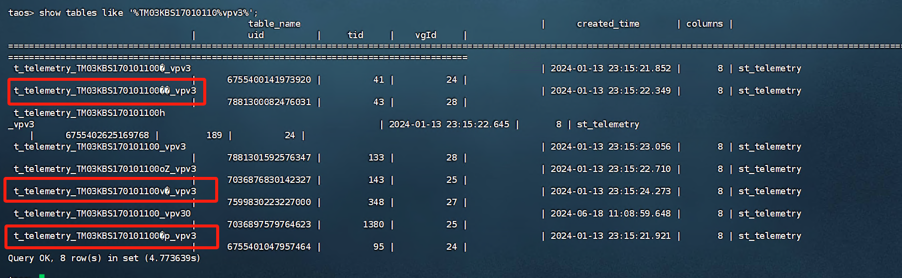

# 支持删除名称非法的表

## 1. 背景

- TD2.x 和 TD3.x 对表名校验不严格，会导致创建包含可见及不可见的`非法字符`的表。示例如下：


- 期望提供方法对此类表进行清理。
- JIRA： [TS-5111](https://jira.taosdata.com:18080/browse/TS-5111)

## 2. 变更历史

| 日期 | 版本 | 负责人 | 主要修改内容 |
| --- | --- | --- | --- |
| 2024/7/8 | 0.1 | Cary Xu | 初稿 |
| 2024/7/10 | 1.0 | Cary Xu | 根据 meeting review comments 更新 |
|  |  |  |  |

## 3. 定义

- 非法字符：表名中包含的非预期字符、控制字符等可见或不可见字符。

## 4. 行为说明

### 4.1 新增通过表 uid 删除 `超级表/子表/普通表`命令

- 在通过表名删除的 DROP TABLE/DROP STABLE 命令后，拼接现有关键词 WITH，表示通过表的 uid 删除。
<callout emoji="bulb" background-color="light-orange" border-color="light-orange">
- drop table with {table_uid} 语句针对 table_uid 的语法检查，复用了普通删表 drop table {table_name} 语句针对 table_name 的语法检查。因此，drop table with '{table_uid}' 会报语法错误。
- 可正确执行的语法为通过 `` 将 table_uid 包含进去。示例：
      drop table with `232323322`;
</callout>


|  | 当前命令 | 新增命令 |
| --- | --- | --- |
| 删除`超级表/子表/普通表` | DROP TABLE multi_drop_clause(A) multi_drop_clause(A) ::= drop_table_clause(B). multi_drop_clause(A) ::= multi_drop_clause(B) NK_COMMA drop_table_clause(C). drop_table_clause(A) ::= exists_opt(B) full_table_name(C). full_table_name(A) ::= table_name(B). full_table_name(A) ::= db_name(B) NK_DOT table_name(C). | ~~DROP TABLE exists_opt(A) ~~~~TABLE_UID table_uid(B).~~ DROP TABLE WITH multi_drop_clause(A). |
| 删除`超级表` | DROP STABLE exists_opt(A) full_table_name(B) | DROP STABLE WITH exists_opt(A) full_table_uid(B). |

- 企业版和社区版均支持。
- 与通过表名删表（root 用户、db owner 和拥有 db 写权限的用户可通过表名删表）不同，仅 root 用户可通过表 uid 删除 `超级表/子表/普通表`。
- 执行 drop stable/table with 表 uid 时:
```python
1) 如果 uid 对应的表存在，返回成功； 
2) 如果 uid 对应的表不存在，包含 if exists 时返回成功，否则返回 "DB error: Table does not exist"
```

## 5. 性能

- 与通过表名删表逻辑相比，没有明显的性能差别。

## 6. 兼容性

- 无 

## 7. 运维

<callout emoji="bulb" background-color="light-orange" border-color="light-orange">
- 仅作为一种运维手段供交付部门使用，不对外公开。但是，如果用户通过查看 sql.y 语法了解了该语法，也不会限制。
</callout>

- 支持通过 uid 删除表名，建议仅用于表名包括非法字符的场景；表名不包含非法字符的删表场景，建议直接通过表名删除。

## 8. 使用场景

### 8.1 通过 uid 删除包含非法字符的`超级表`、`子表` 或 `普通表`

- 如何判断表名中包含非法字符？
```python
当通过 show tables 输出的表名，进行 "查询/写入/删除" 等操作时，提示 "Table does not exist"，可以认为表名中包含非法字符。
```

- 如何获取表的 uid？
```python

## 9. ins_tables 的 uid 列，即为表的 uid

通过 select * from information_schema.ins_tables where table_name like 'aa%';
通过 select table_name,uid from information_schema.ins_tables where table_name like 'aa%';
```

- 操作示例
<view type="1">

  > ⚠ 嵌入文件，需在飞书中查看 (token: Em4KbGaYiowArQx3WAzcBtKFntg)

</view>

```python

## 10. 首先，执行 python3 illegal_char.py，构造包含非法字符的表；然后登录 taos 执行下列语句

taos> use db;
Database changed.

taos> show tables like 'aa%'; # 表是存在的
           table_name           |
=================================
 aa¿fnn1                        |
Query OK, 1 row(s) in set (0.002622s)

taos> select * from aa¿fnn1; # 通过表名查询，提示语法错误

DB error: syntax error near "aa¿fnn1;" (0.000109s)
taos> select * from `aa¿fnn1`; # 通过转义后的表名查询，仍然提示表不存在

DB error: Fail to get table info, error: Table does not exist (0.000727s)

taos> select * from  information_schema.ins_tables where table_name like 'aa%'; # uid 列即为表的 uid
           table_name           |            db_name             |       create_time       |   columns   |          stable_name           |          uid          |  vgroup_id  |     ttl     |         table_comment          |          type           |
==========================================================================================================================================================================================================================================================
 aa¿fnn1                        | db                             | 2024-07-09 12:48:12.510 |           2 | NULL                           |   7868643269545039211 |           4 |           0 | NULL                           | NORMAL_TABLE            |
Query OK, 1 row(s) in set (0.003448s)

taos> select table_name,uid from information_schema.ins_tables where table_name like 'aa%';
           table_name           |          uid          |
=========================================================
 aa¿fnn1                        |   7868643269545039211 |
Query OK, 1 row(s) in set (0.004351s)

## 11. 通过 uid 删除表

taos> drop table with `7868643269545039211`;
Drop OK, 0 row(s) affected (0.001377s)

## 12. 任一表的 uid 不存在，则直接报错，且 uid 列表中已存在表也不会删除(行为同根据表名删表)

taos> drop table with if exists `7868643269545039211`, `7868643269545039212`, if exists `7868643269545039213`; 
DB error: Table does not exist (0.001925s)

```

## 13. 约束和限制

- 无

## 14. 常见错误和排查

- 用户操作失败，错误码对照表

| Error code | description | note |
| --- | --- | --- |
| 0x2600 | syntax error near | Sql 语句非法 |
| 0x2603 | Table does not exist | drop 不存在的表 |
| 0x2644 | Permission denied or target object not exist | 非 root 用户执行 drop table with |

## 15. 可观测性

- 无

## 16. 安装和卸载

- 无特殊要求

## 17. 文档

- 仅作为一种运维手段供交付部门使用，不对外提供文档。
```python
不需要修改官网文档。
不需要修改企业版文档。
```

## 18. 参考文档

- [权限管理：普通用户没有建库权限](https://taosdata.feishu.cn/wiki/TqeZwar76iXESDk3ificA47gnzc)

## 19. 附录

### 15.1 通过 uid 删表流程

| 方案 | 流程 | 优点 | 缺点 | 备注 |
| --- | --- | --- | --- | --- |
| 1 | 1）在 catalog 模块新增通过表 uid 获取 tableName 的方法。 2）将通过表 uid 删表转换为通过 tableName 删表，复用 tableName 的删表流程。 | 1）可复用现有的删表逻辑，代码结构清晰，后续维护简单。 | 1）catalog 新增通过表 uid 获取表名的逻辑。获取表名时，需要将表 uid 广播至所有的 DB 的所有 vgroup。 2）执行流程分为 2 步：获取表名 和 通过表名删除。 | 如果方案可行，暂定采用该方案，原因是后续维护简单，且不会因为忘记修改引入错误。 |
| 2 | 1）新增通过表 uid 删表处理流程，包括超级表、子表和普通表。 2）针对 drop stable，因为原有的删表流程已经包括 suid 字段，可复用部分逻辑。 3）针对 drop table，首先发往 mnode，判断是否为超级表。如果为超级表，则构造删除逻辑。如果不是超级表，则构造子表/普通表删除逻辑。 | 1）执行流程只有 1 步：直接通过表 uid 删除，不需要根据表 uid 获取表名的步骤。因为无法通过表 uid 知晓表在哪一个 vgroup，也需要通过广播下发给所有 vgroup。 | 1）新增一套删表流程，后期要维护 2 套逻辑，容易遗漏或出错。 |  |

###
