# 树根互联一个巨复杂的事务不一致问题的排查

花费非常多的时间去找出问题原因，问题本身特别复杂，很难在jira说清原因，特此写下这个文档以做说明，并且排查过程非常典型，写个文档作为记录。
TS-5262

### 1. 问题的现象：

日志中出现大量的ERROR，显示存在大量的事务，虽然有大量ERROR，后面分析完确认这些ERROR都是干扰项。
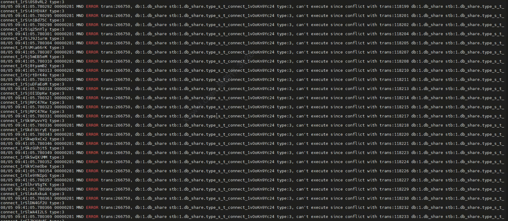

但show transaction只有一条事务记录
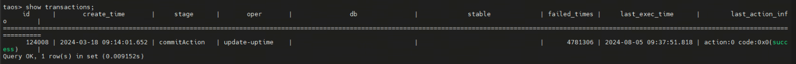

~~并且出现了core dump，~~~~，当时认为是另外一个独立的问题，分析后发现，这个core是个结果。~~
TS-5261

在core问题绕过去后（采用删除wal的临时方法），重启taosd，show transactions，出现了9万个事务在运行。类似于下图，本地复现的截图，客户环境未截图。
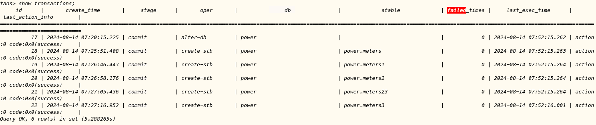

9万个事务在慢慢减少，是事务在挨个执行，执行完事务就消失了。过了几个小时后，所有事务都执行完，消失。

但是在某次节点重启后，又出现了出现了9万个事务，并且事务在逐渐增多。在后续分析的过程中，曾经把客户的mnode数据在本地恢复，恢复后的事务的数量达到了20万多。与客户沟通，客户回复，他们在生产环境中在做压力测试，在大量的创建stb，alter stb，drop stb。认为这样的压力测试导致了大量事务出现，但后面发现这是一个干扰项。

在客户停止掉压测，事务不再增加，并且等待所有的事务都被执行完，所有事务消化掉之后，又做了一次节点重启，大量事务又再次出现，这时事务应该已经达到20万了，但是当时没有确认这个数量。到此，确认了一个现象，这些大量的事务会反复出现，然后消失，重启后又重新出现。

后续和客户的讨论中，又确认了一个现象，并不是每次重启这次都会出现，有时出现，有时不出现，出现的规律未知。

### 2. 分析过程：

- 找到可疑点，排除第一个干扰项
虽然，开始认为出现大量事务是客户压测导致的，但是有2个现象非常奇怪：
1.反复出现
2.反复出现的事务中，会有从3月份到8月创建的事务

所以另外一个怀疑点是事务出现了未知原因的回退，并不是压测导致。排除压测这个干扰项。另外一个可疑的现象是，所有的事务都处在commit阶段，无一例外。所以还是要来了3个mnode节点的日志。

- 排除第二个干扰项
仔细分析大量ERROR报错的日志，并且结合代码，发现这些ERROR不是真正的ERROR，本来应该打印成Info被错误的打印成ERROR。建了一个独立的jira解决了这个问题。
TD-31348

但并不是没有ERROR，的确出现了事务冲突，本来应该打印一条ERROR，再打印9万条INFO，被打印成了9万个ERROR。

- 找到恢复方案
初步怀疑，wal重放，导致出现从3月开始的事务又重新出现，怀疑问题出在wal模块。而且在日志中发现了wal在启动时，对文件做了trim处理的日志（日志未截图），这也是一个干扰项。分析一下发现，如果是wal模块的问题，在同样压力的情况下，vnode应该也出现回退现象。

所以重新查看mnode的启动过程的日志（这部分日志未截图），发现wal并未重放，Mnode的sdb中在启动之后就存在20多万个事务。

具体找一个事务，查看这个事务在重启后的执行过程，发现同一个事务，同一个stage，在leader和follower上的执行不一样
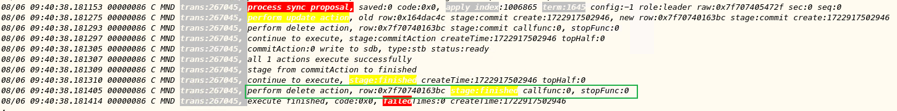

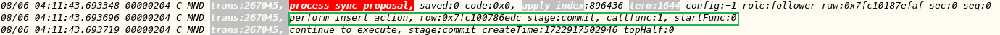

这说明，leader和follower的sdb出现了不一致，leader上存在这个事务，所以在执行commit阶段时，是先执行了update操作，后面又执行了delete操作。但是在follower上不存在这个事务，leader执行commit阶段，也会给follower发送一条sync消息，要求follower也执行commit阶段，但是follower上不存在这个事务，目前的mnode的实现是执行一个insert操作（目前mnode这个实现有待商榷，但并不是重点），所以follower本来不存在这个事务，在leader执行完这个事务后，反而多出这个事务出来。所以这也就解释了，节点重启后事务的重新出现问题，如果重启导致了leader切换，follower成为了leader，这时leader启动起来后sdb中就存在这个事务，并且这个事务处在执行的过程中，leader会 继续驱动事务执行。但是原来的leader变成follower后sdb中并不存在这个事物，重新执行这个事务，会重新生成一个事务出来，这就导致事务会反复出现。同样，如果节点重启后，原来的leader继续成为leader，则事务不会出现。

到此，可以给客户一个恢复方案，拿mnode leader的数据，替换覆盖follower的数据，让3个mnode节点达成一致。

- 走到死胡同
虽然找到了恢复方案，但是仍然不知什么原因导致了mnode节点不一致。

所以想到随着刚才的事务往前找日志，找到这个事务第一次执行时的情况，这个事务第一次执行时，在follower上发生如下错误
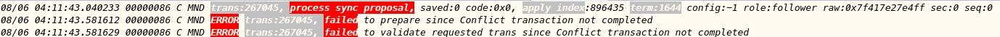

也就是说这个事务执行和某个事务冲突，导致本来应该做一个insert操作，没有成功，所以导致后面再要执行update操作时，变成执行了insert操作。这里说明一下，一个stb的事务执行，prepare阶段和commit接都要写入sdb，第一是insert操作，第二次是update和delete。这里第一次没有成功，第二次就变成了insert操作。

但是到这里也走入了一个死胡同，第一个冲突是怎么产生的，如果顺着时间线网上找，需要查看客户的3月的日志，这显然是不可能的。

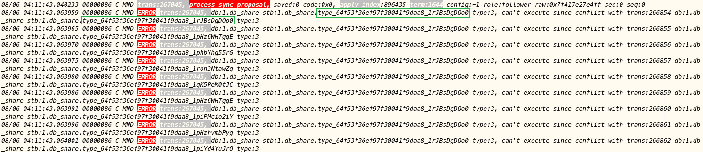

- 推测一个可能，找到最终原因
一突破口是发现，这些事务从3月到8月，这说明这几个月内这个问题是稳定复现的，所以推测，是一个偶然的因素导致出现了一个不一致的事务出现，后续所有事务都会和这个事务冲突，由于事务冲突，所有这些事务执行后都会变成一个不一致的事务，所以出现了20万的事务。那么能产生这么大冲突的应该是一个和db相关的事务。

把客户所有的事务导出，搜索db相关的事务
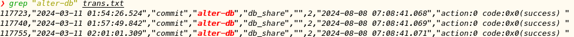

果然在20多万的事务中，在3月11日，存在3个alter-db事务。

但是不能解释的是在这之前还有大量事务，后面又发现一个现象
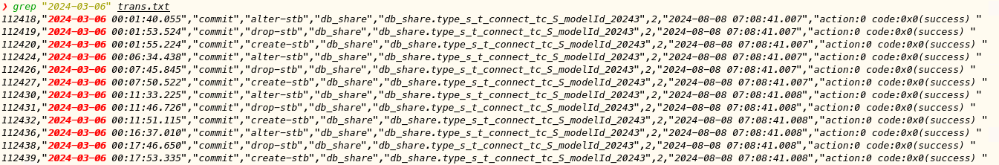

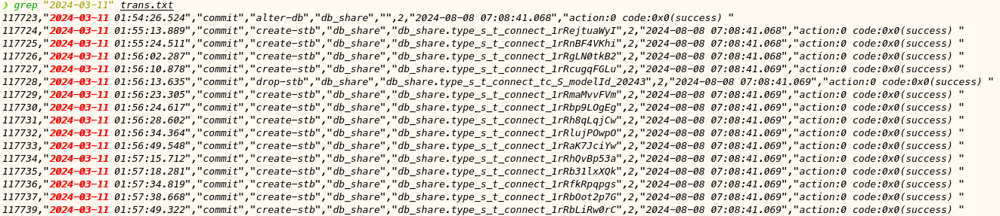

3月11日之前，都是与同一个超级表（type_s_t_connect_tc_S_modelId_20243）相关的事务，在11日出现alter-db的事务后，就是各种超级表。

所以可以得出一个结论，出现了2个偶然事件，第一个与type_s_t_connect_tc_S_modelId_20243有关的事务出现了不一致，导致了后续所有type_s_t_connect_tc_S_modelId_20243的事务都不一致了，到了3月11日，一个alter-db的事务发生了同样的偶然事件，导致alter-db之后的所有事务都出现了不一致。

那么是什么样的偶然事件导致这最开始的2个事务不一致那？+

排查code，最终发现这段code
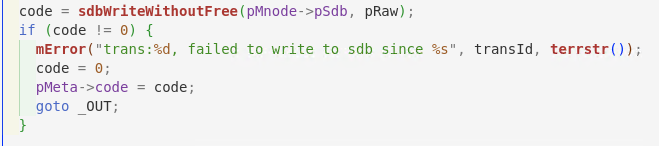

这是操作sdb的函数调用，刚才提到一个事务执行过程，会2次操作sdb，在prepare阶段会insert一个事务，在commit
阶段会update，这2次操作都是调用这个函数实现的，如果这个函数的2次调用中，第一次调用失败返回错误，第二次执行成功应该就会复现这个问题。

为了复现这个问题，必须hack掉现有的代码，
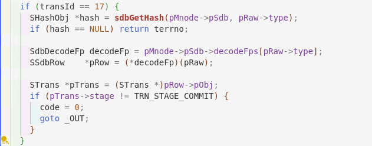

添加了这样的一段代码，transid为17的事务是个alterdb 的事物，让这个事务只有在commit阶段才继续调用sdbWriteWithoutFree，在其他阶段强制不调用sdbWriteWithoutFree。在这个alterdb事务执行后，再执行几个createstb的操作，重启节点，让follower成为leader，果然之前已经执行完成stb事务，又重新出现，并且再次重启后，又会反复出现。

### 3. 最终结论

所以的出最终结论，这个问题发生的原因是，在3月份的一次执行alterdb操作时，第一调用sdbWriteWithoutFree发生错误，比如内存分配失败，但是第二次调用sdbWriteWithoutFree时，执行成功了。在这样一个非常偶然的条件下，把mnode带入到了一个无法恢复的不一致状态。

### 4. ~~补充1--导致TS-5261的core原因~~

~~为什么不一致会导致~~~~Vnode的core？~~
TS-5261

~~这是因为这些事务中alterstb给超级表减少列的操作，每次启动这些事务会重新执行，先会重新执行，先重新执行create stb，然后在执行alter stb，这个中间会有时间差，但是这是事务是从commit阶段重新被执行的，所有即便重新执行也不会给vnode发消息进行减少column的操作，所以vnode一直保持在建列之后的状态，那么在create stb和alter stb这个执行的时间差里，mnode的schema状态，与vnode中schema就不一致了，客户端按照mnode中的schema给vnode发消息，就会包含不存在的column，vnode无法解析这些column最后产生core。~~

### 5. 补充2--导致出问题的代码更改

赵本光在1年多前，添加了一行代码(https://github.com/taosdata/TDengine/commit/ae26f701ae12f8b177c95e9370911ceb6db26c5b?diff=split&w=0#diff-100e549b9fa9f206769d37f5070ded816b8f0d64a2b701777a50e15816b6ea43, commit未关联jira，不清楚为什么要这么改)，在sdbWriteWithoutFree返回错误的情况下，强行把code赋值成0，强制返回正确。
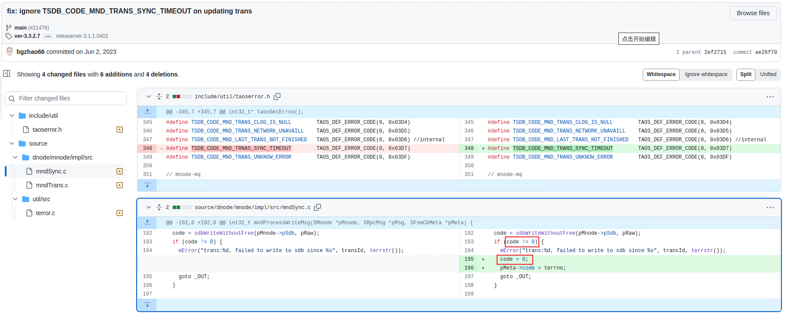
