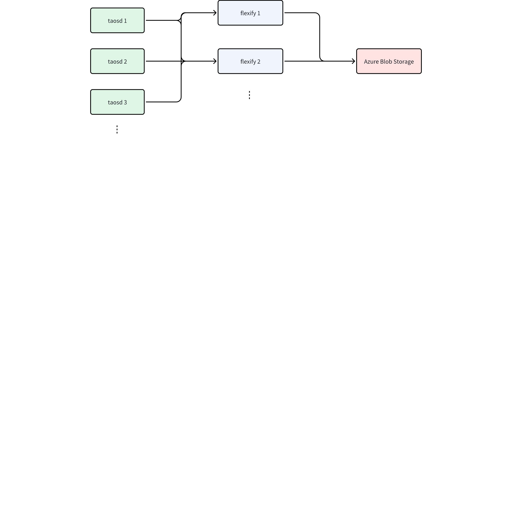
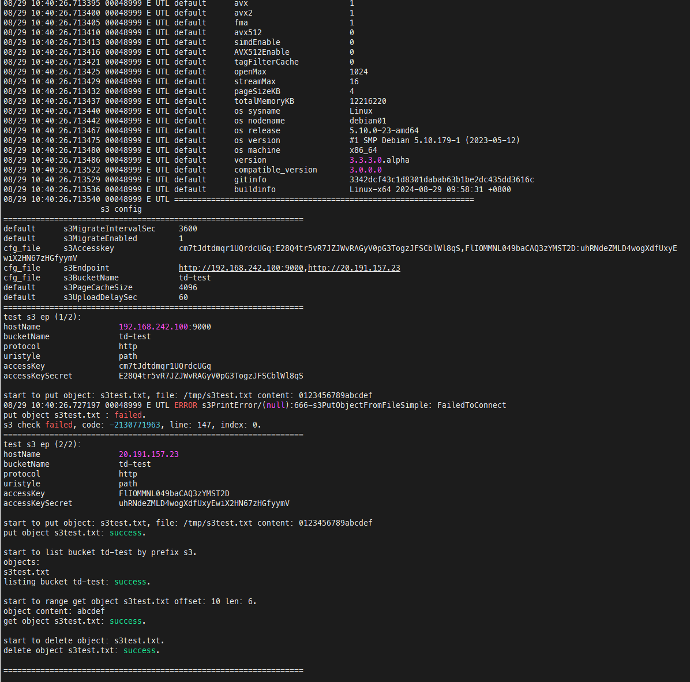

# 访问 Azure Blob 支持配置多个 Flexify 节点

## 1. 背景

为保证与 Azure Blob Storage 服务的连接高可用，我们使用多个 Flexify 节点对同一个 Blob 建立多个 S3 网关，每个 Flexify 节点都将提供 S3 访问服务。taosd 配置中填入全部访问信息，在 S3 操作时将随机选择一个 Flexify 节点，并在该节点故障时切换至其他节点。


## 2. 变更历史

| 日期 | 版本 | 负责人 | 主要修改内容 |
| --- | --- | --- | --- |
| 2024/9/14 | 0.1 | 李顺纲 | 初稿 |
| 2024/9/14 | 0.2 | 李顺纲 | 修改描述以适配官网文档 |

## 3. 定义

无

## 4. 行为说明

### 4.1 Flexify 节点搭建

 [S3 API for Azure Blob Storage (Flexify.IO)](https://taosdata.feishu.cn/wiki/Hq9dw8BIpiZRhGkHXdMcNQiYncd)

### 4.2 配置

```cpp {wrap}
s3EndPoint http //20.191.157.23,http://20.191.157.24,http://20.191.157.25
s3AccessKey FLIOMMNL049baCAQ32YMST2D:uhRNdeZMLD4wogXdfUxyEwiX2HN67zHGfymV,ABCIOMMNL049baCAQ3zYMST2D:uhRNdeZMD4wogXdfUxyEWiX2HN67zHGfyymV,DEFOMMNL049baCAQ3ZYMST2D:uhRNdeZMLD4wogXdfUxyEwiX
s3BucketName td-test
```

1. 允许对 s3EndPoint、s3AccessKey 配置多项，但要求二者项数一致。多个配置项间使用 ',' 分隔。s3BucketName 仅允许配置一项
2. 认为每一组 {s3EndPoint、s3AccessKey} 配置对应一个 S3 服务节点，每次发起 S3 请求时将随机选择一个服务节点
3. **认为全部 S3 服务节点指向同一数据源，对全部 S3 服务节点操作完全等价**
4. 向某一 S3 服务节点请求失败后会切换至其他节点，全部节点都失败后将返回最后产生的错误码
5. 每一个 S3 服务节点的重试逻辑与本修改前应完全一致
6. **最大支持的 S3 服务节点配置数为 10**

### 4.3 s3 状态检查

使用 `taosd --checks3` 进行 S3 状态检查。在配置多个 S3 服务时，某一服务检查失败仍会继续检查其他服务。


## 5. 性能

无

## 6. 兼容性

无

## 7. 运维

无

## 8. 使用场景

**仅多 S3 服务节点指向同一数据源时可使用本功能**

## 9. 约束和限制

无

## 10. 常见错误和排查

无

## 11. 可观测性

无

## 12. 安装和卸载

无

## 13. 文档

无

## 14. 参考文档

无

## 15. 附录

TD-31289


TD-31604
