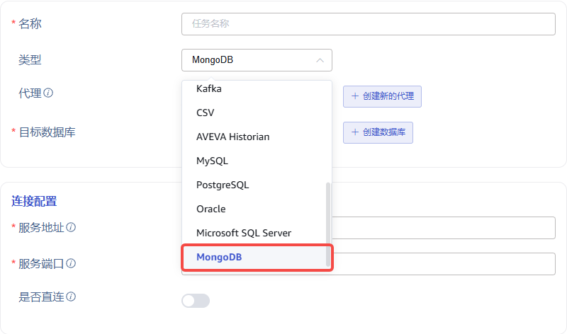
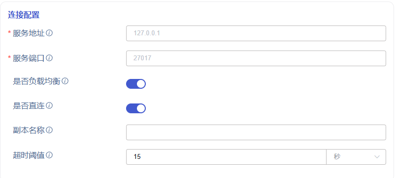
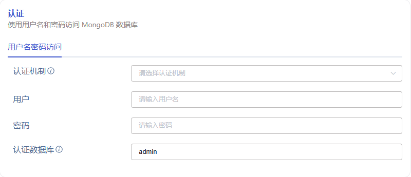
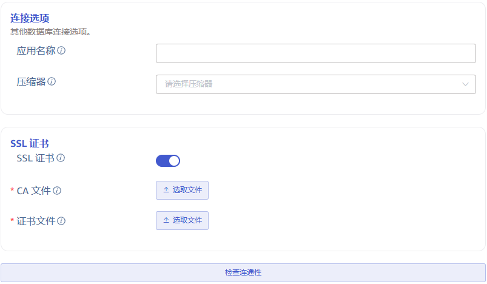
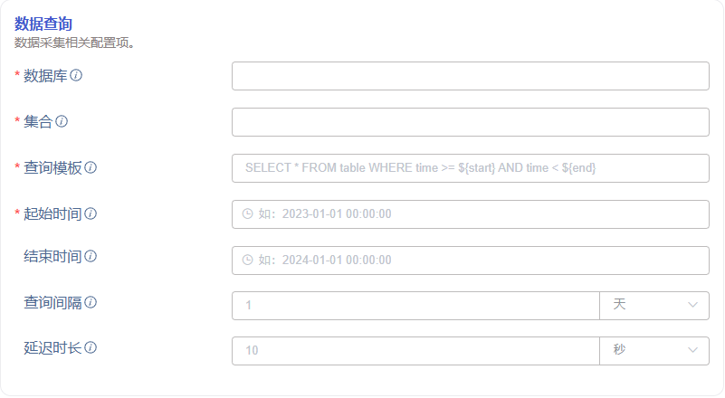

# Data In: MongoDB

## 1. 背景

MongoDB 是一个介于关系型数据库与非关系型数据库之间的产品，被广泛应用于内容管理系统、移动应用与物联网等众多领域，目前有客户使用 MongoDB 积累了 600 亿条、90TB 的数据，需要向 TDengine 进行迁移，我们有必要尽快开发 taosx 对 MongoDB 数据源的支持。

TS-5096

## 2. 变更历史

| 日期 | 版本 | 负责人 | 主要修改内容 |
| --- | --- | --- | --- |
| 2024/07/01 | 0.1 | @张元湃 | 初稿 |
| 2024/07/09 | 0.2 | @张元湃 | 补充 [`4.2.4 Transformer`](https://taosdata.feishu.cn/wiki/Ep7LwSBqxiR5zNk12locOQL4nie#EtPXdaWAwo6gURxO958cr76cnCb) 重写 [`9.约束和限制`](https://taosdata.feishu.cn/wiki/Ep7LwSBqxiR5zNk12locOQL4nie#doxcnV0g6dyKrrffFKaistvOp1W) |
| 2024/07/11 | 0.3 | @张元湃 | 修改 [`4.2.3 数据查询`](https://taosdata.feishu.cn/wiki/Ep7LwSBqxiR5zNk12locOQL4nie#BJG7dyMTaoWdlvxjbdlcYftxn9g) 精简 [`4.2.4 Transformer`](https://taosdata.feishu.cn/wiki/Ep7LwSBqxiR5zNk12locOQL4nie#EtPXdaWAwo6gURxO958cr76cnCb) |
| 2024/07/15 | 0.4 | @张元湃 | 增加 [`4.2.3 连通性检查`](https://taosdata.feishu.cn/wiki/Ep7LwSBqxiR5zNk12locOQL4nie#Tmg0dUmJ4oF2hcx89I0c1FRQnic)并更改标题序号 根据评论修改部分描述 |
| 2024/07/15 | 0.5 | @张元湃 | [`4.2.2 版本信息`](https://taosdata.feishu.cn/wiki/Ep7LwSBqxiR5zNk12locOQL4nie#U0OQdPtuooshibxGD7wcRplNnOf)中增加现状说明 增加 [`4.3 MongoDB 数据类型映射`](https://taosdata.feishu.cn/wiki/Ep7LwSBqxiR5zNk12locOQL4nie#W0l2dhb6hoknHdx5L7HcxXpunVf) 修改 [`10. 常见错误和排查`](https://taosdata.feishu.cn/wiki/Ep7LwSBqxiR5zNk12locOQL4nie#doxcnG62nN4REziUTPvANukctkc) |
|  |  |  |  |

## 3. 定义

- MongoDB 名词：
  - Document 文档：MongoDB 的数据记录，类似于关系型数据库中的一行数据
  - Collection 集合：MongoDB 将文档存储在集合中，集合类似于关系型数据库中的表
- 数据源参数类型：
  - json：表示 json 格式的字符串，仅在查询条件中使用，它需要能被反序列化为 Document 对象，示例内容可参照 [15.1 查询条件示例内容](https://taosdata.feishu.cn/wiki/Ep7LwSBqxiR5zNk12locOQL4nie#doxcnOIRhXa0fNTcmu8mgZeDM3c)
  - bool：表示 “是/否”、“开/关”、“有效/无效” 等参数，它通常使用 switch 组件展示
  - string：表示字符串类型参数，在 UI 上或者用输入框输入，或者通过下拉列表选择
  - file：表示文件，使用文件上传组件将文件上传到服务器，然后将文件路径拼接到 DSN 中
  - duration: 表示时间间隔，其在 DSN 中是形如 `1d` `5m` `10s` 的时间长度字符串
  - datetime: 表示时间戳，其在 DSN  中是 RFC3339 格式字符串，形如：`2024-02-04T00:00:00+08:00`
- explorer 时区：指 explorer 页面右上角由用户指定或浏览器默认选择的时区，它默认代表用户所处地理位置的时区，输入时间与输出时间都以此为基础进行转换

## 4. 行为说明

### 4.1 添加数据源

Explorer 数据源列表中，增加数据源 MongoDB。


### 4.2 MongoDB 数据源 UI

MongoDB 数据源，使用与关系型数据库基本一致的 UI 展示结构，包括：`连接信息`、`版本信息`、`数据查询`、`Transformer`、`高级选项`五大部分。

#### 4.2.1 连接信息

连接信息包括基本连接配置、认证和连接选项三部分：
- 连接配置：包括服务地址、端口、是否负载均衡、是否直连、副本名称、超时阈值。
**Note: 暂不支持 “是否负载均衡”，“是否直连”，“副本名称”****，“超时阈值”**


连接配置参数说明如下：

| **ID** | **Name** | **Description** | **Type** | **Choices** |
| --- | --- | --- | --- | --- |
| host | 服务地址（Host） | MongoDB 的服务器地址 | string | 必填项 |
| port | 服务端口（Port） | MongoDB 的端口 | string | 必填项 |
| load_balanced （0718版本不实现，0731版本实现） | 是否负载均衡（Load Balanced） | 是否通过负载均衡进行连接 | bool | 默认 false true：host 地址被当作负载均衡地址 false：host 地址被当作数据库地址 |
| direct_connection （0718版本不实现，0731版本实现） | 是否直连（Direct Connection） | 是否直接连接到单个主机或者自动发现集群中所有服务器 | bool | 默认 false true：直接连接到 host:port false：发现集群中其他服务器 |
| repl_set_name （0718版本不实现，0731版本实现） | 副本名称（Replica Name） | 客户端连接到指定名称的集群副本 direct_connection=true 时不显示 | string | 非必填项，默认空 如果指定了副本名称，则只连接到此副本服务器 |
| local_threshold （0718版本不实现，0731版本实现） | 超时阈值（Local Threshold） | 用于确定与所有服务器中最短往返时间相比，客户端与服务器之间的平均往返时间被允许增加多少 direct_connection=true 时不显示 | duration | 非必填项，默认 15 ms 当值为 0 时，表示没有延迟窗口，因此只会连接平均往返时间最低的服务器 |

- 认证：包括用户名、密码、认证机制、认证数据库。


认证参数说明如下：

| **ID** | **Name** | **Description** | **Type** | **Choices** |
| --- | --- | --- | --- | --- |
| mechanism （0718版本不实现，0731版本实现） | 认证机制（Authenticate Mechanism） | 要使用的身份验证机制，如果没有提供，将与服务器协商一个 | string | 非必选项 ~~MongoDbCr~~ ScramSha1 ScramSha256 MongoDbX509 ~~Gssapi~~ Plain MongoDbAws ~~MongoDbOidc~~ |
| username | 用户（Username） | 数据库认证用户 | string | 必填项 |
| password | 密码（Password） | 数据库认证密码 | string | 必填项 |
| source | 认证数据库（Authenticate DB） | 进行身份验证的数据库，在 SCRAM 身份验证机制中默认为 “admin”，GSSAPI 和 MONGODB-X509 默认为 “$external”，PLAIN 默认为数据库名称或 “$external”。 | string | 非必填项 |

- 连接选项：包括应用名称、压缩器、加密传输、证书文件、证书密钥文件。


连接选项参数说明如下：

| **ID** | **Name** | **Description** | **Type** | **Choices** |
| --- | --- | --- | --- | --- |
| app_name | 应用名称（Application Name） | 用于标识客户端 | string | 非必填项 |
| compressors | 压缩器（Compressor） | 用于压缩发送到服务器的消息和解压缩从服务器接收的消息 | string | 非必选项 snappy zlib zstd |
| tls | 加密（SSL） | 客户端与服务端之间通信是否使用加密连接 | bool | 默认 false true：加密 false：不加密 |
| ca_file_path | CA 文件（CA File） | CA 证书文件路径 tls=false 时不显示 | file | 非必填项 |
| cert_key_file_path | 证书文件（Cert File） | CA 证书密钥文件路径 tls=false 时不显示 | file | 非必填项 |

#### 4.2.2 版本信息（暂不支持）

**暂不考虑支持不同版本的客户端，原因是我们使用固定版本的客户端可以支持 MongoDB 3.6+，细节如下：**
<quote-container>
- MongoDB 服务端最新版本 7.0.12
- 客户使用的服务端版本 4.2.12，公司开发/测试环境使用的服务端版本 4.2.12
- taosx 使用的 rust 依赖库是 mongodb-3.0.1
  - 发布于 2024-07-10
  - **支持 mongodb 3.6+（3.6 发布于 2017-11）**
  - 依赖 rust 1.64+（taosx 使用 1.78）、没有其他特殊写明的依赖
</quote-container>

版本信息包括驱动版本信息和接口版本信息两部分：
- 驱动版本：包括驱动名称、驱动版本、操作系统。
驱动版本参数说明如下：

| **ID** | **Name** | **Description** | **Type** | **Choices** |
| --- | --- | --- | --- | --- |
| driver_name | 驱动名称（Driver Name） | 驱动库的名称 | string | 非必填项 |
| driver_version | 驱动版本（Driver Version） | 驱动库的版本 | string | 非必填项 |

- 接口版本：接口版本、严格模式、弃用提示。
接口版本参数说明如下：

| **ID** | **Name** | **Description** | **Type** | **Choices** |
| --- | --- | --- | --- | --- |
| api_version | 接口版本（Server Api Version） | 服务端接口的版本 | string | 非必选项 v1 |
| api_strict | 严格模式（Strict） | 服务端是否拒绝已声明接口之外的所有操作 | bool | 默认 false |
| api_deprecation_errors | 弃用提示（Deprecation Errors） | 客户端使用弃用的接口时是否要报错提示 | bool | 默认 false |

#### 4.2.3 连通性检查

- 连通性检查在连接信息之后（只验证基于已经配置的连接信息的连通性。如果增加了 driver 和 api 的配置，则连通性检查也要基于它们）。

#### 4.2.4 数据查询

Explorer 查询页面使用基于时间窗口的分段查询计划。根据起止时间（start, end）和查询间隔时间窗口（interval），确定查询计划。


各参数说明如下：

| **ID** | **Name** | **Description** | **Type** |
| --- | --- | --- | --- |
| database | 数据库（Database） | 源数据库 | string |
| collection | 集合（Collection） | 源集合 | string |
| sql | 查询模板（Query Template） | 用于查询的 json 表达式。 | json |
| start | 起始时间（Start Time） | 应用于查询语句的起始时间。 | datetime |
| end | 结束时间（End Time） | 应用于查询语句的结束时间。 | datetime |
| interval | 查询间隔（Interval） | 用于分段查询的时间范围。 | duration |
| delay | 延迟时长（Delay） | 用于同步未来时刻数据的等待时长。 与 MySQL、Oracle 等数据源描述保持一致。 | duration |

- 数据库：输入框输入，支持配置时间占位符，详见 [4.2.3.1 分库分表](https://taosdata.feishu.cn/wiki/Ep7LwSBqxiR5zNk12locOQL4nie#PDv8dBqLJoer8TxlhXscHyjHnIf)
- 集合：输入框输入，支持配置时间占位符，详见 [4.2.3.1 分库分表](https://taosdata.feishu.cn/wiki/Ep7LwSBqxiR5zNk12locOQL4nie#PDv8dBqLJoer8TxlhXscHyjHnIf)
- 查询模板中必须使用预定义的时间占位符，需**同时包含起止**时间，起止时间占位符必须**成对出现**，且**允许多组**时间占位符（使用示例可参照）
  - Datetime 起止 `${start_datetime}` `${end_datet``i``me}`：对应后端 datetime 类型字段的筛选，如下所示：
  ```json
  // 查询模板
  {"ddate":{"$gte":${start_datetime},"$lt":${end_datetime}}}
  // 后端转换
  {"ddate":{"$gte":{"$date":"2024-06-01T00:00:00+00:00"},"$lt":{"$date":"2024-07-01T00:00:00+00:00"}}}
  // 相当于 sql
  ... where ddate >= ${start_datetime} and ddate < ${end_datetime}
  ```

  - Timestamp 起止：`${start_timestamp}` `${end_timestamp}`：对应后端 timestamp 类型字段的筛选，如下所示：
  ```json
  // 查询模板
  {"ttime":{"$gte":${start_timestamp},"$lt":${end_timestamp}}}
  // 后端转换
  {"ttime":{"$gte":{"$timestamp":{"t":123,"i":456}},"$lt":{"$timestamp":{"t":123,"i":456}}}}
  // 相当于 sql
  ... where ttime >= ${start_timestamp} and ttime < ${end_timestamp}
  ```

- `**start**`**, **`**end**`：分段查询的起止时间记为 `[start, end)` ，使用左闭右开区间。**起始时间为必选项**。**结束时间为可选项**，不选时，同步将不会停止（即通过连续查询达到有延时的实时同步的目的）。
- `**interval**`：查询间隔时间窗口，将 `[start, end)` 分割为多个时间片，分别查询。
- `**delay**`**：**延迟时长。此参数仅在查询起止时间包含未来时间时有意义。在时间 `end` 到达时，延迟 `delay` 时长再进行查询，以等待该查询时段内的数据写入完毕。

##### 4.2.4.1 分库分表

如果有按时间分库分表的需求，即数据库名与集合名中包含日期（如 `db_2024` 为 2024 年数据库、 `table_202403` 为 2024 年 3 月数据集合），可配合 `interval` 参数在查询过程中使用时间占位符：

| name | description | Example |
| --- | --- | --- |
| Y | 年，完整的公历年表示，零填充的 4 位整数。 | 2001 |
| y | 年，公历年除以 100，零填充的 2 位整数。 | 01 |
| m | 月，整数月份（01 - 12） | 07 |
| M | 月，整数月份（1 - 12） | 7 |
| B | 月，月份英文全拼 | July |
| b | 月，月份英文的缩写（3 个字母） | Jul |
| d | 日，日期的数字表示（01 - 31） | 08 |
| D | 日，日期的数字表示（1 - 31） | 8 |
| j | 日，一年中的第几天（001 - 366） | 089 |
| J | 日，一年中的第几天（1 - 366） | 89 |
| F | 日，相当于 `${Y}-${m}-${d}` | 2001-07-08 |

可以使用如下时间占位符的组合：

| Ymd | 日，完整的年月日表示，中间没有空格 | 20010708 |
| --- | --- | --- |
| ymd | 日，完整的年月日表示，中间没有空格，年为 2 位数字 | 010708 |
| md | 日，月日的数字表示，中间没有空格 | 0708 |
| dm | 日，日月的数字表示，中间没有空格 | 0807 |
| Yj | 日，以一年中的第几天表示的日期，中间没有空格 | 2001189 |
| yj | 日，以一年中的第几天表示的日期，中间没有空格，年为 2 位数字 | 01189 |

##### 4.2.4.2 任务状态变更

使用分段查询功能下，其任务状态变更条件和结果如下：
1. 任务执行完毕，进入 **已完成 **状态
2. 任务执行出错，进入 **已中断 **状态，并继续重试，同步任务以上次执行成功的 end' 作为新的 start' 开始执行。
3. 任务配置编辑时，**不允许**修改基础 SQL 语句。
4. 任务配置修改后，启动任务时需要对新的 start, end 及 breakpoint 的关系重新计算。如果修改了 end，且 end < breakpoint，则直接结束。

#### 4.2.5 Transformer （数据映射）

MongoDB 的数据映射部分，与 Kafka 数据源保持基本一致，由于 MongoDB 数据源支持复杂结构的 bson 数据，为了提供更好的支持，需要对现有 transformer 功能进行升级。


##### 4.2.5.1 解析（0718版本不实现，0731版本实现）


在`解析`的下拉框中选中`json`选项后，增加配置 `depth` 参数：
- depth：flatten 层级，是指由外向内展开 object 的最大层级，默认`0`，即不展开
对于下方示例数据进行不同的配置，进行示例说明：
```json
{
    "a1": 1,
    "a2": [1, 2, 3],
    "a3": {
        "b1": 1,
        "b2": [1, 2, 3],
        "b3": {
            "c1": 1,
            "c2": [1, 2, 3],
            "c3": ["d", "e", "f"]
        }
    },
    "a4": [{"b11": "strb11", "b12": 10}, {"b11": "strb21", "b12": 11}]
}
```

1. 默认配置 depth=0，不展开 object，解析结果如下：

| **列名** | **a1** | **a2** | **a3** | **a4** |
| --- | --- | --- | --- | --- |
| **类型** | DataType::Int32 | DataType::List | DataType::Map | DataType::List |
| **值** | 1 | [1, 2, 3] | ```json {wrap} { "b1": 1, "b2": [1, 2, 3], "b3": { "c1": 1, "c2": [1, 2, 3], "c3": ["d", "e", "f"] } } ``` | ```json [ { "b11": "strb11", "b12": 10 }, { "b11": "strb21", "b12": 11 } ] ``` |

1. 配置为 depth=1，向内展开 1 层 object，解析结果为：

| **列名** | **a1** | **a2** | **a3.b1** | **a3.b2** | **a3.b3** | **a4** |
| --- | --- | --- | --- | --- | --- | --- |
| **类型** | DataType::Int32 | DataType::List | DataType::Int32 | DataType::List | DataType::Map | DataType::List |
| **值** | 1 | [1,2,3] | 1 | [1,2,3] | ```json "b3": { "c1": 1, "c2": [1, 2, 3], "c3": ["d", "e", "f"] } ``` | ```json [ { "b11": "strb11", "b12": 10 }, { "b11": "strb21", "b12": 11 } ] ``` |

1. 配置为 depth=2，向内展开 2 层 object，解析结果为：

| **列名** | **a1** | **a2** | **a3.b1** | **a3.b2** | **a3.b3.c1** | **a3.b3.c2** | **a3.b3.c3** | **a4** |
| --- | --- | --- | --- | --- | --- | --- | --- | --- |
| **类型** | DataType::Int32 | DataType::List | DataType::Int32 | DataType::List | DataType::Int32 | DataType::List | DataType::List | DataType::List |
| **值** | 1 | [1,2,3] | 1 | [1,2,3] | 1 | [1, 2, 3] | ["d", "e", "f"] | ```json [ { "b11": "strb11", "b12": 10 }, { "b11": "strb21", "b12": 11 } ] ``` |

##### 4.2.5.2 从列中提取或拆分


在`从列中提取或拆分`的下拉框中增加`join`选项，同时指定连接符（例如`,`），将使用`,`拼接指定列中子元素列表。
<quote-container>
**注：前端会过滤，只有 array 类型的字段可以有 join 选项**
</quote-container>

对于下方示例数据进行示例说明：

| a1 | a2 | a3.b1 | a3.b2 | a3.b3 | a4 |
| --- | --- | --- | --- | --- | --- |
| 1 | [1,2,3] | 1 | [1,2,3] | ```json "b3": { "c1": 1, "c2": [1, 2, 3], "c3": ["d", "e", "f"] } ``` | ```json [ { "b11": "strb11", "b12": 10 }, { "b11": "strb21", "b12": 11 } ] ``` |

1. 配置 a2 列为 `join`，连接符设置为`,`字符，转换结果为：

| a1 | a2 | a3.b1 | a3.b2 | a3.b3 | a4 |
| --- | --- | --- | --- | --- | --- |
| 1 | "1,2,3" | 1 | [1,2,3] | ```json "b3": { "c1": 1, "c2": [1, 2, 3], "c3": ["d", "e", "f"] } ``` | ```json [ { "b11": "strb11", "b12": 10 }, { "b11": "strb21", "b12": 11 } ] ``` |

1. 配置 a4 列为 `join`，连接符设置为`,`字符，转换结果为：

| a1 | a2 | a3.b1 | a3.b2 | a3.b3 | a4 |
| --- | --- | --- | --- | --- | --- |
| 1 | [1,2,3] | 1 | [1,2,3] | ```json "b3": { "c1": 1, "c2": [1, 2, 3], "c3": ["d", "e", "f"] } ``` | "{\"b11\":\"strb11\",\"b12\":10},\"b11\":\"strb21\",\"b12\":11}" |

##### 4.2.5.3 映射

需要注意：时间戳列映射到 TDengine 表时，如果原始类型是 DATETIME/TIMESTAMP 类型，不需要转换；如果是字符串类型，支持 RFC3339 格式字符串自动解析，其他情况需要拼接完整时间戳字符串后才能入库。

#### 4.2.6 高级选项

支持设置读并发数与批次大小：


### 4.3 MongoDB 数据类型映射

| **MongoDB 字段类型** | **获取示例数据接口** | **TDengine 类型** |
| --- | --- | --- |
| Double | f64 | Float64 |
| String | String | NChar(50) |
| Array | String | NChar(50) |
| Document | String | NChar(50) |
| Boolean | bool | Bool |
| Int32 | i32 | Int32 |
| Int64 | i64 | Int64 |
| Timestamp | DateTime | Timestamp(TimeUnit::Nanosecond) |
| Binary | String | NChar(50) |
| DateTime | DateTime | Timestamp(TimeUnit::Nanosecond) |
| 其他 （可参见 [9. 约束和限制](https://taosdata.feishu.cn/wiki/Ep7LwSBqxiR5zNk12locOQL4nie#doxcnV0g6dyKrrffFKaistvOp1W)） | String | NChar(50) |

## 5. 性能

暂时没有性能参考基准。

## 6. 兼容性

不涉及兼容性。

## 7. 运维

无。

## 8. 使用场景

### 8.1 历史数据迁移

通过指定源库、表、查询语句、时间范围，对过去的时间段进行查询，到达迁移历史数据的目的。

### 8.2 实时数据同步

使用未来时间分段查询，可达到迁移实时数据的目的。
<quote-container>
如果没有结束时间，taosx 可持续迁移实时数据；如果结束时间在一个未来时间，等任务进行到这个未来时间时会结束。
</quote-container>

## 9. 约束和限制

MongoDB 到 TDengine 的数据类型映射和示例数据如下表：

|  |
|  |
| **类型** | **示例原始数据** | **类型** | **示例入库数据** |
| Null | - | nchar | null |
| Regex | ```json Regex { pattern: "abc", options: "i", } ``` | nchar | "/abc/i" |
| JavaScriptCode | ```json JavaScriptCode( "function() { return 1; }", ) ``` | nchar | "function() { return 1; }" |
| JavaScriptCodeWithScope | ```json JavaScriptCodeWithScope { code: "function() { return n; }", scope: Document({ "n": Int32( 1, ), }), } ``` | nchar | "{\"$code\":\"function() { return n; }\",\"$scope\":{\"n\":1}}" |
| ObjectId | ObjectId("668cf33c8b8a4b7f037409c2") | nchar | "668cf33c8b8a4b7f037409c2" |
| Symbol | Symbol("abc") | nchar | "abc" |
| Decimal128 | Decimal128(3.141592653) | nchar | "3.141592653" |
| Undefined | - | nchar | null |
| MaxKey | - | nchar | "MaxKey" |
| MinKey | - | nchar | "MinKey" |

## 10. 常见错误和排查

1. 连接错误在检查数据源时显示在 Explorer
   - 地址/端口 空：前端非空提示
   - 地址/端口 错误：Failed to connect to dsn: timed out
   - 用户/密码 错误：Failed to connect to dsn: authentication failed
   - 认证数据库 错误：Failed to connect to dsn: authentication failed
2. 获取示例数据时，检查检查数据源可用性，检查库/表/时间列是否存在，错误显示在 Explorer
   - 数据库/集合/查询模板/开始时间 空：前端非空提示
   - 数据库/集合 错误：Failed to get sample from data source: no data found
   - 查询模板 json 格式错误：Failed to get sample from data source: parsing query template failed
   - 查询模板中不包含时间占位符或时间占位符不成对（仅包含 start*，或 end*）时：
      - 只包含 start_datetime：Failed to get sample from data source: invalid query template, missing end_datetime.
      - 只包含 end_datetime：Failed to get sample from data source: invalid query template, missing start_datetime.
      - 只包含 start_timestamp：Failed to get sample from data source: invalid query template, missing end_timestamp.
      - 只包含 end_timestamp：Failed to get sample from data source: invalid query template, missing start_timestamp.
      - 不包含时间占位符：Failed to get sample from data source: invalid query template, missing start and end.
   - 查询模板语法错误：Failed to get sample from data source: syntax error in the query template（具体错误信息）
3. 创建任务和更新任务配置时，检查数据源可用性，检查库/表/时间列是否存在，错误显示在 Explorer。
   - 数据库/集合/查询模板/开始时间 空：前端非空提示
   - transformer 参数 空：前端非空提示
   - 数据库授权过期：License error: The destination is not a valid TDengine enterprise edition: licensing expired, please contact the TDengine customer success team for further assistance.

## 11. 可观测性

可观测性所涉及的范围同其他数据源（Flat 类型数据源，如 MySQL、Oracle）一致。
需要 @佘彦杰在 在 taosx TDinsight 中添加 MongoDB 数据源监控面板。

## 12. 安装和卸载

无。

## 13. 文档

- **需要**修改企业版文档
- **不需要**修改官网文档

## 14. 参考文档

https://docs.mongoing.com/mongo-introduction/bson-types
https://docs.rs/mongodb/3.0.0/mongodb/options/struct.ClientOptions.html

## 15. 附录

<quote-container>
关系型数据库 FS 附录中的实现方案基本都适用，不再重复了，可参考以下内容：
- [分段查询实现方案](https://taosdata.feishu.cn/wiki/YYGuw9LXmiePQ7kQS1Uc9oIsnPh#doxcnkK3SINF3prWvbZBgTt1Hof)
- [断点续传](https://taosdata.feishu.cn/wiki/YYGuw9LXmiePQ7kQS1Uc9oIsnPh#doxcn7uGZl7YyG8PfqjVK75Oyye)
- [时间条件带时区查询](https://taosdata.feishu.cn/wiki/YYGuw9LXmiePQ7kQS1Uc9oIsnPh#OjnWdDcawoiL0mxo4yycNbPFnNc)
</quote-container>

### 15.1 查询条件示例内容

#### 15.1.1 不同数据类型的查询示例

- 按 Double 类型的 double 字段筛选: {"double":3.141592653}
- 按 String 类型的 string 字段筛选: {"string":"abc"}
- 按 Array 类型的 array 字段筛选: {"array":[1,2,3]}
- 按 Document 类型的 document 字段筛选: {"document":{"int32":123,"int64":123}}
- 按 Boolean 类型的 bool 字段筛选: {"bool":true}
- 按 Int32/Int64 类型的 int 字段筛选: {"int":123}
- 按 Timestamp 类型的 timestamp 字段筛选: {"timestamp":{"$timestamp":{"t":123,"i":456}}}
- 按 Binary 类型的 binary 字段筛选: {"binary":[1,2,3]}
- 按 ObjectId 类型的 _id 字段筛选: {"_id":{"$oid":"667d1b7af66b206a61109c0a"}}
- 按 DateTime 类型的 datetime 字段筛选: {"datetime":{"$date":{"$numberLong":"1719475066480"}}}
- 按 Symbol 类型的 symbol 字段筛选: {"symbol":{"$symbol":"abc"}}
- 按 Decimal128 类型的 decimal128 字段筛选: {"decimal128":{"$numberDecimalBytes":[77,230,64,187,0,0,0,0,0,0,0,0,0,0,46,48]}}

#### 15.1.2 不同组合的查询示例

- `=` 条件：{"string":"abc"}
- `>` 条件：{"int":{"$gt":30}}
- `and` 条件：{"string":"abc","int":{"$gt":30}}
- `or` 条件：{"$or":[{"string":"abc"},{"int":{"$gt":30}}]}
- `in` 条件： {"string":{"$in":[ "abc","def"]}}

#### 15.1.3 带时间占位符的查询模板

- 根据数据库中 Datetime 类型的字段 ddate 进行筛选：
```json
// 查询模板
{"ddate":{"$gte":${start_datetime},"$lt":${end_datetime}}}
// 后端转换
{"ddate":{"$gte":{"$date":"2024-06-01T00:00:00+00:00"},"$lt":{"$date":"2024-07-01T00:00:00+00:00"}}}
// 相当于 sql
... where ddate >= ${start_datetime} and ddate < ${end_datetime}
```

- 根据数据库中 Timestamp 类型的字段 ttime 进行筛选：
```json
// 查询模板
{"ttime":{"$gte":${start_timestamp},"$lt":${end_timestamp}}}
// 后端转换
{"ttime":{"$gte":{"$timestamp":{"t":123,"i":456}},"$lt":{"$timestamp":{"t":123,"i":456}}}}
// 相当于 sql
... where ttime >= ${start_timestamp} and ttime < ${end_timestamp}
```

### 15.2 MongoDB 数据类型映射关系对照表

| MongoDB 字段类型 | Sample Data | Arrow 类型 | TDengine 类型 |
| --- | --- | --- | --- |
| Double | f64 | Float64 | Float64 |
| String | String | Utf8 | NChar(50) |
| Array | String | List | NChar(50) |
| Document | String | Struct | NChar(50) |
| Boolean | bool | Boolean | Bool |
| Int32 | i32 | Int32 | Int32 |
| Int64 | i64 | Int64 | Int64 |
| Timestamp | DateTime | Timestamp(TimeUnit::Nanosecond, None) | Timestamp(TimeUnit::Nanosecond) |
| Binary | String | Utf8 | NChar(50) |
| DateTime | DateTime | Timestamp(TimeUnit::Nanosecond, None) | Timestamp(TimeUnit::Nanosecond) |

### 15.3 沃太数据模型及开发需求

[数据迁移记录](https://taosdata.feishu.cn/wiki/KuU4wrbq2ipi7KkrHkKcDOO3nle)

### 15.4 沃太数据示例

<view type="2">

  > ⚠ 嵌入文件，需在飞书中查看 (token: OzxEbyiihoKmTRxwJeRcX1UTnSc)

</view>

<view type="2">

  > ⚠ 嵌入文件，需在飞书中查看 (token: Vjpib2tMgoYsT6xOkd6clJjCnIb)

</view>
