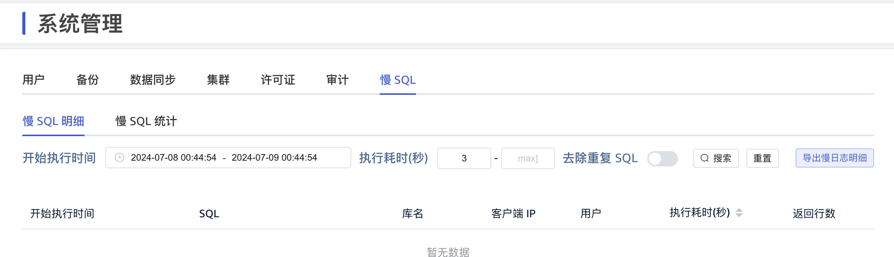
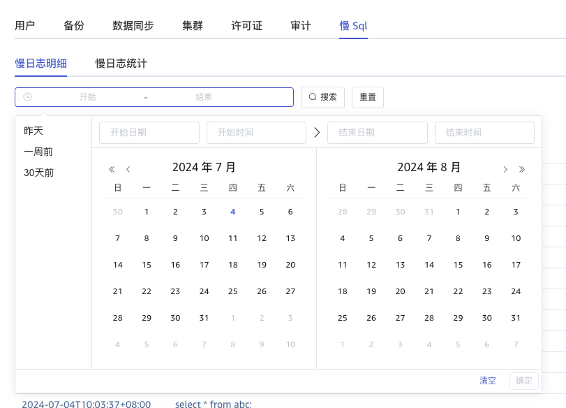
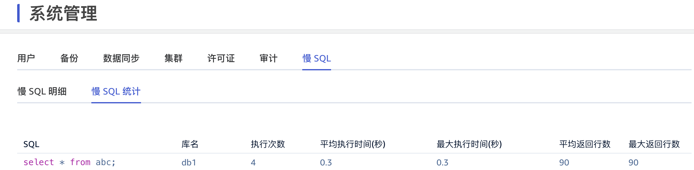

# Explorer 支持查看慢 SQL表中所记录的信息

## 1. 背景

自 3.3.2.0 起，TDengine 支持[慢 sql 执行语句日志](https://taosdata.feishu.cn/wiki/MIUFw4ab1iczeRkkhC9chzsandc)，Explorer 中需要支持展示慢 SQL 执行语句日志统计与明细。

## 2. 变更历史

| 日期 | 版本 | 负责人 | 主要修改内容 |
| --- | --- | --- | --- |
| 2024/7/4 | 0.1 | 顾香 | 初稿 |
| 2024/7/5 | 0.2 | 顾香 | 根据评论进行修改 |
| 2024/7/8 | 0.3 | 顾香 | 根据线下 review 修改文案、修改/增加交互、查询 sql 语句等 |

## 3. 定义

无

## 4. 行为说明

### 4.1 Explorer 需要支持在系统管理中增加慢 SQL tab 页面

分为两个部分：“慢 SQL明细”，“慢 SQL统计”，根据“taos_slow_sql_detail”表结构做相应的字段调整。

#### 4.1.1 慢 SQL明细（Slow SQL Details）

展示中英文为：
- 开始执行时：Started At  
- SQL：SQL。超出长度出现...，鼠标 hover 弹出完整的 SQL，每行后边加一个复制按钮
- 库名：Database
- 客户端 IP：Client IP
- 用户: User
- 执行耗时: Execution Time。展示以秒为单位，保留一位小数。
- 返回行数: Rows




- 表中的数据来源 Sql 为：
```sql
 --默认查询一天前&执行耗时 >= 3s 的数据，每页展示20条
SELECT * FROM log.taos_slow_sql_detail 
WHERE start_ts > 1720080469583 AND start_ts <= 1720166869583 AND query_time >= 3000  
ORDER BY start_ts DESC limit 0,20;
```

- 根据执行耗时进行升序和降序排序；
- 根据开始执行时间进行搜索过滤，快捷的时间选择包含（以当前时间计算的）一天内、一周内和 30 天以内。默认值为一天内；
- 点击 “去除重复 SQL"的开关，去掉重复的 SQL，只展示每个 SQL 最近的一次
- 根据指定执行耗时的区间过滤，比如 >=5s，[3s,5s] 之间的，<=1s 的等等。默认值 >=10 秒
```sql
-- 同时满足三个条件的查询语句
SELECT LAST_ROW(start_ts) as start_ts, db, ip, `user`, sql, query_time, rows_num 
FROM log.taos_slow_sql_detail 
WHERE start_ts > 1720080469583 AND start_ts <= 1720166869583 AND query_time >= 3000
PARTITION by sql,db order by start_ts desc limit 0,20 ; 

```

- 导出慢 SQL明细，导出文件名为 slowSql.csv，导出内容为当前页面所选条件的 Sql 查出来的结果；
- 重置按钮：点击重置按钮，重置为以当前时间计算 24 小时内 >= 3s 的慢 SQL
- Table  增加每页展示条数下拉选择，比如 [20, 50, 100, 200] 选项

#### 4.1.2 慢 SQL 统计（Slow SQL Statistics）

展示内容中英文：
- SQL：SQL。超出长度出现...，鼠标 hover 弹出完整的 SQL，每行后边加一个复制按钮
- 库名: Database
- 执行次数: Executed Times
- 平均执行时间: AVG Execution Time。展示以秒为单位，保留一位小数，支持排序
- 最大执行时间: MAX Execution Time。展示以秒为单位，保留一位小数，支持排序
```sql
-- 根据平均执行时间/最大执行时间 进行排序
SELECT
    sql,
    db, 
    count(*) as query_count, 
    max(query_time) as max_query_time,
    cast(avg(query_time) as int) as avg_query_time, 
    cast(avg(rows_num) as int) as avg_rows_num, 
    max(rows_num) as max_rows_num 
from log.taos_slow_sql_detail 
PARTITION by sql, db order by max_query_time ASC,avg_query_time DESC 
LIMIT 0,20
```

- 平均返回行数: Average Rows
- 最大返回行数: Maximum Rows


- 表中数据来源 Sql 为：
```sql
SELECT
    sql, -- sql 语句
    db, -- 库名
    count(*) as query_count, -- 执行次数
    cast(avg(query_time) as int) as avg_query_time, -- 平均执行时间
    max(query_time) as max_query_time, -- 最大执行时间
    cast(avg(rows_num) as int) as avg_rows_num, -- 平均返回行数
    max(rows_num) as max_rows_num -- 最大返回行数
from log.taos_slow_sql_detail 
PARTITION by sql, db limit 0,20
```

    
- Table  增加每页展示条数下拉选择，比如 [20, 50, 100, 200] 选项

## 5. 性能

无

## 6. 兼容性

仅支持 3.3.3.0 之后版本

## 7. 运维

无

## 8. 使用场景

无

## 9. 约束和限制

企业版、社区版都支持

## 10. 常见错误和排查

无

## 11. 可观测性

无变化

## 12. 安装和卸载

无变化

## 13. 文档

- **需要**修改企业版文档：需要对此特性添加说明，修改截图等
- 不需要修改官网文档。参考文档

## 14. 参考文档

## 15. 附录

无
