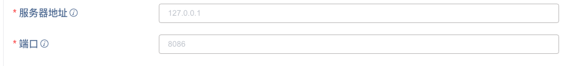
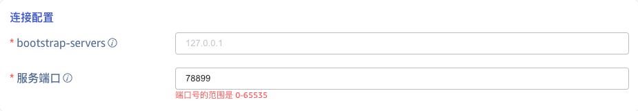
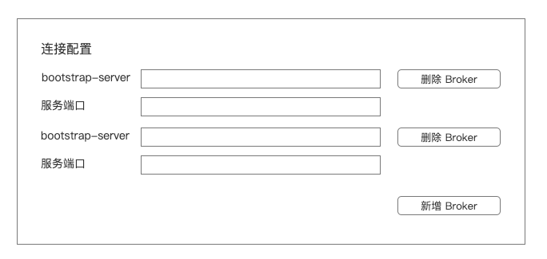
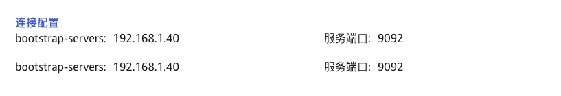

# Explorer 数据源服务器和端口地址的输入格式统一

## 1. 背景

各数据源服务器地址和端口号输入行为在页面行为不统一，有的为 ip:port,有的是分开填写，为了产品行为的统一，因此需要将 IP 和 Port 分开填写。

## 2. 变更历史

| 日期 | 版本 | 负责人 | 主要修改内容 |
| --- | --- | --- | --- |
| 2024/7/8 | 0.1 | 顾香 | 初稿 |
| 2024/7/10 | 0.2 | 顾香 | 根据评论修改细节 |

## 3. 定义

无

## 4. 行为说明

### 4.1 地址和端口分开填写

目前 UI 的展现形式

统一后的 UI 服务地址和端口号输入如下图所示：

### 4.2 影响范围

#### 4.2.1 影响的数据源

如果按照拆分成服务器地址和端口号分开填写的形式，目前只有以下三个数据源不满足需求。但是 OPC-UA/DA 还含有 path 部分，是否还需要进行拆分？如果要拆分，该怎么拆分合理？
- ~~OPC-UA（目前路径中含有路径）：127.0.0.1:6066/OPCUA/Serverpath~~
- ~~OPC-DA (同上)~~
- Kafka
- ~~TDengine 2.x~~
- ~~InfluxDB~~
- ~~OpenTSDB~~
- ~~MQTT~~
- ~~AVEVA Historian~~
- ~~MySQL~~
- ~~PostgreSQL~~
- ~~Oracle~~
- ~~Microsoft SQL Server~~
结论：
- 只有 kafka 数据源需要调整 UI
- 端口号增加校验的数据源包括：Kafka、TDengine 2.x、InfluxDB、OpenTSDB、MQTT、AVEVA Historian、MySQL、PostgreSQL、Oracle、Microsoft SQL Server

#### 4.2.2 受影响的 UI 

受影响的 UI 包括：数据源新增、编辑、查看页面
- 新增、编辑页面的修改
  - 原服务地址输入框中默认提示由  ip:port 改为 ip 的形式。具体由 127.0.0.1:9092 改为 127.0.0.1
  - 新增服务端口输入框，包括叹号中的描述信息，提示为 Kafka 的端口 ；输入框中提示为数据源默认的端口号。如 9092
  - 对端口号增加精准校验规则，只能输入 0-65535 的数字。错误提示信息为：端口号的范围是 0-65535（The port number ranges from 0 to 65535），提示位置遵从产品中的表单校验，在输入框的下面用红色字体描述
  

  - 多个 broker 地址时，在连接配置右下增加 "新增 Broker"按钮，点击 add 后成对增加 bootstrap-server 和服务端口。新增的 bootstrap-server 和服务端口行为和之前保持一致，比如是否必填，端口号的校验等完全保持一致。点击 "删除 Broker",时， 成对删除 bootstrap-server 和服务端口，当只有一对地址时 del 按钮不可用。
   UI 原型如下图：
  

- 查看页面的修改：增加一个服务端口字段，多个 broker 时，成对在下面依次展示即可。如下图所示：

## 5. 性能

无。

## 6. 兼容性

无。

## 7. 运维

无。

## 8. 使用场景

无。

## 9. 约束和限制

无。

## 10. 常见错误和排查

无

## 11. 可观测性

UI 展示

## 12. 安装和卸载

无

## 13. 文档

需要修改企业版文档

## 14. 参考文档

## 15. 附录

无。
