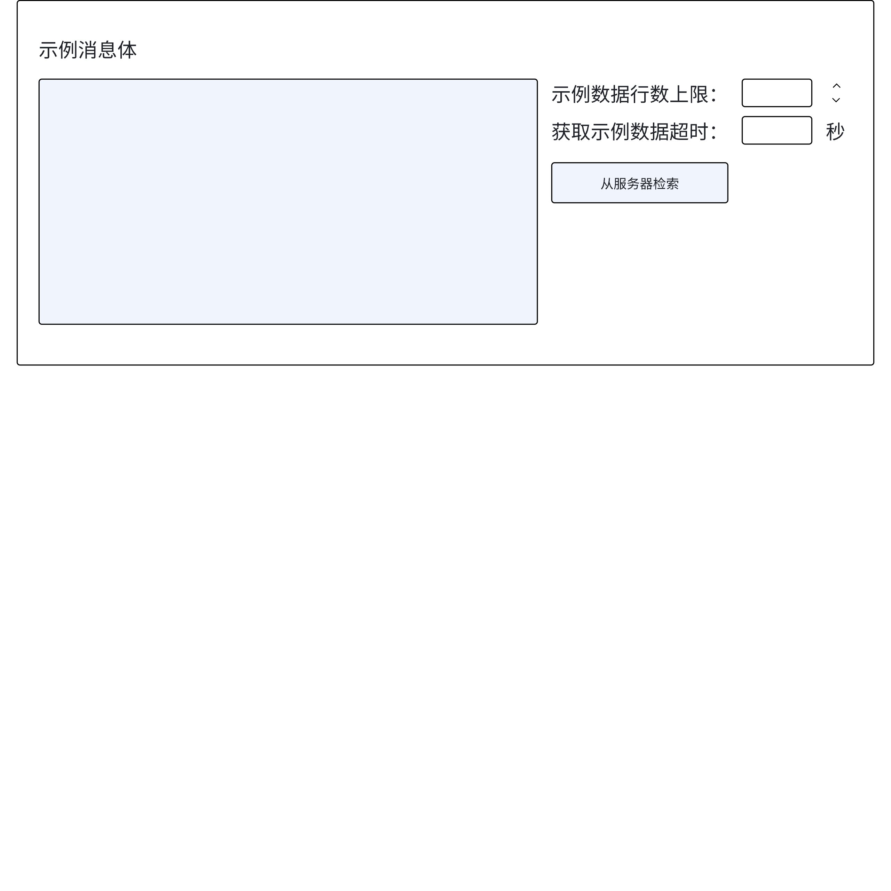

# Explorer 超时时间

## 1. 背景

taosX 的各种数据源，对返回的时间要求不同。例如：获取 mqtt 的示例数据，是通过订阅获取的，要求超时时间在 5 秒以内；获取 historian 的示例数据，通过查询 Historian 数据库，要求超时时间在 5 分钟以内即可。
目前，taosX 和 explorer 使用了统一的默认超时时间：30 秒。因此，这个 FS 的预期是：
1. 使用统一的机制为 taosX 和 taos-explorer 之间的 API 设置超时时间；
2. 机制能够为不同数据源设置不同的超时时间
JIRA：
TS-4699

## 2. 变更历史

| 日期 | 版本 | 负责人 | 主要修改内容 |
| --- | --- | --- | --- |
| 2024-09-09 | v0.1 | @杨志宇 | 初稿 |

## 3. 定义

无

## 4. 行为说明

### 4.1 timeout 的作用

Explorer 在配置数据源时，要进行连通性检查、获取示例数据、配置的合法性校验等操作。如果在配置时，某些接口要耗费很长时间，则在任务执行期间，一定会有问题。例如：
1. 连通性检查超时，说明和连接相关的配置有问题，或者无法连接到服务器；
2. 获取示例数据超时，说明查询条件/任务划分规则配置有问题，运行期间会影响性能；
3. 合法性校验超时，说明配置的规则过于复杂，或服务器获取不到必要的校验数据。
因此，taosX 对外暴露的某些接口，必须有一个 timeout，如果请求超过 timeout ，则应该返回超时错误。
taosX 需要设置 timeout 的接口，具有以下约束：
1. 接口本身要求必须在 timeout 内完成。
2. 接口是幂等的，重试对系统中的数据无影响。

### 4.2 timeout 的处理规则

taosX 处理超时的规则如下：
1. Request 中如果有 timeout 参数，则 taosX 使用 Request 中的 timeout；
2. Request 中没有 timeout 参数，则 taosX 使用 4.3 节中规定的 timeout；
3. Request 中没有 timeout 参数，且 4.3 节中没有规定，则统一使用全局的 timeout。全局的 timeout 可以通过配置文件（request_timeout）或环境变量（TAOSX_REQUEST_TIMEOUT）进行设置，优先级：环境变量 > 配置文件。
4. 以上所有规则都没有生效，则使用默认值 30 秒。

### 4.3 各 API 的默认 timeout

| **接口** | **说明** | **数据源** | **超时时间（second）** |
| --- | --- | --- | --- |
| histoiran | 120 |
| mysql | 120 |
| postgres | 120 |
| oracle | 120 |
| MSSQL | 120 |

### 4.4 Explorer 上的 timeout 设置

1. 所有的连通性检查，在请求中都不带 timeout 参数，使用后台的默认 timeout 参数（30s）。
2. OPC CSV 文件合法性校验，在请求中不带 timeout 参数，使用后台的默认 timeout 参数（30s）。
3. **通过查询方式获取示例数据的各种数据源，这类数据获取可能比较慢，要在请求中带 timeout 参数，包括：histoiran、mysql、postgres、oracle、MSSQL**。在 Explorer UI 上，仅在这几种数据源获取示例数据的地方允许用户设置超时时间，默认值：historian 120 秒，其它数据源 30 秒。
4. 通过订阅方式获取示例数据的各种数据源，这类数据获取应该很快，在请求中不带 timeout 参数，使用后台的默认 timeout 参数（30s）。
explorer 页面如下：


## 5. 性能

无

## 6. 兼容性

无兼容性问题。

## 7. 运维

无

## 8. 使用场景

### 8.1 通过环境变量设置 timeout

在环境变量中设置 TAOSX_REQUEST_TIMEOUT，对于 4.3 节中没有描述的接口，使用 TAOSX_REQUEST_TIMEOUT 处理超时。
例如：
```bash
TAOSX_REQUEST_TIMEOUT=30 taosx serve -v
```

### 8.2 通过配置文件设置 timeout

在 taosx.toml 中配置 request_timeout，对于 4.3 节中没有描述的接口，使用 request_timeout 处理超时。
```toml
[serve]
request_timeout = 30
```

### 8.3 通过 HTTP 请求设置 timeout

在 HTTP 请求的 URL query 中设置 timeout 参数，taosX 按照 Request 中的 timeout 处理。
例如：
```plaintext
GET /ds/in/validate?timeout=60
```

## 9. 约束和限制

无

## 10. 常见错误和排查

无

## 11. 可观测性

无

## 12. 文档

无

## 13. 参考文档

无
