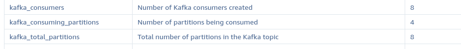
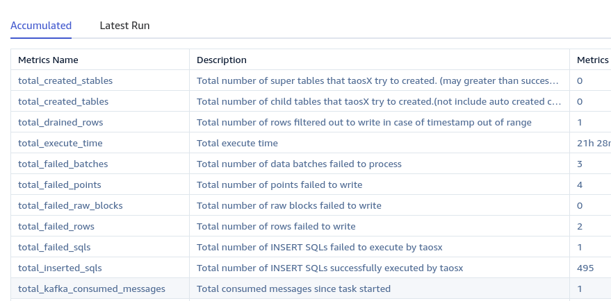
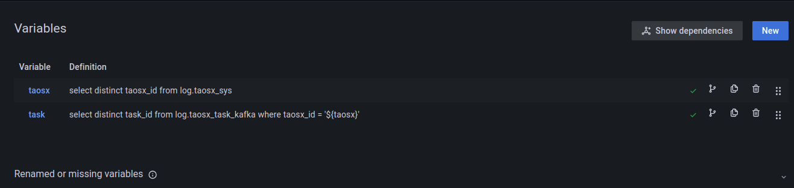
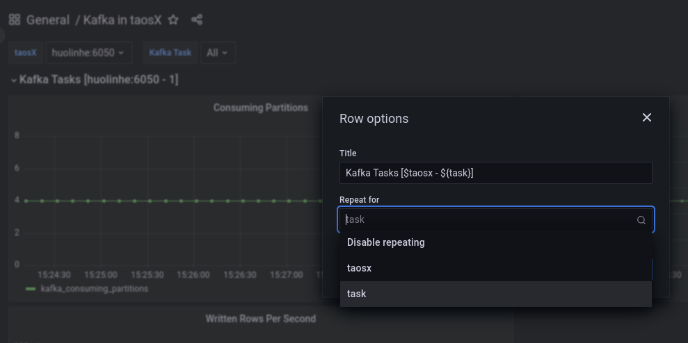
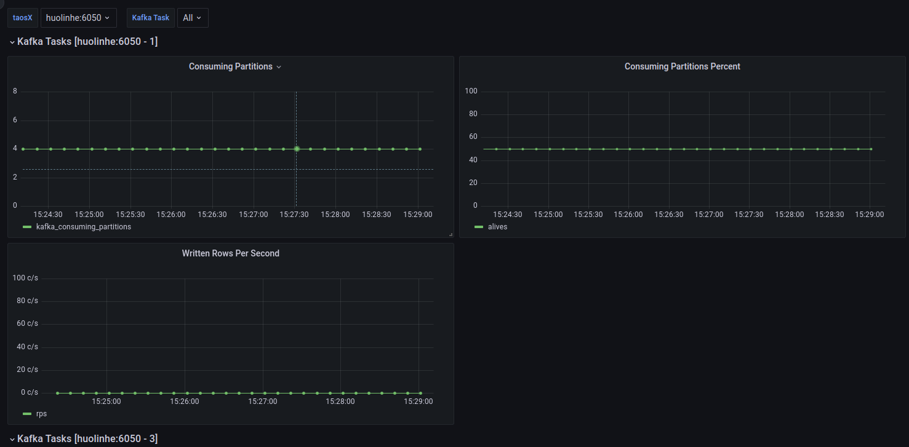
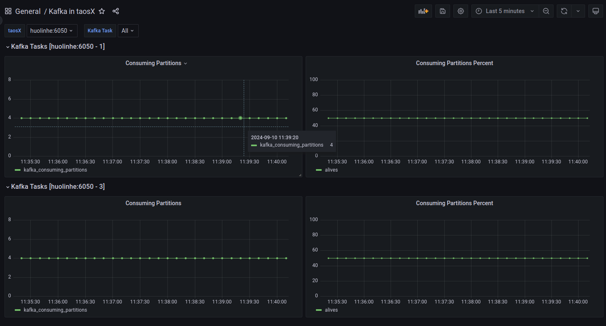
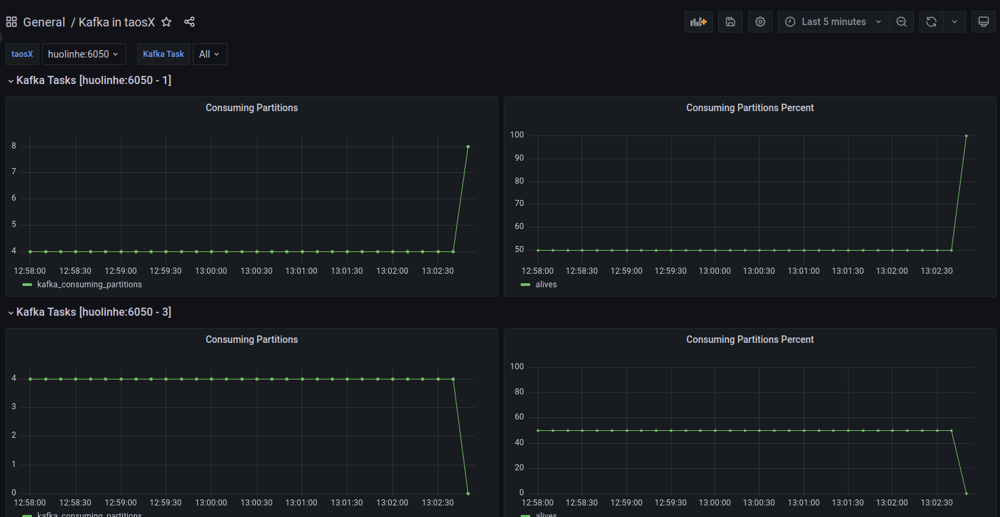

# FS - Kafka 监控指标优化

## 1. 背景

根据**河北电力**二期 ）提出的初始需求编写此文档，后续[客户提出taosx告警指标](https://taosdata.feishu.cn/wiki/MThBwgyd0iT3rQk2cXic4yk4nGg) 的要求不在本次优化范围中，即本文档完成以下告警指标的查询能力：
TS-5292

1. 数据消费速率异常告警
2. 数据写入条数为 0 
3. Consumers 存活数量和 Kafka partitions 数量的百分比
其中 1 和 2 均为衍生指标，即可使用 `log` 库中的指标进行计算后得到（SQL 语句见 [8.1.](https://taosdata.feishu.cn/wiki/Tez8wXiIaidLmEkTDDhc76Hcnsd#share-OYeTdN6D8oGzsgxZm6bcXIKGnUf) ）。3 中 Consumers 存活数量和 Kafka partitions 数量为直接指标，百分比也可通过计算得到。因为 1 / 2 已有相关数据，故本次优化主要目标是添加 Consumers 存活数量和 Kafka partitions 数量指标。

## 2. 变更历史

| 日期 | 版本 | 负责人 | 主要修改内容 |
| --- | --- | --- | --- |
| 2024/09/10 | 0.1 | @霍琳贺 | 初稿 |
| 2024/09/11 | 0.2 | @霍琳贺 | 添加 kafka_consumed_messages |
| 2024/09/11 | 1.0 | @霍琳贺 | 讨论定稿 |
|  |  |  |  |

## 3. 定义

- Consumers：只当前在 Kafka 数据源执行任务中，正在进行消费的消费者。随着任务执行，消费者的数量可能会降低（和恢复），故，Consumers 是一个动态指标。该指标名记为：`consumers`。
- Partitions：记录 Kafka 分区（下文中均使用 Partion(s)） 的个数。一般情况下，Kafka Partions 的总个数不变（Kafka Topic 创建时指定 Partitions 数量，但可以动态增加 Partitions 个数，只增不减）。但对于一个 Kafka 订阅任务而言，可以消费到的 Partitions 数量有可能发生变化（例如：两个 Kafka 任务使用同一消费者组（Consumer Group）订阅同一 Topic ）。基于此，下文对于 Partitions 指标分为两个：
   - Kafka 当前分区总数，记为 `total_partions`。
   - 当前任务消费的分区数，记为 `consuming_partions`。

## 4. 行为说明

对于 Kafka 数据源，添加以下指标：

| 指标名 | 描述 | 描述（En） |
| --- | --- | --- |
| kafka_consumers | Kafka 消费者数 | Number of Kafka consumers created |
| kafka_total_partitions | Kafka topic 总分区数 | Total number of partitions in Kafka topic |
| kafka_consuming_partitions | 正在消费的分区数 | Number of partitions being consumed |
| kafka_consumed_messages | 已经消费的消息数 | Number of messages has been consumed |
| total_kafka_consumed_messages | 累计消费的消息总数 | Total consumed messages since task started |

UI 无变化，新增的指标将自动附加到数据源的指标列表中：


`total_kafka_consumed_messages` 自动附加到累计指标列表中：


## 5. 性能

无影响。

## 6. 兼容性

无影响。

## 7. 运维

1. 查询某个 Kafka 任务的写入条数：`total_written_rows` `written_rows` 均可用于计算写入条数，区别是 `total_written_rows` 表示该任务写入的总条数，`written_rows` 表示该任务最后一次启动至今写入的条数。
  ```sql
  select _c0, cast(total_written_rows as int) as rows
    from log.taosx_task_kafka 
    where
    taosx_id = 'huolinhe:6050' and task_id = 1
    order by _c0 desc
    limit 10
  ```

  返回示例如下（NULL 值表示当前没有消费者被创建）：
  ```sql
             _c0           |    rows     |
  ========================================
   2024-09-11 11:52:42.258 |         503 |
   2024-09-11 11:52:40.259 |         503 |
   2024-09-11 11:52:38.259 |         503 |
   2024-09-11 11:52:36.259 |         503 |
   2024-09-11 11:52:34.258 |         503 |
   2024-09-11 11:52:32.259 |         503 |
   2024-09-11 11:52:30.259 |         503 |
   2024-09-11 11:52:28.259 |         503 |
   2024-09-11 11:52:26.259 |         503 |
   2024-09-11 11:52:24.258 |         503 |
  Query OK, 10 row(s) in set (0.006385s)
  ```

1. 查询某个 Kafka 任务的写入速率（单位 rps or r/s， records per second）：`total_written_rows` `written_rows` 均可用于计算写入速率。
  ```sql
  select _c0, derivative(total_written_rows, 1s, 1) as rps
    from log.taosx_task_kafka 
    where
    taosx_id = 'huolinhe:6050' and task_id = 1
    order by _c0 desc
    limit 10
  ```

  返回示例如下（NULL 值表示当前没有消费者被创建）：
  ```sql
             _c0           |            rps            |
  ======================================================
   2024-09-11 19:46:56.007 |         1.000000000000000 |
   2024-09-11 19:46:46.007 |         1.000000000000000 |
   2024-09-11 19:46:36.007 |         1.000000000000000 |
   2024-09-11 19:46:26.007 |         1.100000000000000 |
   2024-09-11 19:46:16.007 |         0.999900009999000 |
   2024-09-11 19:46:06.006 |         0.900000000000000 |
   2024-09-11 19:45:56.006 |         1.100110011001100 |
   2024-09-11 19:45:46.007 |         0.800000000000000 |
   2024-09-11 19:45:36.007 |         1.099890010998900 |
   2024-09-11 19:45:26.006 |         1.000100010001000 |
  Query OK, 10 row(s) in set (0.002360s)
  
  ```

1. 查询某个 Kafka 任务的消费速率（单位 rps or r/s， records per second）：`total_kafka_consumed_messages` `kafka_consumed_messages` 均可用于计算消费速率。
  ```sql
  select _c0, derivative(total_kafka_consumed_messages, 1s, 1) as rps
    from log.taosx_task_kafka 
    where
    taosx_id = 'huolinhe:6050' and task_id = 1
    order by _c0 desc
    limit 10
  ```

  返回示例如下：
  ```sql {wrap}
             _c0           |            rps            |
  ======================================================
   2024-09-11 20:58:41.819 |         0.500000000000000 |
   2024-09-11 20:58:39.819 |         0.000000000000000 |
   2024-09-11 20:58:37.821 |         0.000000000000000 |
   2024-09-11 20:58:35.820 |         0.000000000000000 |
   2024-09-11 20:58:33.820 |         0.500000000000000 |
   2024-09-11 20:58:31.820 |         0.499750124937531 |
   2024-09-11 20:58:29.819 |         0.500250125062531 |
   2024-09-11 20:58:27.820 |         0.000000000000000 |
   2024-09-11 20:58:25.820 |         0.000000000000000 |
   2024-09-11 20:58:23.820 |         1.000000000000000 |
  
  ```

1. 查询某个 Kafka 任务 Consumers 存活数量
  ```sql
  select _c0, cast(kafka_consumers as int) as `consumers`
    from log.taosx_task_kafka
    where
      taosx_id = 'huolinhe:6050' and task_id = 1
    order by _c0 desc
    limit 10
  ```

  返回示例如下（NULL 值表示当前没有消费者被创建）：
  ```sql
             _c0           |  consumers  |
  ========================================
   2024-09-11 11:52:42.258 |          28 |
   2024-09-11 11:52:40.259 |          28 |
   2024-09-11 11:52:38.259 |          28 |
   2024-09-11 11:52:36.259 |          28 |
   2024-09-11 11:52:34.258 |          28 |
   2024-09-11 11:52:32.259 |          28 |
   2024-09-11 11:52:30.259 |          28 |
   2024-09-11 11:52:28.259 |          28 |
   2024-09-11 11:52:26.259 |          28 |
   2024-09-11 11:52:24.258 |          28 |
  Query OK, 10 row(s) in set (0.013967s)
  ```

1. 查询某个 Kafka 任务消费者正在消费的 Partitions 数量
  ```sql
  select _c0, cast(kafka_consuming_partitions as int) as kafka_consuming_partitions
    from log.taosx_task_kafka
    where taosx_id = 'huolinhe:6050' and task_id = 1
    order by _c0 desc
    limit 10
  ```

  返回示例如下（NULL 值表示当前没有消费者被创建）：
  ```sql
             _c0           | kafka_consuming_partitions |
  =======================================================
   2024-09-11 11:52:42.258 |                          3 |
   2024-09-11 11:52:40.259 |                          8 |
   2024-09-11 11:52:38.259 |                          8 |
   2024-09-11 11:52:36.259 |                          8 |
   2024-09-11 11:52:34.258 |                          4 |
   2024-09-11 11:52:32.259 |                          4 |
   2024-09-11 11:52:30.259 |                          4 |
   2024-09-11 11:52:28.259 |                          4 |
   2024-09-11 11:52:26.259 |                          4 |
   2024-09-11 11:52:24.258 |                          4 |
  Query OK, 10 row(s) in set (0.013619s)
  
  ```

1. 查询某个 Kafka 任务正在消费的 Partitions 与 Partitions 总数量的百分比
  ```sql
  select _c0,
      cast(kafka_consuming_partitions/kafka_total_partitions * 100 as int)
      as percent
    from taosx_task_kafka
    where taosx_id = 'huolinhe:6050' and task_id = 1
    order by _c0 desc
    limit 10
  ```

  返回示例如下（NULL 值表示当前没有消费者被创建）：
  ```sql
             _c0           |   percent   |
  ========================================
   2024-09-11 11:52:42.258 |          37 |
   2024-09-11 11:52:40.259 |         100 |
   2024-09-11 11:52:38.259 |         100 |
   2024-09-11 11:52:36.259 |         100 |
   2024-09-11 11:52:34.258 |          50 |
   2024-09-11 11:52:32.259 |          50 |
   2024-09-11 11:52:30.259 |          50 |
   2024-09-11 11:52:28.259 |          50 |
   2024-09-11 11:52:26.259 |          50 |
   2024-09-11 11:52:24.258 |          50 |
  Query OK, 10 row(s) in set (0.011766s)
  
  ```

## 8. 使用场景

### 8.1 Grafana 监控 Kafka 运行数据

Step 1: 配置 Dashbard 变量 `taosx` 和 `task`，用于标识 taosx 实例和任务 ID。


Step 2: 添加和配置 Dashboad 显示组（Row）：


Step 3: 配置 Panels
- 写入速率，查询语句如下：
  ```sql {wrap}
  select _c0, derivative(total_written_rows, 1s, 1) as rps
    from log.taosx_task_kafka 
    where taosx_id = '$taosx' and task_id = $task and _c0 >= $from and _c0 < $to
  ```

- 正在消费的 Partions 数量，查询语句如下：
  ```sql
  select _c0, cast(kafka_consuming_partitions as int) 
    as kafka_consuming_partitions 
    from log.taosx_task_kafka
    where taosx_id = "$taosx" and task_id = $task
      and _c0 > $from and _c0 <= $to
  ```

- 正在消费的 Partitions 数量占总 Partitions 数量的百分比（解决原始问题 1 和 2），查询语句如下：
  ```sql {wrap}
  select _wstart, cast(avg(kafka_consuming_partitions) / 
    avg(kafka_total_partitions) * 100 as int) as alives
    from log.taosx_task_kafka 
    where taosx_id = "$taosx" and task_id = $task
      and _c0 > $from and _c0 <= $to
    interval(1s)
  ```

配置完毕后：



下图展示了两个使用同一 Group ID 的同步任务，各自使用 Partitions 一半数量的消费者，分别占比 50%。


下图展示了两个使用同一 Group ID 的同步任务在其中一个任务关闭时的 Rebalance 后的状态，存活的任务消费了所有 Partitions（100%）。



## 9. 约束和限制

无。

## 10. 常见错误和排查

无。

## 11. 可观测性

无。

## 12. 安装和卸载

无。

## 13. 文档

无。

## 14. 参考文档

**Note: 用户手册中尽量不出现设计方案或实现相关的内容。**
