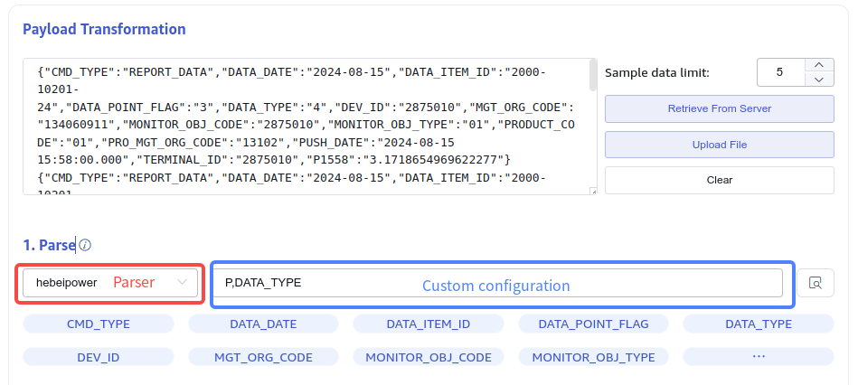

# FS - taosX Transformer Parser 插件化机制

## 1. 背景

参考 [河北电力 taosX/kafka 性能测试报告](https://taosdata.feishu.cn/wiki/ISDzwo5SVieYAYkR1fwcVtjJnYe)，我们在河北电力测试和交付过程中，发现当前基于 Rhai 的 UDT 插件方案会造成较大的性能损耗，因此我们重新将 C FFI 插件机制纳入开发计划，主要解决最关键的 Payload 解析的性能问题，主要涉及的数据源包括 MQTT、Kafka 。
同时我们对 Parser 的插件化机制提出以下实现要求：
1. 跨平台：实现中应使用跨平台 API 进行框架实现（C FFI 本身是跨平台的）。
2. 线程安全：插件功能应可以在多线程运行环境中安全调用（因为 taosX 使用 Tokio 多线程异步运行时，即使使用单实例也需要保证线程安全）。
3. 高性能：插件性能相对于 Rhai UDT 插件有可观的性能提升，相对于 taosx Rust 原生实现，不出现明显降低。
4. 可配置：可在 Explorer UI 界面进行插件配置，如配置自定义过滤器、解析方式等，以满足定制化开发的要求。

## 2. 变更历史

| 日期 | 版本 | 负责人 | 主要修改内容 |
| --- | --- | --- | --- |
| 2024/08/20 | 0.1 | @霍琳贺 | 初稿 |
| 2024/08/30 | 1.0 | @霍琳贺 | 达成共识，无需线下 Review，定稿 |

## 3. 定义

- UDT：User-Defined-Transformer。
- [Rhai](https://rhai.rs/)：一种嵌入式脚本语言，用于实现 UDT 自定义脚本。
- FFI：[Foreign Function Interface](https://doc.rust-lang.org/nomicon/ffi.html#foreign-function-interface)，在本文档中指在 Rust 环境中与 C ABI 兼容的插件（即动态库）进行交互的方式。

## 4. 行为说明

### 4.1 Explorer UI

我们将复用现有的 Payload 解析 UI，插件将作为解析器的一个选项（见下图中红框部分），其自定义配置是一个 UTF-8 字符串（见下图中蓝框部分）。


自定义配置输入框是字符串类型，默认值为空。其形式和意义均由插件开发者约定，例如：
- 使用 CSV 键值对方式：`key1=value1,key2=value2`，用于自定义过滤器、解析字段等。
- 使用 CSV 格式配置项： `option1,option2` 。
- 自定义配置没有固定格式，开发者与用户应当有明确约定。
之后的 Transform 操作没有变化。

### 4.2 服务端 API

taosX 服务端增加一组 API 以提供当前插件列表：

| API | 说明 | Request | Response |
| --- | --- | --- | --- |
| GET /transform/parser/plugins | 查看可用 Parsers 插件列表 | 无 | 服务正常时始终返回 200。 返回 Body 为 Parser Object 列表： ```json {wrap} [{ "id": "hebeipower", "name": "Power", "version": "0.1.0", "mtime": "2024-08-20T08:00:00Z", "description": "河北电力自定义插件" }] ``` ID 为动态库的名称（如 `libhebeipower.so` 的 ID 为 `hebeipower`） `last_modified_at` 为文件的最后一次修改日期。 如果插件加载错误，其 Parser Object 形式如下： ```json {wrap} [{ "id": "hebeipower", "error": "Error reason here." }] ``` |
| POST /transform/parsers | 通过 API 加载插件。 - 如果能够成功加载，返回 200 并将插件复制到插件目录中。对于已经存在的插件，此操作将更新。 - 如果失败，返回错误消息。 <callout emoji="camping" background-color="light-orange" border-color="light-orange"> 此 API 暂不对外开放 </callout> | ContentType: multipart 参数：插件动态库文件。 | 成功时返回 200： ```json {wrap} { "id": "hebeipower", "name": "Power", "version": "0.1.0", "last_modified_at": "2024-08-20T08:00:00Z", "description": "河北电力自定义插件" } ``` 失败时返回 500： ```json {wrap} { "code": 65535, "message": "Error reason here." } ``` |

### 4.3 插件机制说明

Parser 插件是一个要求用 C/Rust 语言开发的 C ABI 兼容动态库，该动态库要实现约定的 API 并编译为在 taosX 所在运行环境中能够正确运行的动态库，然后复制到约定位置由 taosX 在运行时加载，并在处理数据的 Parsing 阶段调用。

#### 4.3.1 插件位置

在 `taosx.toml` 配置文件中复用 `plugins` 配置，追加`/parsers`作为插件安装路径，默认值在 UNIX 环境下为 `/usr/local/taos/plugins/parsers`，在 Windows 下为 `C:\TDengine\plugins\parsers`。

#### 4.3.2 安装插件

安装插件即为将插件的动态库复制到上述目录下，taosX 启动时检查插件目录下所有动态库文件是否可用，如有无法加载的动态库，会在运行时报错，但 taosx 主进程不会退出。使用时应该在启动 taosx 服务后，在 Explorer 界面上查看是否已生效，如果没有生效，需要在日志中检查错误说明并修复插件动态库的错误。

#### 4.3.3 ~~插件自动~~~~识别和~~~~更新~~

~~插件修改后~~~~或开发了新的插件~~~~，可将动态库文件拷贝到插件目录中，即可自动~~~~识别出新插件或~~~~更新~~~~已经加载过的插件~~~~。但~~~~新插件~~~~对于正在运行中的任务不生效，新的插件仅对新创建或启动的任务生效。~~
~~taosX 监听以下后缀名的插件：~~
- ~~Linux：后缀名为 .so ~~
- ~~Windows：后缀名为 .dll~~
- ~~macOS: 后缀名为 .dylib~~
~~当插件文件删除后，自动更新机制将会移除该插件入口，但不影响正在运行中的任务。~~

### 4.4 插件接口规范

稳定的插件接口应当作为使用文档的一部分提供给用户。
此处约定，taosX Transform Parser 插件应当实现以下接口：

| 函数签名 | 描述 | 参数说明 | 返回值 |
| --- | --- | --- | --- |
| const char* parser_name() | 插件名，用于前端显示。 | 无 | 字符串 |
| const char* parser_version() | 插件版本，用于日志记录和问题定位。 | 无 | 字符串 |
| struct parser_resp_t { int e; // Error if null. void* p; // Success if contains. } parser_resp_t parser_new(char* ctx, uint32_t len); | 使用用户自定义配置生成解析器对象或返回错误信息。 | char* ctx: 用户自定义配置字符串。 uint32_t len: 该字符串的二进制长度（不含 `\0`）。 | 返回值为结构体。 struct parser_resp_t { char* e; // Error if null. void* p; // Success if contains. } 当创建对象失败时，第一个指针 `e` 不为 NULL。 当创建成功时，`e` 为 `NULL`，`p` 为解析器对象。 |
| const char* parser_mutate( void* parser, const uint8_t* in_ptr, uint32_t in_len, const void* uint8_t* out_ptr, uint32_t* out_len ); | 使用解析器对象对输入 payload 进行解析，返回结果为 JSON 格式 `[u8]` 。返回的 JSON 将使用默认的 JSON 解析器进行完全解码（展开根数组和所有的对象）。 | <source-synced align="1"> void* parser: `parser_new` 生成的对象指针。 </source-synced> const uint8_t* in_ptr, uint32_t in_len：输入 Payload 的指针和 bytes 长度（不含 `\0`）。 const void* uint8_t* out_ptr, uint32_t * out_len：输出 JSON 字符串的指针和长度（不含 `\0`）。当 out_ptr 指向为空时，表示输出为空。当 out_ptr 不为空时，应用（taosx）在使用完毕后应当释放该内存空间。 | 字符串指针。 当调用成功时，返回值为 `NULL`。 当调用失败时，返回错误信息字符串。 |
| void parser_free(void* parser); | 释放解析器对象内存。 | <reference-synced source-block-id="Gfp7dNcD9spG0Rb3id9c0UQtnFg" source-document-id="JZlydG0keoR5UWxjAATc3EdJnZF"> </reference-synced> | 无。 |

## 5. 性能

插件性能相对于 Rhai UDT 插件有可观的性能提升，相对于 taosx Rust 原生实现，不出现明显降低。

## 6. 兼容性

- 新增解析器对 Transform 流程兼容性无影响。
- 接口开发应当遵循向下兼容的原则：即当接口规范有更新时，应当兼容旧版本。当无法兼容时，应当给出提示。
- 编译好的插件不是跨平台的：不同系统间、不同 CPU 架构之间的插件二进制不兼容。

## 7. 运维

插件作为动态库在客户运行环境中运行时，对**插件的编译环境**可能有特殊要求，在交付时或指导用户使用该机制时，应当格外注意或提示这一点。

## 8. 使用场景

### 8.1 河北电力

河北电力使用自定义解析器对输入的 JSON 字段进行修改或过滤之后，再进入 Tranform 流程进行消费。

### 8.2 自定义编解码

当用户使用特殊格式对消息进行编码时，可实现自定义解码器对 Payload 进行解析或处理，包括但不限于：
- 解压缩；
- Protobuf/Flatbuffer/MessagePack 等格式编解码；
- 部分字段重构；
- 视频图像处理等。

## 9. 约束和限制

- 插件仅对每一行 Payload 进行处理，无法处理上下文；
- 当插件实现中出现内存错误等问题时， 可能导致 taosx 主进程崩溃；
- 编译安装动态库时，需要使用运行环境兼容的动态库文件。

## 10. 常见错误和排查

常见的错误主要是插件加载错误：
- 不支持的平台：编译目标平台与当前环境不匹配，如 x86_64 的动态库在 aarch64 上使用时。
- 不支持的特性：编译目标使用了当前 CPU 不支持的特性时，如使用了 AVX512 特性的库运行在不支持的 CPU 上时。
- 不支持的运行时：编译目标使用了与当前运行环境不匹配的运行时，如 Ubuntu 22.04 上编译的动态库，运行在 Ubuntu 20.04 上时。
- 缺少相应的动态库：编译目标使用了运行环境中不存在的动态库，比如 CentOS 7 上编译的使用了 libssl.so 的动态库运行在 Ubuntu 上。
- taosx coredump: 当使用插件时，taosx 进程崩溃，可能是插件实现 Bug，排查问题时检查堆栈中是否包含 4.4. 中约定的插件接口。

## 11. 可观测性

- 日志中记录每次加载或更新插件的事件，包括文件路径、名称、版本或可能的错误信息。
- 生产环境中插件本身不记录日志。

## 12. 安装和卸载

- 安装时没有特殊操作。
- 卸载时，如果插件目录存在且包含插件，应该提示用户是否删除（与用户日志、配置等一致），静默卸载时除外。

## 13. 文档

需要修改企业版文档，包括：
- 服务端配置项
- 插件开发文档
- 插件使用文档

## 14. 参考文档

## 15. 附录
