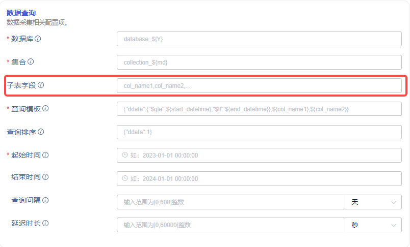
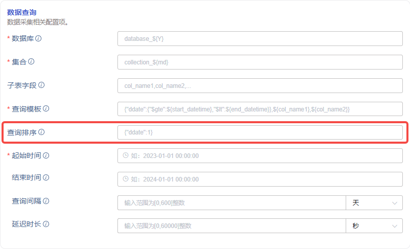

# FS - 解决 MongoDB 与关系型数据库迁移数据乱序问题

## 1. 背景

沃太能源项目，MongoDB 数据迁移过程中没有考虑数据的时间戳乱序及子表乱序，导致写入 TDengine 时性能不高，而且产生大量乱序数据导致磁盘占用高，使数据迁移任务进行的很不顺利，需要解决此问题。
关系型数据库的数据迁移与 MongoDB 问题相同，解决方案的原理相同，实现略有差异，可归在此文档中统一说明。
乱序数据产生原因：
1. 查询语句原因：由于查询语句中没有指定时间排序条件，而数据库返回结果默认也没有排序，所以单次查询得到的源数据是时间戳乱序的（本方案可以解决）；
2. 线程并发原因：按照时间分片查询，多线程分别处理多个时间片，一个线程处理结束后立即申请下一个未处理的时间片，线程间处理完成时间并非按照时间片的先后完成，所以在时间片之间是乱序的（本方案可以解决）；
3. 子表原因：数据未按照子表拆分处理，批量执行的 sql 中包含多个子表的数据，导致子表间乱序（本方案可以解决）；
4. 异常重试原因：处理过程中发生异常后，例如写 TDengine 超时报错，程序会将当前批次的数据写回内存，导致产生乱序（本方案不能完全解决，可以减轻）；
5. 断点续传原因：任务执行过程中会记录断点，断点续传时会按照较早的时间戳开始，导致断点之后的部分数据成为乱序数据（本方案不能完全解决，可以减轻）。
乱序数据引发后果：
1. 每个写 TDengine 的 sql 语句可能会包含很多子表，即一个写操作写多个 vgroup 的多个文件，磁盘效率低，写入性能差；
2. 时间戳乱序的数据，时间片在多个文件块中存在，查询效率低；
3. 时间戳乱序的数据，压缩效率低，磁盘占用大。
相关 jira 如下：

TS-5289

## 2. 变更历史

| 日期 | 版本 | 负责人 | 主要修改内容 |
| --- | --- | --- | --- |
| 2024/08/23 | 0.1 | @张元湃 | 初稿 |
| 2024/08/28 | 0.2 | @张元湃 | 根据 review 意见修改 |
| 2024/08/30 | 0.3 | @张元湃 | 合入关系型数据库，修改部分内容 |
| 2024/09/03 | 0.4 | @张元湃 | 根据 review 意见修改 |
|  |  |  |  |

## 3. 定义

- 关系型数据库：仅包括 MySQL、Oracle、PostgreSQL、SQL Server 四个
- 断点：已迁移完成的时间点
- 断点续传：任务重启时，检测任务 ID 是否存在已关联的断点信息，如果存在，将断点时间作为任务开始时间

## 4. 行为说明

原实现方案中按照时间片拆分子任务，在子任务间并行处理，这样会产生子表乱序且时间戳乱序的数据。为解决这两种乱序，将采用以下改进方案：
1. 解决子表乱序：
   - 由用户指定`子表字段`作为数据写入不同子表的条件，它们必须与 transform 中的 tag 字段对应，否则不能保证优化效果；
   - 由用户将指定的`子表字段`拼接到`查询模板`中，用于生成最终执行的查询语句，如果没有正确使用，则不能保证优化效果；
   - 任务开始前，系统根据配置的`子表字段`检索出所有的子表组合（distinct col1,col2 ...），然后根据子表拆分子任务，每个子任务陆续处理时间片，多个子任务间并行处理（子表并行），则可以保障处理效率及单个子表的时间戳顺序写入。
2. 解决查询乱序：由用户指定查询的排序条件，它必须是 transform 中 ts 映射的字段，且按时间正序，否则不能保证优化效果。

### 4.1 增加子表拆分条件

Explorer 页面的 `MongoDB/关系型数据库` 数据源任务配置中，在数据查询中增加`子表字段`配置，它可以配置以逗号分隔的 0~N 个字段。


子表字段参数说明如下：

| **ID** | **Name** | **Description** | **Type** | **Choices** |
| --- | --- | --- | --- | --- |
| subtable_fields | 子表字段 Subtable fields | 用于拆分子表的字段 Fields and query statements used for splitting sub tables | string | 非必填项 如果需要配置多个字段名，使用英文逗号进行分隔 注：关系型数据库需要填写完整的 distinct 查询语句 |

此项配置需要结合`查询模板`共同使用，否则将产生非预期结果，使用示例如下：
1. MongoDB 示例：
- 如果在页面中配置了两个子表字段`"col_name1,col_name2"`，前端拼接到 DSN 中的内容应为 `subtable_fields="col_name1,col_name2"`
  - 其中 `col_name1` 与 `col_name2` 将作为拆分子表的条件，迁移任务执行之前，会预先查询出它们的组合的所有去重后的值，例如 `[("a",1), ("a",2), ("b",1), ("c",3)]`
  - 程序将根据去重后的值遍历拼装查询条件，例如 `"col_name1":"a"` 与 `"col_name2":1`
- 在`查询模板`中将原语句 `{"ddate":{"$gte":${start_datetime},"$lt":${end_datetime}}}` 修改为 `{"ddate":{"$gte":${start_datetime},"$lt":${end_datetime}}``, ${col_name1}, ${col_name2}``}`
  - 其中 `${col_name1}` 与 `${col_name2}` 两个占位符会被替换为具体的查询条件，例如 `{"ddate":{"$gte":${start_datetime},"$lt":${end_datetime}}``, "col_name1":"a", "col_name2":1``}`
1. 关系型数据库示例：
- 如果在页面中配置了两个子表字段`"select distinct col_name1,col_name2 from tablename"`，前端拼接到 DSN 中的内容应为 `subtable_fields="select distinct col_name1,col_name2 from tablename"`
  - 其中 `col_name1` 与 `col_name2` 将作为拆分子表的条件，迁移任务执行之前，会预先查询出它们的组合的所有去重后的值，例如 `[("a",1), ("a",2), ("b",1), ("c",3)]`
  - 程序将根据去重后的值遍历拼装查询条件，例如 `col_name1='a'` 与 `col_name2=1`
- 在`查询模板`中将原语句 `SELECT * FROM table WHERE time >= ${start} AND time < ${end}` 修改为 `SELECT * FROM table WHERE time >= ${start} AND time < ${end}`` and ${col_name1} and ${col_name2}`
  - 其中 `${col_name1}` 与 `${col_name2}` 两个占位符会被替换为具体的查询条件，例如 `SELECT * FROM table WHERE time >= ${start} AND time < ${end} `` and col_name1='a' and col_name2=1`

### 4.2 增加查询排序

#### 4.2.1 MongoDB 数据库

Explorer 页面的 MongoDB 数据源任务配置中，在数据查询中增加`查询排序`配置。


查询排序字段参数说明如下：

| **ID** | **Name** | **Description** | **Type** | **Choices** |
| --- | --- | --- | --- | --- |
| sort | 查询排序 Sort | 执行查询时的排序条件 Sorting of query statements | json | 非必填项 key：排序字段名（建议只填 transform 中映射到 ts 的字段） value：1正序、-1倒序，其他无效 |

使用示例如下：

| **sort** | **说明** |
| --- | --- |
| {"createtime":1} | MongoDB 查询结果按 createtime 正序返回 |
| {"createdate":1, "createtime":1} | MongoDB 查询结果按 createdate 正序、createtime正序返回 |

#### 4.2.2 关系型数据库

由用户直接写到查询模板中，例如 `SELECT * FROM table WHERE time >= ${start} AND time < ${end}`` ORDER BY time`

### 4.3 修改断点格式

原断点格式：
```json
{
    // 子任务ID:任务进度时间点
    "mig-1": 2024-01-05 04:00:00
    "mig-2": 2024-01-05 06:00:00
}
```

修改后断点格式：
```json
{
    // 子任务ID(带子表条件):任务进度时间点
    "mig-`col_name1=a,col_name2=1`": 2024-01-05 04:00:00
    "mig-`col_name1=a,col_name2=2`": 2024-01-05 05:00:00
    "mig-`col_name1=b,col_name2=1`": 2024-01-05 07:00:00
}
```

## 5. 性能

### 5.1 查询 MongoDB 性能

基于以下几条原因，查询 MongoDB 的性能预计可能会有下降，但尚未经过测试验证：
1. 任务开始前先查询指定字段的所有值（distinct values）会占用一定时间
2. 原先只按 time 列查询，现在增加其他列（不一定有索引），查询速度会有影响
3. 原先只按 time 列的 interval 划分区段查询，现在需要按 “子表列组合” 与 interval 共同划分区段，查询次数将会增长 “子表列组合个数” 倍，整体查询速度会有严重影响

### 5.2 写入 TDengine 性能

原先写入 TDengine 的是乱序数据，现在按子表、时间戳顺序写入，预计速度有一定提升，提升效果未知。

### 5.3 TDengine 存储性能

乱序写入的数据在 TDengine 中会占用更多的磁盘，需要定期 compact 才能提高磁盘有效使用率，改为顺序写入后则不存在此问题。

## 6. 兼容性

可以正常兼容旧版本 taosx 创建的迁移任务。

## 7. 运维

断点文件相比旧版本会大很多，需要注意，断点文件默认路径如下：
```bash

## 8. windows 平台

C:\\TDengine\\data\\taosx\\tasks\\{id}\\breakpoints

## 9. linux 平台

/var/lib/taos/taosx/tasks/{id}/breakpoints
```

## 10. 使用场景

MongoDB 历史数据迁移与实时数据同步、关系型数据库历史数据迁移与实时数据同步。
沃太能源项目案例：
客户使用 taosx 将 MongoDB 中存储的数据迁移到 TDengine 中，其中数量级较大的表是 sys_coldata，此表按年分库、按月分表，单表行级最高可达 10 亿，总数据量约 300 亿条。TDengine 集群 1 级存储 2T 硬盘、2 级存储 8T 硬盘、3 级存储使用 S3 网络存储。
表 sys_coldata 中的字段 upload_time 映射到 TDengine 的 ts 字段，字段 sys_sn 作为拆分子表的 tag，解决乱序前（ts 乱序、一条 insert sql 写入多张子表），迁移任务执行约 20 小时即可将 1 级存储写满，但 compact 后数据文件大小骤减，甚至只占用几百兆。
由此可见乱序数据产生的恶劣影响有多大，使用优化后的 taosx 则可以缓解此问题，可以按照如下配置：
1. 配置`子表字段`为 sys_sn
2. 配置`查询排序`为 upload_time
程序的最终查询语句将变为 filter:{"upload_time":{"$gte":xxx,"$lt":xxx},sys_sn:xxx}, sort:{"upload_time":1}，这样得到的源数据则是按子表拆分的、时间片有序的、时间片内有序的数据。

## 11. 约束和限制

拆分子表的字段，其类型仅支持 String/Double/Int32/Int64/Boolean 及相关类型，其余暂不支持。

## 12. 已知问题

1. 如果`子表字段`配置了 col_name1,col_name2 但`查询模板`中没有正确使用，则不能解决乱序问题；
2. 如果`子表字段`配置了 col_name1,col_name2 但 transform 中拆分子表的字段与此不符，则不能解决乱序问题；
3. MongoDB 迁移任务，如果`查询排序`配置了例如 {"time":-1} 或 {"name":1} 的“错误排序规则”，则不能解决乱序问题；
4. 关系型数据库迁移任务，如果`查询模板`中未填写 order by 子句，或者填写了例如 order by time desc 的“错误排序规则”，则不能解决乱序问题；
5. 写入 TDengine 报错引起的乱序问题不能解决；
6. 任务重启引起的乱序问题不能解决；
7. 任务执行过程中新写入的历史数据可能不会被迁移。比如当前对某张表的数据迁移到了时间 A，如果此时补录时间 A 以前的数据，则这些数据不会被迁移，因为迁移任务按时间顺序分片查询历史数据。

## 13. 常见错误和排查

- MongoDB 数据源获取示例数据时报错 “parsing sort failed: xxx”：字段 sort 配置错误。
- 关系型数据库获取示例数据时报错 “Syntax error in SQL template: xxx”：
  - 检查`子表字段`是否配置正确：字段是否存在？类型是否支持？查询语句是否正确？
  - 检查`查询模板`是否配置正确：SQL 语句是否合法？

## 14. 可观测性

无。

## 15. 安装和卸载

无。

## 16. 文档

需要修改企业版文档，不需要修改官网文档。

## 17. 参考文档

无。

## 18. 附录

无。
