# MQTT ClientID 和 Kafka GroupID 生成规则优化

## 1. 背景

JIRA 链接：

TD-30606

TD-29040

TD-30941

1. 当前 mqtt 使用 UUID 作为默认 client id，接受用户输入指定，存在如下问题：
   - 如果用户没有指定，在task 详情页面上不会显示默认生成的client id
  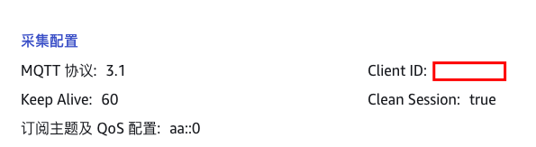

   - 而默认生成的UUID在 mqtt broker 端进行问题排查时不方便定位这个 client 的来源
  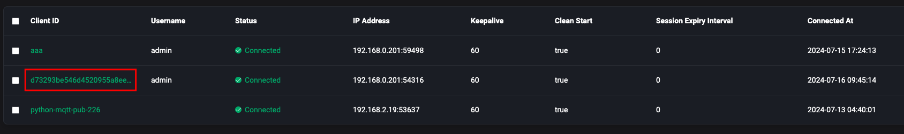

   - 用户指定一个固定的 id，在进行任务复制时如果忘记指定，相同id会导致 client 互踢
  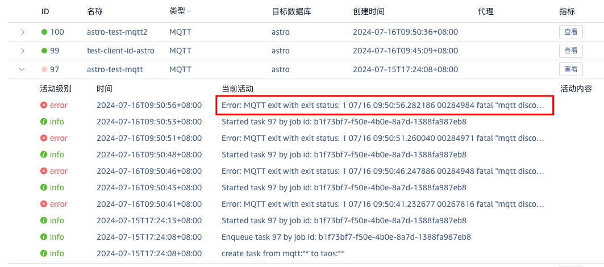

1. 当前 kafka 使用 task id 作为 group id，存在以下问题：
   - 无法辨别 group id 来源，给问题排查和监控造成不便
   - 当一台机器上部署了多个 taosx 实例且数据目录不同，taosx之间是相互独立的，task id 各自维护，从1开始计数。那么当多个实例同时连接同一个的 kafka，不同实例的不同任务会分到一个组下，消费同样的数据导致问题

## 2. 变更历史

| 日期 | 版本 | 负责人 | 主要修改内容 |
| --- | --- | --- | --- |
| 2024/07/16 | 0.1 | @闫宇星 | 初稿 |
| 2024/07/18 | 0.2 | @闫宇星 | 根据线下review进行修改 |
| 2024/7/23 | 0.3 | @闫宇星 | 补充兼容性规则，优化 UI |

## 3. 定义

无

## 4. 行为说明

### 4.1 MQTT ClientID

1. 任务创建/复制/修改/详情页面，按照 taosx{task_id}{user_input} 或 taosx{user_input} 进行展示 ，在创建/复制页面，task_id 交互按钮旁添加提示“使用当前任务ID进行填充”，user_input 为输入框，由用户自由发挥填写
2. 任务修改页面提供ClientID当前值，不可修改
3. 任务创建页面，user_input 段为必填项
4. 任务复制页面同任务创建页面，但 user_input 置为空，强制用户填写
5. 填写规则： 
   - 分为3段，taosx{task_id}{user_input}，其中 task_id 为可选字段，如果用户选择添加，则生成时填充为当前任务的id，user_input 为必填字段，由用户填写，输入不做限制
   - 有些 mqtt broker 可能会限制 client id 的最大长度，比如 V3.1 协议规定最大长度为 23，V3.1.1/V5 中长度为 23，仅由字母数字组成的 CilentID 是必须合法的（broker可能遵守也可能不遵守）
   - 参考：[MQTT Version 5.0](https://docs.oasis-open.org/mqtt/mqtt/v5.0/os/mqtt-v5.0-os.html#_Toc3901059:~:text=The%20Server%20MUST%20allow,MQTT%2D3.1.3%2D5%5D.)
6. 任务修改页面，连接配置中的 MQTT 地址，MQTT 端口，以及采集配置中的ClientID，订阅主题置灰不可修改
7. 切换按钮提示：“是否将当前任务的 ID 填充到 ID 中”
任务创建页面
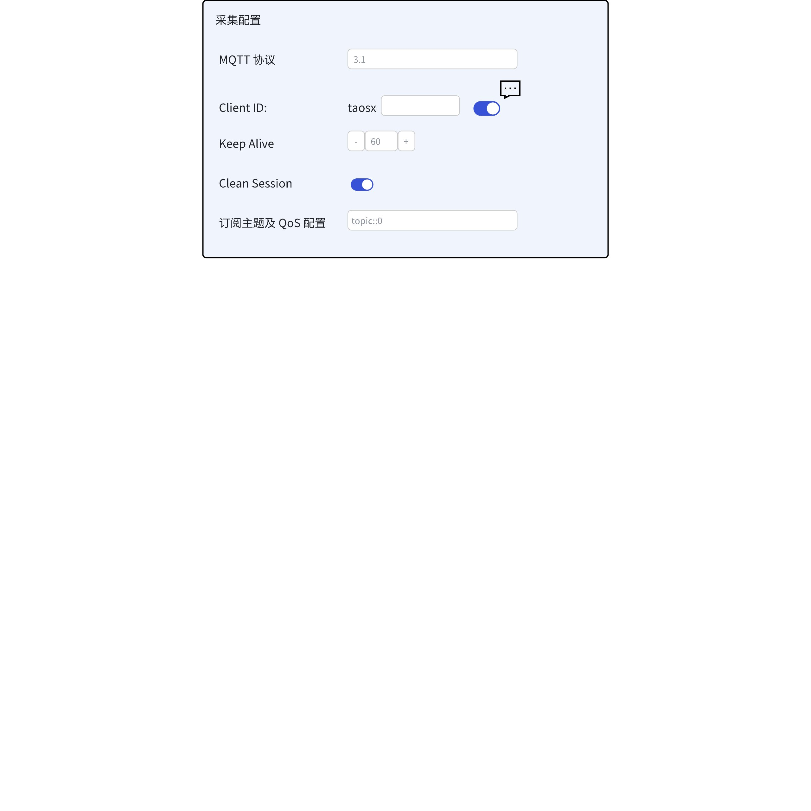

任务复制页面
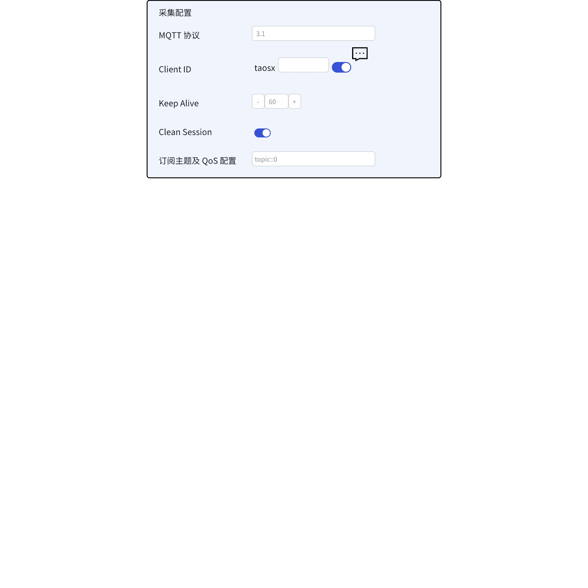

任务修改页面
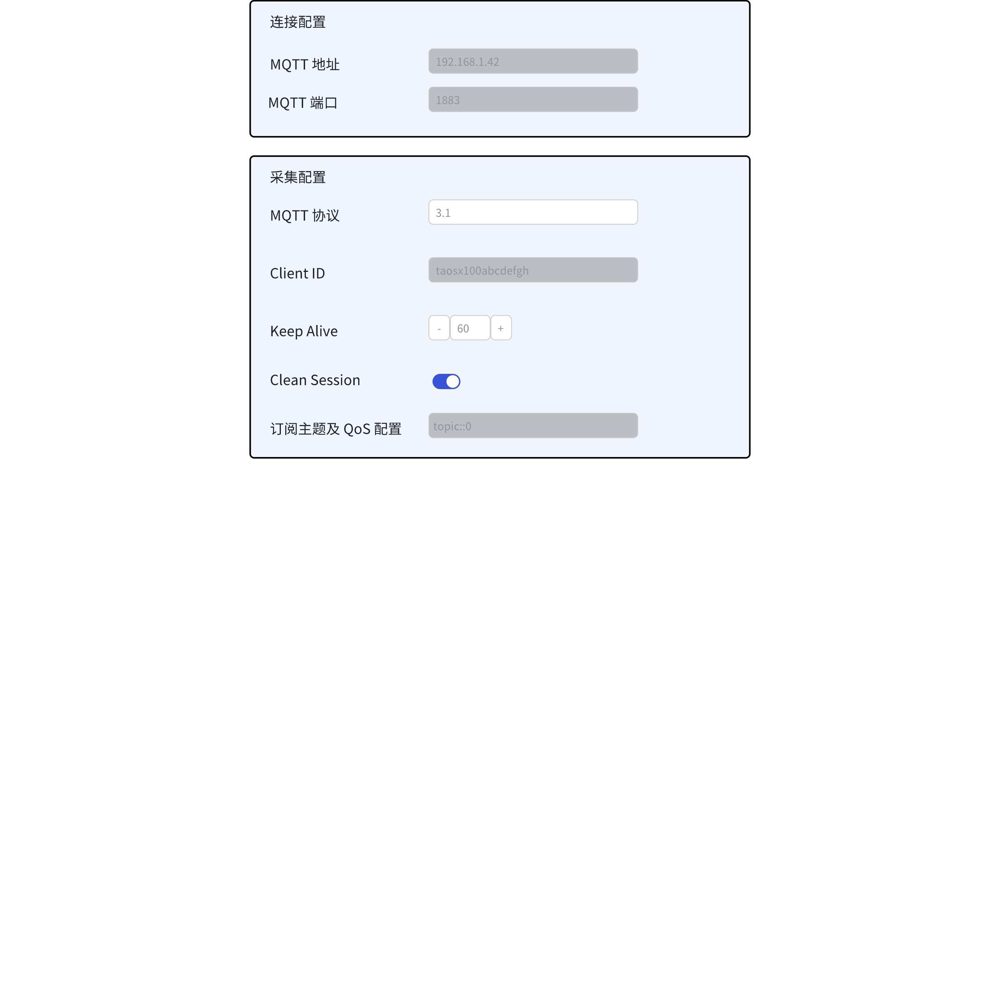

任务详情页面
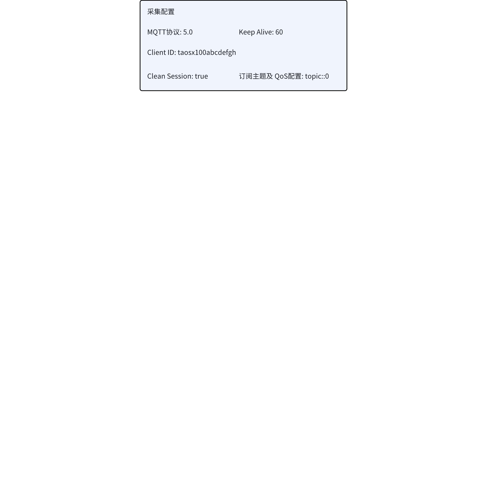

### 4.2 Kafka GroupID

1. 页面添加 GroupID 和 ClientID 填写配置，页面逻辑以及生成规则同 MQTT ClientID
2. 任务修改页面，连接配置，主题，消费者组 ID，ClientID 部分不允许修改
任务创建
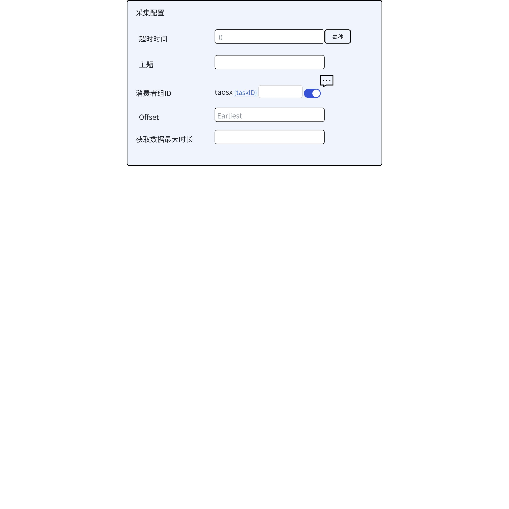

任务复制页面
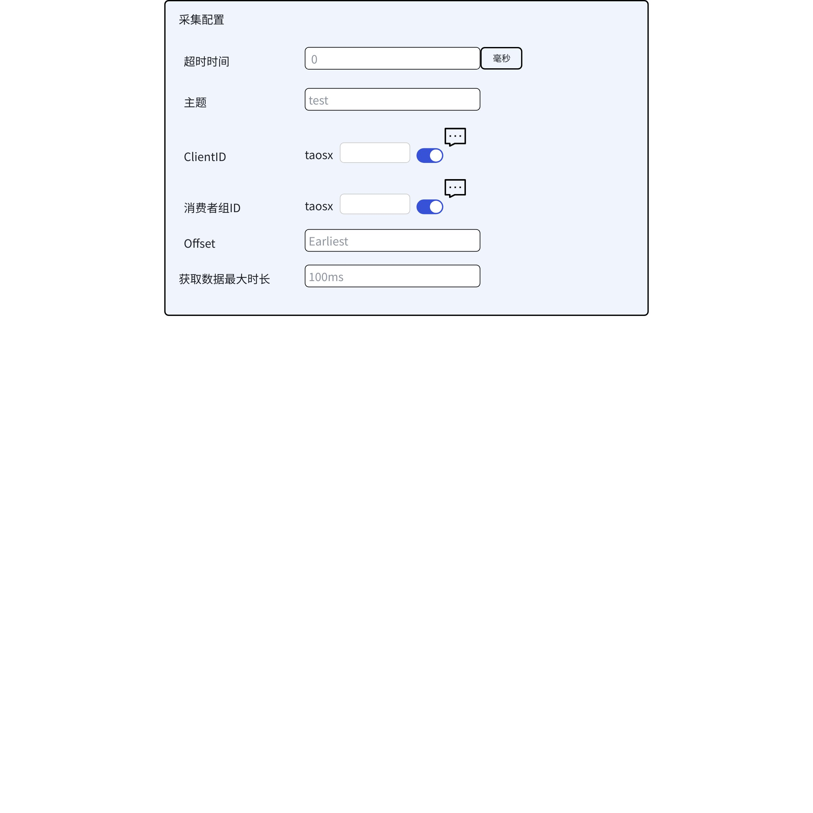

任务修改页面
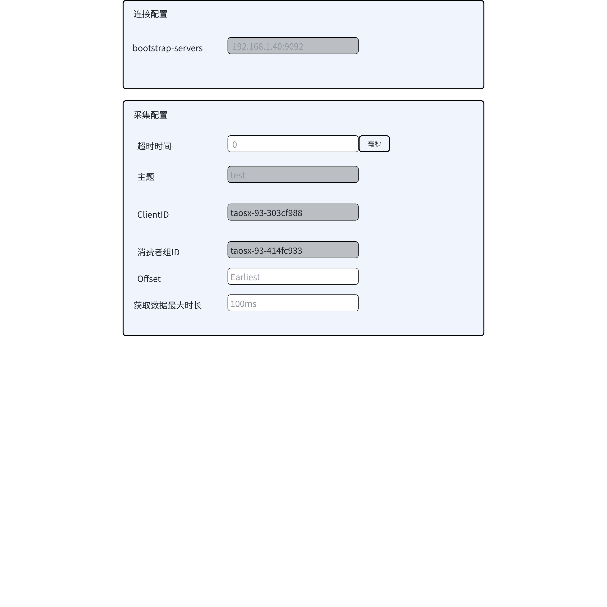

任务详情页面
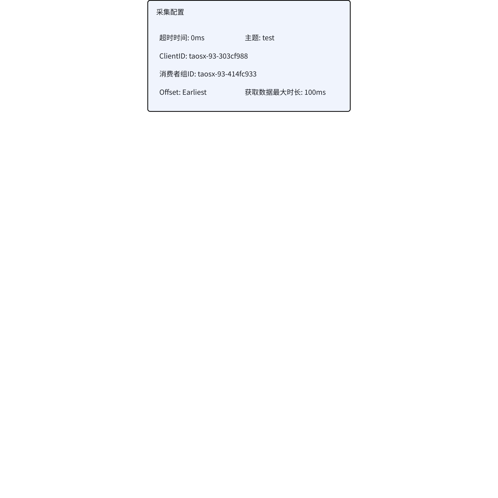

## 5. 性能

无

## 6. 兼容性

1. 新创建的任务使用新的自动生成的 ClientID 和 GroupID，对已有的旧 ID 没有影响
2. 对于使用旧版本已生成的 MQTT ClientID
   - 由用户填写，在修改页面显示用户填写的 ClientID；创建和复制页面按照新的页面交互，最后一段置空由用户填写
   - 系统自动生成的 UUID，因为没有持久化，在修改页面无法进行显示，显示为空；创建和复制页面按照新的页面交互，最后一段置空由用户填写
3. 对于使用旧版本已生成的 Kafka GroupID
   - 修改页面显示当前任务的 taskID（旧版本使用 taskID 作为 GroupID）
   - 创建和复制页面按照新的页面交互，最后一段置空由用户填写
4. 旧版本上创建的任务在升级后不做任何人工干预能够继续运行

## 7. 运维

无

## 8. 使用场景

1. MQTT 任务的创建/复制/修改/详情中对于 ClientID 的设置/查看
2. Kafka 任务的创建/复制/修改/详情中对于消费者组ID的设置/查看

## 9. 约束和限制

无

## 10. 常见错误和排查

无

## 11. 可观测性

无

## 12. 安装和卸载

无

## 13. 文档

需要修改企业版文档
1. http://192.168.0.30:3000/docs/enterprise/datain/mqtt/
2. http://192.168.0.30:3000/docs/enterprise/datain/kafka/

## 14. 参考文档

无

## 15. 附录

### 15.1 接口变更

1. from 新增 "group" 段，表示 kafka group id（沿用之前的）
2. 接口新增字段

| path | 字段 | 描述 |
| --- | --- | --- |
| `POST /tasks` | - client_id_with_task_id: true - group_id_with_task_id: true | - 在 from dsn 中新增 param 字段 - 是否使用 task id 填充 mqtt client id 和 kafka group id - 不传或传false表示不填充 |
