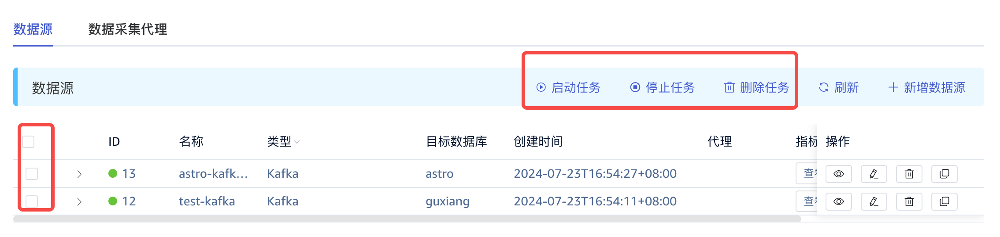
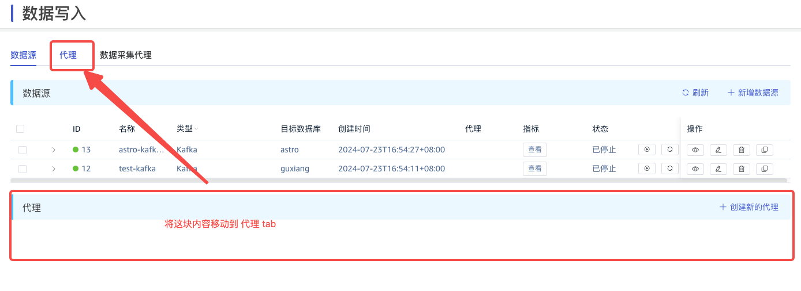
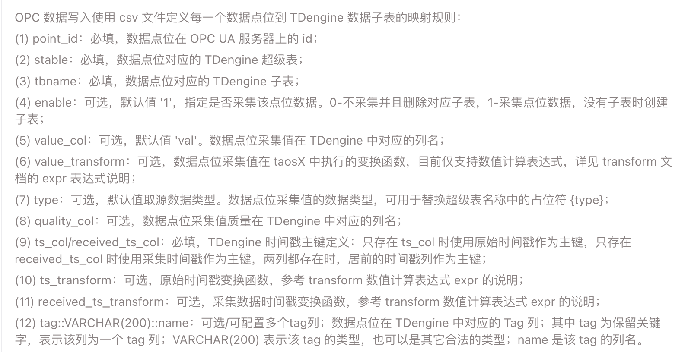
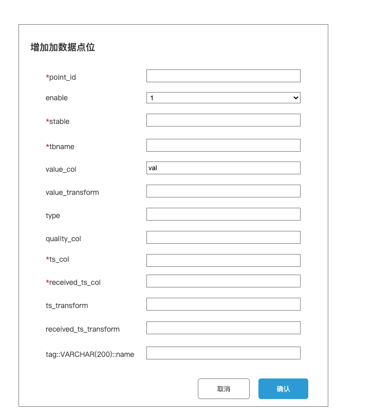

# OPC 点位支持动态添加和查看

## 1. 背景

需求来源 jira [TS-5209](https://jira.taosdata.com:18080/browse/TS-5209)。 梅州卷烟厂用户在使用 explorer 数据写入功能时，觉得现交互体验不是很方便和友好，提出了以下几个问题：
- 数据写入列表因为只占据了一半空间，能够显示的任务数量有限；希望能够显示更多任务并提供分页显示机制
- 任务较多时，要停止或启动一批任务需要一个个点击，比较麻烦
- OPC-UA 用 CSV 上传配置后想增加点位，只能先下载、编辑再上传，步骤繁琐

## 2. 变更历史

| 日期 | 版本 | 负责人 | 主要修改内容 |
| --- | --- | --- | --- |
| 2024/7/25 | 0.1 | 顾香 | 初稿 |
| 2024/7/25 | 0.2 | 顾香 | 根据 Wade 线上 Review 意见修改 |
| 2024/7/30 | 0.3 | 顾香 | 根据线下 review 修改，主要修改是添加点位表单由后端获取 |
| 2024/8/1 | 0.4 | 顾香 | 补充评论中提出的一些细节，如提示消息的定制化等 FS 定稿 |

## 3. 定义

无。

## 4. 行为说明

### 4.1 批量启动和停止全部或多个任务

#### 4.1.1 状态转换条件

1. 允许启动的任务状态：created、failed、stopped、suspended、completed
2. 允许停止的任务状态：queued、running、interrupted、waiting、resumed
3. 允许删除的任务状态：completed、stopped、failed、interrupted、ticked

#### 4.1.2 UI 变化

修改后的 UI：

#### 4.1.3 行为说明

- 在列表每个任务前增加复选框，可以全选，也可以选择多个任务。
- 新增启动任务按钮：
  - 在没有勾选任务时，启动任务按钮不可点击
  - 鼠标放上去提示，请先选择需要启动的任务
  - 勾选任务后点击启动任务按钮弹出确认启动任务弹框，点击弹框中的确认按钮，则启动勾选的任务中状态为允许启动的任务；其余任务保持现状，不做任何更改也不做提示
- 新增停止任务按钮：
  - 在没有勾选任务时，停止任务按钮不可点击
  - 鼠标放上去提示，请先选择需要停止的任务
  - 勾选任务后，点击停止任务按钮弹出确认停止任务弹框，点击弹框中的确认按钮，则停止勾选的任务中状态为允许停止的任务，其余任务保持现状，不做任何更改也不做提示
- 新增删除任务按钮：
  - 在没有勾选任务时，删除任务按钮不可点击
  - 鼠标放上去提示，请先选择需要删除的任务
  - 勾选任务后点击删除任务按钮弹出确认删除任务弹框，点击弹框中的确认按钮，则删除勾选的任务中状态为允许删除的任务；其余任务保持现状，不做任何更改也不做提示 
- ~~操作成功或失败的信息~~~~追加~~~~在每个任务的日志信息中~~~~，UI 中点的颜色和之前逻辑保持一致，即根据最新的状态进行颜色变化，失败是红色，成功是绿色~~
- 全部启动成功后，弹窗提示“共成功启动 n 个任务”；如果有启动失败的任务，则使用回车符拼接多个任务的错误提示信息，弹窗提示。

### 4.2 数据源页面调整

#### 4.2.1 UI 变化

#### 4.2.2 行为说明

- 将代理放在单独的 tab 上，让数据源列表占据一整页，不单独增加分页的UI，在当前表格内滚动的方式。代理页不修改任何交互
- 点击数据源列表中单个代理值跳转到代理tab并高亮代理列表中的对应的代理行

### 4.3 CSV 配置点位调整

#### 4.3.1 原 csv 每列说明 

继续保留，不做修改

#### 4.3.2 UI 变化

- 增加数据点位按钮 UI：

- 增加数据点位弹框表单 UI：

#### 4.3.3 行为说明

- 新增增加点位按钮：任务编辑页面新增一个增加点位按钮，新增/复制页面不可见
  - 必须先上传 CSV 作为初始配置，如果未上传则“增加数据点位”按钮不可见
  - 增加数据点位可以任意次数
- 新增数据点位表单弹框：表单字段完全从接口获取，表单字段和 csv 每列说明、顺序完全一致。填写单个数据点位的映射规则，且每次只能增加一个点位。
- 点击增加点位按钮，弹出增加数据点位表单填写框，填写信息
- 点击弹框中确认按钮提交点位信息，
  - 操作成功：增加点位成功后，下载使用中的 csv 文件中能看到增加的点位信息，且点位已经生效了。提示信息为数据点位增加成功
  - 操作失败： 弹出提示信息数据点位增加失败
  - 操作成功或失败：当前的弹框不自动关闭，且上次填写的部分信息默认保留, 只清空一定不会相同的字段，包括 point_id，方便填写下一个点位。如果操作失败，表单保留在当前页面，内容保持上次填写的内容方便修改
- 任何时候如果选择下载 CSV 都是当前所有已经配置的点位（包括增加的）
-  任何时候如果上传 CSV 都会覆盖原有配置（包括增加的）
- 点击保存并应用按钮时如果当前配置没有任何改动，点击只跳转页面，实际不调用接口

## 5. 性能

无。

## 6. 兼容性

无。

## 7. 运维

无。

## 8. 使用场景

无变化。

## 9. 约束和限制

约束：无
限制：无

## 10. 常见错误和排查

无。

## 11. 可观测性

无变化

## 12. 安装和卸载

无。

## 13. 文档

- **需要**修改企业版文档：需要对此特性添加说明，修改截图等
- 不需要修改官网文档。参考文档

## 14. 参考文档

无

## 15. 附录一：taosX 的行为变更

### 15.1 批量启动/停止/删除任务

处理批量启动/停止/删除任务的请求，接口的详细定义在开发过程中补充在附录2中。
增加以下接口：
- 批量启动任务：`POST /tasks/start`
- 批量停止任务：`POST /tasks/stop`
- 批量删除任务：`POST /tasks/delete`

### 15.2 增加点位配置

OPC-UA 和 OPC-DA 数据源，使用“上传 CSV 配置文件”方式，点击“增加数据点位”按钮时，弹出表单。用户通过填写表单，新建一个 OPC 点位的配置规则，提交到 taosX 处理，包括以下行为：
1. 检查**提交的点位**和**现有 CSV 文件中的点位**是否冲突？如果冲突，则增加失败，返回错误信息，前端提示；
2. 检查**提交的点位配置**能否通过 CSV 合法性校验？如果不通过，则增加失败，返回错误信息，前端提示；
3. 将新增的点位配置，追加到现有的 CSV 点位配置文件中；
4. 新增的点位配置，对当前正在运行的任务生效。即：调用“**添加点位配置**”前后，不需要停止/重启当前任务。
增加以下接口：
- 查看点位配置的 CSV Header：`GET /ds/in/opc/csv/points/header`
- 追加点位配置到 CSV：`PATCH /ds/in/opc/csv/points`

### 15.3 查看点位列表

通过“上传 CSV 配置文件” 中的 “查看点位列表”，成功新增的 OPC 点位应该出现在点位列表中。

## 16. 附录二：taosX 的接口变更

通过 swagger 生成 API 接口文档，可以直接访问：http://192.168.0.201:6050/swagger-ui/
