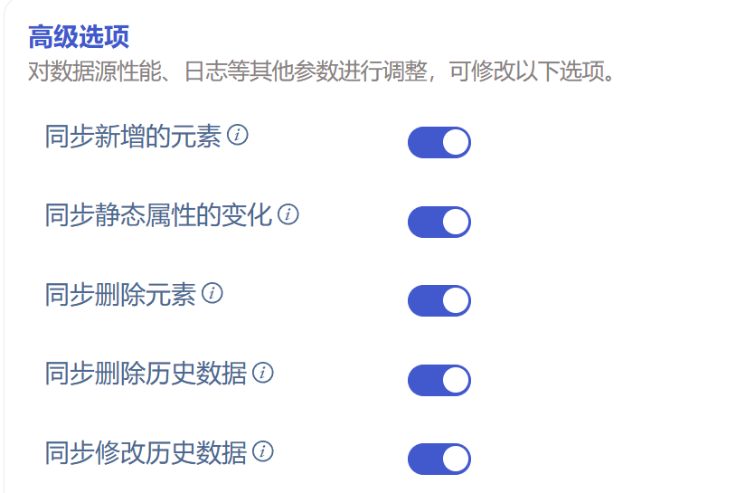

# PI 数据源同步增删改操作和提前建表

JIRA：
taosX 更改：

TD-30364

Explorer 更改：

TD-30466

连接器更改：

TD-30439

TD-30927

TD-30931

## 1. 背景

PI 数据源最基本的功能是同步历史数据和同步实时数据，但在实际应用场景中，如果只有这两个基本功能产品是不完善的。在 Cargill POC 过程中，用户就提出除了同步数据以外的需求，总结一下包括：
- 同步动态增加的元素，对于 TDengine 就是动态增加子表。（已支持）
- 同步修改静态 Attibute 值的操作，对于 TDengine 就是修改子表的标签值。（已支持，但与 transform 不兼容，需要重构）
- 同步删除元素的操作，对于 TDengine 就是删除子表。（未支持）
- 同步删除元素某个动态属性的历史数据。（未支持）
- 同步修改元素某个动态属性的历史数据。（未支持）

## 2. 变更历史

| 日期 | 版本 | 负责人 | 主要修改内容 |
| --- | --- | --- | --- |
| 2024/7/12 | 0.1 | 丁博 | 初稿 |
| 2024/7/15 | 0.2 | 丁博 | 根据 wade review 意见修改 - 新增同步历史数据变化 |
| 2024/7/16 | 1.0 | 丁博 | 根据线下 review 意见更改 - 新增的开关选项只在多列模式展示 - 提前建表不阻塞写入数据 - 修改特殊场景的描述 |
| 2024/7/23 | 1.1 | 丁博 | 修改“同步删除历史数据”行为描述 |

## 3. 定义

1. 增删改：在本文中，从 PI 的角度看指增加新的元素、删除元素或删除元素的历史数据、修改元素的静态属性或动态属性的历史数据。从 TDengine 角度看，增指增子表，删指删子表数据或删子表本身，改指改标签列的值或改历史数据。
2. 提前建表： 指在订阅到新数据之前，就提前创建好超级表和子表。
3. 时序数据：在 PI 指 PI Point 数据，在 TDengine 指非 TAG 列的数据。
4. 静态数据：在 PI 指元素的非 PI Point 属性的值，在 TDengine 指 TAG 列的数据。静态数据并非不变化的数据，“静态”只是相对时序数据而言的。
5. 纯静态元素： PI 中定义的元素，没有一个属性引用 PI Point，也就是说所有数据都是静态数据的元素。由于 TDengine 不支持只有一个时间戳主键列的超级表，此类元素的模板映射到 TDengine 的超级表会自动加上一个数据列，名称为 _x1。这类超级表的子表不会有时序数据。
6. 建表消息： PI 连接器发送给 taosX 的用于创建子表的消息。包含了创建一批子表需要的一切数据。
7. 数据消息：PI 连接器发送给 taosX 的用于写入时序数据的消息。
8. 控制消息：PI 连接器发送给 taosX 的删除数据、删除元素、修改属性值的消息。

## 4. 行为说明

### 4.1 界面设计

对于 PI 任务（不包括 PI backfill），如果选择了多列模式，高级选项部分新增 5 个开关选项（**单列模式下隐藏**），均默认开启。如下图:

1. 同步新增的元素（Synchronize New Elements）
      中文描述：监听配置的模板下新增的元素，无需重启任务，即可自动同步新增元素的数据。
英文描述：Monitor the newly added elements under the configured templates, and synchronize the data of the newly added elements without restarting the task.
1. 同步静态属性的变化 (Synchronize The Changes of Static Attributes)
中文描述：同步所有静态属性（非 PI Point 属性）的变化。
英文描述：Synchronize the changes of all static attribute to TDengine.
1. 同步删除元素的操作 (Synchronize The Deletions of Elements)
  中文描述：监听配置的模板下删除元素的事件，并同步删除 TDengine 对应子表。
  英文描述：Monitor deleting elements under the configured templates, and correspondingly drop the corresponding child tables in TDengine.
1. 同步删除历史数据（Synchronize The Deletion of Data）
  中文描述：对于某个元素的动态属性，如果在 PI 中某个时间的数据被删除了，**TDengine 对应时间对应列的数据会被置空**。
  英文描述：For the dynamic attributes of an element, if the data for a certain period of time is deleted in PI, the corresponding data is set to null in TDengine.
1. 同步修改历史数据 (Synchronize The Changes of Point Data)
  中文描述：对于某个元素的动态属性，如果在 PI 中历史数据被修改了，TDengine 对应时间的数据也会更新。
  英文描述：For the dynamic attributes of an element, if the data for a certain time is modified in PI, the corresponding data is updated automatically too in TDengine.

### 4.2 提前建表

在以前的版本中，只有纯静态元素对应的子表是提前创建的，（因为如果在收到建表消息的时候不创建子表，再也没有机会触发建表）。其它子表是跟随第一批数据创建的。这会导致数据更新频率低的元素在很长一段时间内无法触发建表操作，**因此****本次修****改为所有元素都提前建表**。

### 4.3 特殊场景

#### 4.3.1 注册监听前发生增删改

如果一个任务要同步的元素比较多，连接器会分批监听元素的属性变化。比如 1 万个元素，可能需要 1 分钟才能完成监听。在任务启动后，注册监听前的事件会被忽略掉。

#### 4.3.2 实时数据与删除元素事件几乎同时发生

taosX 内部并行处理事件，不能保证事件的发生顺序和处理顺序一致，因此有可能先处理删除事件，再处理最后一批写入事件。结果就是这个元素对应的子表没有被删除，因为写入的时候会自动建表。

#### 4.3.3 建表成功前修改元素的静态属性值

taosX 内部会保证建表消息和控制消息严格按照事件发生的顺序被处理，这个场景静态属性值的修改时会被同步到 TDengine。

#### 4.3.4 修改了用于表名的静态属性

在 PI 数据源支持 transform 之后，元素对应的子表名是通过配置文件的子表名映射规则决定的。用户可以用静态属性的任意组合和变换生成子表名。默认规则是：${elment_name}_${element_id}。如果子表名表达式中引用了属性 A，后来属性 A 的值又被修改了，那么计算得到的目标表是一个全新的子表名，不存在在 TDengine 中。此时同步操作会因找不到目标表而失败。此后新的时序数据依然会写入原来的子表，但是在任务重启之后，元素 ID 对应的子表会重新计算，新的数据会写入新的子表。

## 5. 性能

提前建表对性能有一定影响，实时任务每次启动都会首先尝试把所有子表创建一遍，在子表数量较多的情况下，这是很耗时的操作。**为了避免建表阻塞对数据消息的处理，我们会用不同的线程处理建表消息和数据消息**。

## 6. 兼容性

1. 升级 taosX 后，旧版本连接器依然可以使用，已有的数据同步任务可照常运行。
2. 如果要使用新增的功能，PI 连接器和 taosX 都需升级至 3.3.3.0 版本。

## 7. 运维

无

## 8. 使用场景

同背景部分所描述，有 4 个使用场景。

## 9. 约束和限制

### 9.1 限制

1. **不支持同步模板级别新增或删除属性**。因为这类变化造成新旧 schema 不兼容，我们建议重建任务，重新开始同步数据。
2. **不支持同步修改元素名称。任务重启后以新的元素名称建表。**
3. 对于 String Builder 、Table Lookup、URI Builder 三种数据引用类型，尚无法监听其变化。
4. 本文所新加的功能，只针对多列模型。暂不支持同步单列模型子表的增子表、删数据、改 TAG 操作。

### 9.2 约束

1. taosX 指对配置文件指定的模板执行同步操作。比如，某个实时同步任务 A，指定了模板 T1 和 T2，那么只有与 T1 和 T2 相关的变化才会同步到 TDengine。
2. 不支持同步不依赖任何模板的独立存在的元素。
3. 删除数据并不会立即释放该表所占用的磁盘空间，而是把该表的数据标记为已删除，在查询时这些数据将不会再出现，但释放磁盘空间会延迟到系统自动或用户手动进行数据重整时。

## 10. 常见错误和排查

可以在高级选项部分，更改连接器日志级别为 DEBUG，输出更多调试信息。

## 11. 可观测性

无

## 12. 安装和卸载

无

## 13. 文档

需要更改企业版文档，详细描述支持的功能。

## 14. 参考文档

[5/16 Cargill Requests](https://taosdata.feishu.cn/wiki/EnckwjJhDiAx31ka86lcinTrngh)
[PI 系统使用](https://taosdata.feishu.cn/wiki/Jxu9wFXUqiUbWFkfRpGchD5Bnih)

## 15. 附录

 [Control flow in Lush Stream（draft）](https://taosdata.feishu.cn/wiki/BO7Pw3W8CivJiUkBONgcVdXPn3c)
