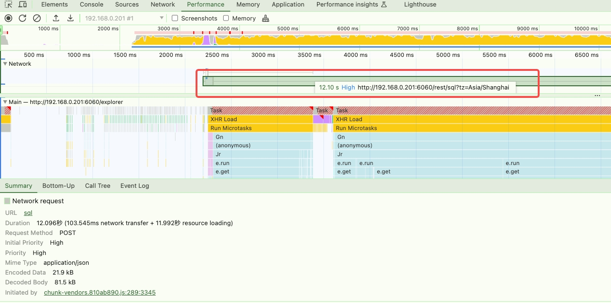
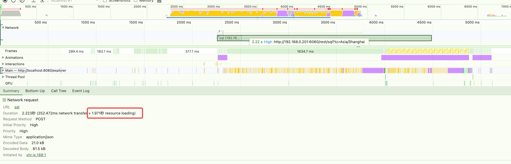

# taosExplorer 查询 900 字段表格十分缓慢

1. 问题描述
taosExplorer 在查询大宽表时，从查询到显示到页面的时间需要十几秒。

1. 原因
经过分析，查询接口从发起到响应的时间小于1s，但是页面渲染成 dom 元素需要 10s 以上。一次性渲染的元素过多，导致浏览器渲染缓慢卡顿。
1. 解决方案
初次只渲染真实 dom 20列，并加上了一个整体的 loading 等待交互，拖动滚动条的时候再去加载更多数据。优化之后在相同数据量的情况下由一开始的12s下降到2.2s。

