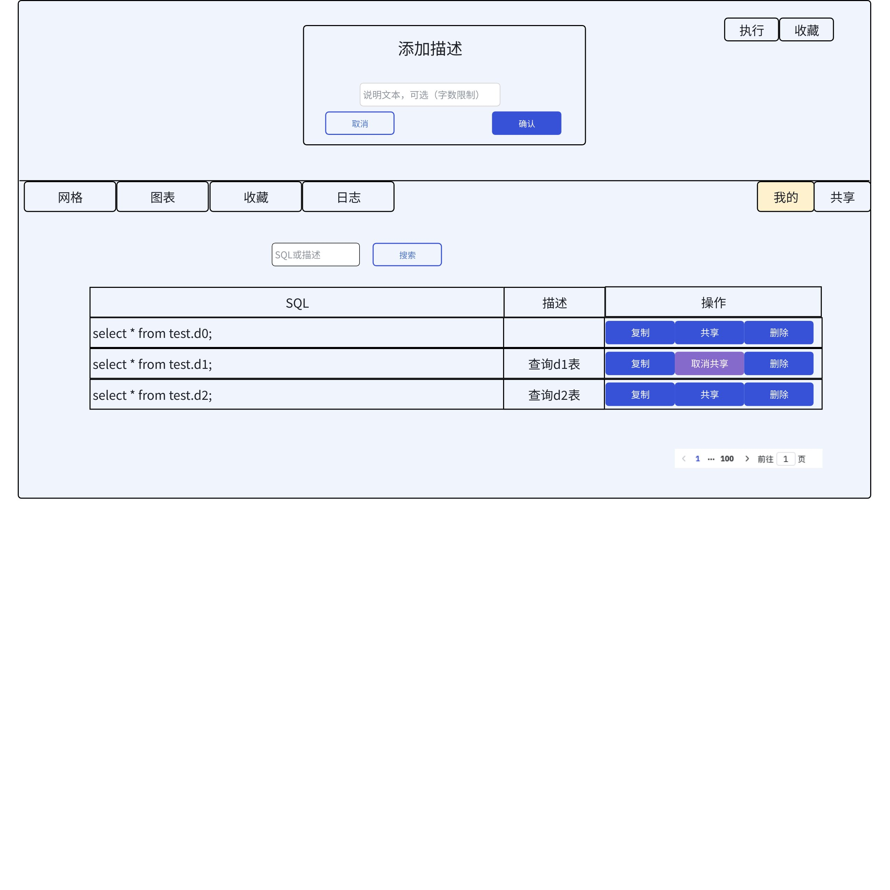
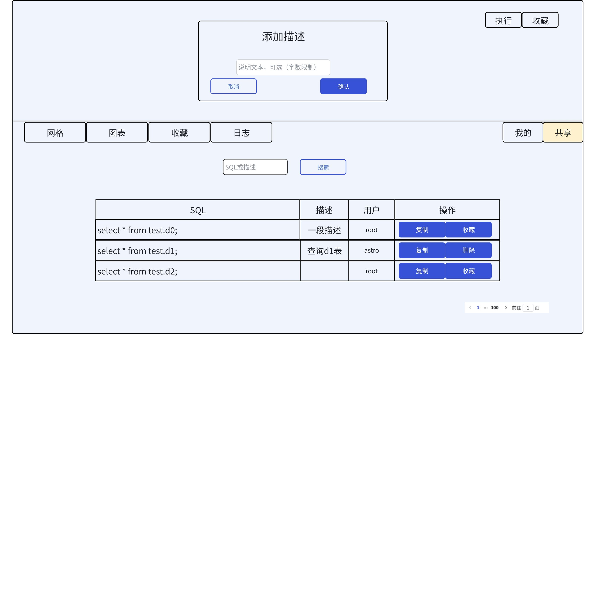

# 收藏查询语句持久化存储

JIRA：
TD-29959

## 1. 背景

当前查询语句收藏功能使用浏览器的 LocalStorage 进行保存，在用户清理浏览器数据后会丢失，因此考虑为收藏功能增加持久化能力，数据保存在服务端，且用户间数据相互隔离。

## 2. 变更历史

| 日期 | 版本 | 负责人 | 主要修改内容 |
| --- | --- | --- | --- |
| 2024/07/08 | 0.1 | @闫宇星 | 初稿 |
| 2024/07/09 | 0.2 | @闫宇星 | 对收藏行为进行重新设计 |
| 2024/07/10 | 0.3 | @闫宇星 | 部分交互修改 |
| 2024/07/11 | 0.4 | @闫宇星 | 根据线下review建议进行修改 |
| 2024/07/12 | 0.5 | @闫宇星 | 接口定义修改 |

## 3. 定义

无。

## 4. 行为说明

### 4.1 页面行为

#### 4.1.1 窗口收藏按钮

##### 4.1.1.1 收藏用户选择的语句

1. 用户在页面选中一段 SQL，点击收藏按钮，直接收藏为一条记录，收藏时可以输入一段文本作为对该 SQL 的说明或标签
2. **如果窗口内没有选中的****语句****，收藏按钮置灰无法点击**

##### 4.1.1.2 页面提示及其他行为

1. 点击收藏按钮进行收藏的 SQL 语句只收藏到用户个人空间下
2. SQL 不可以只包含空白字符，如空格，换行符等，否则提示 "SQL 不可为空"
3. 如果当前用户已经收藏过此 SQL，页面弹出提示 “当前 SQL 已收藏”，判重只依据 SQL
4. 如果是新添加的 SQL 且收藏成功，页面提示 “收藏成功”
5. 当前页面，用户调整上下窗口大小后，点击回车按钮窗口会复位，需修复

#### 4.1.2 收藏记录展示

##### 4.1.2.1 搜索栏

1. 设置 "我的/共享" 切换按钮或页签，用户切换个人收藏和共享收藏页面
2. 添加 “SQL” 筛选框，用于按照 SQL 和 “描述”字段的内容 进行模糊搜索

##### 4.1.2.2 记录展示

1. 每条记录等高展示，一行展示不下的部分展示 "..."，鼠标悬停展示全部内容
   - 对于 SQL 中包含换行符的内容，按照一行展示，显式展示换行符，鼠标悬停时按照换行的样式展示
```plaintext
// 记录行内显示样式
select * \nfrom test.meters;

// 鼠标悬停显示样式
select *
from test.meters;
```

1. 切换为个人收藏后，每行记录右侧显示三个按钮，“复制”，“共享/取消共享”，“删除”
   - 点击“共享”按钮，按钮切换为“取消共享”，同时 SQL 添加到共享空间下
   - 点击“取消共享”，按钮变回“共享”，SQL 从 共享空间下删除
   - 点击删除按钮，SQL 从个人空间删除，如果此 SQL 已被共享，也同步删除
2. 切换为共享收藏，每行记录右侧显示两个按钮
   - 当前用户共享的记录，展示“复制”，“删除”；其他用户共享的记录，展示“复制”，“收藏”
   - 点击收藏按钮，将别人共享的 SQL 添加到自己的空间下
   - 点击删除按钮，SQL 从共享空间和个人空间删除，删除不需要确认操作
3. 鼠标悬停在记录上时记录高亮，小框展示整个记录的内容，且点击时自动添加到窗口中
4. SQL 记录按照添加时间倒序排列，新添加的SQL在最上面
5. 个人/共享空间的所有 SQL 均不可重复，如果用户收藏 SQL 时，个人空间下已存在此 SQL，则提示 “当前 SQL 已收藏”；如果用户将自己的SQL共享到共享空间，但共享空间已存在此 SQL，则提示 “该SQL已由其它用户共享”，即个人空间下的 SQL 不可重复，共享空间下的 SQL 不可重复; 在进行收藏或共享时判断是否已经存在只依据 SQL 不考虑其标签或说明
6. 分页大小暂定为 10, 20, 50, 100，可由用户自己选择，默认每页展示 20 条
7. 点击收藏按钮后，弹出“添加描述”对话框，允许用户针对选中的SQL添加描述
8. 展示包括完整的 SQL 说明字段，此说明字段用户可点击修改，点击操作中编辑图标，弹出一个修改描述的框，原始描述会先回显，编辑内容后，点击确认。

#### 4.1.3 效果图

个人收藏页面


共享收藏页面


### 4.2 配置

explorer.toml 添加一个配置项，指定数据文件存储目录

| 配置项名称 | Linux/macos 默认值 | Windows 默认值 |
| --- | --- | --- |
| data_dir | /var/lib/taos/explorer | C:\\TDengine\\data\\explorer |

## 5. 性能

由保存到浏览器 LocalStorage 的形式变成发送到服务端并进行持久化，链路增加，性能会有损耗，但不会影响用户体验。

## 6. 兼容性

无

## 7. 运维

1. explorer.toml 新增配置项
2. 数据文件目录维护

## 8. 使用场景

taos-explorer 数据浏览器中的收藏 SQL 功能。

## 9. 约束和限制

无

## 10. 常见错误和排查

无

## 11. 可观测性

无

## 12. 安装和卸载

rmtaos 卸载时需要连带删除数据目录
1. 如果用户使用默认值，则删除 taos 数据目录时会连带删除, 
2. explorer 会提供卸载脚本供 rmtaos 调用，该脚本会清除数据（无论是默认路径还是自定义路径）
3. 如果用户使用 -C/--config-file 指定配置文件启动，则只需要删除默认数据目录=

## 13. 文档

1. 需要修改企业版文档，位置 TDinternal 仓库 3.0 分支， 中文版：docs/zh/30-enterprise/13-explorer.md，英文版：docs/en/30-enterprise/13-explorer.md
2. 官网文档上不需要修改

## 14. 参考文档

无

## 15. 附录

### 15.1 新增接口

#### 15.1.1 用户信息

从 HEADER 获取 username。

#### 15.1.2 接口设计

没有接口用于直接更新，如果要更新收藏的 SQL，目前的设计是删除旧的重新收藏新的。

| Method | Path | params | Ok result (HTTP Code: 200) | 功能说明 |
| --- | --- | --- | --- | --- |
| POST | `/api/``-/``favorites/sql` | ```json { "sql": "select 1;", "description": "xxx" // SQL 描述字段，可为空或不传 } ``` | ```json { "code": 0, "data": null } ``` | 新增收藏的SQL语句 |
| GET | `/api/``-/``favorites/sql` | `/api/-/favorites/sql?page=1&page_size=20&sql_desc_fuzzy=select&is_public=true` 1. page: 第几页，必传 1. page_size: 分页大小，必传 1. sql_desc_fuzzy: sql 和描述的模糊搜索，不传或传空表示全部 1. is_public: 是否查找共享收藏，不传表示个人所有收藏，false表示个人非共享收藏 | 数据为空 ```json { "code": 0, "data": null } ``` 数据非空 ```json { "code": 0, "data": { "page": 1, "page_size": 20, "total": 100, "total_page": 5, "list": [ { "id": 1, "username": "root", "sql": "select 1;", "description": "xxx", "created_at": 1720506719, "is_public": true } ] } } ``` | 获取收藏的SQL语句列表 |
| PATCH | `/api/``-/``favorites/sql/{id}` | ```json { "public": true, // true 表示将 SQL 设置为共享收藏，false 表示取消共享，此字段不传表示不对收藏状态进行修改 "description": "xxx" // 修改描述字段，此字段不传表示不对描述字段进行修改，为空或只包含空白字符串则会将描述字段置空 } ``` | ```json { "code": 0, "data": null } ``` | 将SQL语句设置为共享/非共享 |
| DELETE | `/api/favorites/sql/{id}` |  | ```json { "code": 0, "data": null } ``` | 删除收藏的SQL语句 |

错误响应
1. 业务错误，如用户输入错误等
- 前端在页面弹出提示
- HTTP Code = 200，code != 0
```json
{
    "code": xxx,
    "msg": "xxx"
}
```

1. 服务内部报错
- HTTP Code=500, message="can not open file explorer.db: ..."
1. 服务不可达等报错，由前端根据情况进行弹出提示

#### 15.1.3 错误码

1. 收藏 SQL 语句不可为空 101
2. 重复添加 SQL 102
3. 描述字符长度超过20字符 103
4. Page 页数为零 104

### 15.2 持久化

服务端持久化到数据库文件，展示时按用户登录时使用的名称进行筛选，根据sql共享状态字段来筛选进行个人页面和共享页面的展示
1. 使用 sqlite 进行数据存储，表名 sql_favorites
2. 持久化字段

| 字段名称 | 字段类型 | 字段说明 |
| --- | --- | --- |
| id | integer | 数据库自增id，用于前端标识记录 |
| comment | varchar(40) | 对该 SQL 的说明或标签，至多40个字节 |
| username | text | 数据库用户名称 |
| sql | text | 收藏的sql |
| created_at | datetime | 创建时间 |
| is_public | boolean | 是否为共享收藏 |
