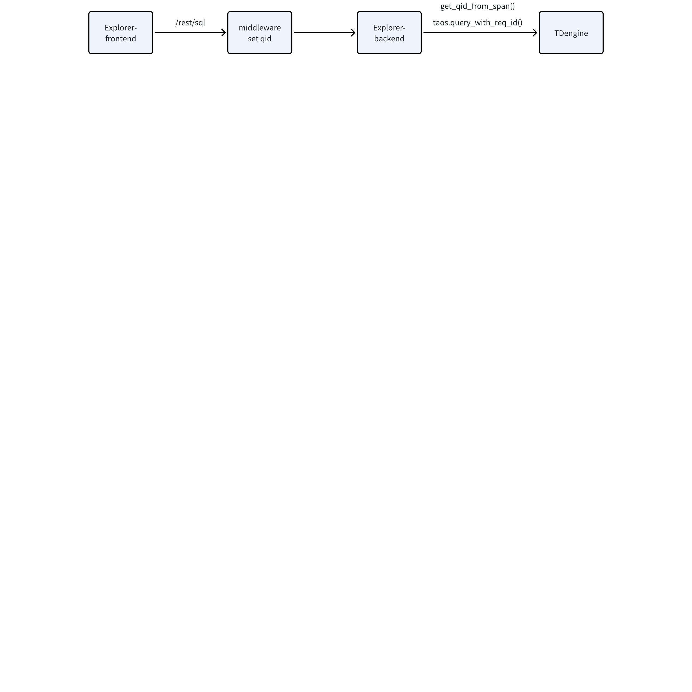
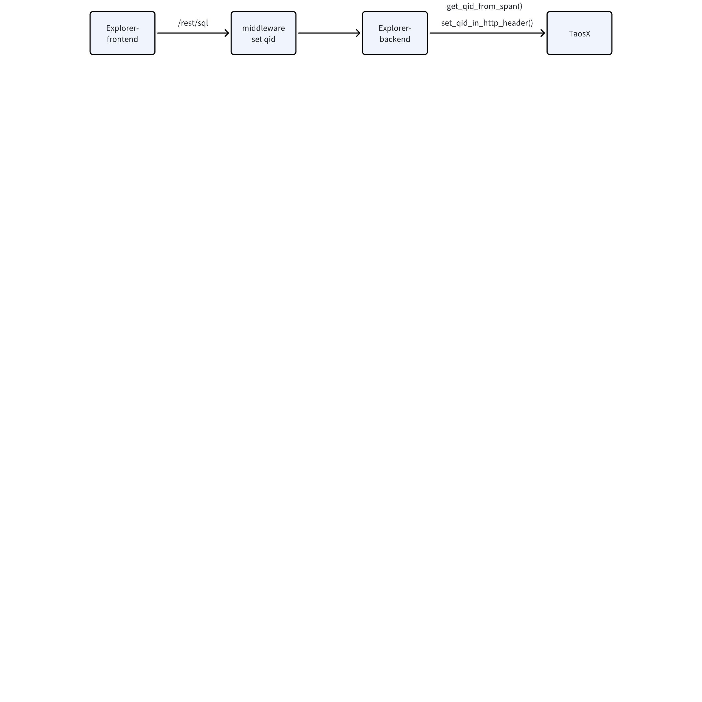
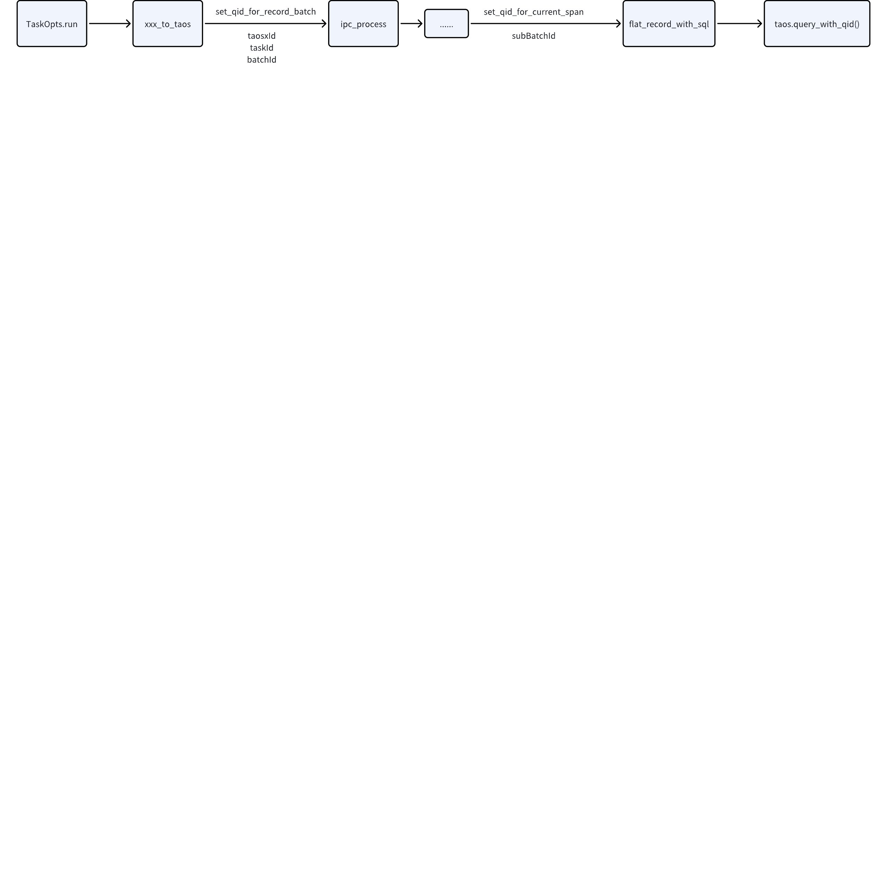
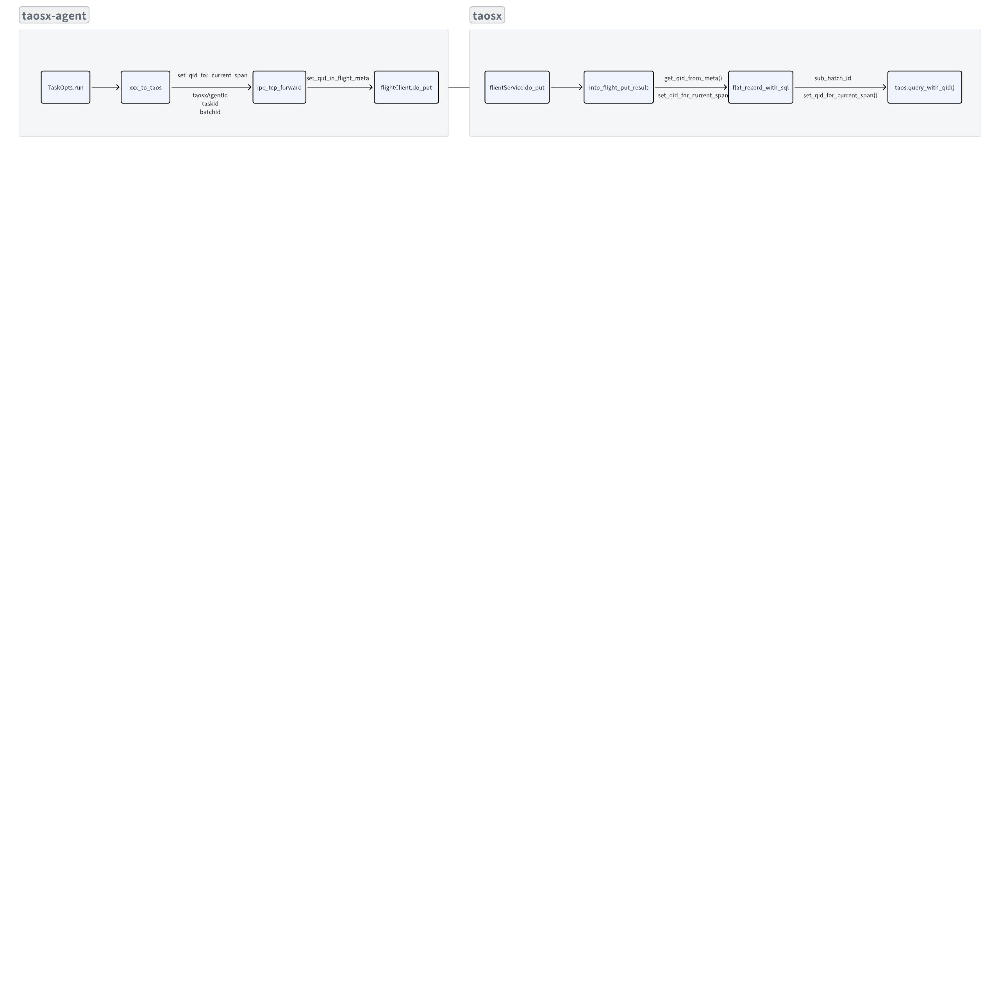

# Rust 日志组件实现方案

## 1. QID 的流转

### 1.1 Explorer -> TD

1. Explorer 前端发送 sql 请求到 Explorer 后端
2. Explorer 后端的 actix-web 中间件自动设置 QID 到 RootSpan 中
3. Explorer 后端代码里，在调用 taos 连接器时，将 span 中的 QID 取出
4. 在执行放入到 taos.query_with_req_id() 参数中，如果存在多个 SQL 调用，需要更新最后一个字节 id，为每个调用生成一个新的 QID


### 1.2 Explorer -> Taosx

1. Explorer 前端发送 sql 请求到 Explorer 后端
2. Explorer 后端的 actix-web 中间件自动设置 QID 到 RootSpan 中
3. 转发到 taosx 前，将 QID 设置到 HTTP header 中


### 1.3 Taosx Task -> TD

1. 新生成一个 RecordBatch 后，QID 也生成一个新的，因为当前 RecordBatch 需要通过 IPC 传递给下一级处理流程，所以需要在此处把新的 QID 写入到 RecordBatch Schema 的 metadata 中
2. ipc_reader 收到 RecordBatch 后，从 metadata 取出 QID，设置到当前的 span 中
3. 在接下来的流程中，把新的 span 传递给下游，父 span 的  QID 会传递给新生成的子 span，只要确保 span 不断，QID 可以一直传递下去
4. 打印日志时，layer 层会自动取出当前 span 中的 QID 进行打印，无需人工参与


### 1.4 Taosx-agent Task -> taosx -> TD

1. 生成批次/子批次的时候，新生成一个 QID
2. 在 arrow flight 调用的部分，将 QID **手动设置**到 flight 的 metadata 中，传递给 taosx
3. Taosx 收到 flight 消息后，取出 QID，**手动更新**到当前的 span 中
4. Taosx 每次生成一个子批次时，生成一个新的 QID **手动更新**到 当前 span 中，并传递到 SQL 中发送给下游
5. 打印日志时，layer 层会自动取出当前 span 中的 QID 进行打印，无需人工参与


### 1.5 Taosx -> Taoskeeper

- 在 `push_taoskeeper` 方法中，生成 QID 并设置在 HEADER 中发送给 taosKeeper

## 2. 需要实现的组件

### 2.1 actix-web 中间件

- 用于在请求到来时初始化 QID 在 Span 中，从而可以在后续的处理过程中可以直接获取到
- 使用 一个 ID 生成器，每新来一个请求，ID 递增 1，按照日志规范拼接 explorer/taosx id 设置到 RootSpan 中
```rust
pub struct TaosRootSpanBuilder(Arc<AtomicU64>);

impl RootSpanBuilder for TaosRootSpanBuilder {
    fn on_request_start(request: &ServiceRequest) -> Span {
        let span = tracing::info_span!("http", TID = tracing::field::Empty);
        // todo!()
        span
    }

    fn on_request_end<B: MessageBody>(span: Span, outcome: &Result<ServiceResponse<B>, Error>) {
        // log response status
    }
}
```

### 2.2 tracing_subscriber layer

#### 2.2.1 `on_new_span` 方法

- 每次创建新的 span 时被调用，**如果父 span 中 QID 已存在，则直接继承到当前 span 中，否则生成一个新的**
- 用于不是从 actix-web api 开始的流程的 QID 初始化

#### 2.2.2 `on_event`方法

会在每次打印日志时被调用。因此在 `on_event` 方法中可以实现： 
- 日志 format，制定每条日志输出的样式
- 打印时，首先查找打印日志时手动设置的 QID field，如果不存在，则查找全局设置的 QID
- 获取一个用于输出日志的 Writer，把格式化好的日志输出到指定的 Writer 中
```rust
pub trait QidInitializer {
    fn new_qid(&self) -> u64;
}

pub struct TaosLayer<Q, S, W> {
    initializer: Q,
    make_writer: W,
    _inner: PhantomData<S>,
}

impl<S, W> layer::Layer<S> for TaosLayer<S, W>
where
    S: Subscriber + for<'a> LookupSpan<'a>,
    W: for<'writer> MakeWriter<'writer> + 'static,
{
    fn on_new_span(&self, attrs: &Attributes<'_>, id: &Id, ctx: Context<'_, S>) {
        // init and set QID
    }

    fn on_event(&self, event: &Event<'_>, ctx: Context<'_, S>) {
        // format and write log
    }
}
```

### 2.3 `MakeWriter` 

- 用于生成当前用于输出的 Writer
- 用于日志滚动相关逻辑，当日志滚动后需要写入新文件时，在这里返回一个新的文件句柄
- 实现参考 `tracing_appender`
```rust
pub trait MakeWriter<'a> {
    type Writer: Write;

    fn make_writer(&'a self) -> Self::Writer;
}
```

### 2.4 方便函数

```rust
enum MetadataType {
  Span,
  HttpHeader(HttpHeader),
  ArrowFlight(FlightData),
}

impl MetadataType {
    pub fn set_qid(&mut self) {}

    pub fn get_qid(&self) -> u64 {}
}
```

### 2.5 QID 数据结构

由于各个服务使用的 QID 结构不同，所以定义一个 trait 供日志组件使用
- `init` 方法用于初始化一个最初的 QID
- `get` 方法用于获取当前 span 中存储的 QID 的值
```rust
trait QidManager {
    fn init() -> Self;
    fn get(&self) -> u64;
}
```

### 2.6 实践

1. 在每次更新 QID 的时候，需要生成新的子 span，并把新的 QID 更新到新 span 中
2. 在需要进程间通信的时候，如 Http，arrowFlight 等，需要手动更新 QID 到元数据中，传递给对面的进程节点

### 2.7 代码组织形式

1. 以库的形式提供，开放上述实现的组件，taosx 和 explorer 依赖此日志组件库，以 git 的形式
```toml
[dependencies]
taoslog = { version = "1.10.3", git = "https://github.com/taosdata/taoslog.git", branch = "main" }
```

1. 每次日志库更新版本后，需要更新 taosx 和 explorer 的依赖
2. 根据晨会讨论，后期考虑合并 explorer 和 taosx
