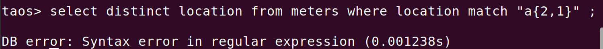
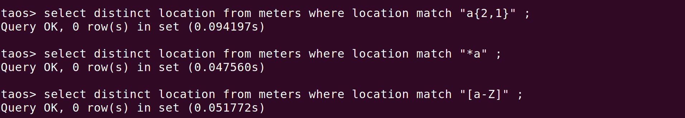

# TD-29679 正则表达式优化

## 1. 测试目标

该优化的改变主要包含两点：
1. 对于不符合正则表达式语法的语句将会报出错误：
```sql
DB error: Syntax error in regular expression
```

1. 增加了缓存效果，提高了查询的性能
因此在本次测试中也包含两点
- 确定在新版本下不符合正则表达式的语法会报出错误，而不是与上哥版本一样显示0rows匹配的结果
- 进行多次的并发测试查看性能提升了多少

## 2. 变更历史

| Date | Version | Owner | Memo |
| --- | --- | --- | --- |
| 2024/07/18 | 0.2 | @张志鹏 | 确定正则表达式的运行正常，去掉了相应的部分 |
| 2024/07/16 | 0.1 | @张志鹏 |  |

## 3. 测试结论

在新版本下，对于不符合正则表达式语法的情况，会报出错误，而不是返回`0 row(s)`的输出。
同时在新版本下会出现下面的错误：
```bash
07/17 17:01:16.186208 00139135 E UTL ERROR Failed to put regex pattern ^C.*a into cache, exception internal error.
07/17 17:01:16.186211 00139134 E UTL ERROR Failed to put regex pattern ^Ca.* into cache, exception internal error.
07/17 17:01:16.186254 00139133 E UTL ERROR Failed to put regex pattern ^California.S[a-z]+$ into cache, exception internal error.
```

在性能方面：
1. 在1w张子表，每个子表1w项时，新老版本性能基本一致
2. 在1000张子表，每个子表一千项时，老版本时间接近为新版本的50%
3. 在10张子表，每个子表一千项时，新版本性能提高15%左右

## 4. 测试环境

Ubuntu 22.04 版本， gcc版本13.2
测试的旧版本为: 581f21496f4509c8f075046de522e12ea0b9e119
新版本为：c10106a4da4f8833784554a6b57f8f6d11082ba7

## 5. 测试过程

1. 测试正则表达式语法，在新版本下下列语法会列出错误:
2. `*a`
3. `[a-Z]`
4. `a{2,1}` 
错误信息如下:


1. 在旧版本下测试上述语法:


1. 新旧版本的性能比较(单条正则表达式语句) 第一部分我们考虑每个语句中只有一个正则表达式。我们先使用`taosBenchmark`创建数据库，数据库大小为1万个字表每个字表一万条数据，使用的正则表达式数组在下方：
```bash
    regexslist = ["^California.LosAngles$","^California.SanJose$", "^California.Campbell$", "^California.SantaClara$",
                  "^California.SanFrancisco$", "^California.SanDiego$", "^California.Sacramento$", "^California.SanMateo$",
                  "^California.MountainView$", "^California.PaloAlto$", "^California.Sunnyvale$","^California.San(Jose|Diego|Francisco)$",
                  "^California.S[a-z]+$","^California.(M|P)[a-z]+$", "San[A-Z][a-z]+$", "S[a-z]+([A-Z][a-z]+)?$"] 

    query_strings = regexslist * 50
    reverse_string = regexslist[::-1] * 50
    
    ## select count(*) from meters where location match
```

我们使用两个进程来并发测试，一个顺序匹配，一个逆序匹配，在旧版本下运行的结果为:
```bash
Total execution time for all processes: 61.97 seconds
Process 1 execution time: 61.97 seconds
Process 2 execution time: 61.96 seconds
```

在新版本中运行的结果为:
```bash
Total execution time for all processes: 62.71 seconds
Process 1 execution time: 62.71 seconds
Process 2 execution time: 62.06 seconds
```

在误差范围内性能几乎没有变化。
1. 新旧性能比较(在一条查询语句中查询两次），其余条件与上面一致，查询语句类似于下面
```bash
select count(*) from meters where location match '{sql[0]}' and location match '{sql[1]}'
```

旧版本运行结果：
```bash
Total execution time for all processes: 107.15 seconds
Process 1 execution time: 107.14 seconds
Process 2 execution time: 106.58 seconds
```

新版本运行结果：
```bash
Total execution time for all processes: 106.18 seconds
Process 1 execution time: 105.74 seconds
Process 2 execution time: 106.18 seconds

```

总共时间约为100s，每个线程大约经过了4000次查询。
经过与开发讨论，在查询的表过大的时候，可能由于其他的部分所消耗的时间已经很大，因此在正则表达式上的优化很难体现出来。于是采用更小的表进行下一步的测试。
1. 新老性能比较，这时候我们考虑更少的表(1000个子表，每个字表1000项)，为了进一步探究差距，每个语句我们会进行四次匹配，每个进程进行4000次查询。
旧版本性能：
```bash
Total execution time for all processes: 21.33 seconds
Process 1 execution time: 21.33 seconds
Process 2 execution time: 21.29 seconds

## 6. 经过了多次运行 ，均为20s附近

```

新版本性能：
```bash
Total execution time for all processes: 36.89 seconds
Process 1 execution time: 36.88 seconds
Process 2 execution time: 36.88 seconds
```

1. 新老性能比较，对于更少的表，10个子表，每个子表1000项,同样每个语句进行四次匹配，每个进程将会查询20000次
旧版本性能
```bash
Total execution time for all processes: 30.77 seconds
Process 1 execution time: 30.74 seconds
Process 2 execution time: 30.77 seconds

```

新版本性能
```bash
Total execution time for all processes: 26.24 seconds
Process 1 execution time: 26.24 seconds
Process 2 execution time: 26.24 seconds

```

新版本性能略有提升
