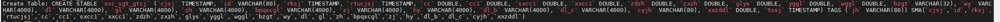

# TD-30453 tmq异常测试报告

### 1. 测试结论

测试通过


### 2. 测试目标

基于[TD-30453](https://jira.taosdata.com:18080/browse/TD-30453)，验证tmq相关功能在异常场景的可用性。

### 3. 测试环境

192.168.0.21
CPU（4）：Intel(R) Xeon(R) CPU E5-2620 v3 @ 2.40GHz
MEMORY：8G
版本：
TDengine Enterprise Edition
taosd version: 3.3.2.8.0905 compatible_version: 3.0.0.0
git: 46a58a0eb8e20e3fcd8453da292c8be886f8fef9（commit为3.0分支）
gitOfInternal: 8bfa57b2f49d13e7a439ab60c753e3aef127af44
build: Linux-x64 2024-09-05 17:15:35 +0800

### 4. 测试场景

使用脚本起10个进程不间断做运维操作，期间有taosbenchmark测试数据写入，做异常操作，观察taosd是否可以恢复，事务是否可以恢复

| 编号 | 运维操作 | 异常操作 | 结果 |
| --- | --- | --- | --- |
| 1 | drop table | 正常删除，无异常 |
| 2 | drop db | 无法删除，正常报 Topic must be dropped first |
| 3 | Restart taosd | 正常restart，事务不受影响 |
| 4 | Kill -9 taosd | 事务可以正常恢复 |
| 5 | drop table | 正常删除，无异常 |
| 7 | Restart taosd | 无异常，正常恢复 |
| 8 | Kill -9 taosd | 无异常，正常恢复 |
| 9 | drop table | 正常删除，无异常 |
| 10 | Restart taosd | 事务redoAction会处理一段时间，而后恢复正常，脚本正常执行 |
| 11 | Kill -9 taosd | 事务redoAction会处理一段时间，而后恢复正常，脚本正常执行 |
| 12 | 以上三个运维操作一起进行 | Kill -9 taosd | 启动后可以恢复正常，无core。概率性会有transaction fail几次，但是最后都可以恢复 taos> show transactions\G; *************************** 1.row *************************** id: 86687 create_time: 2024-09-10 15:53:02.897 stage: redoAction oper: tmq-reb db: test stable: test_topic failed_times: 3 last_exec_time: 2024-09-10 15:54:44.611 last_action_info: action:2 code:0x111(Action in progress) msgType:vnode-tmq-subscribe numOfEps:1 inUse:0 ep:0-u0-21:6030 Query OK, 1 row(s) in set (0.002968s) |

### 5. ~~CI相关历史case~~

~~,,y,system-test,./pytest.sh python3 ./test.py -f 7-tmq/tmqDnodeRestart.py~~
~~,,y,system-test,./pytest.sh python3 ./test.py -f 7-tmq/tmqDnodeRestart1.py~~
~~验证了消费数据时重启denode，是否能正常消费~~

~~,,y,system-test,./pytest.sh python3 ./test.py -f 7-tmq/tmqSubscribeStb-r3.py -N 5~~
~~集群多denode场景~~

~~,,y,system-test,./pytest.sh python3 ./test.py -f 7-tmq/tmq3mnodeSwitch.py -N 6 -M 3 -i True~~
~~验证切换mnode后消费是否正常~~

### 6. 相关测试脚本

#### 6.1 drop topic脚本

```python
import taos
import requests
import time
import multiprocessing


def get_db_connection():
    return taos.connect(
        host='192.168.0.21',
        port=6030,
        user='root',
        password='taosdata',
        database='test'
    )


conn = get_db_connection()


def create_topic(topic_name):
    sql = 'CREATE TOPIC `%s` AS SELECT * FROM `test`.`meters`' % topic_name
    cursor = conn.cursor()
    return cursor.execute(sql)


def delete_topic(topic_name):
    sql = 'drop TOPIC `%s`' % topic_name
    cursor = conn.cursor()
    return cursor.execute(sql)


def press(name):
    while 1:
        try:
            create_topic(name)
            print("create topic %s" % name)
        except Exception as e:
            print("topic %s error: %s" % (name, e))
        time.sleep(0.1)
        try:
            delete_topic(name)
            print("delete topic %s" % name)
        except Exception as e:
            print("topic %s error: %s" % (name, e))
        time.sleep(0.1)


if __name__ == '__main__':
    topics = ["topic_%s" % i for i in range(10)]
    with multiprocessing.Pool(processes=10) as pool:
        results = pool.map(press, topics)
```

#### 6.2 Start/close consumer脚本

```python
import taos
import requests
import time
import multiprocessing
from taosws import Consumer


def get_db_connection():
    return taos.connect(
        host='192.168.0.21',
        port=6030,
        user='root',
        password='taosdata',
        database='test'
    )


conn = get_db_connection()


def create_consumer(client):
    while 1:
        try:
            conf = {
                # auth options
                "td.connect.websocket.scheme": "ws",
                "td.connect.ip": "192.168.0.21:6041",
                "td.connect.user": "root",
                "td.connect.pass": "taosdata",
                # consume options
                "group.id": "test_group_py",
                "client.id": client,
            }
            consumer = Consumer(conf)
            consumer.subscribe(["test_topic"])
            print("%s ready" % client)
            time.sleep(0.5)
            consumer.close()
            print("%s closed" % client)
        except Exception as e:
            print("%s error: %s" % (client, e))


if __name__ == '__main__':
    consumers = ["test_consumer_ws_py_%s" % i for i in range(10)]
    with multiprocessing.Pool(processes=10) as pool:
        results = pool.map(create_consumer, consumers)
```

#### 6.3 drop consumer group脚本

```python
import taos
import requests
import time
import multiprocessing
from taosws import Consumer


def get_db_connection():
    return taos.connect(
        host='192.168.0.21',
        port=6030,
        user='root',
        password='taosdata',
        database='test'
    )


conn = get_db_connection()


def drop_consumer_group(group):
    sql = 'DROP CONSUMER GROUP %s on test_topic;' % group
    cursor = conn.cursor()
    return cursor.execute(sql)


def create_consumer_group(i):
    group = "test_group_py_%s" % i
    while 1:
        try:
            conf = {
                # auth options
                "td.connect.websocket.scheme": "ws",
                "td.connect.ip": "192.168.0.21:6041",
                "td.connect.user": "root",
                "td.connect.pass": "taosdata",
                # consume options
                "group.id": group,
                "client.id": "test_consumer_ws_py",
            }
            consumer = Consumer(conf)
            consumer.subscribe(["test_topic"])
            print("%s ready" % group)
            consumer.close()
            print("%s closed" % group)
            time.sleep(2)
            drop_consumer_group(group)
            print("delete %s successfully" % group)
        except Exception as e:
            print("%s error: %s" % (group, e))


if __name__ == '__main__':
    groups = [i for i in range(10)]
    with multiprocessing.Pool(processes=10) as pool:
        results = pool.map(create_consumer_group, groups)
```

### 7. 发现问题

无
