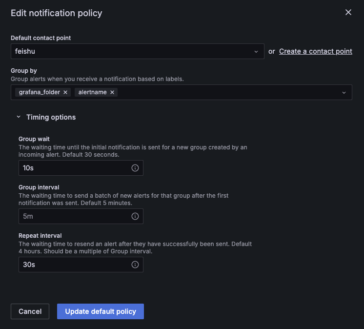
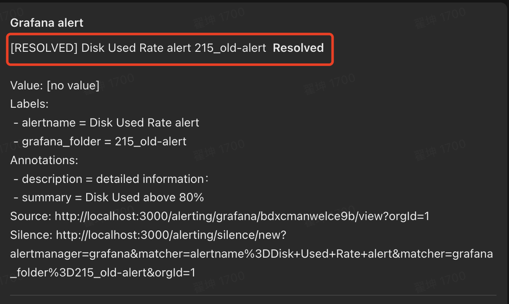
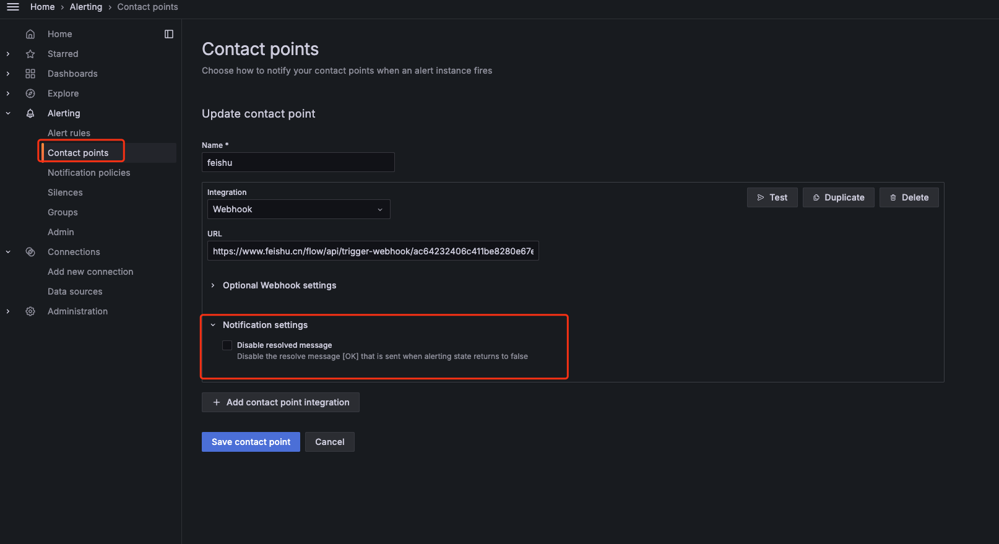

# TDinsight告警配置功能(grafana11) Test Spec

## 1. 测试目标

保证TDinsight插件新增的告警配置功能在grafana11版本均正常工作

## 2. 变更历史

| Date | Version | Owner | Memo |
| --- | --- | --- | --- |
| 2024.9.5 | 0.1 | 翟坤 | 创建初稿 |
| 2024.9.11 | 1.0 | 翟坤 | 更新测试结果 |

## 3. 测试结论

| 测试类型 | 测试结论 | 备注信息 |
| --- | --- | --- |
| 功能测试 | 测试通过 | 基本功能测试通过，已知问题和限制，参见第5小节 |
| 兼容测试 | 测试通过 | 仅支持3.1.2.0以及更新的版本 |

## 4. 开发质量报告

结论：良

| 统计指标 | 数量 |
| --- | --- |
| 提测被拒次数 （测试阻塞，无法进行） | 0 |
| 基础测试用例不通过 | 0 |
| Bug 总数 | 4 |
| 严重 Bug 总数 | 0 |

## 5. 已知问题和限制

1. 告警信息发送配置不属于插件控制，需要用户自行配置。此处配置会影响告警发送频率和规则，交付需要部署时需要根据客户情况进行配置。

1. 由于grafana 11的告警上报和发送周期分别配置，可能会出现在两次上报更新中间，会出现持续发送告警的情况，比如上报周期是5分钟，而告警发送周期为1分钟，在上一次上报发生后的5分钟内即使监控数据恢复到告警阈值以下，当每分钟的告警周期被触发时，告警队列中对应的告警状态仍为true，则会继续发送告警消息，直到下次告警上报更新告警状态为false，告警消息才会停止发送
2. Grafana 11的告警机制新增resolved告警消息，当评估数据不符合告警机制后，会发送一次告警结束的消息，这是grafana 7.5没有的

可通过配置Contact points关闭该类告警消息

1. 当dnode节点因异常挂掉后，如果监控数据正好存储在这个节点，将会导致监控数据库查询不可用，此时会触发告警规则：若查询不到监控数据就告警的机制
2. 数据源被删除后，由于grafana不会通知插件，因此告警不会自动清除，需要用户手工清理，在加载alert rules后，删除datasource前要确保删除了对应的alert rules，否则会有残留的alert rules
3. 由于最新监控功能代码合入到3.1.2.0版本，在此之前的3.1.1.x版本因log库的定义不同，告警功能无法兼容

## 6. 测试资源及环境

### 6.1 功能测试

| 测试环境 | 部署服务 | 系统 |
| --- | --- | --- |
| 192.168.0.43 192.168.0.58 192.168.0.61 | Taosd服务 |
| 192.168.0.215 | Grafana 11.0.0、Taosd服务 |

### 6.2 性能测试

无

## 7. 测试范围及重点

- TDinsight插件上的告警控件定义正确
- 基于告警规则可以正确发送告警信息
- taoskeeper使用单节点部署模式

## 8. 测试用例

### 8.1 功能测试

| 类型 | 测试目的 | 测试步骤 | 预期结果 | 是否为基础用例 | 测试结果 | 备注 |
| --- | --- | --- | --- | --- | --- | --- |
| Dnode 节点的CPU负载 | CPU负载 > 80%，触发告警 | ./blade create cpu load --cpu-percent 81 | 触发告警 | Y | Pass |  |
|  | CPU负载 < 80%，不会触发告警 | ./blade create cpu load --cpu-percent 79 | 不会触发告警 | Y | Pass |  |
|  | CPU负载 = 80%，不会触发告警 | ./blade create cpu load --cpu-percent 80 | 不会触发告警 | N | Pass | 较难稳定维持CPU负载为80%，该项测试目标无法精确验证，但可验证在80%-81%之间可触发告警 |
|  | 扫描间隔：5分钟 | 查看alert rules的Evaluation group定义 | Evaluation group值为alert_5m | N | Pass |  |
|  | 持续时间：5分钟 | 查看alert rules的Pending period定义 | Pending period值为5m | N | Pass |  |
|  | 查询无对应数据，触发告警 | 停止taoskeeper，停止数据上报 | 发送告警 | N | Pass |  |
| Dnode 节点的的内存 | 内存 > 60%，触发告警 | 通过percentile内存泄漏的问题，控制内存上涨,[https://jira.taosdata.com:18080/browse/TD-31080](https://jira.taosdata.com:18080/browse/TD-31080)
1.生成数据
2.重复执行jira中的sql | 触发告警 | Y | Pass |  |
|  | 内存 <= 60%，不会触发告警 | 通过percentile内存泄漏的问题，控制内存上涨,[https://jira.taosdata.com:18080/browse/TD-31080](https://jira.taosdata.com:18080/browse/TD-31080)
1.生成数据
2.重复执行jira中的sql | 不会触发告警 | Y | Pass | 较难稳定维持内存使用率为60%，60%的测试点无法精确验证 |
|  | 扫描间隔：5分钟 | 查看alert rules的Evaluation group定义 | Evaluation group值为alert_5m | N | Pass |  |
|  | 持续时间：5分钟 | 查看alert rules的Pending period定义 | Pending period值为5m | N | Pass |  |
|  | 查询无对应数据，触发告警 | 停止taoskeeper，停止数据上报 | 触发告警 | N | Pass |  |
| Dnode 节点的磁盘容量占用 | 磁盘占用 > 80%，触发告警 | ./blade create disk fill –path / --percent 81 | 触发告警 | Y | Pass |  |
|  | 磁盘占用 < 80%，不会触发告警 | ./blade create disk fill –path / --percent 79 | 不会触发告警 | Y | Pass | 较难稳定维持磁盘使用率为80%，80%的测试点无法精确验证，但验证了80%-81%之间会触发告警 |
|  | 扫描间隔：5分钟 | 查看alert rules的Evaluation group定义 | Evaluation group值为alert_5m | N | Pass |  |
|  | 持续时间：5分钟 | 查看alert rules的Pending period定义 | Pending period值为5m | N | Pass |  |
|  | 查询无对应数据，触发告警 | 停止taoskeeper，停止数据上报 | 触发告警 | N | Pass |  |
| 集群授权到期 | 集群授权到期< 60天，触发告警 | 集群授权到期< 60天 | 触发告警 | Y | Pass |  |
|  | 集群授权到期> 60天，不触发告警 | 集群授权到期> 60天 | 不会触发告警 | Y | Pass |  |
|  | 集群授权到期= 60天，不触发告警 | 集群授权到期= 60天 | 不会触发告警 | N | Pass |  |
|  | 扫描间隔：1天 | 查看alert rules的Evaluation group定义 | Evaluation group值为alert_24h | N | Pass |  |
|  | 持续时间为0 | 查看alert rules的Pending period定义 | Pending period值为0 | N | Pass |  |
|  | 查询无对应数据，触发告警 | 停止taoskeeper，停止数据上报，发送告警 | 每隔24小时发送告警 | N | Pass |  |
| 测点数达到授权测点数 | 测点数>=90%，触发告警 | 测点数>=90% | 触发告警 | Y | Pass |  |
|  | 测点数<90%，不触发告警 | 测点数<90% | 不会触发告警 | Y | Pass |  |
|  | 扫描间隔：1天 | 查看alert rules的Evaluation group定义 | Evaluation group值为alert_24h | N | Pass |  |
|  | 持续时间为0 | 查看alert rules的Pending period定义 | Pending period值为0 | N | Pass |  |
|  | 查询无对应数据，触发告警 | 停止taoskeeper，停止数据上报，发送告警 | 每隔24小时发送告警 | N | Pass |  |
| 查询并发请求数 | 查询并发请求数>100，触发告警 | 通过taosBenchmark在150并发查询毫秒级查询 | 触发告警 | Y | Pass |  |
|  | 查询并发请求数<=100，不触发告警 | 通过taosBenchmark在1分钟分别执行查询99和100次 | 不会触发告警 | N | Pass |  |
|  | 扫描间隔：1分钟 | 查看alert rules的Evaluation group定义 | Evaluation group值为alert_1m | N | Pass |  |
|  | 持续时间为0 | 查看alert rules的Pending period定义 | Pending period值为0 | N | Pass |  |
|  | 查询无对应数据，不触发告警 | 停止taoskeeper，停止数据上报，不会发送告警 | 不会触发告警 | N | Pass |  |
| 慢查询执行最长时间 | sql执行时间>300秒，触发告警 | 通过UDF执行一条执行时间为310秒的sql | 当超过300s后，触发告警 | Y | Pass |  |
|  | sql执行时间<300秒，不触发告警 | 通过UDF执行一条执行时间为298秒的sql | sql执行到结束，不会触发告警 | Y | Pass |  |
|  | 扫描间隔：1分钟 | 每隔1分钟做一次告警扫描 | 每隔1分钟发送一次告警 | N | Pass |  |
|  | 持续时间为0 | 达到告警阈值后 | 立刻发送告警 | N | Pass |  |
|  | 查询无对应数据，不触发告警 | 停止taoskeeper，停止数据上报，不会发送告警 | 不会触发告警 | N | Pass |  |
| Dnode下线 | Dnode下线:total != alive，触发告警 | Dnode下线 | 触发告警 | Y | Pass |  |
|  | Dnode重新上线:total = alive，不触发告警 | Dnode重新上线后超过30s | 告警停止 | Y | Pass |  |
|  | 扫描间隔：30秒 | 查看alert rules的Evaluation group定义 | Evaluation group值为alert_30s | N | Pass |  |
|  | 持续时间为0 | 查看alert rules的Pending period定义 | Pending period值为0 | N | Pass |  |
|  | 查询无对应数据，触发告警 | 停止taoskeeper，停止数据上报，发送告警 | 触发告警 | N | Pass |  |
| Vnode下线 | Vnode下线:total != alive，触发告警 | Vnode下线，超过30s | 触发告警 | Y | Pass |  |
|  | Vnode重新上线:total = alive，不触发告警 | Vnode重新上线后超过30s | 告警停止 | Y | Pass |  |
|  | 扫描间隔：30秒 | 查看alert rules的Evaluation group定义 | Evaluation group值为alert_30s | N | Pass |  |
|  | 持续时间为0 | 查看alert rules的Pending period定义 | Pending period值为0 | N | Pass |  |
|  | 查询无对应数据，触发告警 | 停止taoskeeper，停止数据上报，发送告警 | 触发告警 | N | Pass |  |
| 数据删除请求数 | 数据删除请求数>0，触发告警 | 数据删除请求数>0 | 触发告警 | Y | Pass |  |
|  | 数据删除请求数=0，不触发告警 | 数据删除请求数=0 | 不会触发告警 | Y | Pass |  |
|  | 扫描间隔：30秒 | 查看alert rules的Evaluation group定义 | Evaluation group值为alert_30s | N | Pass |  |
|  | 持续时间为0 | 查看alert rules的Pending period定义 | Pending period值为0 | N | Pass |  |
|  | 查询无对应数据，触发告警 | 停止taoskeeper，停止数据上报，发送告警 | 不会触发告警 | N | Pass |  |
| Adapter RESTful 请求失败 | 请求失败数>5，触发告警 | 通过发送错误的sql，实现请求失败数>5 | 触发告警 | Y | Pass |  |
|  | 请求失败数<=5，不触发告警 | 通过发送错误的sql，实现请求失败数<=5 | 不会触发告警 | Y | Pass |  |
|  | 扫描间隔：30秒 | 查看alert rules的Evaluation group定义 | Evaluation group值为alert_30s | N | Pass |  |
|  | 持续时间为0 | 查看alert rules的Pending period定义 | Pending period值为0 | N | Pass |  |
|  | 查询无对应数据，不触发告警 | 停止taoskeeper，停止数据上报 | 不会触发告警 | N | Pass |  |
| Adapter WebSocket 请求失败 | 请求失败数>5，触发告警 | 通过发送错误的sql，实现请求失败数>5 | 触发告警 | Y | Pass |  |
|  | 请求失败数<=5，不触发告警 | 通过发送错误的sql，实现请求失败数<=5 | 不会触发告警 | Y | Pass |  |
|  | 扫描间隔：30秒 | 查看alert rules的Evaluation group定义 | Evaluation group值为alert_30s | N | Pass |  |
|  | 持续时间为0 | 查看alert rules的Pending period定义 | Pending period值为0 | N | Pass |  |
|  | 查询无对应数据，不触发告警 | 停止taoskeeper，停止数据上报 | 不会触发告警 | N | Pass |  |
| Dnode 数据上报缺少 | Dnode 数据上报缺少数<3，触发报警 | Dnode 数据上报缺少数<3 | 触发告警 | Y | Pass | 在预警时间内，手动去log库删除上报数据，模拟数据<3条的场景 |
|  | Dnode 数据上报缺少数>=3，不会触发报警 | 启动3节点集群，节点正常 | 不会触发告警 | Y | Pass |  |
|  | 扫描间隔：180秒 | 查看alert rules的Evaluation group定义 | Evaluation group值为alert_180s | N | Pass |  |
|  | 持续时间为0 | 查看alert rules的Pending period定义 | Pending period值为0 | N | Pass |  |
|  | 查询无对应数据，触发告警 | 停止taoskeeper，停止数据上报 | 触发告警 | N | Pass |  |
| Dnode 重启 | 重启Dnode服务，触发报警 | 重启Dnode服务，等待90s | 触发告警 | Y | Pass |  |
|  | 停止Dnode服务，触发报警 | 停止Dnode服务，等待90s | 触发告警 | Y | Pass |  |
|  | 扫描间隔：90秒 | 查看alert rules的Evaluation group定义 | Evaluation group值为alert_90s | N | Pass |  |
|  | 持续时间为0 | 查看alert rules的Pending period定义 | Pending period值为5m | N | Pass |  |
|  | 查询无对应数据，触发告警 | 停止taoskeeper，停止数据上报 | 触发告警 | N | Pass |  |
| 告警加载功能 | Load TDengine Alert状态为true，加载告警插件 | Load TDengine Alert状态为true，点击“Test & Save” | alert rules加载成功 | Y | Pass |  |
|  | Load TDengine Alert状态为false，加载告警插件 | Load TDengine Alert状态为false，点击“Test & Save” | alert rules不会被加载 | Y | Pass |  |
|  | 告警rules已加载，删除告警rules | 告警rules已加载，删除告警rules | rules删除成功 | Y | Pass |  |
|  | 告警rules未加载，删除告警rules | 告警rules未加载，删除告警rules | 提示信息：Failed to delete alarm rules, reason: Request failed with status code 404 | N | Pass |  |
|  | 加载告警rules，删除datasource | 加载告警rules后删除datasource | datasource被删除，但alert rules不会被删除 | N | Pass |  |

### 8.2 兼容性测试

| Grafana | TDengine | 测试结果 | 测试范围 |
| --- | --- | --- | --- |
| 3.3.3.0 | 支持 | 全部测试用例 |
| 3.1.2.0 | 支持 | 1. 测试需要用对应3.1.2.0版本的taoskeeper，否则会出现taoskeeper和tdengine的兼容性问题，原因是taoskeeper新版本使用了复合主键，而复合主键是3.3.0.0版本后才合入到tdengine 1. 因为3.1.2.0版本的监控功能是刚从3.0分支迁移过去，本次兼容性测试仅抽检: 1. websocket错误次数 1. restfull错误次数 1. dnode状态 1. vnode状态 |
| 3.1.1.45 | 不支持 | 该版本及更早的版本不支持新监控功能，而告警功能很多功能是基于新监控开发，所以3.1.1.45及以前版本不支持告警功能 |
| 7.5 | 3.3.3.0 | 支持 | 通过Grafana 7.5加载最新的TDinsight插件，做基本的告警功能抽检，范围如下： 1. websocket错误次数 1. restfull错误次数 1. dnode状态 1. vnode状态 |

## 9. 相关文档

### 9.1 需求 & 设计文档

[Grafana 11 版本告警自动导入](https://taosdata.feishu.cn/wiki/XTtCw5Pmzinv2ckUQ3uchMTznpf)

### 9.2 JIRA链接

TS-4819

TD-30670

### 9.3 其他文档

[TD-26529:taosd monitor 数据重构和基本观测框架测试报告](https://taosdata.feishu.cn/wiki/Blwkwt53qiQO7wkXdK7c2DFzntd)
[TDengine 监测](https://taosdata.feishu.cn/wiki/B1W1wfUu8iSefQktLI3cRfeHntd)
[Grafana 配置告警](https://taosdata.feishu.cn/wiki/WzObwFf3li02srkdU9VcNw2gnMf)
[Grafana 7.5 版本告警自动导入](https://taosdata.feishu.cn/wiki/OBa2woeWAimXSrkeWJ3cFP5znmh)
