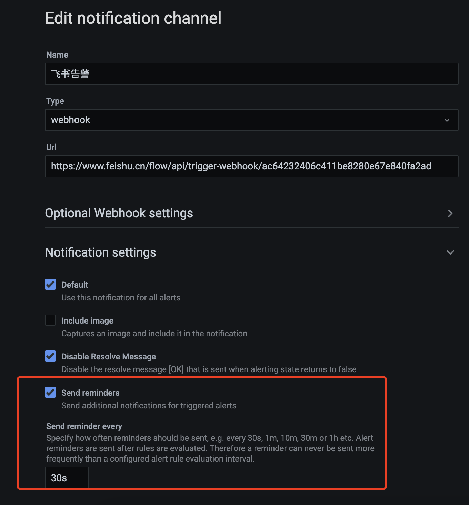

# TDinsight告警配置功能(grafana7.5) Test Spec

## 1. 测试目标

保证TDinsight插件新增的告警配置功能在grafana7.5版本均正常工作

## 2. 变更历史

| Date | Version | Owner | Memo |
| --- | --- | --- | --- |
| 2024.7.11 | 1.0.0 | 翟坤 | 创建初稿 |
| 2024.8.15 | 2.0.0 | 翟坤 | 更新测试结论 |

## 3. 测试结论

| 测试类型 | 测试结论 | 备注信息 |
| --- | --- | --- |
| 功能测试 | 测试通过 | 基本功能测试通过，已知问题和限制，参见第5小节 |
| 兼容测试 | 测试通过 | 仅支持3.1.2.0以及更新的版本 |

## 4. 开发质量报告

结论：一般

| 统计指标 | 数量 |
| --- | --- |
| 提测被拒次数 （测试阻塞，无法进行） | 2 |
| 基础测试用例不通过 | 4 |
| Bug 总数 | 10 |
| 严重 Bug 总数 | 4 |

## 5. 已知问题和限制

1. 
  TD-31129

1. 
  TD-31385

1. Grafana 7.5版本当告警阈值一直被触发时，持续发送告警的功能需要用户在配置告警channel时手动配置，否则默认配置下，在一直触发告警阈值的场景，仅会发送一次告警消息。另外配置的时间要小于告警时间周期

1. 告警模板中许多告警规则是基于监控interval=30s开发的，比如dnodes数据报上告警控件，默认是统计每180s内dnode上报的数据条数<3便触发告警，但若用户将监控上报周期interval的值修改为90s，180s内只会上报2条数据，便会触发告警（按照告警业务逻辑，此为误报）。所以告警功能在客户场景的维护工作需要对告警功能底层业务较熟的运维人员去维护
2. 受garafa自身运行逻辑和网络等因素影响，告警间隔会出现少许差异，比如配置为30s告警一次，但实际飞书收到并发出告警的间隔可能为20s-40s，但若连续告警时，告警间隔会逐渐趋于稳定，最后基本趋近于告警阈值

## 6. 测试资源及环境

### 6.1 功能测试

| 测试环境 | 部署服务 | 系统 |
| --- | --- | --- |
| 192.168.0.215 | Taosd服务 |
| 192.168.0.175 | Grafana 7.5、Taosd服务 |

### 6.2 性能测试

无

## 7. 测试范围及重点

- TDinsight插件上的告警控件定义正确
- 基于告警规则可以正确发送告警信息

## 8. 测试用例

### 8.1 功能测试

| 类型 | 测试目的 | 测试步骤 | 预期结果 | 是否为基础用例 | 测试结果 | 备注 |
| --- | --- | --- | --- | --- | --- | --- |
| Dnode 节点的CPU负载 | CPU负载 > 80%，触发告警 | ./blade create cpu load --cpu-percent 81 | 触发告警 | Y | Pass |  |
|  | CPU负载 < 80%，不会触发告警 | ./blade create cpu load --cpu-percent 79 | 不会触发告警 | Y | Pass |  |
|  | CPU负载 = 80%，不会触发告警 | ./blade create cpu load --cpu-percent 80 | 不会触发告警 | N | Pass | 较难稳定维持CPU负载为80%，该项测试目标无法精确验证，但可验证在80%-81%之间可触发告警 |
|  | 数据扫描间隔：5分钟 | 触发告警阈值后，保持告警状态9分钟 | 每隔5分钟发送一次告警 | N | Pass |  |
|  | 持续时间：4分钟 | 达到告警阈值后，保持告警状态4分钟 | 4分钟后再次触发告警阈值 | N | Pass |  |
|  | 查询无对应数据，触发告警 | 停止taoskeeper，停止数据上报 | 每5分钟发送告警 | N | Pass |  |
| Dnode 节点的的内存 | 内存 > 60%，触发告警 | 通过percentile内存泄漏的问题，控制内存上涨,[https://jira.taosdata.com:18080/browse/TD-31080](https://jira.taosdata.com:18080/browse/TD-31080)
1.生成数据
2.重复执行jira中的sql | 触发告警 | Y | Pass | 通过percentile内存泄漏的问题，控制内存上涨 |
|  | 内存 < 60%，不会触发告警 | 通过percentile内存泄漏的问题，控制内存上涨,[https://jira.taosdata.com:18080/browse/TD-31080](https://jira.taosdata.com:18080/browse/TD-31080)
1.生成数据
2.重复执行jira中的sql | 不会触发告警 | Y | Pass | 较难稳定维持内存使用率为80%，该项测试目标可能无法精确验证 |
|  | 数据扫描间隔：5分钟 | 触发告警阈值后，保持告警状态10分钟 | 每隔5分钟发送一次告警 | N | Pass |  |
|  | 持续时间：4分钟 | 达到告警阈值后，保持告警状态5分钟 | 4分钟后再次触发告警阈值 | N | Pass |  |
|  | 查询无对应数据，触发告警 | 停止taoskeeper，停止数据上报 | 每5分钟发送告警 | N | Pass |  |
| Dnode 节点的磁盘容量占用 | 磁盘占用 > 80%，触发告警 | ./blade create disk fill –path / --percent 81 | 触发告警 | Y | Pass |  |
|  | 磁盘占用 < 80%，不会触发告警 | ./blade create disk fill –path / --percent 79 | 不会触发告警 | Y | Pass |  |
|  | 磁盘占用 = 80%，不会触发告警 | ./blade create disk fill –path / --percent 80 | 不会触发告警 | N | Pass |  |
|  | 数据扫描间隔：5分钟 | 触发告警阈值后，保持告警状态10分钟 | 每隔5分钟发送一次告警 | N | Pass |  |
|  | 持续时间：4分钟 | 达到告警阈值后，保持告警状态5分钟 | 4分钟后再次触发告警阈值 | N | Pass |  |
|  | 查询无对应数据，触发告警 | 停止taoskeeper，停止数据上报 | 每5分钟发送告警 | N | Pass |  |
| 集群授权到期 | 集群授权到期< 60天，触发告警 | 集群授权到期< 60天 | 触发告警 | Y | Pass |  |
|  | 集群授权到期> 60天，不触发告警 | 集群授权到期> 60天 | 不会触发告警 | Y | Pass |  |
|  | 集群授权到期= 60天，不触发告警 | 集群授权到期= 60天 | 不会触发告警 | N | Pass |  |
|  | 数据扫描间隔：1天 | 每隔1天做一次告警扫描 | 每隔1天发送一次告警 | N | Pass |  |
|  | 持续时间为0 | 达到告警阈值后 | 立刻发送告警 | N | Pass |  |
|  | 查询无对应数据，触发告警 | 停止taoskeeper，停止数据上报，发送告警 | 每隔24小时发送告警 | N | Pass |  |
| 测点数达到授权测点数 | 测点数>90%，触发告警 | 测点数>90% | 触发告警 | Y | Pass |  |
|  | 测点数<90%，不触发告警 | 测点数<90% | 不会触发告警 | Y | Pass |  |
|  | 测点数=90%，触发告警 | 测点数=90% | 触发告警 | N | Pass |  |
|  | 数据扫描间隔：1天 | 每隔1天做一次告警扫描 | 每隔5分钟发送一次告警 | N | Pass |  |
|  | 持续时间为0 | 达到告警阈值后 | 立刻发送告警 | N | Pass |  |
|  | 查询无对应数据，触发告警 | 停止taoskeeper，停止数据上报，发送告警 | 每隔24小时发送告警 | N | Pass |  |
| 查询并发请求数 | 查询并发请求数>100，触发告警 | 通过taosBenchmark在1分钟执行查询105次 | 触发告警 | Y | Pass |  |
|  | 查询并发请求数=100，不触发告警 | 通过taosBenchmark在1分钟执行查询100次 | 不会触发告警 | N | Pass |  |
|  | 数据扫描间隔：1分钟 | 每隔1分钟做一次告警扫描 | 每隔1分钟发送一次告警 | N | Pass |  |
|  | 持续时间为0 | 达到告警阈值后 | 立刻发送告警 | N | Pass |  |
|  | 查询无对应数据，不触发告警 | 停止taoskeeper，停止数据上报，不会发送告警 | 不会触发告警 | N | Pass |  |
| 慢查询执行最长时间 | sql执行时间>300秒，触发告警 | 通过UDF执行一条执行时间为310秒的sql | 1.当超过300s后，触发告警
2.以后每隔1分钟，触发一次告警 | Y | Pass |  |
|  | sql执行时间<300秒，不触发告警 | 通过UDF执行一条执行时间为298秒的sql | sql执行到结束，不会触发告警 | Y | Pass |  |
|  | 数据扫描间隔：1分钟 | 每隔1分钟做一次告警扫描 | 每隔1分钟发送一次告警 | N | Pass |  |
|  | 持续时间为0 | 达到告警阈值后 | 立刻发送告警 | N | Pass |  |
|  | 查询无对应数据，不触发告警 | 停止taoskeeper，停止数据上报，不会发送告警 | 不会触发告警 | N | Pass |  |
| Dnode下线 | Dnode下线:total != alive，触发告警 | Dnode下线 | 触发告警 | Y | Pass |  |
|  | Dnode重新上线:total = alive，不触发告警 | Dnode重新上线后超过30s | 告警停止 | Y | Pass |  |
|  | 数据扫描间隔：30秒 | 每隔30秒做一次告警扫描 | 每隔30秒发送一次告警 | N | Pass |  |
|  | 持续时间为0 | 达到告警阈值后 | 立刻发送告警 | N | Pass |  |
|  | 查询无对应数据，触发告警 | 停止taoskeeper，停止数据上报，发送告警 | 每隔30秒发送告警 | N | Pass |  |
| Vnode下线 | Vnode下线:total != alive，触发告警 | Vnode下线，超过30s | 触发告警 | Y | Pass |  |
|  | Vnode重新上线:total = alive，不触发告警 | Vnode重新上线后超过30s | 告警停止 | Y | Pass |  |
|  | 数据扫描间隔：30秒 | 每隔30秒做一次告警扫描 | 每隔30秒发送一次告警 | N | Pass |  |
|  | 持续时间为0 | 达到告警阈值后 | 立刻发送告警 | N | Pass |  |
|  | 查询无对应数据，触发告警 | 停止taoskeeper，停止数据上报，发送告警 | 每隔30秒发送告警 | N | Pass |  |
| 数据删除请求数 | 数据删除请求数>0，触发告警 | 数据删除请求数>0 | 触发告警 | Y | Pass |  |
|  | 数据删除请求数=0，不触发告警 | 数据删除请求数=0 | 不会触发告警 | Y | Pass |  |
|  | 数据扫描间隔：30秒 | 每隔30秒做一次告警扫描 | 每隔30秒发送一次告警 | N | Pass |  |
|  | 持续时间为0 | 达到告警阈值后 | 立刻发送告警 | N | Pass |  |
|  | 查询无对应数据，触发告警 | 停止taoskeeper，停止数据上报，发送告警 | 不会触发告警 | N | Pass |  |
| Adapter RESTful 请求失败 | 请求失败数>5，触发告警 | 通过发送错误的sql，实现请求失败数>5 | 触发告警 | Y | Pass |  |
|  | 请求失败数<=5，不触发告警 | 通过发送错误的sql，实现请求失败数<=5 | 不会触发告警 | Y | Pass |  |
|  | 数据扫描间隔：30秒 | 每隔30秒做一次告警扫描 | 每隔30秒发送告警 | N | Pass |  |
|  | 持续时间为0 | 达到告警阈值后 | 立刻发送告警 | N | Pass |  |
|  | 查询无对应数据，不触发告警 | 停止taoskeeper，停止数据上报 | 不会触发告警 | N | Pass |  |
| Adapter WebSocket 请求失败 | 请求失败数>5，触发告警 | 通过发送错误的sql，实现请求失败数>5 | 触发告警 | Y | Pass |  |
|  | 请求失败数<=5，不触发告警 | 通过发送错误的sql，实现请求失败数<=5 | 不会触发告警 | Y | Pass |  |
|  | 数据扫描间隔：30秒 | 每隔30秒做一次告警扫描 | 每隔30秒发送告警 | N | Pass |  |
|  | 持续时间为0 | 达到告警阈值后 | 立刻发送告警 | N | Pass |  |
|  | 查询无对应数据，不触发告警 | 停止taoskeeper，停止数据上报 | 不会触发告警 | N | Pass |  |
| Dnode 数据上报缺少 | Dnode 数据上报缺少数<3，触发报警 | Dnode 数据上报缺少数<3 | 触发告警 | Y | Pass | 在预警时间内，手动去log库删除上报数据，模拟数据<3条的场景 |
|  | Dnode 数据上报缺少数>=3，不会触发报警 | 启动3节点集群，节点正常 | 不会触发告警 | Y | Pass |  |
|  | 数据扫描间隔：180秒 | 每隔180秒做一次告警扫描 | 每隔180秒发送告警 | N | Pass |  |
|  | 持续时间为0 | 达到告警阈值后 | 立刻发送告警 | N | Pass |  |
|  | 查询无对应数据，触发告警 | 停止taoskeeper，停止数据上报 | 触发告警 | N | Pass |  |
| Dnode 重启 | 重启Dnode服务，触发报警 | 重启Dnode服务，等待90s | 触发告警 | Y | Pass |  |
|  | 停止Dnode服务，触发报警 | 停止Dnode服务，等待90s | 触发告警 | Y | Pass |  |
|  | 数据扫描间隔：90秒 | 每隔90秒做一次告警扫描 | 每隔90秒发送告警 | N | Pass |  |
|  | 持续时间为0 | 达到告警阈值后 | 立刻发送告警 | N | Pass |  |
|  | 查询无对应数据，触发告警 | 停止taoskeeper，停止数据上报 | 触发告警 | N | Pass |  |

### 8.2 兼容性测试

| Grafana | TDengine | 测试结果 | 测试范围 |
| --- | --- | --- | --- |
| 3.3.3.0 | 支持 | 全部测试用例 |
| 3.1.2.0 | 支持 | 1. 测试需要用对应3.1.2.0版本的taoskeeper，否则会出现兼容性问题，原因是taoskeeper新版本使用了复合主键，而复合主键时3.3.0.0版本后才合入到tdengine 1. 因为3.1.2.0版本的监控功能是刚从3.0分支迁移过去，本次兼容性测试仅抽检websocket错误次数、restfull错误次数、dnode状态、delete次数 |
| 3.1.1.45 | 不支持 | 该版本及更早的版本不支持新监控功能，而告警功能很多功能是基于新监控开发，所以3.1.1.45及以前版本不支持告警功能 |

## 9. 相关文档

### 9.1 需求 & 设计文档

[Grafana 7.5 版本告警自动导入](https://taosdata.feishu.cn/wiki/OBa2woeWAimXSrkeWJ3cFP5znmh)

### 9.2 JIRA链接

TS-4819

[Grafana 7.5 版本告警自动导入](https://taosdata.feishu.cn/wiki/OBa2woeWAimXSrkeWJ3cFP5znmh)

### 9.3 其他文档

[TD-26529:taosd monitor 数据重构和基本观测框架测试报告](https://taosdata.feishu.cn/wiki/Blwkwt53qiQO7wkXdK7c2DFzntd)
[TDengine 监测](https://taosdata.feishu.cn/wiki/B1W1wfUu8iSefQktLI3cRfeHntd)
[Grafana 配置告警](https://taosdata.feishu.cn/wiki/WzObwFf3li02srkdU9VcNw2gnMf)
[Grafana 7.5 版本告警自动导入](https://taosdata.feishu.cn/wiki/OBa2woeWAimXSrkeWJ3cFP5znmh)
