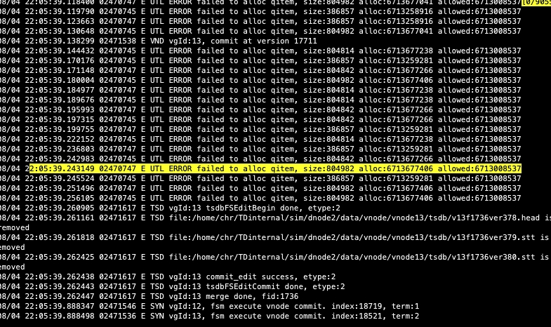

# TS-4596-[中石化EPDC] 优化offset文件过大读取慢的问题- Test Spec

## 1. 测试目标

测试 offset 文件文件不再变大，同时可以从旧版本平稳升级到新版本。

## 2. 变更历史

| Date | Version | Owner | Memo |
| --- | --- | --- | --- |
| 2024.07.29 | 0.1 | 陈浩然 |  |
| 2024.07.30 | 1.0 | 陈浩然 | 增加测试用例和结论 |
| 2024.08.08 | 1.1 | 陈浩然 | 完成修复加载过慢的 bug的验证 |

## 3. 测试范围

 TDengine-enterprise-3.3.3.0-alph（3.0 分支待发布版本） 版本修复了该问题。
1. TDengine-enterprise-3.2.3.6 版本升级到  TDengine-enterprise-3.3.3.0-alph
2. 3.3.2.2 升级到TDengine-enterprise-3.3.3.0-alph
3. 3.1.2.0 升级到 3.1.2.1/3.1.3.0（3.1 的最新编译版本）

## 4. 测试结论

1. 3.0 分支的offset 的信息已经不会再因为重启而增大，从旧版本平稳升级到修复的新版本，不支持降级。
2. 3.1 分支offset 的信息从旧版本平稳升级到修复的新版本，不支持降级。
3. 3.1.2.0 到 3.1.2.1 可以滚动升级，业务不中断，订阅也会继续。
4. 3.1.2.0 -3.1.3.0 无法滚动升级，节点停止升级后，无法重启成功，一直会报兼容性错误。 
5. 加载 100M 的 offset 文件秒级内加载完成

## 5. 开发质量报告

结论：本特性/优化的开发质量是优

| 统计指标 | 数量 |
| --- | --- |
| 提测被拒次数 |  |
| 基础测试用例不通过 |  |
| Bug 总数 | 1 |
| 严重 Bug 总数 |  |

## 6. 已知问题和限制

## 7. 测试环境

- OS: Linux 192.168.1.86
- taosd 版本
```python
TDengine Enterprise Edition
taosd version: 3.3.3.0.alpha compatible_version: 3.0.0.0
git: 83df6c6fc873472dfa00a6874f5a982ade94f3e9
gitOfInternal: 308a86823d655def550155c4827e9b4c4452cf7f
build: Linux-x64 2024-07-28 13:44:31 +0800
```

## 8. 测试数据 (Optional)

1. 测试数据取 taosBenchmark 的默认数据列
```python
taos> describe db_sub.meters;
             field              |          type          |   length    |        note        |     encode     |    compress    |     level      |
================================================================================================================================================
 ts                             | TIMESTAMP              |           8 |                    | delta-i        | lz4            | medium         |
 current                        | FLOAT                  |           4 |                    | delta-d        | lz4            | medium         |
 voltage                        | INT                    |           4 |                    | simple8b       | lz4            | medium         |
 phase                          | FLOAT                  |           4 |                    | delta-d        | lz4            | medium         |
 groupid                        | INT                    |           4 | TAG                | disabled       | disabled       | disabled       |
 location                       | VARCHAR                |          24 | TAG                | disabled       | disabled       | disabled       |
Query OK, 6 row(s) in set (0.000889s)
```


1. consumer 配置：
|  | 订阅来源tsdb*(taosx)
(experimental.snapshot.enable=true) |  | 订阅来源wal（默认）
(experimental.snapshot.enable=false) |  |
| --- | --- | --- | --- | --- |
| 订阅类型 | 消费进度（auto.offset.reset） |  | 消费进度（auto.offset.reset） |  |
|  | latest（默认） | earliest | latest（默认） | earliest |
| 超级表订阅 |  | * |  | * |
| 查询订阅 |  |  |  |  |
| 数据库订阅 |  |  |  |  |

1. Restart taosd 的脚本 restart.py
```python
import os
import time
import subprocess

count = 0
while count < 100:
    print(f"count: {count}")
    os.system("nohup taosd &")
        time.sleep(5)
    os.system("ps -ef | grep taosd | grep -v grep | awk '{print $2}' | xargs kill -15")
    try:
        print("check old vnode path:tq/offset*")
        output = subprocess.check_output("du  /var/lib/taos/vnode/vnode*/tq/offset-ver0 -csh", shell=True, stderr=subprocess.STDOUT)
        print(output.decode('utf-8'))
    except subprocess.CalledProcessError as e:
        print("命令执行出错:", e.output.decode('utf-8'))
    try:
        print("check old vnode path:tq/subscribe/offset*")
        output = subprocess.check_output("du /var/lib/taos/vnode/vnode*/tq/subscribe/offset-ver0 -csh ", shell=True, stderr=subprocess.STDOUT)
        print(output.decode('utf-8'))
    except subprocess.CalledProcessError as e:
        print("命令执行出错:", e.output.decode('utf-8'))
    try:
        print("check new vnode path:tq/subscribe/main.tdb")
        output = subprocess.check_output("du /var/lib/taos/vnode/vnode*/tq/subscribe/main.tdb -csh ", shell=True, stderr=subprocess.STDOUT)
        print(output.decode('utf-8'))
    except subprocess.CalledProcessError as e:
        print("命令执行出错:", e.output.decode('utf-8'))
    count += 1

```

1. Restart taosd 的脚本restart-cluster.py
```python {wrap}
import os
import time
import subprocess
import random

count = 0
while count < 100:
    print(f"count: {count}")
    i =  random.randint(1,3)
    print(i)
    print(f"ps -ef | grep dnode{i} |grep taosd | grep -v grep | awk '{{print $2}}' | xargs kill -15")
    os.system(f"ps -ef | grep dnode{i} |grep taosd | grep -v grep | awk '{{print $2}}' | xargs kill -15")
    time.sleep(10)
    print(f"nohup taosd -c /home/chr/TDinternal/sim/dnode{i}/cfg &")
    os.system(f"nohup taosd -c /home/chr/TDinternal/sim/dnode{i}/cfg &")
    time.sleep(10)

    try:
        print("check old vnode path:tq/offset*")
        output = subprocess.check_output("du  /home/chr/TDinternal/sim/dnode*/data/vnode/vnode*/tq/offset-ver0 -csh", shell=True, stderr=subprocess.STDOUT)
        print(output.decode('utf-8'))
    except subprocess.CalledProcessError as e:
        print("命令执行出错:", e.output.decode('utf-8'))
    try:
        print("check old vnode path:tq/subscribe/offset*")
        output = subprocess.check_output("du  /home/chr/TDinternal/sim/dnode*/data/vnode/vnode*/tq/subscribe/offset-ver0 -csh ", shell=True, stderr=subprocess.STDOUT)
        print(output.decode('utf-8'))
    except subprocess.CalledProcessError as e:
        print("命令执行出错:", e.output.decode('utf-8'))
    try:
        print("check new vnode path:tq/subscribe/main.tdb")
        output = subprocess.check_output("du  /home/chr/TDinternal/sim/dnode*/data/vnode/vnode*/tq/subscribe/main.tdb -csh ", shell=True, stderr=subprocess.STDOUT)
        print(output.decode('utf-8'))
    except subprocess.CalledProcessError as e:
        print("命令执行出错:", e.output.decode('utf-8'))
    count += 1

```

1. consumer 脚本：per_consumer.py，这里配置 auto-commit 为 false，
2. consumer_new 脚本：per_consumer_new.py，保持和per_consumer.py内容一致，只是去掉15-24 行部分的 drop topic、写数据和create topic
```python
import os
import taos
import time
from datetime import datetime
import subprocess
from multiprocessing import Process
import threading
from taos.tmq import Consumer

try:
    conn = taos.connect()
except Exception as e:
    print(str(e))

conn.execute(f'drop topic if exists select_d1;')
conn.execute(f'drop topic if exists select_d2;')
conn.execute(f'drop topic if exists select_d3;')
conn.execute(f'drop topic if exists select_d4;')
os.system("nohup taosBenchmark -d db_sub -t 10000 -n 10000 -y & ")

conn.execute(f'create topic select_d1 as  select * from db_sub.meters;')
conn.execute(f'create topic select_d2 as  select * from db_sub.meters;')
conn.execute(f'create topic select_d3 as  select * from db_sub.meters;')
conn.execute(f'create topic select_d4 as  select * from db_sub.meters;')

def sub_consumer(consumer,group_id):
    if group_id < 100 :
        consumer.subscribe(["select_d1"])
    elif group_id < 200 :
        consumer.subscribe(["select_d2"])
    elif group_id < 300 :
        consumer.subscribe(["select_d3"])
    else:
        consumer.subscribe(["select_d4"])

    nrows = 0
    while True:
        start = datetime.now()
        print(f"time:{start},consumer:{group_id}, start to consume")
        #start = datetime.now()
        #print(f"time:{start},consumer:{group_id}, start to consume")
        message = consumer.poll(timeout=10.0)
        
        if message:
            id = message.offset()
            topic = message.topic()
            database = message.database()
            
            for block in message:
                addrows = block.nrows()
                nrows += block.nrows()
                ncols = block.ncols()
                #for row in block:
                #    print(row)
                values = block.fetchall
            end = datetime.now()
            elapsed_time = end -start
            print(f"time:{end},consumer:{group_id}, elapsed time:{elapsed_time},consumer_nrows:{nrows},consumer_addrows:{addrows}, consumer_ncols:{ncols},offset:{id}")
        consumer.commit()
        print(f"consumer:{group_id},consumer_nrows:{nrows}")
            # consumer.unsubscribe()
            # consumer.close()
            # break
    
def cloud_consumer(group_id):
    conf = {
        # auth options
        "td.connect.websocket.scheme": "ws",
        # consume options
        "td.connect.ip": "yw86",
        "td.connect.port": "6241",
        "group.id": f"local{group_id}", 
        "client.id": "test_consumer_ws_py",
        "enable.auto.commit": "true",
        "auto.commit.interval.ms": "1000",
        "auto.offset.reset": "earliest",
        "msg.with.table.name": "true",
        "experimental.snapshot.enable" :"true",
    }
    consumer = Consumer(conf)
    print(consumer,group_id)
    #counsmer sub:
    while True:
        try:
            sub_consumer(consumer,group_id)
        except Exception as e:
            print(str(e))
            time.sleep(1)
            break
    
    #consumer.close()

def taosc_consumer(group_id):
    conf = {
        # auth options
        # consume options
        "td.connect.ip": "yw86",
        "td.connect.user": "root",
        "td.connect.pass": "taosdata",
        "group.id": f"local{group_id}", 
        "client.id": "test_consumer_py",
        "enable.auto.commit": "false",
        "auto.commit.interval.ms": "1000",
        "auto.offset.reset": "earliest",
        "msg.with.table.name": "true",
        "experimental.snapshot.enable" :"false",
    }
    consumer = Consumer(conf)
    print(consumer,group_id)
    #counsmer sub:
    while True:
        try:
            sub_consumer(consumer,group_id)
        except Exception as e:
            print(str(e))
            time.sleep(1)
            break
    
    #consumer.close()

consumer_groups_num = 1
threads = []
process_list = []

for id in range(consumer_groups_num):
    #threads.append(Process(target=cloud_consumer, args=(id,)))
    threads.append(threading.Thread(target=taosc_consumer, args=(id,)))
for tr in threads:
    tr.start()
for tr in threads:
    tr.join()

```


## 9. 测试用例

### 9.1 功能测试

在提测时，开发应保证基础用例全部通过。
| 用例编号 | 类型 | 测试目的 | 测试步骤 | 预期结果 | 是否为基础用例 | 测试结果 | 备注 |
| --- | --- | --- | --- | --- | --- | --- | --- |
| 1 |  |  | 1. 部署 3.2.3.6,写入数据一百张子表，每张子表一万条数据
1. 创建 1 个 topic，select * from db_sub.meters
2. 边写入数据，边开启订阅客户端，配置  1个consumer group。consumer 设置为snapshot 为 false，autocommit 为 false
3. 记录数据文件vnode/vnode3/tq/offset-ver0，多次重启 taosd 以后再次查看文件大小 。
4. 等待订阅完成，查看订阅条目数，记录 offset 值
5. 升级3.0 最新 版本，启动该版本的 taosd，查看数据文件的路径和文件名称的变化。
6. 关闭之前的消费进程，再次启动同样 groupid 的消费组，（启动脚本 per_consumer_new 只是去掉了 create 数据和 topic 部分）查看show subscription 中的offset值
7. 再次记录文件大小 tq/subscribe/main.tdb ，多次重启 taosd 以后再次查看文件大小 。 | 1. 步骤 4中的数据文件tq/offset-ver0每次重启都会变大。
8. 步骤 5 的订阅条目数为 100w 条，等于所有超级表meters数据条目数。
9. 步骤 6 升级完成后，数据文件tq/offset-ver0被移除，转移到vnode/vnode3/tq/subscribe/main.tdb
10. 步骤 7中的 offset 值和步骤5 的 offset 值相同（3.1实测也是相同的）
11. tq/subscribe/main.tdb文件大小不会在变化。 |  | Pass | 如果没有poll到新的数据，确认 offset 值升级前后是完全相同的。 |
| 2 |  |  | 1. 部署 3.2.3.6,写入数据1000张子表，每张子表一万条数据
1. 创建 1 个 topic，select * from db_sub.meters
2. 边写入数据，边开启订阅客户端，配置  1个consumer group。consumer 设置为snapshot 为 false，autocommit 为 false
3. 记录数据文件vnode/vnode3/tq/offset-ver0，多次重启 taosd 以后再次查看文件大小 。
4. 订阅一部分时，停止 taosd，并记录最终订阅的条目数
5. 升级3.0 最新版本，启动该版本的 taosd，查看数据文件的路径和文件名称的变化。
6. 关闭之前的消费进程，再次启动同样 groupid 的消费组，（启动脚本 per_consumer_new 只是去掉了 create 数据和 topic 部分），等待订阅全部完成，记录订阅条目数
7. 再次记录文件大小 tq/subscribe/main.tdb ，多次重启 taosd 以后再次查看文件大小 | 1. 步骤 4中的数据文件tq/offset-ver0每次重启都会变大。
8. 步骤 6 升级完成后，数据文件tq/offset-ver0被移除，转移到vnode/vnode3/tq/subscribe/main.tdb
9. 步骤 5 的订阅条目数+步骤 7 的订阅条目数要大于等于所有超级表meters数据条目数。（这个大于等于多少待讨论）
10. 步骤 8 的tq/subscribe/main.tdb文件大小不会在变化。 |  | Pass | 订阅的数据比实际数据库的数据多 1%-9% 左右，这个待讨论是否合理。分别对应consumer-groupsid=1 和consumer-groupsid=10） |
| 3 | 订阅 wal |  | 1. 部署 3.2.3.6,写入数据一百张子表，每张子表一万条数据
1. 创建 1 个 topic，select * from db_sub.meters
2. 边写入数据，边开启订阅客户端，配置 100 个consumer group。consumer 设置为snapshot 为 false
3. 记录数据文件vnode/vnode3/tq/offset-ver0，多次重启 taosd 以后再次查看文件大小 。
4. 升级3.0 最新 版本，启动该版本的 taosd，查看数据文件的路径和文件名称的变化。
5. 关闭之前的消费进程，再次启动同样 groupid 的消费组，（启动脚本 per_consumer_new 只是去掉了 create 数据和 topic 部分），等待订阅全部完成，记录订阅条目数
7.再次记录文件大小 tq/subscribe/main.tdb ，多次重启 taosd 以后再次查看文件大小 | 1. 步骤 4 中数据文件tq/offset-ver0每次重启都会增加。
1. 步骤 5 中数据文件tq/offset-ver0被移动，转移到vnode/vnode3/tq/subscribe/main.tdb
2. 步骤 7 里的 main.tdb文件大小不变化。 |  | Pass |  |
| 4 |  |  | 1. 部署 3.3.2.2,写入数据一万张子表，每张子表一万条数据
1. 创建 1 个 topic，select * from db_sub.meters
2. 边写入数据，边开启订阅客户端，配置 1 个consumer group。consumer 设置为snapshot 为 false
3. 记录数据文件vnode/vnode3/tq/subscribe/offset-ver0，多次重启 taosd 以后再次查看文件大小 。
4. 等待订阅完成，查看订阅情况是否正常
5. 升级3.0 最新 版本，启动该版本的 taosd，查看数据文件的路径和文件名称的变化。
6. 查看show subscription 中的offset值
7. 再次记录文件大小，vnode/vnode3/tq/subscribe/main.tdb，多次重启 taosd 以后再次查看文件大小 。 | 1. 步骤 4 中数据文件vnode/vnode3/tq/subscribe/offset-ver0每次重启都会增加。
8. 步骤 5 订阅数据正确。
9. 步骤 6 中数据文件vnode/vnode3/tq/subscribe/offset-ver0被删除，转移到vnode/vnode3/tq/subscribe/main.tdb

10. 步骤 8 里的 main.tdb文件大小不变化。 |  | Pass |  |
| 5 | 订阅 tsbd
-taosx |  | 1. 部署 3.2.3.6,写入数据一万张子表，每张子表一万条数据
1. 创建 1 个 topic，select * from db_sub.meters
2. 边写入数据，边开启订阅客户端，配置 1 个consumer group。consumer 设置为snapshot 为 true
3. 记录数据文件vnode/vnode3/tq/offset-ver0，多次重启 taosd 以后再次查看文件大小 。
4. 等待订阅完成，查看订阅情况是否正常
5. 升级3.0 最新 版本，启动该版本的 taosd，查看数据文件的路径和文件名称的变化。
6. 查看show subscription 中的offset值
7. 再次记录文件大小，vnode/vnode3/tq/subscribe/main.tdb，多次重启 taosd 以后再次查看文件大小 。 | 1. 步骤 4 中数据文件tq/offset-ver0每次重启都会增加。
8. 步骤 5 订阅数据正确。
9. 步骤 6 中数据文件tq/offset-ver0被删除，转移到vnode/vnode3/tq/subscribe/main.tdb

10. 步骤 8 里的 main.tdb文件大小不变化。 |  | Pass |  |
| 6 |  |  | 1. 部署 3.3.2.2,写入数据一万张子表，每张子表一万条数据
1. 创建 1 个 topic，select * from db_sub.meters
2. 边写入数据，边开启订阅客户端，配置 1 个consumer group。consumer 设置为snapshot 为  true
3. 记录数据文件vnode/vnode3/tq/subscribe/offset-ver0，多次重启 taosd 以后再次查看文件大小 。
4. 等待订阅完成，查看订阅情况是否正常
5. 升级3.0 最新 版本，启动该版本的 taosd，查看数据文件的路径和文件名称的变化。
6. 查看show subscription 中的offset值
7. 再次记录文件大小，vnode/vnode3/tq/subscribe/main.tdb，多次重启 taosd 以后再次查看文件大小 。 | 1. 步骤 4 中数据文件vnode/vnode3/tq/subscribe/offset-ver0每次重启都会增加。
8. 步骤 5 订阅数据正确。
9. 步骤 6 中数据文件vnode/vnode3/tq/subscribe/offset-ver0被删除，转移到vnode/vnode3/tq/subscribe/main.tdb

10. 步骤 8 里的 main.tdb文件大小不变化。 |  | Pass |  |
| 7 |  |  | 同测试例4，数据使用是创建 3 副本。（ taosBenchmark -d db_sub -t 10000 -n 10000 -a 3 -y） |  |  | Pass |  |
| 8 |  |  | 上述测试例从 3.1.2.0 升级到最新的3.1 测试版本再来一遍 |  |  | Pass |  |
| 9 | 滚动升级测试 |  | 1. 旧版本 3.1.2.0启动3 节点 3mnonde 集群，创建 3 副本的 test171 库，
1. 持续后台写入 10亿数据（ taosBenchmark  -t 10000 -n 100000 -d test171 -c /etc/taos/ -v 2 -a 3 -y -k 10 -z 5  ）
3.创建 topic：create topic if not exists select_d1  as select * from test171.meters; 并启动订阅程序：（consumer_per_new.py）
1. 升级 dnode1，查看 dnode 和 vnode 的状态（升级后的版本为 3.1.2.1）
2. 待 dnode1 状态正常，升级 dnode2，查看 dnode 和 vnode 的状态
3. 待 dnode2 状态正常，升级 dnode3，查看 dnode 和 vnode 的状态
4. 待 dnode3 状态正常，查看 dnode 和 vnode 的状态
5. 检查步骤 2 写的数据是否完整
6. 检查步骤 3 的订阅是否完整 | 1. 步骤 4、5、6 、7中，每次升级 检查show dnodes 所有状态ready，且 show vnodes 的 restore 状态为 true。这样才是dnode 的状态正常表现。
2.步骤7、8的数据均完整， |  | Pass | offset 文件如果很大，这个滚动升级时的 offline 节点到恢复到 ready 需要的时间会很久，我测试的时候是 60k 左右文件，启动恢复了2-3 分钟左右。 |
| 10 |  |  | 测试用例 9 中升级后的版本为 3.1.3.1 | 1.第一个节点升级启动后，无法加入集群，因为 server 第三位不一样的情况下不兼容。 |  | Pass | 不支持第三位版本号变更的滚动升级 |
|  |  |  | 1. 使用 3.1.1.33 版本启动 3 节点集群，
1. 升级前，使用现场给的 offset 文件，约 107M，copy 文件到任意 vnode 的 tq 目录
2. 停止所有 taosd，然后全部升级版本到 3.1. 1.x（3.1 最新分支编译，可修改版本号，只是为了测试），
3. 观察 taosd 的启动情况， | 1. taosd 三个节点均启动成功 |  | Pass | 回归测试没问题了
目前测试半小时还未加载启动成功。时间太长 |

### 9.2 兼容性

版本升级兼容：
1. TDengine-enterprise-3.2.3.6 版本（2024 年 5.1 之前的）升级到  TDengine-enterprise-3.3.2.5
2. 3.3.2.2 升级到3.3.2.5
3. 3.1.2.0 升级到 3.1.2.1 or 3.1.3.0（或者3.1 的最新编译版本）
版本降级：
不支持降级

## 10. 待讨论(Optional)

订阅的数据比实际数据库的数据多 1%-9% 左右，这个待讨论是否合理。
| consumer | 实际消费 | rows | 实际-rows |  |
| --- | --- | --- | --- | --- |
| 1 | 10160000 |  | 10000000 | 1.02 |
| 10 | 10930000 |  | 10000000 | 1.09 |

用例 9 的过程中有报错：rpc 队列满了。跟怡豪讨论，该报错不一定是问题，确实存在队列满的情况。
[Out of memory in rpc queue 报错如何处理](https://taosdata.feishu.cn/wiki/Mt2owjbQGiRSsek9ROycSZRpn91)


## 11. Jira

TD-31248


## 12. 测试计划 (Optional)


## 13. 风险评估

## 14. 测试备忘 (Optional)


## 15. 参考文档 (Optional)
