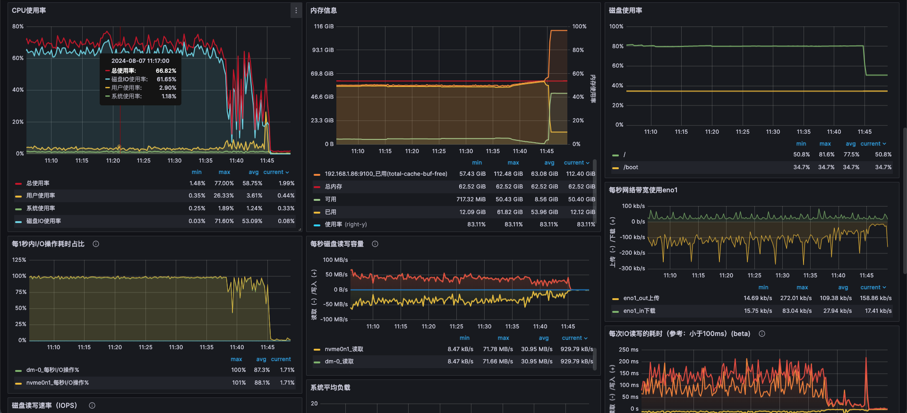

# TS-4882-TSMA最大颗粒放宽到1年 Test Spec

## 1. 测试目标

1. 验证 tsma 最大颗粒度为 1 年。
2. 在基于 1 年、1 月、1 天的颗粒度，测试查询性能有大幅度升级，写入速度没有大幅度下降。
3. 数据查询结果正确。

## 2. 变更历史

| Date | Version | Owner | Memo |
| --- | --- | --- | --- |
| 2024.07.30 | 0.1 | 陈浩然 |  |
|  |  |  |  |

## 3. 测试范围

- 创建 tsma 的功能测试
- 创建interval 分别为1h / 1d / 1n / 1y 四个范围时，系统写入测试性能下降比例
- 创建interval 分别为1h / 1d / 1n / 1y 四个范围时，系统查询测试性能提升比例

## 4. 测试结论

1. 创建 tsma 以后，写入性能有不同程度的下降，比例为 33%-43%
2. 极端使用 1s 的窗口来创建 stream（tsma 不支持），写入性能比例下降 54.78%
3. 创建 tsma 以后，在interval 大范围查询时， tsma 的提升效果显著，提升 2-9 倍，普通聚合查询最高提升 28 倍
4. 创建 tsma 以后first 的查询性能未提升且有很大程度下降，下降87%-988%。
5. 需要谨慎使用 tsma 。过大的窗口数量会让系统负载很高，导致硬盘占用过大，内存和 cpu 一直处于历史数据的计算中。这里推荐窗口一个 vnode 小于千万级的窗口数量。
遗留问题：

TD-32329


TD-32438


TD-32437

## 5. 性能统计规则

### 5.1 写入速度

写入速度的性能变化率计算公式：
<equation>写入速度变化比率=\frac{(当前测试速度-基线测试速度)}{基线测试速度}*100\%
</equation>
当速度变化率为负值时，说明写入速度下降；当该值为正时，意味着写入速度提升

### 5.2 查询时延

查询时延的性能变化率的计算公式：
<equation>查询时延变化比率=\frac{(基线查询时延-当前查询时延)}{min（查询时延，基线时延）}* 100\%
</equation>
当查询时延变化率为负值时，说明查询性能下降；当该值为正时，意味着查询性能提升

## 6. 开发质量报告

结论：本特性的开发质量是一般，主要表现在对大窗口的流和异常情况下的流的处理还不稳定，需要继续优化和完善。

| 统计指标 | 数量 |
| --- | --- |
| 提测被拒次数 |  |
| 基础测试用例不通过 |  |
| Bug 总数 | 20 |
| 严重 Bug 总数 |  |

## 7. 已知问题和限制

TD-29371

## 8. 测试环境

1. 测试平台：Linux x64
2. 测试资源：192.168.1.86（尽量使用 adress san版本运行测试用例）

## 9. 测试数据 (Optional)

创建数据，分两种数据规模。
功能测试：   写入 1752w 数据，"childtable_count": 1000, "insert_rows": 17280,
性能测试 ：  写入 17亿 数据，"childtable_count": 100000, "insert_rows": 17280,

### 9.1 测试 taosBenchmark json

```json
{
    "filetype": "insert",
    "cfgdir": "/etc/taos",
    "host": "yw86",
    "port": 6030,
    "user": "root",
    "password": "taosdata",
    "connection_pool_size": 8,
    "num_of_records_per_req": 20000,
    "thread_count": 8,
    "create_table_thread_count": 10,
    "result_file": "./insert_res_mix.txt",
    "confirm_parameter_prompt": "no",
    "insert_interval": 10000,
    "check_sql": "yes",
    "continue_if_fail": "yes",
    "databases": [
        {
            "dbinfo": {
                "name": "tsmadb",
                "drop": "yes",
                "vgroups": 8,
                "replica": 1,
                "precision": "ms",
                "stt_trigger": 1,
                "minRows": 100,
                "WAL_RETENTION_PERIOD": 10,
                "maxRows": 4096
            },
            "super_tables": [
                {
                    "name": "meters",
                    "child_table_exists": "no",
                    "childtable_count": 100000,
                    "insert_rows": 17280,
                    "childtable_prefix": "d",
                    "insert_mode": "taosc",
                    "insert_interval": 0,
                    "timestamp_step": 900000,
                    "start_timestamp":"2022-09-01 10:00:00",
                    "disorder_ratio": 0,
                    "update_ratio": 0,
                    "delete_ratio": 0,
                    "disorder_fill_interval": 0,
                    "update_fill_interval": 0,
                    "generate_row_rule": 0,
                    "columns": [
                        { "type": "bool",        "name": "bc"},
                        { "type": "float",       "name": "fc",  "max": 1, "min": 0 },
                        { "type": "double",      "name": "dc",  "max": 1, "min": 0 },
                        { "type": "tinyint",     "name": "ti",  "max": 100, "min": 0 },
                        { "type": "smallint",    "name": "si",  "max": 100, "min": 0 },
                        { "type": "int",         "name": "ic",  "max": 100, "min": 0 },
                        { "type": "bigint",      "name": "bi",  "max": 100, "min": 0 },
                        { "type": "utinyint",    "name": "uti", "max": 100, "min": 0 },
                        { "type": "usmallint",   "name": "usi", "max": 100, "min": 0 },
                        { "type": "uint",        "name": "ui",  "max": 100, "min": 0 },
                        { "type": "ubigint",     "name": "ubi", "max": 100, "min": 0 },
                        { "type": "binary",      "name": "bin", "len": 10},
                        { "type": "nchar",       "name": "nch", "len": 10}
                    ],
                    "tags": [
                        {
                            "type": "tinyint",
                            "name": "groupid",
                            "max": 10,
                            "min": 1
                        },
                        {
                            "name": "location",
                            "type": "binary",
                            "len": 16,
                            "values": ["San Francisco", "Los Angles", "San Diego",
                                "San Jose", "Palo Alto", "Campbell", "Mountain View",
                                "Sunnyvale", "Santa Clara", "Cupertino"]
                        }
                    ]
                }
            ]
        }
    ]
}
```

## 10. 测试用例

tsma 和 查询 sql 列表：
| tsma | create tsma tsma1d on tsmadb.meters function(avg(fc),avg(dc),avg(ti),avg(ic),avg(bi),avg(uti),avg(usi),avg(ui),avg(ubi)) interval(1d); |
| --- | --- |
|  | create tsma tsma_tsmadb1 on tsmadb.meters function(avg(fc),last(bc),min(ti),first(nch),last(bin),max(uti),count(ui),spread(ts),stddev(dc)) interval(1d); |
| 查询 sql 列表 | 查询 sql（不使用 tsma 时， sql select 后面加入： /*+ skip_tsma()*/  ）alter local 'querySmaOptimize' '1'; |
|  | select avg(fc),last(bc),min(ti),first(nch),last(bin),max(uti),count(ui),spread(ts),stddev(dc) from tsmadb.meters; |
|  | select avg(fc),last(bc),min(ti),first(nch),last(bin),max(uti),count(ui),spread(ts),stddev(dc),tbname from tsmadb.meters partition by tbname; |
|  | select  location,avg(fc),last(bc),min(ti),first(nch),last(bin),max(uti),count(ui),spread(ts),stddev(dc) from tsmadb.meters   partition by location ; |
|  | select avg(fc),last(bc),min(ti),first(nch),last(bin),max(uti),count(ui),spread(ts),stddev(dc) from tsmadb.meters interval(1d) /(1n)/(1y); |

### 10.1 功能+性能测试用例

| 类型 | 测试目的 | 测试步骤 | 预期结果 | 是否为基础用例 | 测试结果 | 备注 |
| --- | --- | --- | --- | --- | --- | --- |
| 1 | create tsma | 1. interval 测试 最小窗口为 1m Interval 最大窗口为 1y 创建[1m,1y]之外的 interval 值必须指定单位，且验证该值的单位是不是符合预期，遍历: a (毫秒),s (秒), u (微妙) , b (纳秒), d (天), h (小时), m (分钟), n (月), , w (周), y (年)。 | 1. 创建 tsma 从 1m 到 1y 均成功
1. 创建 tsma 失败的，提示信息正确。 |  | Pass |  |
| 2 | create recursive tsma | 1.基准 tsma在 interval 为小时及以下级别时，recursive tsma的 interval 必须是tsma interval 的整数倍。
1. 基准 tsma 在 interval 为小时以上级别时（d\w\n\y），要创建同级别的 recursive tsma，recursive tsma的 interval 必须是tsma interval 的整数倍。
3.基准 tsma 在 interval 为小时以上级别时（d\w\n\y），要创建跨级别的 recursive tsma，则基准 tsma 的 interval 值必须是 1d、1n、1y | 1. 创建 tsma 成功。
1. 创建 tsma 失败的提示信息正确 |  | Pass |  |
| 3 | 写入性能不下降 | 1. 创建测试数据，数据频率是 15min 一条，总共 10w 设备，每个设备生成31*96 条的数据（涵盖 1个月）
1. 生成数据的同时创建 tsma，interval 设置为 1h
2. 记录写完数据的写入性能
3. 重复步骤 1，记录写完数据的写入性能， | 1. 对比 3 和 4 的写入性能，没有太大下降， |  | Fail | 验证性能下降38%-44% |
| 4 | 写入性能不下降 | 1. 创建测试数据，数据频率是 15min 一条，总共 10w 设备，每个设备生成31*96 条的数据（涵盖 1个月）
1. 生成数据的同时创建 tsma，interval 设置为 1d
2. 记录写完数据的写入性能
3. 重复步骤 1，记录写完数据的写入性能， | 1. 对比 3 和 4 的写入性能，没有太大下降 |  | Fail |  |
| 5 | 写入性能不下降 | 1. 创建测试数据，数据频率是 15min 一条，总共 10w 设备，每个设备生成31*96 条的数据（涵盖 1个月）
1. 生成数据的同时创建 tsma，interval 设置为 1n
2. 记录写完数据的写入性能
3. 重复步骤 1，记录写完数据的写入性能， | 1. 对比 3 和 4 的写入性能，没有太大下降 |  | Fail |  |
| 6 | 写入性能不下降 | 1. 创建测试数据，数据频率是 15min 一条，总共 10w 设备，每个设备生成31*96 条的数据（涵盖 1个月）
1. 生成数据的同时创建 tsma，interval 设置为 1y
2. 记录写完数据的写入性能
3. 重复步骤 1，记录写完数据的写入性能， | 1. 对比 3 和 4 的写入性能，没有太大下降 |  | Fail |  |
| 7 | 查询性能提升-1h | 1. 创建测试数据，数据频率是 15min 一条，总共 10w 设备，每个设备生成30*96*6 条的数据（涵盖 6个月）
1. 生成数据的同时创建 tsma，interval 设置为 1h(每个窗口 4 条记录)
2. 记录每个 tsma 条件下，对应四个查询语句的性能，并核对 tsma 的结果跟非 tsma 的结果一致。 
3. 横向对比第一个查询语句对应四种 interval 的性能提升 |  |  | Fail | 不再测试。 |
| 8 | 查询性能提升-1d | 1. 创建测试数据，数据频率是 15min 一条，总共 10w 设备，每个设备生成30*96*6 条的数据（涵盖 6个月）
1. 生成数据的同时创建 tsma，interval 设置为 1d，(每个窗口 96条记录)
2. 记录每个 tsma 条件下，对应四个查询语句的性能，并核对 tsma 的结果跟非 tsma 的结果一致。 |  |  | Pass |  |
| 9 | 查询性能提升-1n | 1. 创建测试数据，数据频率是 15min 一条，总共 10w 设备，每个设备生成30*96*6 条的数据（涵盖 6个月）
1. 生成数据的同时创建 tsma，interval 设置为 1n(每个窗口 2880 条记录)
2. 记录每个 tsma 条件下，对应四个查询语句的性能，并核对 tsma 的结果跟非 tsma 的结果一致。 |  |  | Pass |  |
| 10 | 查询性能提升-1y | 1. 创建测试数据，数据频率是 15min 一条，总共 10w 设备，每个设备生成30*96*6 条的数据（涵盖 6个月）
1. 生成数据的同时创建 tsma，interval 设置为1y
2. 记录每个 tsma 条件下，对应四个查询语句的性能，并核对 tsma 的结果跟非 tsma 的结果一致。 
3. 横向对比第一个查询语句对应三种 interval（1d/1n/1y） 的性能提升 |  |  | Pass |  |
| 11 | 写入性能不下降 | 1. 创建测试数据，数据频率是 15min 一条，总共 10w 设备，每个设备生成31*96 条的数据（涵盖 1个月）
1. 生成数据的同时创建 tsma，interval 设置为 1s(这里无法使用 1s 的 tsma，使用 stream 替代：create stream stream1 TRIGGER MAX_DELAY 300s fill_history 1 into meters_res_stb tags(groupid TINYINT, location varchar(16), `tbname` varchar(255)) subtable(md5(concat('tsma1',tbname))) as select sum(ic),av
g(fc),last(bc),min(ti),first(nch),last(bin),max(uti),count(ui), _wstart, _wend, _wduration from meters partition by tbname, groupid, location interval(1s);)
1. 写入数据 taosBenchmark -d db_sub -t 200000 -n 100000 -v 8 -y 
2. 删除 strema 以后，重复步骤 3，记录写完数据的写入性能， | 1. 对比 3 和 4 的写入性能，没有太大下降 |  | Fail | 写入速度下降了 54.78% |

## 11. 待讨论(Optional)

## 12. Jira

## 13. 测试计划 (Optional)

## 14. 风险评估

## 15. 性能测试结果记录 

### 15.1 写入性能测试记录

| 测试用例3-6 | tsma | 写入 rows/s |  |  |  | 备注 | stream/tsma |
| --- | --- | --- | --- | --- | --- | --- | --- |
| 31*96/10w子表 | 无 | 1895905 |  |  |  | [08/06 22:11:05.349703] SUCC: Spent 163.273703 (real 156.969880) seconds to insert rows: 297600000 with 8 thread(s) into tsmadb 1822706.26 (real 1895905.13) records/second
[08/06 22:11:05.349718] SUCC: insert delay, min: 4.6100ms, avg: 12.5576ms, p90: 10.8710ms, p95: 17.9590ms, p99: 73.8130ms, max: 5604.0950ms |  |
|  | interval(1h) | 1188012.73 | (C3-C2)/C2 |  |  | [08/06 22:19:16.821718] SUCC: Spent 258.091226 (real 250.502366) seconds to insert rows: 297600000 with 8 thread(s) into tsmadb 1153080.66 (real 1188012.73) records/second
[08/06 22:19:16.821732] SUCC: insert delay, min: 4.5840ms, avg: 20.0402ms, p90: 16.3450ms, p95: 38.4130ms, p99: 280.8970ms, max: 4056.3890ms |  |
|  | interval(1d) | 1259867 | (C4-C2)/C2 |  |  | [08/06 22:24:33.215799] SUCC: Spent 245.200508 (real 236.215371) seconds to insert rows: 297600000 with 8 thread(s) into tsmadb 1213700.58 (real 1259867.21) records/second
[08/06 22:24:33.215811] SUCC: insert delay, min: 4.5730ms, avg: 18.8972ms, p90: 21.1310ms, p95: 31.0210ms, p99: 196.8180ms, max: 3855.2100ms |  |
|  | interval(1n) | 1111622 | (C5-C2)/C2 |  |  | [08/06 22:35:02.832313] SUCC: Spent 277.361794 (real 267.716705) seconds to insert rows: 297600000 with 8 thread(s) into tsmadb 1072966.81 (real 1111622.83) records/second
[08/06 22:35:02.832326] SUCC: insert delay, min: 4.5700ms, avg: 21.4173ms, p90: 20.9960ms, p95: 48.1520ms, p99: 290.1920ms, max: 2706.5020ms |  |
|  | interval(1y) | 1067387 | (C6-C2)/C2 |  |  | [08/06 22:40:42.243777] SUCC: Spent 289.927054 (real 278.811630) seconds to insert rows: 297600000 with 8 thread(s) into tsmadb 1026465.09 (real 1067387.33) records/second
[08/06 22:40:42.243800] SUCC: insert delay, min: 4.6160ms, avg: 22.3049ms, p90: 21.6980ms, p95: 38.3980ms, p99: 257.5010ms, max: 4555.6440ms |  |
| 30*96*6/10w子表 | 无 | 713433 | C7/C2 |  |  | 该测试结果不合理，后续的测试发现读写速度远低于正常值，故该测试结果无法使用。
[08/06 23:37:11.901210] SUCC: Spent 2479.607886 (real 2422.090824) seconds to insert rows: 1728000000 with 8 thread(s) into tsmadb 696884.38 (real 713433.20) records/second
[08/06 23:37:11.901228] SUCC: insert delay, min: 5.4480ms, avg: 96.8836ms, p90: 81.5660ms, p95: 359.8490ms, p99: 1903.4310ms, max: 18283.4100ms |  |
| 测试用例 11 |  |  |  |  |  |  |  |
| taosBenchmark -d db_sub -t 200000 -n 100000 -v 8 -y | stream | 写入 rows/s |  | 建表速度 |  | 备注 |  |
|  | 无流 | 803713 |  | 4788 |  | SUCC: Spent 41.7710 seconds to create 200000 table(s) with 8 thread(s) speed: 4788 tables/s, already exist 0 table(s), actual 200000 table(s) pre created, 0 table(s) will be auto created
[09/26 11:41:46.257016] SUCC: Spent 217.204233 (real 208.564474) seconds to insert rows: 174570000 with 8 thread(s) into db_sub 803713.62 (real 837007.36) records/second
[09/26 11:41:46.257039] SUCC: insert delay, min: 42.6080ms, avg: 95.6224ms, p90: 109.9660ms, p95: 114.5680ms, p99: 219.3200ms, max: 6274.6550ms |  |
|  | 有流 | 363423 | (C11-C10)/C10 | 1706 | (E11-E10)/E10 | [09/26 11:01:02.941732] SUCC: Spent 117.2010 seconds to create 200000 table(s) with 8 thread(s) speed: 1706 tables/s, already exist 0 table(s), actual 200000 table(s) pre created, 0 table(s) will be auto created
[09/26 11:04:23.391160] SUCC: Spent 200.234518 (real 194.087462) seconds to insert rows: 72770000 with 8 thread(s) into db_sub 363423.85 (real 374934.06) records/second
[09/26 11:04:23.391202] SUCC: insert delay, min: 53.9870ms, avg: 213.6057ms, p90: 246.1310ms, p95: 290.9480ms, p99: 2097.7070ms, max: 7443.3820ms | create stream stream1 TRIGGER MAX_DELAY 300s fill_history 1 into meters_res_stb tags(groupid TINYINT, location varchar(16), `tbname` varchar(255)) subtable(md5(concat('tsma1',tbname))) as select sum(ic),av
g(fc),last(bc),min(ti),first(nch),last(bin),max(uti),count(ui), _wstart, _wend, _wduration from meters partition by tbname, groupid, location interval(1s);) |

### 15.2 查询性能测试记录

#### 15.2.1 2024-0806-case-7

测试用例 7 中，实测过程，设置1h 的 interval ，流每个窗口只有 4 条记录，导致流计算占用的磁盘和内存过大。tq 17G，tsdb8.6G。内存使用58G，不打算继续等待这个计算完成。所以对于这种窗口只有 4 条数据的聚合，意义不大甚至需要禁止，运行 3 h 还没结束。资源使用截图。



#### 15.2.2 2024-0807-case-8

| 查询 sql（不使用 tsma 时， sql select 后面加入： /*+ skip_tsma()*/  ） explain verbose true  
alter local 'querySmaOptimize' '1'; | 查询内部是否有优化 | 使用 tsma | 不使用 tsma | 时延减小比例 |
| --- | --- | --- | --- | --- |
| create tsma tsma_tsmadb1 on tsmadb.meters function(avg(fc),last(bc),min(ti),first(nch),last(bin),max(uti),count(ui),spread(ts),stddev(dc)) interval(1d); |  |  |  |  |
| select avg(fc),min(ti),max(uti),count(ui),spread(ts) from tsmadb.meters; | 存在 sma | 1.00765 | 0.708094 | (D3-C3)/IF(D3>C3,C3,D3) |
| select stddev(dc) from tsmadb.meters; | 不存在 sma | 0.707922 | 4.193896 | (D4-C4)/IF(D4>C4,C4,D4) |
| select last(bc),last(bin) from tsmadb.meters; | 查询做过优化 | 1.109767 | 0.509163 | (D5-C5)/IF(D5>C5,C5,D5) |
| select first(nch) from tsmadb.meters; | 查询做过优化 | 0.864895 | 0.079437 | (D6-C6)/IF(D6>C6,C6,D6) |
| select avg(fc),min(ti),max(uti),count(ui),spread(ts),tbname from tsmadb.meters partition by tbname; | 存在 sma | 1.886664 | 1.67762 | (D7-C7)/IF(D7>C7,C7,D7) |
| select count(ui),location from tsmadb.meters partition by location; | 存在 sma | 1.047667 | 1.364775 | (D8-C8)/IF(D8>C8,C8,D8) |
| select avg(fc),min(ti),max(uti),count(ui),spread(ts)  from tsmadb.meters interval(1d); | interval查询没有 sma | 1.654767 | 17.073095 | (D9-C9)/IF(D9>C9,C9,D9) |
| select avg(fc),min(ti),max(uti),count(ui),spread(ts)  from tsmadb.meters interval(1n) | interval查询没有 sma | 3.631002 | 4.370085 | (D10-C10)/IF(D10>C10,C10,D10) |

#### 15.2.3 2024-0808-case-9

| 查询 sql（不使用 tsma 时， sql select 后面加入： /*+ skip_tsma()*/  ） explain verbose true  
alter local 'querySmaOptimize' '1'; |  | 使用 tsma | 不使用 tsma | 时延减小比例 |
| --- | --- | --- | --- | --- |
| create tsma tsma_tsmadb1 on tsmadb.meters function(sum(ic),avg(fc),last(bc),min(ti),first(nch),last(bin),max(uti),count(ui),spread(ts),stddev(dc)) interval(1n); |  |  |  |  |
| select sum(ic),avg(fc),min(ti),max(uti),count(ui),spread(ts) from tsmadb.meters; | 存在 sma | 0.239625 | 0.708094 | (D3-C3)/IF(D3>C3,C3,D3) |
| select stddev(dc) from tsmadb.meters; | 不存在 sma | 0.189403 | 5.628432 | (D4-C4)/IF(D4>C4,C4,D4) |
| select last(bc),last(bin) from tsmadb.meters; | 查询做过优化,第一次查询会换成，第二次就快，未开启 last 缓存 | 0.226614 | 0.226317 | (D5-C5)/IF(D5>C5,C5,D5) |
| select first(nch) from tsmadb.meters; | 查询做过优化 | 0.206852 | 0.080429 | (D6-C6)/IF(D6>C6,C6,D6) |
| select sum(ic),avg(fc),min(ti),max(uti),count(ui),spread(ts),tbname from tsmadb.meters partition by tbname; | 存在 sma | 0.528607 | 1.709062 | (D7-C7)/IF(D7>C7,C7,D7) |
| select count(ui),location from tsmadb.meters partition by location; | 存在 sma | 0.362516 | 1.52037 | (D8-C8)/IF(D8>C8,C8,D8) |
| select sum(ic),avg(fc),min(ti),max(uti),count(ui),spread(ts)  from tsmadb.meters interval(1d); |  | 14.421323 | 6.404767 | (D9-C9)/IF(D9>C9,C9,D9) |
| select sum(ic),avg(fc),min(ti),max(uti),count(ui),spread(ts)  from tsmadb.meters interval(1n); |  | 1.110199 | 4.549589 | (D10-C10)/IF(D10>C10,C10,D10) |
| select sum(ic),avg(fc),min(ti),max(uti),count(ui),spread(ts)  from tsmadb.meters interval(1y); |  | 1.007838 | 3.502877 | (D11-C11)/IF(D11>C11,C11,D11) |

#### 15.2.4 2024-0809-case-10

| 查询 sql（不使用 tsma 时， sql select 后面加入： /*+ skip_tsma()*/  ） explain verbose true  
alter local 'querySmaOptimize' '1'; |  | 使用 tsma | 不使用 tsma | 时延减小比例 |
| --- | --- | --- | --- | --- |
| create tsma tsma_tsmadb1 on tsmadb.meters function(sum(ic),avg(fc),last(bc),min(ti),first(nch),last(bin),max(uti),count(ui),spread(ts),stddev(dc)) interval(1n);
create recursive tsma t1y on  tsmadb.tsma_tsmadb1 interval(1y); |  |  |  |  |
| select sum(ic),avg(fc),min(ti),max(uti),count(ui),spread(ts) from tsmadb.meters; | 存在 sma | 0.162147 | 0.736288 | (D3-C3)/IF(D3>C3,C3,D3) |
| select stddev(dc) from tsmadb.meters; | 不存在 sma | 0.149137 | 17.481167 | (D4-C4)/IF(D4>C4,C4,D4) |
| select last(bc),last(bin) from tsmadb.meters; | 查询做过优化,第一次查询会换成，第二次就快，未开启 last 缓存 | 0.165772 | 0.56942 | (D5-C5)/IF(D5>C5,C5,D5) |
| select first(nch) from tsmadb.meters; | 查询做过优化 | 0.150647 | 0.08044 | (D6-C6)/IF(D6>C6,C6,D6) |
| select sum(ic),avg(fc),min(ti),max(uti),count(ui),spread(ts),tbname from tsmadb.meters partition by tbname; | 存在 sma | 0.224973 | 2.127425 | (D7-C7)/IF(D7>C7,C7,D7) |
| select count(ui),location from tsmadb.meters partition by location; | 存在 sma | 0.191035 | 1.937124 | (D8-C8)/IF(D8>C8,C8,D8) |
| select sum(ic),avg(fc),min(ti),max(uti),count(ui),spread(ts)  from tsmadb.meters interval(1d); |  | 21.758518 | 6.386483 | (D9-C9)/IF(D9>C9,C9,D9) |
| select sum(ic),avg(fc),min(ti),max(uti),count(ui),spread(ts)  from tsmadb.meters interval(1n); | interval查询没有 sma | 1.113009 | 4.524035 | (D10-C10)/IF(D10>C10,C10,D10) |
| select sum(ic),avg(fc),min(ti),max(uti),count(ui),spread(ts)  from tsmadb.meters interval(1y); | interval查询没有 sma | 0.376753 | 3.778213 | (D11-C11)/IF(D11>C11,C11,D11) |

## 16. 参考文档 (Optional)

[TDengine TSMA Test Spec](https://taosdata.feishu.cn/wiki/AZSXw4eoWirWS1kwmZzcFBu0n3O)
[TSMA 功能](https://taosdata.feishu.cn/wiki/WpVfwsKjeilOtckp3U2cIaz0nef)
