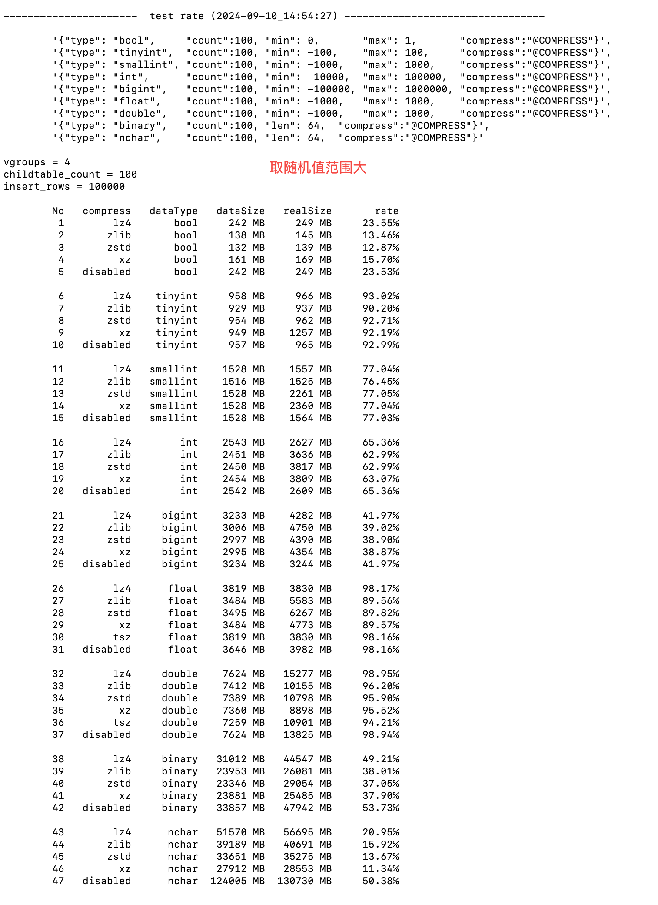
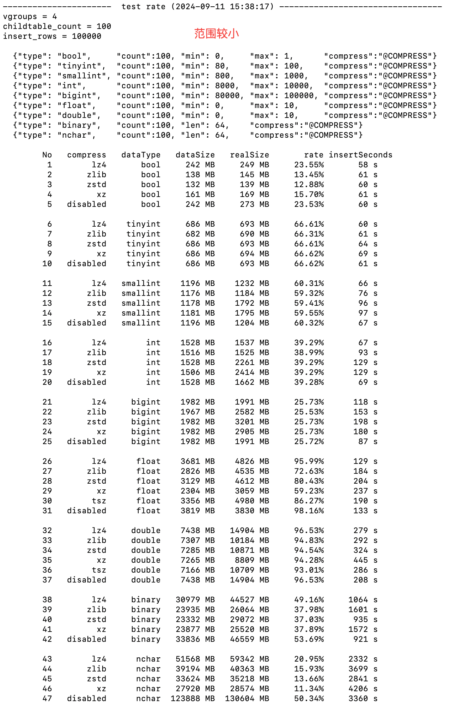

# TS-5035 不同数据类型最佳压缩算法测试

## 1. 测试目标

测试出不同数据类型的最佳压缩算法

## 2. 变更历史

| Date | Version | Owner | Memo |
| --- | --- | --- | --- |
| 2024-09-10 | 0.1 | 段宽军 | 初搞 |
|  |  |  |  |

## 3. 测试范围

有代表性的数据类型，测试 bool tinyint smallint int bigint float double binary nchar 这几种数据类型在不同的二级压缩算法 lz4 zlib zstd xz disabled 情况下哪个更佳

## 4. 测试结论

数据的随机范围不同，对压缩率影响较大，所以还需要具体看数据的特性，选择适合的压缩算法。以 taosBenchmark 生成的数据样本，在随机数范围大一些及较小两种情况下，给出了建议的压缩算法，详细见下面结论章节。

## 5. 开发质量报告

不适用

## 6. 已知问题和限制

- 无

## 7. 测试环境

- 192.168.4.214 
- Linux Ubuntu20.4 (24C 64G)

## 8. 测试数据 (Optional)

测试数据为经过特殊设计后可程序批量验证正确
- 测试方法
  创建一个数据库，一张超级表，100个子表，stt_trigger 设置为1
  超级表配置要测试的数据类型 100 列
  每个子表写入 10W 行数据
  数据写完后做 flush database 和 compact database 
  使用自动化脚本完成测试，测试脚本在 TDegnine 仓库：
   tests/system-test/eco-system/manager/testCompress.py
- 测试结果
       dataSize rate 数据使用 show table distributed 命令获取
       realSize 为计算 dataDir 存储数据目录下的 vnode 文件夹大小，所以略会比 dataSize 大，属正常
 disabled 表示关闭二级压缩，只有一级编码压缩情况下的压缩率情况
insertSeconds 是记录启动 taosBenchmark 写入到进程结束返回的秒数
 进行了两次测试，一次生成的随机数范围较大，另一次是生成随机数范围较小，比较随机数范围对压缩率的影响  程度
1. 范围较大结果如下：

1. 范围较小结果如下：

- 测试结论

  | 数据类型 | 较好压缩算法 | 说明 |
| --- | --- | --- |
| bool | zstd | Bool 类型 zstd 压缩率最好 |
| Tinyint smallint | zlib | Float 类型在随机值范围较大小时 xz 压缩算法较好 |
| float | xz | zlib 相对在压缩率及写入时间上都有优势 |
| double | tsz | Double 类型tsz 压缩算法略好一点点，不明显 |
| binary | zstd | Binary 类型 zstd 压的又快又好 |
| nchar | zstd | NCHAR 类型空洞大，xz 压缩要好，但写入时间较长一些 zstd 写入时间及压缩两方面都好一些 |

   - Bool binary nchar 类型的空洞大，压缩率都比较高
   - tinyint smallint int bigint 随长度增加，空洞也越多，压缩率也越高
   - 随机数范围越小压缩效果越好

## 9. 测试用例

无

## 10. 问题(Optional)

无

## 11. Jira

无

## 12. 测试计划 (Optional)

测试开始时间： 2024-09-09  结束时间： 2024-09-10

## 13. 测试备忘 (Optional)

无

## 14. 参考文档 (Optional)

1. 模板 Json 文件如下：
{
    "filetype": "insert",
    "cfgdir": "/etc/taos",
    "host": "127.0.0.1",
    "port": 6030,
    "user": "root",
    "password": "taosdata",
    "thread_count": 4,
    "create_table_thread_count": 1,
    "confirm_parameter_prompt": "no",
    "num_of_records_per_req": 1000,
    "prepared_rand": 10000,
    "escape_character": "yes",
    "databases": [
        {
            "dbinfo": {
                "name": "dbrate",
                "drop": "yes",
                "vgroups": 4,
                "stt_trigger": 1,
                "wal_retention_size": 1,
                "wal_retention_period": 1
            },
            "super_tables": [
                {
                    "name": "meters",
                    "child_table_exists": "no",
                    "childtable_count": 100,
                    "childtable_prefix": "d",
                    "data_source": "rand",
                    "insert_mode": "taosc",
                    "insert_rows": 100000,
                    "timestamp_step": 1000,
                    "start_timestamp": "2020-10-01 00:00:00.000",
                    "columns": [
                        @DATATYPE
                    ],
                    "tags": [
                        {"type": "TINYINT", "name": "groupid", "max": 10, "min": 1}
                    ]
                }
            ]
        }
    ]
}

1. @DATATYPE 会替换成以下值：
    dataTypes = [
        '{"type": "bool",     "count":100, "min": 0,       "max": 1,       "compress":"@COMPRESS"}',
        '{"type": "tinyint",  "count":100, "min": -100,    "max": 100,     "compress":"@COMPRESS"}',
        '{"type": "smallint", "count":100, "min": -1000,   "max": 1000,    "compress":"@COMPRESS"}',
        '{"type": "int",      "count":100, "min": -10000,  "max": 100000,  "compress":"@COMPRESS"}',
        '{"type": "bigint",   "count":100, "min": -100000, "max": 1000000, "compress":"@COMPRESS"}',
        '{"type": "float",    "count":100, "min": -1000,   "max": 1000,    "compress":"@COMPRESS"}',
        '{"type": "double",   "count":100, "min": -1000,   "max": 1000,    "compress":"@COMPRESS"}',
        '{"type": "binary",   "count":100, "len": 64,  "compress":"@COMPRESS"}',
        '{"type": "nchar",    "count":100, "len": 64,  "compress":"@COMPRESS"}'
    ]
