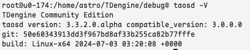
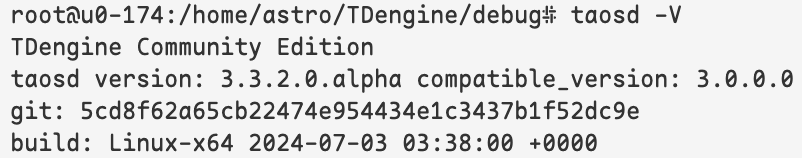
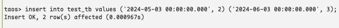
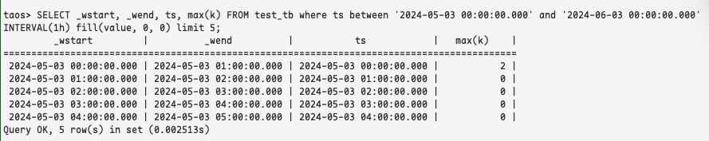
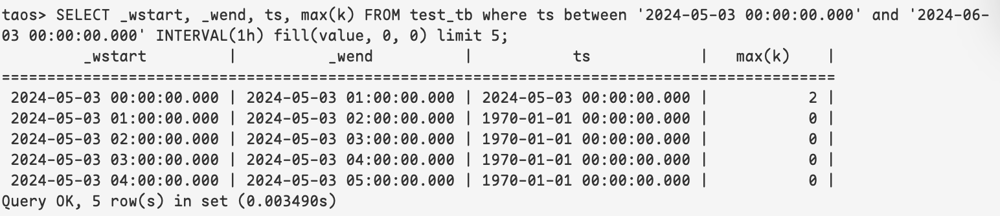
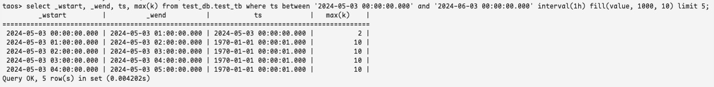
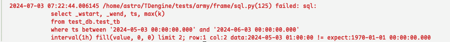

# TS-5103 fill(value,0) not working 测试报告

## 1. 测试目标

对 jira TS-5104 窗口函数查询 fill value 结果修复进行验证

## 2. 变更历史

| Date | Version | Owner | Memo |
| --- | --- | --- | --- |
| 2024/07/03 | 0.1 | @闫宇星 |  |

## 3. 测试结论

修复后的代码窗口函数查询fill value 时间戳列正常赋值，测试通过
CASE PR: 
[test: [TS-5103] add test case for window fill value query by bitcapybara · Pull Request #26387 · tao](https%3A%2F%2Fgithub.com%2Ftaosdata%2FTDengine%2Fpull%2F26387)
[test: [TS-5103] add test case for window fill value query by bitcapybara · Pull Request #26388 · tao](https%3A%2F%2Fgithub.com%2Ftaosdata%2FTDengine%2Fpull%2F26388)

## 4. 已知问题和限制

无

## 5. 测试资源及环境

测试平台：Linux x64
测试资源：192.168.0.174
复现测试版本：COMMIT SHA 50e60343913dd3f967bd8af33b255ca82b77fffe


修复测试版本：Commit  sha 5cd8f62a65cb22474e954434e1c3437b1f52dc9e


## 6. 测试范围及方法

### 6.1 测试范围

Taos shell, select interval fill(value,..) 语句查询

### 6.2 测试方法

1. 创建数据库 `create database test_db`
2. 创建普通表 `create table test_db.test_tb`
3. 插入两条数据


1. 使用 `select _wstart, _wend, ts, max(k) from test_db.test_tb where ts between '2024-05-03 00:00:00.000' and '2024-06-03 00:00:00.000' interval(1h) fill(value, 0, 0) limit 5;` 进行查询，观察窗口区间数据缺失时的填充值

## 7. 测试数据

`'2024-05-03 00:00:00.000', 2`
`'2024-06-03 00:00:00.000', 3`

## 8. 测试用例

### 8.1 问题复现



可以看到，在数据集 `2024-05-03 00:00:00.000` 到 `2024-06-03 00:00:00.000` 一天的时间内，每隔一小时进行一次窗口计算，除第一次和最后一次正好在窗口内，其余都是使用 fill 进行的补值，ts 列补值为窗口开始的时间

### 8.2 问题修复

#### 8.2.1 补零值



修复后的结果，窗口期间缺失的数据，按照用户输入进行了补值，ts 补值为0，即 `1970-01-01 00:00:00.000`

#### 8.2.2 补任意值



修复后的结果，窗口期间缺失的数据，按照用户输入进行了补值，ts 补值为1s，即 `1970-01-01 00:00:01.000`，k补值为 10

### 8.3 测试CASE

```python
def run(self):
        # 创建数据库/表，插入数据
        tdSql.execute("create database test_db;")
        tdSql.execute("create table test_db.test_tb (ts timestamp, k int);")
        tdSql.execute("insert into test_db.test_tb values \
                      ('2024-05-03 00:00:00.000', 2) \
                      ('2024-06-03 00:00:00.000', 3);")
        # 使用窗口函数查询，补零值
        tdSql.queryAndCheckResult(["""
            select _wstart, _wend, ts, max(k) 
            from test_db.test_tb 
            where ts between '2024-05-03 00:00:00.000' and '2024-06-03 00:00:00.000' 
            interval(1h) fill(value, 0, 0) limit 2;"""], 
            [[
                ['2024-05-03 00:00:00.000', '2024-05-03 01:00:00.000', '2024-05-03 00:00:00.000', 2], 
                ['2024-05-03 01:00:00.000', '2024-05-03 02:00:00.000', '1970-01-01 00:00:00.000', 0],
            ]]
        )
        # 使用窗口函数查询，补任意值
        tdSql.queryAndCheckResult(["""
            select _wstart, _wend, ts, max(k) 
            from test_db.test_tb 
            where ts between '2024-05-03 00:00:00.000' and '2024-06-03 00:00:00.000' 
            interval(1h) fill(value, 1000, 10) limit 2;"""], 
            [[
                ['2024-05-03 00:00:00.000', '2024-05-03 01:00:00.000', '2024-05-03 00:00:00.000', 2], 
                ['2024-05-03 01:00:00.000', '2024-05-03 02:00:00.000', '1970-01-01 00:00:01.000', 10],
            ]]
        )
```

复现旧版本会报错，新版本成功运行并退出

