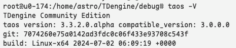
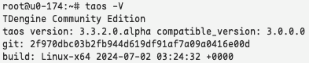
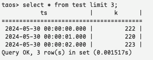
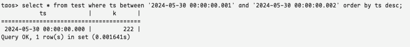
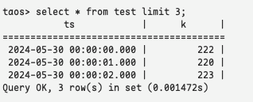
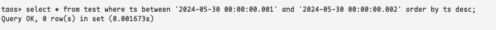

# TS-5104 [晶澳能源]查询异常测试报告

## 1. 测试目标

对 jira TS-5104 逆序查询结果异常对问题是否修复进行确认测试

## 2. 变更历史

| Date | Version | Owner | Memo |
| --- | --- | --- | --- |
| 2024/07/02 | 0.1 | @闫宇星 |  |

## 3. 测试结论

修复后的代码没有再出现逆序查询异常的问题，测试通过

## 4. 已知问题和限制

无

## 5. 测试资源及环境

测试平台：Linux x64
测试资源：192.168.0.174
复现版本：


测试版本：


## 6. 测试范围及方法

### 6.1 测试范围

Taos shell, select order by desc 语句查询

### 6.2 测试方法

1. 建立数据库, stt_trigger 为 1. minrows 为 100.
2. 创建单表 create table test(ts timestamp, k int)，写入数据记录100条，每条记录间隔 1sec。
3. flush database， 确保数据落在 data file中
4. 查询 select * from test where ts between 'start_ts' and 'end_ts' order by ts desc; 其中 start_ts 大于第一条记录的时间戳，且小于第二条记录时间戳，end_ts 也小于第二条记录时间戳
5. 观察返回的结果

## 7. 测试数据

<view type="1">

  > ⚠ 嵌入文件，需在飞书中查看 (token: BBerblqc8oBu2OxzVFDcYla1nAd)

</view>

## 8. 测试用例

### 8.1 准备工作

建库语句
```sql
create database test_db stt_trigger 1 minrows 100;
```

建表语句
```sql
create table test(ts timestamp,k int);
```

导入数据
```sql
insert into test file '/home/astro/sample.csv';
```

### 8.2 问题复现

表中前三条语句，第一条记录时间为 2024-05-30 00:00:00.000, 222


按时间戳逆序查找，在 `2024-05-30 00:00:00.001` 和 `2024-05-30 00:00:00.002` 之间本不应该查询出数据，但查询结果是把第一条查出来了


### 8.3 修复验证

表中前三条语句，第一条记录时间为 2024-05-30 00:00:00.000, 222


按时间戳逆序查找，在 `2024-05-30 00:00:00.001` 和 `2024-05-30 00:00:00.002` 之间返回数据个数为0，符合预期


## 9. 参考文档

jira：
TS-5104
