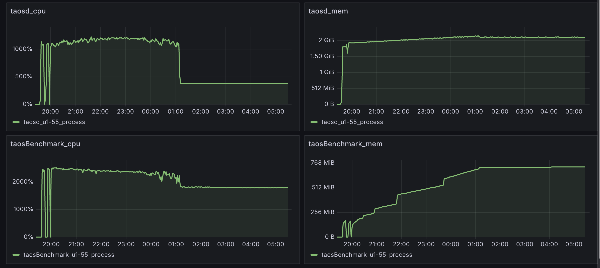
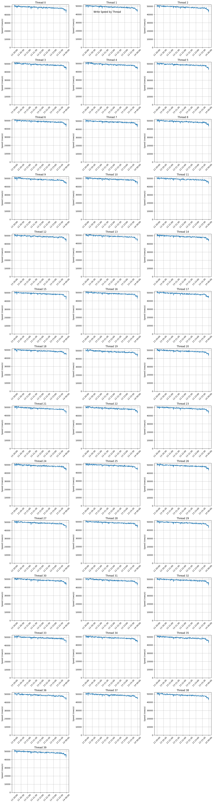

# [Test Report] Compact 自动下发及优化使用体验性能及稳定性测试

<callout emoji="small_blue_diamond" background-color="light-orange" border-color="light-orange">

## 1. 测试结论

1. 在开启自动 compact 的场景下，main 分支运行稳定，没有出现 OOM、coredump 等相关问题
2. 在设置自动 compact 的数据范围与当前写入数据范围不在同一个文件组的情况下，自动 compact 的对写入性能的影响不大。
</callout>

## 2. 概述

[TS-5839](https://jira.taosdata.com:18080/browse/TS-5839)补充对自动 compact 下数据库的性能及稳定性测试

## 3. 软硬件环境

### 3.1 **硬件环境**

| **硬件环境** | **IP** | 用途 | **CPU** | **内存** | **硬盘** |
| --- | --- | --- | --- | --- | --- |
| 192.168.1.55 | taosBenchmark |
| 192.168.1.55 | taosd |

### 3.2 **软件环境**

| **软件环境(main分支)** | **IP** | **运行目录** | **脚本及配置** | **commitID** |
| --- | --- | --- | --- | --- |
| **TDengine** | 192.168.1.55 | /root/TDinternal | taostest --setup=cluster/compact_test.yaml --case=cluster/compact_test.py --keep taostest --setup=cluster/compact_test_rep3.yaml --case=cluster/compact_test.py --keep | TDinternal(5ef4ea2c1a62f8cb7d5765304fb2807b2a92bc56) community(7d745cdb9a17f83e0112245c6e4e98b156a0d723) |

## 4. 测试场景

|  | 测试点 | 描述 |
| --- | --- | --- |
| 长时间大数据量测试 | 将功能测试项尽可能叠加，数据量调大进行长时间压测，期望数据库没有出现 OOM、coredump 等情况。 |
| 正确设置下对写入性能影响小 | 在设置自动 compact 的数据范围与当前写入数据范围不在同一个文件组的情况下，期望自动 compact 的对写入性能的影响不大 |

## 5. 测试用例：

| keep | duration | col_count | col_type | tag_count | tag_type | disorder_ratio | update_ratio | delete_ratio |
| --- | --- | --- | --- | --- | --- | --- | --- | --- |
| 11d | 1d | 2 | int | 1 | int | 30 | 30 | 10 |

### 5.1 稳定性测试

| 测试点 | 测试步骤 | 结果 |
| --- | --- | --- |
| 写入场景下，长时间大数据量压测 | 写入过程中设置自动 compact，大数据量压测， 没有出现 OOM、coredump 等问题。 | 持续压测中 |

## 6. 测试结果

### 6.1 稳定性监控

在监控过程中，设置每隔 10 分钟下发一次 compact，可以看到在运行过程中 taosd 的 CPU 占用和内存占用稳定，在凌晨 1 点时出现的 CPU 使用率断崖式下跌是由于硬盘满导致的。

### 6.2 阻塞写入测试

各个线程写入速度在测试过程中没有大的影响，因此，在合理设计情况下，当 compact 的范围和当前写入的范围不重合的情况下，自动 compact 对写入性能的影响很小。

## 7. 测试结论

1. 在开启自动 compact 的场景下，main 分支运行稳定，没有出现 OOM、coredump 等相关问题
2. 在设置自动 compact 的数据范围与当前写入数据范围不在同一个文件组的情况下，自动 compact 的对写入性能的影响不大。
