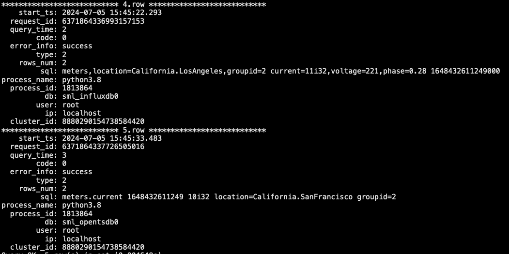

# 慢查询日志 Test Spec

## 1. 测试目标

功能验证：用户可以通过参数配置对慢查询进行个性化配置，符合条件的慢查询SQL会记录到TDengine数据库的log系统表
性能验证：开启慢查询日志功能后不会对其他sql性能有较大的性能影响

## 2. 变更历史

| Date | Version | Owner | Memo |
| --- | --- | --- | --- |
| 2024.6.11 | 1.0.0 | 翟坤 | 创建 |
| 2024.6.16 | 1.1.0 | 翟坤 | 更新用例 |
| 2024.6.17 | 1.1.1 | 翟坤 | 评审后更新用例 |
| 2024.7.9 | 2.0.0 | 翟坤 | 测试完成更新文档 |

## 3. 测试结论

测试通过

### 3.1 功能测试

有5个遗留问题，不影响慢查询主功能且均为TDengine公共机制引发的bug， 本次功能发布作为已知问题。具体问题和限制，参见 5章节-已知问题和限制

### 3.2 性能测试

通过taosBenchmark在20并发连续执行写入和查询的场景下写入和查询性能并无明显波动（在此场景下系统资源压力较小），latency变长比率小于5%。
Note：由于DB高并发有问题，查询压力无法提高，目前无法验证在高并发资源匮乏的场景下频繁记录慢查询对性能的影响，计划待开发完成相关优化后再补充测试：
TD-29948

### 3.3 兼容性测试

| 测试场景 | 测试步骤 | 测试结果 |
| --- | --- | --- |
| 3.3.1.0版本客户端 + 新版服务端 | 1. 部署新版TDengine 1. 部署旧版TDengine 1. 启动旧版的客户端连接新版taosd，前三位版本不一致，报错Version not compatible | 测试通过 |
| 旧版taoskeeper+新版服务端 | 1. 部署新版TDengine 1. 使用旧版TDinsight连接新版taosd，监测面板数据显示正常 | 测试通过 |

### 3.4 稳定性测试

因时间有限，仅在slowLogThreshold为0的场景下分别做简单的持续并发和查询2类稳定性测试

| 测试场景 | 测试步骤 | 测试结果 |
| --- | --- | --- |
| 10并发写入场景 | 1. 通过taosBenchmark在持续写入100亿数据到超级表，其中超级表包含100W子表 1. 写入过程中未发现core或内存溢出 | 测试通过 |
| 持续并发查询场景 | 1. 基于100亿数据包含100W子表的超级表进行并发查询 1. 查询过程中未发现core或内存溢出 | 测试通过 |

## 4. 开发质量报告

结论：一般

| 统计指标 | 数量 |
| --- | --- |
| 提测被拒次数 （测试阻塞，无法进行） | 0 |
| 基础测试用例不通过 | 0 |
| Bug 总数 | 18 |
| 严重 Bug 总数 | 0 |

## 5. 已知问题和限制

1. sml方式写入数据若记录为慢查询，由于没有对应的真实sql，表中的sql字段对应内容为插入数据集合的首条数据，例如influxdb协议保存内容为*meters,location=California.LosAngeles,groupid=2 current=11i32,voltage=221,phase=0.28 1648432611249000*

1. monitorFQDN不支持通过alter命令动态修改
2. 遗留问题
  1. 
    TD-30761

  1. 
    TD-30797

  1. 
    TD-30732

  1. 
    TD-30792

   - ：在性能测试中发现，但不是必现问题
    TD-30880

## 6. 测试资源及环境

### 6.1 功能测试

 测试平台：Linux x64
 测试资源：192.168.0.215

### 6.2 性能测试

 测试平台：Linux x64
 测试资源：

| 机器IP | 用途 | cpu | memory | disk |
| --- | --- | --- | --- | --- |
| 192.168.1.54 | Client, taosBenchnmark | Intel(R) Xeon(R) CPU E5-2620 v3 @ 2.40GHz * 40C | 256G | SSD 2T |
| 192.168.1.43 | Master | Intel(R) Xeon(R) CPU E5-2620 v3 @ 2.40GHz * 40C | 256G | SSD 2T |
| 192.168.1.58 | Slave | Intel(R) Xeon(R) CPU E5-2620 v3 @ 2.40GHz * 40C | 256G | SSD 2T |
| 192.168.1.61 | Slave | Intel(R) Xeon(R) CPU E5-2620 v3 @ 2.40GHz * 40C | 256G | SSD 2T |

## 7. 测试范围及重点

- 新增系统表字段和内容验证
- 慢查询日志相关参数的功能验证
- 慢查询日志上报机制验证
- 版本兼容性测试
- 开启慢查询日志后性能对比验证

## 8. 测试用例

### 8.1 功能测试用例

#### 8.1.1 相关参数测试

慢查询功能是基于监控服务，所以在做本章节的测试前，需要将监控服务打开，并保证服务工作正常
- monitor=1
- monitorFqdn配置为taoskeeper的IP
- monitorPort配置为6041

##### 8.1.1.1 slowLogScope

最基本的CI测试可通过slowLogThresholdTest=0，slowLogThresholdTest>0的场景需要通过手动验证

| 测试类型 | 测试场景 | 用例No. | 测试用例名称 | 测试步骤 | 测试结果 | 自动化 | 备注 |
| --- | --- | --- | --- | --- | --- | --- | --- |
| 1 | 默认值为QUERY | 1. taos.cfg未配置 slowLogScope 1. QUERY类型慢查询会记录到本地日志和数据库taos_slow_sql_detail表 1. INSERT类型慢查询不会记录到本地日志和数据库taos_slow_sql_detail表 1. OTHERS类型慢查询不会记录到本地日志和数据库taos_slow_sql_detail表 | PASS | Y | 通过Create database 是配置大量的vnode可以延长创建时间，比如vgroup=10，replica=3，但是要考虑内存是否足够 |
| 2 | 1. 服务端taos.cfg配置 slowLogScope=ALL 1. QUERY类型慢查询会记录到本地日志和数据库taos_slow_sql_detail表 1. INSERT类型慢查询会记录到本地日志和数据库taos_slow_sql_detail表 1. OTHERS类型慢查询会记录到本地日志和数据库taos_slow_sql_detail表 | PASS | Y |  |
| 3 | 1. 通过命令配置 slowLogScope=ALL 1. QUERY类型慢查询会记录到本地日志和数据库taos_slow_sql_detail表 1. INSERT类型慢查询会记录到本地日志和数据库taos_slow_sql_detail表 1. OTHERS类型慢查询会记录到本地日志和数据库taos_slow_sql_detail表 | PASS | Y |  |
| 4 | 1. 服务端taos.cfg配置 slowLogScope=QUERY 1. QUERY类型慢查询会记录到本地日志和数据库taos_slow_sql_detail表 1. INSERT类型慢查询不会记录到本地日志和数据库taos_slow_sql_detail表 1. OTHERS类型慢查询不会记录到本地日志和数据库taos_slow_sql_detail表 | PASS | Y |  |
| 5 | 1. 通过命令配置 slowLogScope=QUERY 1. QUERY类型慢查询会记录到本地日志和数据库taos_slow_sql_detail表 1. INSERT类型慢查询不会记录到本地日志和数据库taos_slow_sql_detail表 1. OTHERS类型慢查询不会记录到本地日志和数据库taos_slow_sql_detail表 | PASS | Y |  |
| 6 | 1. 服务端taos.cfg配置 slowLogScope=INSERT 1. QUERY类型慢查询不会记录到本地日志和数据库taos_slow_sql_detail表 1. INSERT类型慢查询会记录到本地日志和数据库taos_slow_sql_detail表 1. OTHERS类型慢查询不会记录到本地日志和数据库taos_slow_sql_detail表 | PASS | Y |  |
| 7 | 1. 通过命令配置 slowLogScope=INSERT 1. QUERY类型慢查询不会记录到本地日志和数据库taos_slow_sql_detail表 1. INSERT类型慢查询会记录到本地日志和数据库taos_slow_sql_detail表 1. OTHERS类型慢查询不会记录到本地日志和数据库taos_slow_sql_detail表 | PASS | Y |  |
| 8 | 1. 服务端taos.cfg配置 slowLogScope=OTHER 1. QUERY类型慢查询不会记录到本地日志和数据库taos_slow_sql_detail表 1. INSERT类型慢查询不会记录到本地日志和数据库taos_slow_sql_detail表 1. OTHERS类型慢查询会记录到本地日志和数据库taos_slow_sql_detail表 | PASS | Y |  |
| 9 | 1. 通过命令配置 slowLogScope=OTHER 1. QUERY类型慢查询不会记录到本地日志和数据库taos_slow_sql_detail表 1. INSERT类型慢查询不会记录到本地日志和数据库taos_slow_sql_detail表 1. OTHERS类型慢查询会记录到本地日志和数据库taos_slow_sql_detail表 | PASS | Y |  |
| 10 | 1. 服务端taos.cfg配置 slowLogScope=NONE 1. QUERY类型慢查询不会记录到本地日志和数据库taos_slow_sql_detail表 1. INSERT类型慢查询不会记录到本地日志和数据库taos_slow_sql_detail表 1. OTHERS类型慢查询不会记录到本地日志和数据库taos_slow_sql_detail表 | PASS | Y |  |
| 11 | 1. 通过命令配置 slowLogScope=NONE 1. QUERY类型慢查询不会记录到本地日志和数据库taos_slow_sql_detail表 1. INSERT类型慢查询不会记录到本地日志和数据库taos_slow_sql_detail表 1. OTHERS类型慢查询不会记录到本地日志和数据库taos_slow_sql_detail表 | PASS | Y |  |
| 12 | 1. 服务端taos.cfg配置slowLogScope=QUERY | INSERT | OTHER | NONE 1. QUERY类型慢查询会记录到本地日志和数据库taos_slow_sql_detail表 1. INSERT类型慢查询会记录到本地日志和数据库taos_slow_sql_detail表 1. OTHERS类型慢查询会记录到本地日志和数据库taos_slow_sql_detail表 | PASS | Y |  |
| 13 | 1. 通过命令配置slowLogScope=QUERY | INSERT | OTHER | NONE 1. QUERY类型慢查询会记录到本地日志和数据库taos_slow_sql_detail表 1. INSERT类型慢查询会记录到本地日志和数据库taos_slow_sql_detail表 1. OTHERS类型慢查询会记录到本地日志和数据库taos_slow_sql_detail表 | PASS | Y |  |
| 14 | 1. 服务端taos.cfg配置slowLogScope=QUERY | INSERT | OTHER | NONE 1. QUERY和OTHERS类型慢查询会记录到本地日志和数据库taos_slow_sql_detail表 1. INSERT类型慢查询不会记录到本地日志和数据库taos_slow_sql_detail表 | PASS | Y |  |
| 15 | 1. 通过命令配置slowLogScope=QUERY | INSERT | OTHER | NONE 1. QUERY和OTHERS类型慢查询会记录到本地日志和数据库taos_slow_sql_detail表 1. INSERT类型慢查询不会记录到本地日志和数据库taos_slow_sql_detail表 | PASS | Y |  |
| 16 | 1. 服务端taos.cfg配置slowLogScope=QUERY | INSERT 1. QUERY和INSERT类型慢查询会记录到本地日志和数据库taos_slow_sql_detail表 1. OTHERS类型慢查询不会记录到本地日志和数据库taos_slow_sql_detail表 | PASS | Y |  |
| 17 | 1. 通过命令配置slowLogScope=QUERY | INSERT 1. QUERY和INSERT类型慢查询会记录到本地日志和数据库taos_slow_sql_detail表 1. OTHERS类型慢查询不会记录到本地日志和数据库taos_slow_sql_detail表 | PASS | Y |  |
| 18 | 1. 服务端taos.cfg配置slowLogScope=QUERY | NONE 1. QUERY类型慢查询会记录到本地日志和数据库taos_slow_sql_detail表 1. INSERT和OTHERS类型慢查询不会记录到本地日志和数据库taos_slow_sql_detail表 | PASS | Y |  |
| 19 | 1. 通过命令配置slowLogScope=QUERY | NONE 1. QUERY类型慢查询会记录到本地日志和数据库taos_slow_sql_detail表 1. INSERT和OTHERS类型慢查询不会记录到本地日志和数据库taos_slow_sql_detail表 | PASS | Y |  |
| 20 | 1. 服务端taos.cfg配置 slowLogScope=ALL | NONE 1. QUERY类型慢查询会记录到本地日志和数据库taos_slow_sql_detail表 1. INSERT类型慢查询会记录到本地日志和数据库taos_slow_sql_detail表 1. OTHERS类型慢查询会记录到本地日志和数据库taos_slow_sql_detail表 | PASS | Y |  |
| 21 | 1. 通过命令配置 slowLogScope=ALL | NONE 1. QUERY类型慢查询会记录到本地日志和数据库taos_slow_sql_detail表 1. INSERT类型慢查询会记录到本地日志和数据库taos_slow_sql_detail表 1. OTHERS类型慢查询会记录到本地日志和数据库taos_slow_sql_detail表 | PASS | Y |  |
| 22 | 1. 服务端taos.cfg配置slowLogScope=INVLIDVALUE 1. taosd启动失败 | PASS | Y |  |
| 23 | 1. 通过命令配置slowLogScope=INVLIDVALUE 1. 提示明确的错误信息 | PASS | Y |  |
| 24 | 1. 服务端taos.cfg配置slowLogScope=ALL | INSERT1 1. taosd启动失败 | PASS | Y |  |
| 25 | 1. 通过命令配置slowLogScope=ALL | INSERT1 1. 提示明确的错误信息 | PASS | Y |  |
| 26 | 1. 服务端taos.cfg配置slowLogScope=ALL , INSERT 1. taosd启动失败 | PASS | Y |  |
| 27 | 1. 通过命令配置slowLogScope=ALL , INSERT 1. 提示明确的错误信息 | PASS | Y |  |
| 28 | 1. 服务端taos.cfg配置slowLogScope= 1. taosd跳过该参数，不影响启动 | PASS | Y |  |
| 29 | 1. 通过命令配置slowLogScope= 1. 提示明确的错误信息 | FAILED | Y | 1. TD-30761 |
| 30 | 配置为大小写 | 1. 服务端taos.cfg配置slowLogScope=ALL|Query| InSErT|otherS|NONE 1. taosd启动成功 | PASS | Y |  |
| 31 | 分隔符不合法 | 1. 通过命令配置slowLogScope=ALL,Query, InSErT,otherS,NONE 1. 提示明确的错误信息 | PASS | Y |  |
| slowLogScope配置位置生效性 | 32 | 服务端配置生效，客户端配置不生效 | 1. 服务端taos.cfg配置slowLogScope=INSERT 1. 客户端taos.cfg配置slowLogScope=QUERY 1. INSERT类型慢查询会记录到本地日志和数据库taos_slow_sql_detail表 1. QUERY类型慢查询不会记录到本地日志和数据库taos_slow_sql_detail表 | PASS | Y |  |
| 多节点配置一致性 | 33 | 多节点集群，重启后dnode上的配置不一致，启动报错 | 1. 启动三节点集群，成功 1. 修改其中任意节点的slowLogScope配置与其他节点不一致，启动该节点 1. create dnode 时检测配置是否一致，不一致报错 | PASS | Y |  |

##### 8.1.1.2 slowLogThreshold

最基本的CI测试可通过slowLogThresholdTest=0，slowLogThresholdTest>0的场景需要通过手动验证

| 测试类型 | 测试场景 | 用例No. | 测试用例名称 | 测试步骤 | 测试结果 | 自动化 | 备注 |
| --- | --- | --- | --- | --- | --- | --- | --- |
| 1 | 默认值为10(s) | 1. taos.cfg未配置 slowLogThreshold，配置slowLogScope为ALL 1. 超过10s的QUERY类型慢查询会记录到本地日志和数据库taos_slow_sql_detail表 1. 低于10s的QUERY类型慢查询不会记录到本地日志和数据库taos_slow_sql_detail表 1. 超过10s的INSERT类型慢查询会记录到本地日志和数据库taos_slow_sql_detail表 1. 低于10s的INSERT类型慢查询不会记录到本地日志和数据库taos_slow_sql_detail表 1. 超过10s的OTHERS类型慢查询会记录到本地日志和数据库taos_slow_sql_detail表 1. 低于10s的OTHERS类型慢查询不会记录到本地日志和数据库taos_slow_sql_detail表 | PASS?? |  |  |
| 2 | taos.cfg配置slowLogThreshold=1 | 1. taos.cfg配置 slowLogThreshold=1，配置slowLogScope为ALL 1. 超过1s的QUERY类型慢查询会记录到本地日志和数据库taos_slow_sql_detail表 1. 低于1s的QUERY类型慢查询不会记录到本地日志和数据库taos_slow_sql_detail表 1. 超过1s的INSERT类型慢查询会记录到本地日志和数据库taos_slow_sql_detail表 1. 低于1s的INSERT类型慢查询不会记录到本地日志和数据库taos_slow_sql_detail表 1. 超过1s的OTHERS类型慢查询会记录到本地日志和数据库taos_slow_sql_detail表 1. 低于1s的OTHERS类型慢查询不会记录到本地日志和数据库taos_slow_sql_detail表 | PASS | Y |  |
| 3 | 通过命令配置slowLogThreshold=1 | 1. 通过命令配置 slowLogThreshold=1，配置slowLogScope为ALL 1. 超过1s的QUERY类型慢查询会记录到本地日志和数据库taos_slow_sql_detail表 1. 低于1s的QUERY类型慢查询不会记录到本地日志和数据库taos_slow_sql_detail表 1. 超过1s的INSERT类型慢查询会记录到本地日志和数据库taos_slow_sql_detail表 1. 低于1s的INSERT类型慢查询不会记录到本地日志和数据库taos_slow_sql_detail表 1. 超过1s的OTHERS类型慢查询会记录到本地日志和数据库taos_slow_sql_detail表 1. 低于1s的OTHERS类型慢查询不会记录到本地日志和数据库taos_slow_sql_detail表 | PASS | Y |  |
| 4 | 通过命令配置slowLogThreshold=*2147483647* | 1. 通过命令配置 slowLogThreshold=*2147483647* 1. 时间太长，仅验证边界值是否可成功配置 | PASS | Y |  |
| 5 | 1. 服务端taos.cfg配置slowLogThreshold=0 1. taosd启动失败 | PASS | Y |  |
| 6 | 1. 通过命令配置slowLogThreshold=0 1. 提示明确的错误信息 | PASS | Y |  |
| 7 | 1. 服务端taos.cfg配置slowLogThreshold=0.1 1. taosd启动失败 | PASS | Y |  |
| 8 | 1. 通过命令配置slowLogThreshold=0.1 1. 提示明确的错误信息 | PASS | Y |  |
| 9 | 1. 服务端taos.cfg配置slowLogThreshold=*2147483648* 1. taosd启动失败 | PASS | Y |  |
| 10 | 1. 通过命令配置slowLogThreshold=*2147483648* 1. 提示明确的错误信息 | PASS | Y |  |
| 11 | 1. 服务端taos.cfg配置slowLogThreshold=0 1. taosd启动失败 | PASS | Y |  |
| 12 | 1. 通过命令配置slowLogThreshold=one 1. 提示明确的错误信息 | PASS | Y |  |
| 13 | 1. 服务端taos.cfg配置slowLogThreshold= 1. 忽略该配置，taosd启动不受影响 | PASS | Y |  |
| 14 | 1. 服务端taos.cfg配置slowLogThreshold= 1. 提示明确的错误信息 | PASS | Y |  |
| 15 | 服务端配置生效，客户端配置不生效 | 1. 服务端taos.cfg配置slowLogThreshold=1 1. 客户端taos.cfg配置slowLogThreshold=5 1. 配置slowLogScope为ALL 1. 超过1s的QUERY类型慢查询会记录到本地日志和数据库taos_slow_sql_detail表 1. 超过1s的INSERT类型慢查询会记录到本地日志和数据库taos_slow_sql_detail表 1. 超过1s的OTHERS类型慢查询会记录到本地日志和数据库taos_slow_sql_detail表 | PASS | Y |  |
| 16 | 服务端默认值，客户端配置不生效 | 1. 服务端默认taos.cfg配置 1. 客户端taos.cfg配置slowLogThreshold=1 1. 配置slowLogScope为ALL 1. 超过1s的QUERY类型慢查询不会记录到本地日志和数据库taos_slow_sql_detail表 1. 超过1s的INSERT类型慢查询不会记录到本地日志和数据库taos_slow_sql_detail表 1. 超过1s的OTHERS类型慢查询不会记录到本地日志和数据库taos_slow_sql_detail表 | PASS | Y |  |
| 17 | 多节点集群，重启后dnode上的配置不一致，启动报错 | 1. 启动三节点集群，成功 1. 修改其中任意节点的slowLogThreshold配置与另外两节点不一致，启动该节点报错 | PASS | Y |  |
| 18 | add dnode 时检测配置是否一致 | 1. add dnode 时检测配置是否一致，不一致报错 | PASS | Y |  |

##### 8.1.1.3 slowLogMaxLen

| 测试类型 | 测试场景 | 用例No. | 测试用例名称 | 测试步骤 | 测试结果 | 自动化 | 备注 |
| --- | --- | --- | --- | --- | --- | --- | --- |
| 1 | 默认值为4096 | 1. taos.cfg未配置 slowLogMaxLen，配置slowLogScope为ALL 1. 超过10s的QUERY类型慢查询会记录到本地日志和数据库taos_slow_sql_detail表 1. 低于10s的QUERY类型慢查询不会记录到本地日志和数据库taos_slow_sql_detail表 1. 超过10s的INSERT类型慢查询会记录到本地日志和数据库taos_slow_sql_detail表 1. 低于10s的INSERT类型慢查询不会记录到本地日志和数据库taos_slow_sql_detail表 1. 超过10s的OTHERS类型慢查询会记录到本地日志和数据库taos_slow_sql_detail表 1. 低于10s的OTHERS类型慢查询不会记录到本地日志和数据库taos_slow_sql_detail表 | PASS | Y |  |
| 2 | taos.cfg配置slowLogMaxLen=1 | 1. taos.cfg配置 slowLogMaxLen=1，配置slowLogScope为ALL 1. 超过10的QUERY类型慢查询会做截断处理 1. 超过10的INSERT类型慢查询会做截断处理 1. 超过10的OTHERS类型慢查询会做截断处理 | PASS | Y |  |
| 3 | taos.cfg配置slowLogMaxLen=10 | 1. taos.cfg配置 slowLogMaxLen=10，配置slowLogScope为ALL 1. 超过10的QUERY类型慢查询会做截断处理 1. 超过10的INSERT类型慢查询会做截断处理 1. 超过10的OTHERS类型慢查询会做截断处理 | PASS | Y |  |
| 4 | taos.cfg配置slowLogMaxLen=16384 | 1. taos.cfg配置 slowLogMaxLen=16384，配置slowLogScope为ALL 1. 超过10的QUERY类型慢查询会做截断处理 1. 超过10的INSERT类型慢查询会做截断处理 1. 超过10的OTHERS类型慢查询会做截断处理 | PASS | Y |  |
| 7 | 1. 服务端taos.cfg配置slowLogMaxLen=0 1. taosd启动失败 | PASS | Y |  |
| 8 | 1. 通过命令配置slowLogMaxLen=0 1. 提示明确的错误信息 | PASS | Y |  |
| 9 | 1. 服务端taos.cfg配置slowLogMaxLen=0.1 1. taosd启动失败 | PASS | Y |  |
| 10 | 1. 通过命令配置slowLogMaxLen=0.1 1. 提示明确的错误信息 | PASS | Y |  |
| 11 | 1. 服务端taos.cfg配置slowLogMaxLen=16384 1. taosd启动失败 | PASS | Y |
| 12 | 1. 通过命令配置slowLogMaxLen=16384 1. 提示明确的错误信息 | PASS | Y |
| 13 | 1. 服务端taos.cfg配置slowLogMaxLen=one 1. taosd启动失败 | PASS | Y |  |
| 14 | 1. 通过命令配置slowLogMaxLen=one 1. 提示明确的错误信息 | PASS | Y |  |
| 15 | 1. 服务端taos.cfg配置slowLogMaxLen= 1. taosd启动失败 | PASS | Y |  |
| 16 | 1. 服务端taos.cfg配置slowLogMaxLen= 1. 提示明确的错误信息 | PASS | Y |  |
| slowLogMaxLen配置位置生效性 | 17 | 服务端配置生效，客户端配置不生效 | 1. 服务端taos.cfg配置slowLogMaxLen=10 1. 客户端taos.cfg配置slowLogMaxLen=5 1. 配置slowLogScope为ALL 1. 超过10的QUERY类型慢查询会被截断 1. 超过10的INSERT类型慢查询会被截断 1. 超过10的OTHERS类型慢查询会被截断 | PASS | Y |  |
| 18 | 多节点集群，重启后dnode上的配置不一致，启动报错 | 1. 启动三节点集群，成功 1. 修改其中任意节点的slowLogMaxLen配置与另外两节点不一致，启动该节点报错 | PASS | Y |  |
| 19 | add dnode 时检测配置是否一致 | 1. add dnode 时检测配置是否一致，不一致报错 | PASS | Y |  |

#### 8.1.2 新增监控表测试

| 测试类型 | 测试场景 | 用例No. | 测试用例名称 | 测试步骤 | 测试结果 | 自动化 | 备注 |
| --- | --- | --- | --- | --- | --- | --- | --- |
| 超级表名验证 | 1 | 超级表明验证 | 超级表名为taos_slow_sql_detail | PASS | N |  |
| 子表名验证 | 2 | 子表名验证 | 所有子表名起名规则：{"user"}_{"db"}_{"ip"}_clusterId{"cluster_id"} | PASS | N |  |
| 3 | start_ts | 1. taos.cfg配置 slowLogMaxLen=0，配置slowLogScope为ALL 1. 验证QUERY类型慢查询的start_ts时间 1. 验证INSERT类型慢查询的start_ts时间 1. 验证OTHERS类型慢查询的start_ts时间 | PASS | N |  |
| 4 | request_id | 检查时hash随机值 | PASS | Y |  |
| 5 | query_time | 1. 验证QUERY类型慢查询的执行时间 1. 验证INSERT类型慢查询的执行时间 1. 验证OTHERS类型慢查询的执行时间 1. 超时但sql未完成中断的SQL执行时间测试用例在 8.1.3 章节中验证 | PASS | N |  |
| 6 | code | 1. 执行成功返回0 1. 执行sql超时后，kill query [id] | PASS | Y |  |
| 7 | error_info | 按照错误类型等价类，分别验证不同的失败场景 | PASS | Y |  |
| 8 | type | 1. 验证QUERY类型慢查询的type值为1 1. 验证INSERT类型慢查询的type值为2 1. 验证OTHERS类型慢查询的type值为4 | PASS | Y |  |
| 9 | rows_num | 1. 验证QUERY类型慢查询的rows_num为查询返回数据集行数 1. 验证INSERT类型慢查询的rows_num为插入数据集行数 1. 验证OTHERS类型慢查询的rows_num为sql？？ | PASS | Y |  |
| 10 | sql | 记录sql内容，截断逻辑的测试用例在8.1.1.3章节中覆盖 | PASS | Y |  |
| 11 | process_name | 验证python模式对应的进程名为python3.8 taosBenchmark对应的进程名为taosBenchmark | PASS 测试过程中可以看到taos、Python3.8和taosadaper | Y |  |
| 12 | process_id | 验证python模式对应的进程ID | PASS | Y |  |
| 13 | db | 1. 创建db1和db2 1. Use db1，Select * from table，db值为db1 1. Use db2，Select * from table，db值为db2 1. Use db1，Select * from db2.table，db值为db2 1. Using db1，select* from db1.table, db2.table, db值为db1，db2 1. 未执行 use db操作，select* from db1.table, db2.table, db值为db1，db2 | PASS | Y |  |
| 14 | user | 1. 创建user1和user2 1. 切换用户为user1，执行慢查询，user值为user1 1. 切换用户为user1，执行慢查询，user值为user2 | PASS | Y |  |
| 15 | ip | 1. 该ip值为taosadapter服务所在node节点ip 1. taosc所在节点ip (ip显示内容为taos.cfg配置的FQDN的值) | PASS 显示为localhost | Y |  |
| 16 | cluster_id | 创建2个集群，分别执行慢查询，cluster_id存储集群id值正确 | PASS | Y |  |

#### 8.1.3 特殊场景验证

| 测试类型 | 测试场景 | 用例No. | 测试用例名称 | 测试步骤 | 测试结果 | 自动化 | 备注 |
| --- | --- | --- | --- | --- | --- | --- | --- |
| 1 | 超时但sql未完成，在taosc里ctrl+c中断SQL执行 | 1. 通过命令配置 slowLogThreshold=1，配置slowLogScope为ALL 1. 超过1s的QUERY，客户端ctrl+c中断执行，慢查询会记录到本地日志和数据库taos_slow_sql_detail表，验证执行时间 1. 超过1s的INSERT，客户端ctrl+c中断执行，慢查询会记录到本地日志和数据库taos_slow_sql_detail表，验证执行时间 1. ~~超过1s的OTHERS，客户端ctrl+c中断执行，慢查询会记录到本地日志和数据库taos_slow_sql_detail表，验证执行时间~~ | PASS | N |  |
| 2 | 超时但sql未完成，kill -9关闭客户端，中断SQL执行，无记录 | 1. 通过命令配置 slowLogThreshold=1，配置slowLogScope为ALL 1. 超过1s的QUERY，关闭客户端中断执行，不会记录慢查询 1. 超过1s的INSERT，关闭客户端中断执行，不会记录慢查询 1. 超过1s的OTHERS，关闭客户端中断执行，会记录慢查询 | FAILED | N | 删除db复现 [TD-30732](https://jira.taosdata.com:18080/browse/TD-30732) |
| 3 | 超时但sql未完成，kill query中断SQL执行 | 1. 通过命令配置 slowLogThreshold=1，配置slowLogScope为ALL 1. 超过1s的QUERY，另一个客户端kill query中断执行，慢查询会记录到本地日志和数据库taos_slow_sql_detail表，验证执行时间 1. 超过1s的INSERT，另一个客户端kill query中断执行，慢查询会记录到本地日志和数据库taos_slow_sql_detail表，验证执行时间 1. 超过1s的OTHERS，另一个客户端kill query中断执行，慢查询会记录到本地日志和数据库taos_slow_sql_detail表，验证执行时间 | PASS | N |  |
| ~~超时sql已完成，客户端crash场景~~ | ~~5~~ | ~~超时sql已完成但未上报，kill客户端进程~~ | 1. ~~通过命令配置 slowLogThreshold=1，配置slowLogScope为ALL，配置monitorInterval=10~~ 1. ~~超过1s的QUERY完成，kill客户端进程中重启客户端，等待上报周期完成，慢查询会记录到本地日志和数据库taos_slow_sql_detail表，验证执行时间~~ 1. ~~超过1s的INSERT完成，kill客户端进程中重启客户端，等待上报周期完成，慢查询会记录到本地日志和数据库taos_slow_sql_detail表，验证执行时间~~ 1. ~~超过1s的OTEHRS完成，kill客户端进程中重启客户端，等待上报周期完成，慢查询会记录到本地日志和数据库taos_slow_sql_detail表，验证执行时间~~ | N/A | N |  |
| 6 | 1. slowLogScope=None 1. 不开启监控，monitor=0 1. 慢查询信息不记录本地日志也不上报 | PASS | N |  |
| 7 | 1. slowLogScope=None 1. 开启监控，monitor=1 1. 慢查询信息不记录本地日志也不上报 | PASS | N |  |
| 8 | 记录本地日志，但不上报 | 1. slowLogScope=QUERY或INSERT或ALL或OTHERS或QUERY|ALL 1. 不开启监控，monitor=0 1. 慢查询信息记录本地日志，但不上报 | PASS | N |  |
| 9 | 记录本地日志，并上报 | 1. slowLogScope=QUERY或INSERT或ALL或OTHERS或QUERY|ALL 1. 不开启监控，monitor=1 1. 慢查询信息记录本地日志，并上报 | PASS | N |  |
| 10 | 服务端配置文件修改慢查询参数，客户端同步相关配置 | 1. 服务端配置slowLogThreshold=20s 1. 客户端执行超过5s的查询SQL，不会被记录为慢查询 1. 服务端（所有节点）配置slowLogThreshold=1s后重启服务 1. 等待2s后，相同客户端执行超过5s的查询SQL，会被记录为慢查询 | PASS | N |  |
| 11 | 服务端通过命令修改慢查询参数，客户端同步相关配置 | 1. 服务端配置slowLogThreshold=20s 1. 客户端执行超过5s的查询SQL，不会被记录为慢查询 1. 服务端（所有节点）通过命令修改slowLogThreshold=1s 1. 等待2s后，相同客户端执行超过5s的查询SQL，会被记录为慢查询 | PASS | N |  |
| 12 | 修改非mnode节点的慢查询配置不生效 | 1. 服务端默认配置，客户端执行超过5s的查询SQL，不会被记录为慢查询 1. 服务端（非mnode节点）通过命令修改slowLogThreshold=1s 1. 等待2s后，相同客户端执行超过5s的查询SQL，不会被记录为慢查询 1. 服务端（mnode节点）通过命令修改slowLogThreshold=1s 1. 等待2s后，相同客户端执行超过5s的查询SQL，会被记录为慢查询 | PASS | N |  |
| 13 | 通过命令修改慢查询配置，在dnode重启后失效 | 1. 服务端默认配置，客户端执行超过5s的查询SQL，不会被记录为慢查询 1. 服务端（所有节点）通过命令修改slowLogThreshold=1s 1. 等待2s后，相同客户端执行超过5s的查询SQL，会被记录为慢查询 1. 重启mnode所在节点的dnode 1. 相同客户端执行超过5s的查询SQL，不会被记录为慢查询 1. 生效配置为mnode所在节点的默认配置 | FAILED | N | TD-30792 |
| 14 | STMT-bind_param单行插入 | 通过STMT bind_param单行插入方式触发慢查询，相关数据库表中信息记录正确 | PASS | Y |  |
| 15 | STMT-bind_param_batch多行批量插入 | 通过STMT bind_param_batch多行批量插入方式触发慢查询，相关数据库表中信息记录正确 | PASS | Y |  |
|  | STMT-查询 | 通过STMT进行表数据查询操作，相关数据库表中信息记录正确 | FAILED | Y | TD-30797 |
| 16 | SML写入-Json格式 | 通过SML写入-Json格式方式触发慢查询，相关数据库表中信息记录正确 | PASS | Y |  |
| 17 | SML写入-telnet格式 | 通过SML写入-telnet格式方式触发慢查询，相关数据库表中信息记录正确 | PASS | Y |  |
| 18 | SML写入-line格式 | 通过SML写入-line格式方式触发慢查询，相关数据库表中信息记录正确 | PASS | Y |  |
| 一个客户端上报到多个集群 | 19 | 多个集群，慢查询配置不一致 | 1. 配置2个TDengine集群，一个集群开启慢查询，另一个集群关闭慢查询 1. 开启慢查询的集群对应信息被记录到监控表 1. 未开启慢查询的集群对应信息不会被记录到监控表 | PASS | N |  |
|  | 监控数据保存至非本地数据库 | 20 | 本地上报的监控数据监控数据保存至非本地数据库 | 1. 配置2个TDengine集群，集群1 配置monitor相关配置，将慢查询数据保存至集群2 1. 集群1中执行慢查询sql，集群1本地文件保存慢查询数据，集群2中的监控表中保存对应的慢查询数据 | PASS | N |  |

#### 8.1.4 TD版本验证

| 测试类型 | 测试场景 | 用例No. | 测试用例名称 | 测试步骤 | 测试结果 | 自动化 | 备注 |
| --- | --- | --- | --- | --- | --- | --- | --- |
| 社区版 | 1 | 社区版支持慢查询 | 所有功能测试都是基于社区版，该用例不用重复验证 | PASS | N |  |
| 企业版 | 2 | 企业版支持慢查询 | 企业版手动验证基本功能 | PASS | N |  |

#### 8.1.5 log库子表名验证

| 测试类型 | 测试场景 | 用例No. | 测试用例名称 | 测试步骤 | 测试结果 | 自动化 | 备注 |
| --- | --- | --- | --- | --- | --- | --- | --- |
| 功能测试 | 验证log库中子表名称定义正确 | 1 | 验证log库中子表名称定义正确 | @佘彦杰需要提供log库子表名称命名规则：{"user"}_{"db"}_{"ip"}_clusterId{"cluster_id"} 需要提供log库子表名称命名规则：{"user"}_{"db"}_{"ip"}_clusterId{"cluster_id"} | PASS | N | 名称：root_db_u0215_clusterid_7189850025704648407 |

#### 8.1.6 参数维护功能测试

| 测试类型 | 测试场景 | 用例No. | 测试用例名称 | 测试步骤 | 测试结果 | 自动化 | 备注 |
| --- | --- | --- | --- | --- | --- | --- | --- |
| 慢查询相关参数查询功能 | 1 | 慢查询相关参数查询功能 | 通过命令（`slow cluster variables`）展示慢查询配置参数： 1. monitor 1. monitorInterval 1. slowLogThreshold 1. slowLogMaxLen 1. slowLogScope | PASS |  |  |
| 慢查询相关参数修改功能 | 2 | 慢查询相关参数修改功能 | 该部分功能 8.1 相关参数测试 小节中已测试覆盖 | PASS |  |  |

### 8.2 性能测试

基于当前的benchmark测试场景，将slowLogThreshold配置从0开始逐渐增加，观察不同的threshold阈值对查询性能，资源消耗的影响情况，期望能找到在资源消耗和查询性能波动不大（20%以内？）的前提下，一个尽可能小的threshold阈值
Note: 并发查询20个线程，查询时间平均为9秒时，复现 [TD-29948](https://jira.taosdata.com:18080/browse/TD-29948)
   性能测试中发现问题 [TD-30880](https://jira.taosdata.com:18080/browse/TD-30880)， 在04/07更新代码后，无法复现，需要在测试中注意高压场景下taoskeeper是否有每秒上报消息达10条以上，在此场景下，慢查询消息可能会无法更新到taos_slow_sql_detail表

| 测试类型 | 测试场景 | 用例No. | 测试用例名称 | 测试步骤 | QPS | latency | cpu | memory | io | 备注 |
| --- | --- | --- | --- | --- | --- | --- | --- | --- | --- | --- |
| 1 | 关闭monitor | 1.010 | 9.876521s | node-43：3903% node-61：3913% node-58：3992% | node-43：5.13GB node-61：5.06GB node-58：5.03GB | node-43：1.73KB/S node-61：1.27KB/S node-58：1.37KB/S | 写入速度：801222.38/s 写入延迟：176.2014ms 写入时间：128.45s |
| 2 | slowLogThreshold=0 | 1.036 | 9.634155s | node-43：3999% node-61：3996% node-58：3993% | node-43：1.4GB node-61：1.41GB node-58：1.37GB | node-43：1.82KB/S node-61：93.4KB/S node-58：1.37KB/S | 写入速度：883180.11/s 写入延迟：159.8501ms 写入时间：113.22s |
| 3 | slowLogThreshold=1 | 1.017 | 9.786630s | node-43：3861% node-61：3947% node-58：3966% | node-43：1.56GB node-61：1.51GB node-58：1.47GB | node-43：1.91KB/S node-61：3.82KB/S node-58：2KB/S | 写入速度：885444.75/s 写入延迟：159.4413ms 写入时间：112.93s |
| 4 | slowLogThreshold=3 | 1.015 | 9.819959s | node-43：3962% node-61：3996% node-58：3963% | node-43：1.45GB node-61：1.45GB node-58：1.37GB | node-43：3.64KB/S node-61：88.1KB/S node-58：3.09KB/S | 写入速度：885648.34/s 写入延迟：159.4047ms 写入时间：112.92s |
| 5 | slowLogThreshold=10 |  |  |  |  |  |  |
| 6 | slowLogThreshold=20 |  |  |  |  |  |  |

### 8.3 兼容性测试

| 测试类型 | 测试场景 | 用例No. | 测试用例名称 | 测试步骤 | 测试结果 | 自动化 | 备注 |
| --- | --- | --- | --- | --- | --- | --- | --- |
| 旧版客户端+新版服务端 | 1 | 3.3.1.0版本客户端 + 新版服务端 | 1. 部署新版TDengine 1. 部署旧版TDengine 1. 启动旧版的客户端连接新版taosd，前三位版本不一致，报错Version not compatible | PASS | N |  |
| 旧版taoskeeper+新版服务端 | 2 | 旧版taoskeeper+新版服务端 | 1. 部署新版TDengine 1. 使用旧版TDinsight连接新版taosd，监测面板数据显示正常 | PASS | N |  |

## 9. 引用文档

### 9.1 需求文档

[需求说明：慢查询日志](https://taosdata.feishu.cn/wiki/DfyRwstuXiQjC3kmaiycvXm1nob)

### 9.2 设计文档

[慢查询日志](https://taosdata.feishu.cn/wiki/MIUFw4ab1iczeRkkhC9chzsandc)
[慢 sql 上报设计文档](https://taosdata.feishu.cn/wiki/JgHRwrwJDiFsLDkR9RlcRf8HnNe)

### 9.3 其他文档

TS-4921

TD-30646

[Log Long Query](https://taosdata.feishu.cn/wiki/wikcndICFktjw0RO6w1YSDce0ch)
[TDengine 监测](https://taosdata.feishu.cn/wiki/B1W1wfUu8iSefQktLI3cRfeHntd)
[TD-26529:taosd monitor 数据重构和基本观测框架测试报告](https://taosdata.feishu.cn/wiki/Blwkwt53qiQO7wkXdK7c2DFzntd)
