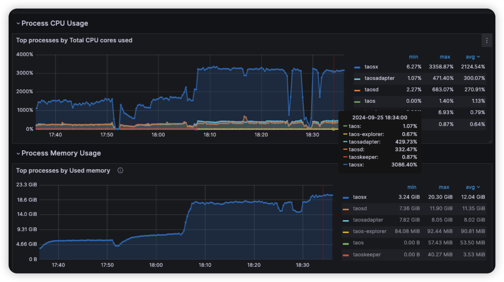

# taosX Transformer Parser 插件化机制 - Test Spec

## 1. 测试目标

- 用户可以通过开发插件的方式实现自定义 Parser 的功能
- 自定义 Parser 与 Rust 原生实现相比，性能没有显著下降，能够满足用户需求（河北电力）

## 2. 变更历史

| Date | Version | Owner | Memo |
| --- | --- | --- | --- |
| 2024.09.13 | 0.1 | @王旭 | 初稿 |
|  |  |  |  |

## 3. 测试范围

<quote-container>
这里用于描述本需求的覆盖范围：
- aaa
- bbb
</quote-container>

## 4. 测试结论

<quote-container>
测试结论中包含结论和关键数据，但不需罗列过多细节，此处需要把把握信息的详细程度，原则上是外部 Reviewer 能够获得清晰的测试结论且尽量没有冗余信息为标准（这个标准是一句正确的废话，具体实行中需要大家 case by case 来处理）
</quote-container>

## 5. 开发质量报告

结论：本特性/优化的开发质量是（优，良，一般，差，很差）

| 统计指标 | 数量 |
| --- | --- |
| 提测被拒次数 |  |
| 基础测试用例不通过 |  |
| Bug 总数 |  |
| 严重 Bug 总数 |  |

## 6. 已知问题和限制

这里用于记录产品使用上的一些限制，包括不支持的场景等，以及在发版时没有解决的minor issues.
- aaa
- bbb

## 7. 测试环境

- OS: Windows, Linux, macOS
- Browser: Chrome

## 8. 测试数据 (Optional)

这里用于描述性能、稳定性测试时的数据准备工作，包括但不局限于：
- field的数量、类型
- tag的数量、类型
- 数据量的大小

## 9. 测试用例

### 9.1 功能

在提测时，开发应保证基础用例全部通过。
| 类型 | 测试目的 | 测试步骤 | 预期结果 | 是否为基础用例 | 测试结果 | 备注 |
| --- | --- | --- | --- | --- | --- | --- |
| 数据源 | 测试 MQTT/Kafka 均可使用自定义 parser |  |  | Y | Pass |  |
| 配置 | 测试默认配置可以正常工作 | 1. 将插件拷贝至 /usr/local/taos/plugins/parsers
1. 重启 taosx | 插件能够正常加载并使用 | Y | Pass |  |
|  | 测试修改插件路径后可以正常工作 | 1. 在 taosx.toml 中修改 plugins_home 为 /root/plugins
1. mkdir -p /root/plugins/parsers
2. 拷贝插件至以上目录
3. 重启 taosx | 插件能够正常加载并使用 |  | Pass |  |
| 插件安装 | 测试插件可以正常加载和使用 |  |  |  | Pass |  |
|  | 测试加载损坏的插件 |  |  |  |  | 当加载损坏的二进制文件时，会出现 taosX 的 API 长时间 pending 的情况 |
| 插件卸载 | 测试插件能够被正常移除 | 1. 在插件安装目录下删除 .so 文件
1. 重启 taosx | 创建任务时，在解析下拉列表，该 parser 不存在 |  | Pass |  |
| 插件编写 | 测试正常编写的插件可以工作 |  |  |  | Pass |  |
|  | 测试缺少 API 的插件在加载时应报错 |  |  |  |  |  |
| 日志 | 测试插件加载时有日志打印 |  | 在 taosx.log 文件中可搜索到 debug 级别的日志打印：
load plugin: |  | Pass |  |

### 9.2 可用性

测试用例包括但不局限于：
- UI是否美观？
- 交互是否合理？
- 字体、字号是否合适？
- 是否存在错别字？

### 9.3 可靠性

这里用于描述稳定性测试相关的内容。

### 9.4 性能

这里用于描述性能测试相关的内容。

#### 9.4.1 20240925

使用内置的 JSON parser 和自定义 parser 对比，rps 的平均值大约下降了 17%
- 使用自定义插件
rps 的平均值为 237482.97
```python
taos> select _c0, derivative(total_kafka_consumed_messages, 1s, 1) as rps   from log.taosx_task_kafka    where   taosx_id = 'u1-69:6050' and task_id = 15   order by _c0 desc   limit 10;
           _c0           |            rps            |
======================================================
 2024-09-25 18:35:33.048 |    244824.482448244816624 |
 2024-09-25 18:35:23.049 |    244175.582441755832406 |
 2024-09-25 18:35:13.048 |    234623.462346234620782 |
 2024-09-25 18:35:03.049 |    232800.000000000000000 |
 2024-09-25 18:34:53.049 |    234600.000000000000000 |
 2024-09-25 18:34:43.049 |    234623.462346234620782 |
 2024-09-25 18:34:33.050 |    236952.609478104364825 |
 2024-09-25 18:34:23.048 |    242090.508610332384706 |
 2024-09-25 18:34:13.060 |    236739.586454899603268 |
 2024-09-25 18:34:03.049 |    233400.000000000000000 |
Query OK, 10 row(s) in set (0.010962s)
```

资源占用情况（2024-09-25 18:20:00）

| 组件 | CPU | Memory |
| --- | --- | --- |
| taosd | 305% | 11.89 GB |
| taosadapter | 390% | 8.03 GB |
| taosx | 3187% | 17.96 GB |



- 使用内置的 JSON parser
rps 的平均值为 287936.71
```python
taos> select _c0, derivative(total_kafka_consumed_messages, 1s, 1) as rps   from log.taosx_task_kafka    where   taosx_id = 'u1-69:6050' and task_id = 25   order by _c0 desc   limit 10;
           _c0           |            rps            |
======================================================
 2024-09-25 19:34:33.046 |    282600.000000000000000 |
 2024-09-25 19:34:23.046 |    294570.542945705412421 |
 2024-09-25 19:34:13.045 |    285057.011402280477341 |
 2024-09-25 19:34:03.047 |    295740.851829634048045 |
 2024-09-25 19:33:53.045 |    286285.885765729704872 |
 2024-09-25 19:33:43.048 |    289171.082891710801050 |
 2024-09-25 19:33:33.047 |    291570.842915708431974 |
 2024-09-25 19:33:23.046 |    283828.382838283840101 |
 2024-09-25 19:33:13.047 |    284456.891378275642637 |
 2024-09-25 19:33:03.049 |    286085.565773690526839 |
Query OK, 10 row(s) in set (0.011634s)
```

资源占用情况（2024-09-25 19:55:00）

| 组件 | CPU | Memory |
| --- | --- | --- |
| taosd | 326% | 12.44 GB |
| taosadapter | 439% | 10.28 GB |
| taosx | 3190% | 24.97 GB |

### 9.5 安全性

测试用例包括但不局限于：
- 日志中是否包含敏感信息？

### 9.6 兼容性

测试用例包括但不局限于：
- 升级安装后，老版本（上一个版本）下创建的任务，能否继续执行？
- 升级安装后，未写入任何数据（未创建任何新任务），是否能够降级并继续运行
- 升级安装后，写入新数据（或创建新的任务）， 是否能够降级并继续运行

### 9.7 本地化

测试用例包括但不局限于：
- 点击切换语言按钮后，UI上的所有元素是否按照选择的语言，正确展示？

## 10. 待讨论(Optional)

这里用于记录在测试或用例编写过程中想到的需要讨论的问题：
- aaa
- bbb

## 11. Jira

此feature相关的所有Jira, 标题中应包含统一的标签: taosx-plugins
<!-- Unsupported block type: 999 -->

## 12. 测试计划 (Optional)

这里用于计划此 feature 测试的开始和结束时间。

## 13. 风险评估

用户记录这个需求的潜在风险，例如：对于功能复杂，开发时间长的功能，是否需要分期提测？

## 14. 测试备忘 (Optional)

- 插件 build & deploy
```bash
cd /data/xwang/taosx/crates/transform/parsers/hebeipower/
cargo build --release
cp target/release/libhebeipower.so /usr/local/taos/plugins/parsers/
```

- 插件的加载采用的是懒加载的方式，在创建任务时，会触发`/transform/parser/plugins`接口调用, 进而触发插件加载
- 插件加载时的日志打印，如下所示：
```plaintext
09/13 16:16:39.991748 DEBUG [plugin:149] TID:0x58bd93d8 [http] load plugin: hebeipower
```


## 15. 参考文档 (Optional)

- [FS - taosX Transformer Parser 插件化机制](https://taosdata.feishu.cn/wiki/YHiCwoHWgi0k9SkMw71cJxFfn8f)
