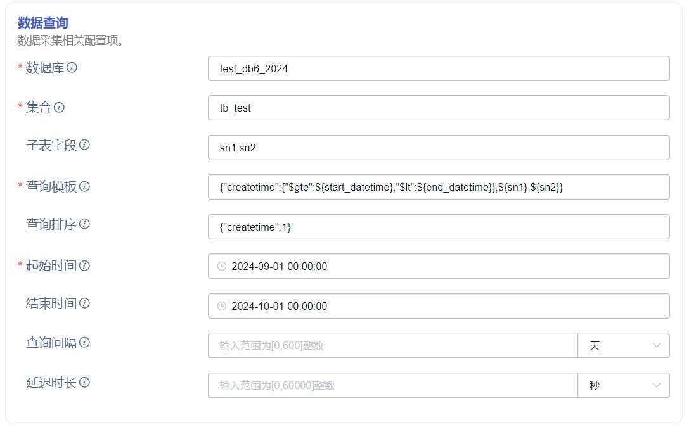
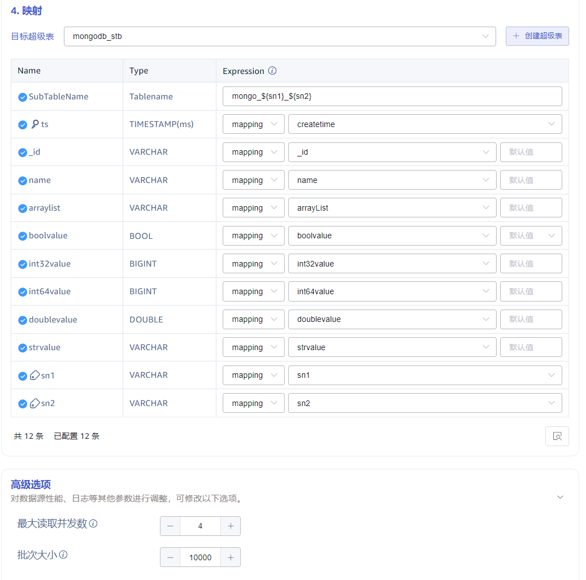

# 3.3.3.0 考试答案

### 1. 第一部分，笔试题目，所有人回答

#### 1.1 说明 TDengine S3 的优点和原因

1. 显著降低存储成本：S3 本身存储成本低，数据上传前通过重新整理提高了压缩比
2. 支持冷数据写入、更新、删除，行为透明：数据拆分多个对象上传，最后一个对象在本地存储， AppendOnly 使得更新发生在最后
3. 查询速度仅下降一倍左右，查询行为透明：存储模型保证同一个表的数据相邻存放，每次查询只需读取少量数据，且预计算数据留在本地

#### 1.2 列出 TDengine S3 支持的厂商

1. 亚马逊：Amazon S3
2. 微软：Azure Blob
3. 腾讯：腾讯 COS
4. 开源：minIO

#### 1.3 说明 taosX 接入数据的主要步骤

1. 配置连接信息
2. 配置 SQL 信息
3. 数据类型转换

#### 1.4 哪个客户在生产环境中用到了 S3 和 MongoDB 接入，用多少数据量

新近签约的沃太能源，使用 MongoDB 积累了 600 亿条、90TB 的数据，正在进行 TDengine 的历史数据迁移

#### 1.5 ODBC32 位驱动程序的业务价值

1. 使用 kepware 或其他类似采集器的工业控制软件，可以用 TDengine 代替 SQL Server，实现控制指令的下发
2. 国产或者国外的某些 SCADA 软件，可以通过 ODBC32 驱动程序读取 TDengine，进而复用其组态软件的功能

#### 1.6 Websocket 接入的优缺点

原生连接方式在服务端升级时，客户端大概率也须升级。而 Websocket 连接方式大概率不需升级，并提供与原生连接相近的性能。POC 阶段为性能考虑，可采用原生接口；在生产环境，建议客户采用 Websocket 接口。

#### 1.7 TDengine 支持那些告警方式

1. 邮件
2. 飞书
3. 钉钉

### 2. 第二部分，笔试题目，售前交付回答

#### 2.1 列出至少 15 个新增的 SQL 函数

1. PI
2. ROUND
3. TRUNCATE
4. TRUNC
5. EXP
6. MOD
7. RAND
8. DEGREES
9. RADIANS
10. GREATEST
11. LEAST
12. CHAR_LENGTH
13. CHAR
14. ASCII
15. TRIM
16. REPLACE
17. REPEAT
18. SUBSTRING
19. SUBSTR
20. SUBSTRING_INDEX(
21. TIMEDIF
22. WEEK
23. WEEKDAY
24. WEEKOFYEAR
25. DAYOFWEEK
26. STDDEV_POP
27. VAR_POP
28. MAX/MIN

#### 2.2 说明慢查询日志的流程

1. 在服务端配置慢查询参数，客户端从服务端拉取配置信息
2. 客户端发现有超过阈值的查询时，将 SQL 发给服务端
3. 服务端将 SQL 发送给 taoskeeper 组件
4. taoskeeper 组件存储到某个 TDengine 集群（可以是本集群）

#### 2.3 列出慢查询涉及的配置参数及其含义

1. slowLogScope：指定启动记录哪些类型的慢 sql（insert/query/others/all)，默认值为 Query
2. slowLogThreshold：指定慢 sql 门限值，默认值 10 秒
3. slowLogMaxLen：指定记录 SQL 语句的最大长度，默认4096
4. monitor、monitorInterval、montiorFqdn、monitorPort： 接收慢日志的taosKeeper 连接信息

#### 2.4 列出慢查询记录的字段

1. 开始执行时间
2. SQL
3. 库名
4. 客户端
5. 用户
6. 执行耗时
7. 返回行

#### 2.5 举例说明 CSV 批量创建子表的 SQL 语句

参照如下语法编写示例
```json
CREATE TABLE
        [IF NOT EXISTS]
        USING stb1_name ([field1_name, ...]) 
        FILE csv_file_path1;
```

#### 2.6 列出 10 个TDengine 支持的告警规则

1. Dnode 节点的 CPU 负载
2. Dnode 节点的的内存
3. Dnode 节点的磁盘容量占用
4. 集群授权到期
5. 测点数达到授权测点数
6. 查询并发请求数
7. 慢查询执行最长时间 （无时间窗口）
8. Dnode下线
9. Vnodes下线
10. 数据删除请求数
11. Adapter RESTful 请求失败
12. Adapter WebSocket 请求失败
13. Dnode 数据上报缺少
14. Dnode 重启

### 3. 第三部分，实操题目

以下是创建“数据写入 - MongoDB”任务时的关键配置信息，仅供参考。
1. 数据查询配置


说明：
1. 当数据从外部数据源导入 TDengine 时，应避免子表维度上的数据乱序，否则会造成 TDengine 写入性能的恶化；为了实现这一点，从外部数据源查询数据时，就需要提前确定数据的子表，每个子表的数据由一个线程写入，从而避免乱序；
2. MongoDB 中，DB 下的 Collection 相当于传统数据库的表，但由于它并没有子表的概念，所以在上图中，就需要指定两个字段来划分子表，distinct(sn1, sn2) 组合的数量即为子表的数量；taosX 在处理时，会根据 distinct(sn1, sn2) 的结果，按子表查询并写入数据。
3. 映射配置

