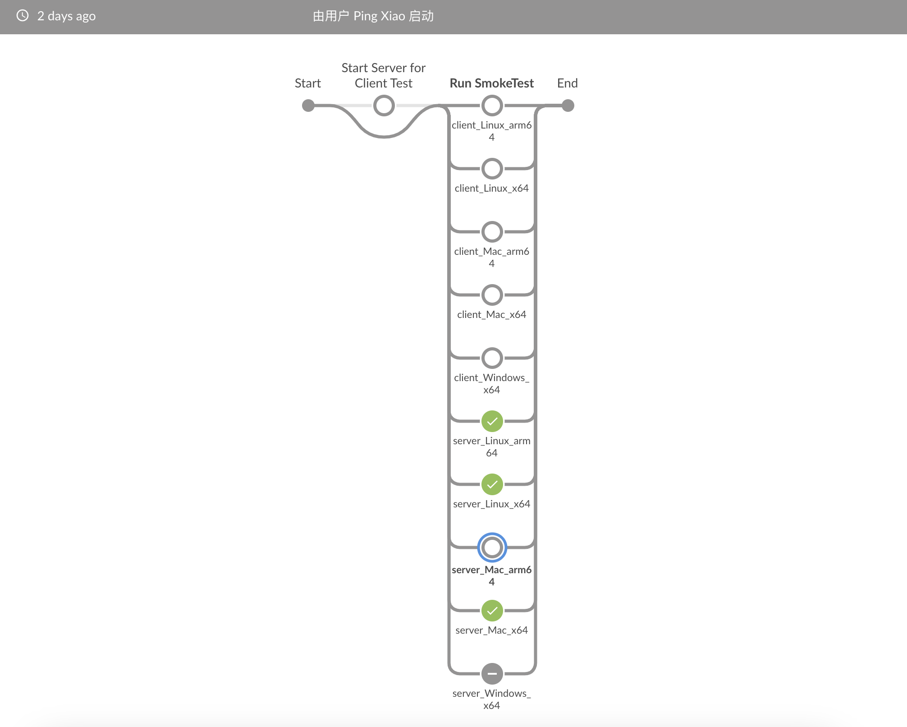
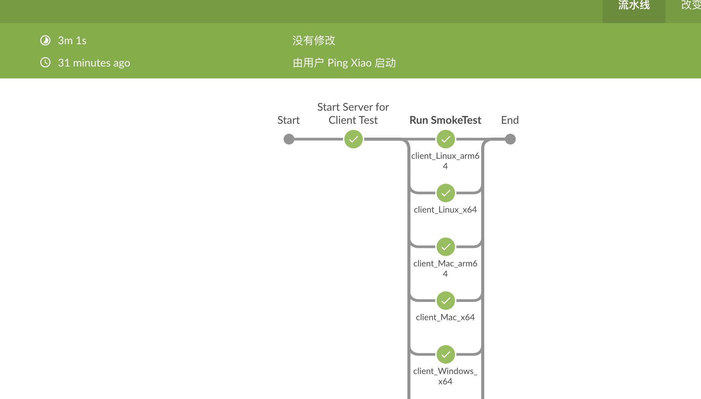
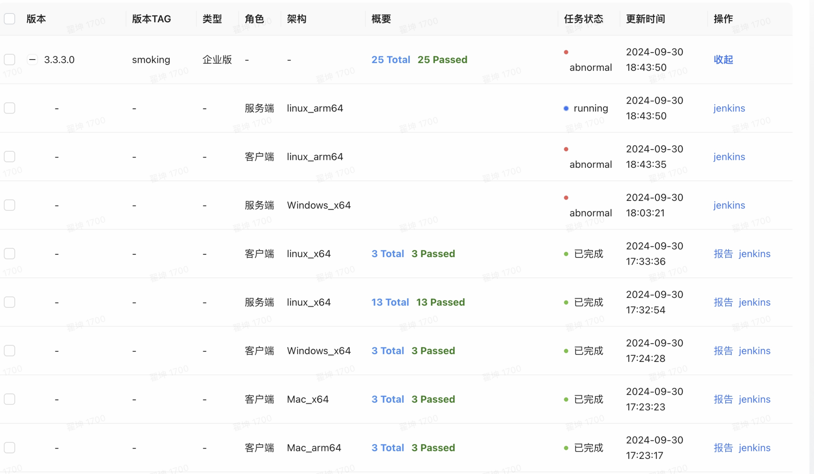

# 3.3.3.0 冒烟测试报告

## 1. 报告结论

3.3.3.0冒烟测试带条件通过【ODBC需手动安装】

| **#** | **项目** | **冒烟测试** | **备注** |
| --- | --- | --- | --- |
| 1 | OSS TDengine Server Linux_arm64 | Pass |  |
| 2 | OSS TDengine Server Linux_x64 | Pass |  |
| 3 | OSS TDengine Server macOS_arm64 | Pass | 手动验证通过 |
| 4 | OSS TDengine Server macOS_x64 | Pass |  |
| 5 | OSS TDengine Client Linux_arm64 | Pass |  |
| 6 | OSS TDengine Client Linux_x64 | Pass |  |
| 7 | OSS TDengine Client macOS_arm64 | Pass |  |
| 8 | OSS TDengine Client macOS_x64 | Pass |  |
| 9 | OSS TDengine Client Windows_x64 | Pass |  |
| 10 | Enterprise TDengine Linux_arm64 | Pass | 手动验证通过 |
| 11 | Enterprise TDengine Linux_x64 | Pass |  |
| 12 | Enterprise TDengine Windows_x64 | Pass* | 手动验证通过 ODBC需手动安装 |
| 13 | Enterprise TDengine Client Linux_arm64 | Pass |  |
| 14 | Enterprise TDengine Client Linux_x64 | Pass |  |
| 15 | Enterprise TDengine Client macOS_arm64 | Pass |  |
| 16 | Enterprise TDengine Client macOS_x64 | Pass |  |
| 17 | Enterprise TDengine Client Windows_x64 | Pass* | ODBC需手动安装 |

## 2. 测试记录

### 2.1 引擎测试部分

#### 2.1.1 社区版 OSS 冒烟测试

服务端


说明：社区版无 Windows 服务端，Mac arm64 平台因被测节点空间不足被取消，手动验证通过。
客户端


冒烟测试全部通过

#### 2.1.2 企业版服务端 & 客户端 Enterprise 冒烟测试



服务端linux_arm64, windows_x64 自动冒烟失败，原因已定位，脚本问题，手动验证用例都成功。
Windows 企业版服务端 odbc 安装失败, root cause 暂不明确。因安装 odbc 安装脚本客户端与服务端没有区别，初步怀疑是服务端安装的某些服务与 odbc 冲突导致。
Workaround： Windows 服务端安装过程仅拷贝 odbc 相关文件，待安装结束后手动执行安装 两条 odbc安装命令即可。安装命令如下：
```bash
C:\Windows\System32\odbcconf.exe /S /F   C:\TDengine\taos_odbc\x64\win_odbc_install.ini
C:\Windows\SysWOW64\odbcconf.exe /S /F   C:\TDengine\taos_odbc\x86\win_odbc_install.ini
```

#### 2.1.3 全量测试 Pass

- http://ci.bl.taosdata.com:8080/view/fulltest/job/FullTest-main-query-replica3/833/execution/node/69/log/
- http://ci.bl.taosdata.com:8080/blue/organizations/jenkins/FullTest3.0/detail/FullTest3.0/3221/pipeline/

### 2.2 应用测试部分

#### 2.2.1 社区版

- 回归测试 Explorer 的基本功能：测试通过

#### 2.2.2 企业版

- 各数据源的所有用例：测试通过
- Windows 平台 client 版安装包中 ODBC Driver 未安装的问题，在[3.3.3.0 发版通知](https://taosdata.feishu.cn/wiki/F4T0wClewiI8LtkEPt0cXud9nrb)中已反馈
