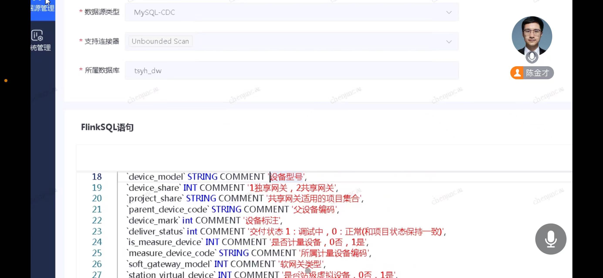
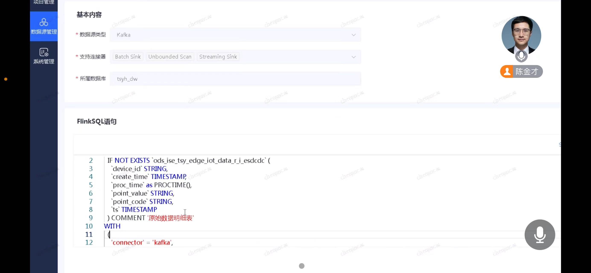
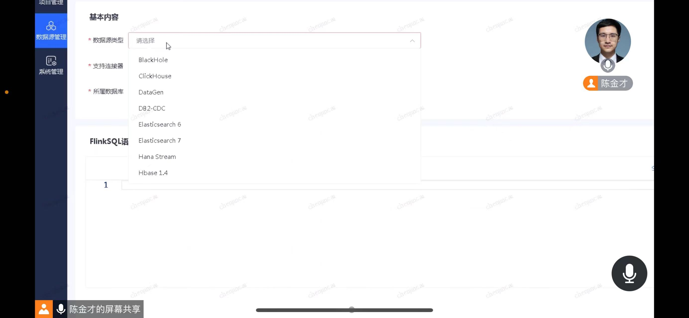
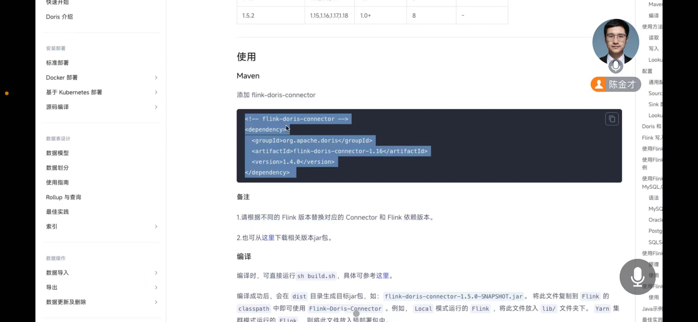
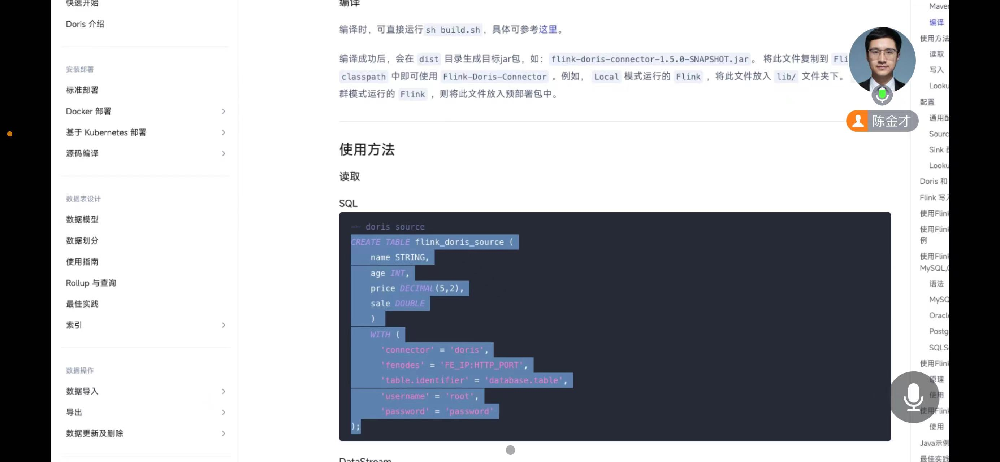

# 需求报告：Flink 连接器

## 1. 需求描述

目前，国电投综合智慧能源科技有限公司建设的大数据平台由多个不同的组件组成，包括：Hive、StarRocks、IoTDB、OpenTSDB、MySQL CDC 等。使用 Flink 作为大数据处理的系统框架，进行 “大数据处理平台”的建设。对于流式数据，使用 Flink 的 Source/ Sink 等组件；对于历史批处理数据，用到了 DataX 组件。
TDengine 将成为时序数据处理解决方案的重要部分。客户架构师规划将 TDengine 作为时序数据处理的基座，时序数据经 Flink 任务处理后，需高效导入 TDengine。
客户的大数据处理平台，由京东负责开发集成，包括：对接各种数据源。客户提出，希望 TDengine 可以提供官方支持的 Flink Sink，京东在此基础上进行集成开发。理由如下：
1. TDengine 官方开发维护的 Flink Sink 可以充分发挥写入性能的优势，做到写入的最佳实践；
2. 除本项目外，其他基于 Flink 做大数据开发平台的厂家，也需要 TDengine Flink Sink 作为基础构建，开展研发工作；
3. 京东作为集成商，开发 TDengine Flink Sink 可能存在商务和风控问题：除项目成本外，项目风险增大。
同时，考虑到 Flink 作为主流流处理引擎，TDengine 作为数据库原厂商提供 Flink 连接器，将有利于拓展产品竞争力，至少与同类竞争对手保持同等的产品力水平。
综上所述，特提出开发 Flink 的 Sink 和 Source，Sink 优先。

补充说明：IoTDB、Doris、StarRocks、MySQL CDC 均已提供原厂连接器，附相关信息如下：
1. IoTDB: https://iotdb.apache.org/zh/UserGuide/latest/Ecosystem-Integration/Flink-SQL-IoTDB.html
2. Doris: https://doris.apache.org/zh-CN/docs/dev/ecosystem/flink-doris-connector/
3. StarRocks: https://docs.starrocks.io/zh/docs/loading/Flink-connector-starrocks/
4. Mysql-cdc: https://ververica.github.io/flink-cdc-connectors/master/content/connectors/mysql-cdc%28ZH%29.html
5. Flink 官方支持的 connector: https://nightlies.apache.org/flink/flink-docs-release-1.18/docs/connectors/table/overview/

附客户平台截图及相关信息：

## 2. 意向用户

列出本需求完成后，可以向前推动的意向用户列表。

| 序号 | 经手人 | 项目名称 | 推动策略 |
| --- | --- | --- | --- |
| 1 | 于小铁 | 国电投综合智慧能源大数据平台升级（暂定） | 2024 年签订合同 |

## 3. 用户场景

1. 用户及所在行业的简要说明
电力行业企业需要通过 Flink 集成多种数据源，进行数据提取、转换、迁移，将处理后数据 sink 至 TDengine

1. 用户的业务场景，包括数据种类、数据来源、查询场景
以国电投综合智慧能源大数据平台为例，现有数据源有 Hive、StarRocks、IoTDB、OpenTSDB、MySQL CDC，未来将新增 TDengine。客户将采用 Flink 进行数据提取、转换等处理后，将数据 sink 至 TDengine。

1. 用户的数据规模，包括设备数、测点数、采集频率、保存时长
子表数预计在几十万至数百万，测点数预计小于 1 亿。采集频率、保存时长未知。

1. 用户的数据模型，包括采集量描述、原始数据样例、采用 TDengine 后的库表结构

2. 用户当前系统的技术方案，以及 TDengine 在技术方案中的位置
目前客户采用 IoTDB、OpenTSDB、Hive 等存储时序数据，经过前期交流，客户架构师考虑采用 TDengine 作为未来统一架构时序数据库的基座。

1. 用户遇到的技术问题，在本需求实现前用户所采取的解决方案
需提供原厂 Flink 连接器，用于目前平台架构的对接，满足 sink 至 TDengine 的需求

1. 本需求实现后用户采取的解决方案
需进一步与客户探讨

1. 提供该功能的其他厂商的产品
IoTDB、Doris、Kafka、StarRocks、Hive、MySQL CDC

1. 本需求给用户带来的主要商业价值
直接价值：同一架构下，接入不同数据源，TDengine 性能最大化、集成工作量最小化
间接价值：
- 基于 TDengine 的统一架构时序处理平台
- 降低资源消耗，降低系统复杂度，降低 TCO
