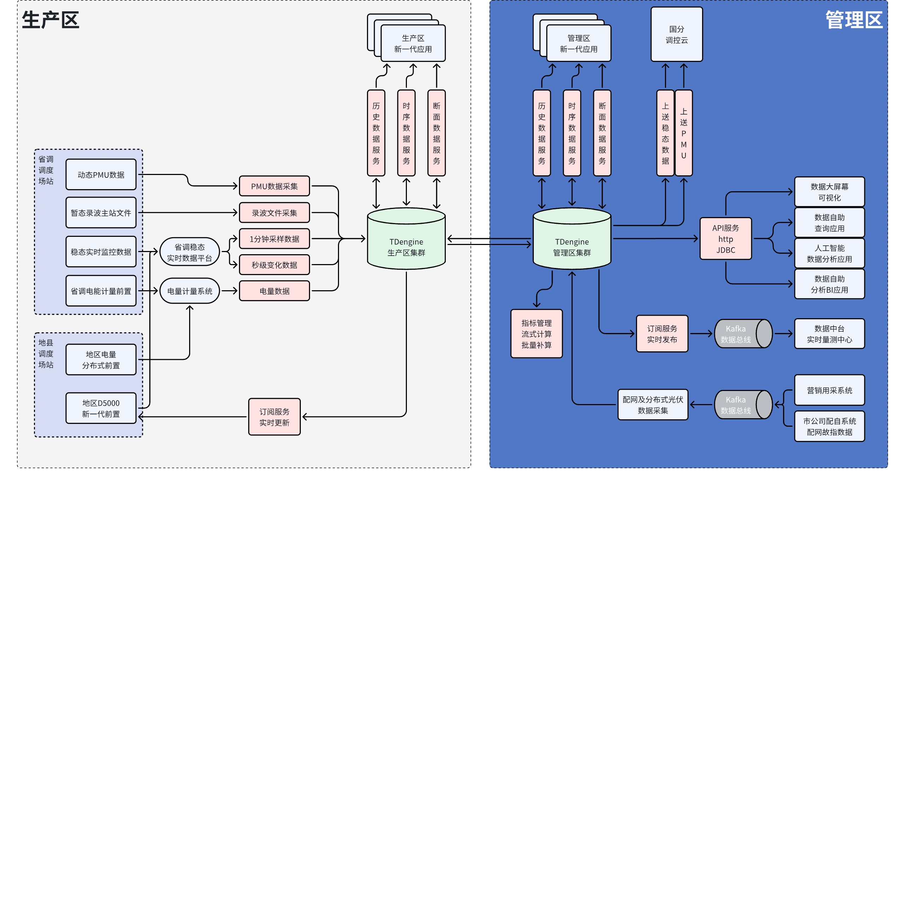

# 需求报告：Interp 函数流计算

## 1. 需求描述

目前电力行业在达梦关系库中仅保存断面数据(一般为一分钟断面)，无法保留原始时序数据。
河北电力调度中心期望在 TDengine 中持久化存储原始时序数据的同时，能计算并保留断面数据。拟通过流计算实现该业务需求：在原始数据写入后，通过流计算触发断面函数算得结果，存入对应子表。
因 Interp 函数不适用流计算(不能保留前值)，需要开发一新的支持流计算的断面函数。

### 1.1 河北电力新一代调度云系统图

<reference-synced source-block-id="I1lLdBkXds17HGb8xNVclU1bnsb" source-document-id="NZf6dcMp5oK0G8xw1lMcsZQqnPd">

  

</reference-synced>

### 1.2 需求说明与示例

#### 1.2.1 业务场景描述

每分钟通过断面函数计算出每个配电变压器(约 70 万子表)下辖分布式光伏(小于 100 万子表)的瞬时功率，然后对每个配电变压器分钟级断面数据进行分组求和(TSMA)

#### 1.2.2 需求说明

1. 支持标签列筛选符合条件的子表
2. 支持新建子表动态加入流计算，一旦子表符合筛选条件，立即加入运行中的流计算
3. FILL 支持 PREV 即可
   - 如果当前窗口内有记录，则取前值
   - 两种行为可配置：行为一：如果当前窗口内无记录，向前查找直到有记录为止，如果没找到记录，则不写入任何记录；行为二：如果窗口内无记录，则取空值写入
4. 支持 FILL HISTORY 选项

#### 1.2.3 补充行为说明

1. 流计算开启后，从 T 时刻开始，每分钟都应产生新的记录
   - FILL HISTORY 开启时，T 为表中第一条记录写入时间
   - FILL HISTORY 关闭时，T 为表中第一条记录写入时间和流计算创建时间的最晚值
2. 即便没有写入事件，须按时触发计算，与 2.x 的连续计算 interval/sliding 行为一样

#### 1.2.4 示例

```sql {wrap}
create stream s1 into stable_1 as
select _wstart,interp(*) from source where tag1 in('y1','a2') fill(prev) partition by tbname interval(1m)
```

## 2. 意向用户

列出本需求完成后，可以向前推动的意向用户列表。

| 序号 | 经手人 | 项目名称 | 推动策略 |
| --- | --- | --- | --- |
| 1 | 肖波 | 河北电力新一代调度云升级 | 2024 年签订新合同 |

## 3. 用户场景

描述用户具体使用场景，多个用户请分别描述，并拆分到多个一级标题下。文档中不要出现与设计、实现相关的内容，但请包含以下内容
1. 用户及所在行业的简要说明
电力行业，电网、发电企业均需要计算断面
各类 SCADA、配网均需要断面计算

1. 用户的业务场景，包括数据种类、数据来源、查询场景
以河北电力调度云项目为例，SCADA 数据(秒级)、配网(分布式光伏，两种：1 分钟、15 分钟级)原始时序数据采集后即时写入TDengine，拟通过流计算触发断面函数算得每分钟断面值，存入对应子表。
业务应用将查询、订阅断面计算表，以获取相应数据。

1. 用户的数据规模，包括设备数、测点数、采集频率、保存时长
子表数预计在几千万至几亿，测点数预计在 10 亿左右。采集频率秒级居多，保存时长未知。

1. 用户的数据模型，包括采集量描述、原始数据样例、采用 TDengine 后的库表结构

2. 用户当前系统的技术方案，以及 TDengine 在技术方案中的位置
**D5000**** ****以及大多数一区**** ****SCADA**** ****中采用达梦存储断面数据，但无法保存实时数据(数据量太大)。**
**TDengine**** ****实现该特性后，将同时能保存原始数据和断面数据，在一区、三区均可实现实时数据、历史数据的融合，潜在价值可观。**

1. 用户遇到的技术问题，在本需求实现前用户所采取的解决方案
同上

1. 本需求实现后用户采取的解决方案
采用TDengine同时保存原始实时数据和断面数据

1. 提供该功能的其他厂商的产品
无

1. 本需求给用户带来的主要商业价值
行业创新：首个能同时保存原始实时数据和断面数据的系统
简化应用架构，降低系统复杂度，降低TCO
