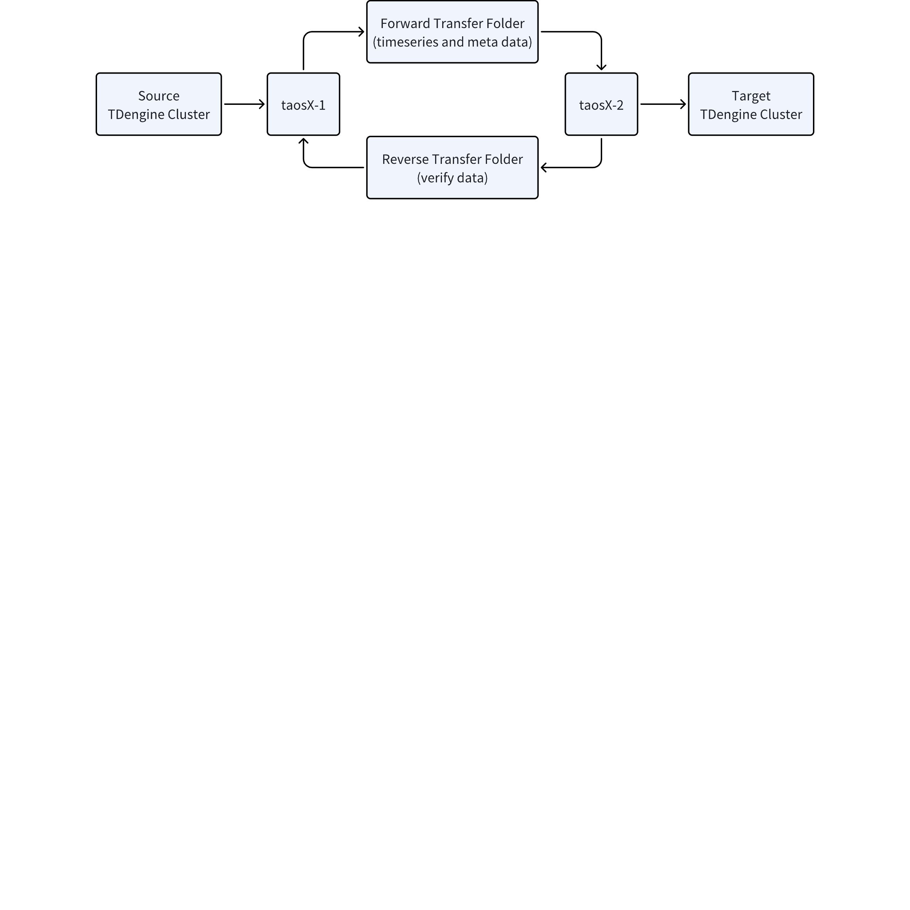

# 需求说明：基于文件中转进行自动增量备份与恢复

## 1. 需求背景

在[taosX 跨正向网闸传输](https://taosdata.feishu.cn/wiki/G85Xwn7E1idqZvkcbm1cQNYKn0c)、[调研：跨正向网闸传输方案](https://taosdata.feishu.cn/wiki/FU7UwSyhSi0bwgk4XW8cSY9mnJf)、[TDengine 穿越网闸方案](https://taosdata.feishu.cn/wiki/OcGQwtJPQiY9n5kBr1wcQk5nnsc)中，对隔离设备同步进行了多次讨论。最原始的需求不再赘述，将之抽象为“基于文件中转进行自动增量备份与恢复”的需求。
1. 中转文件夹：支持 POSIX 接口的文件系统，包括：隔离设备、本地磁盘、可插拔移动磁盘（U 盘）、NAS
2. 源集群和目标集群：两者之间是异构的，不必要求物理节点数量、副本数量相同
3. 元数据备份：包含超级表结构定义、子表列表、子表标签值及变更，不包含 TTL、用户、权限、流、订阅、UDF、TSMA 等任何未被明确列出的数据或者定义，不同步新建的数据库，同名数据库增删后不处理
4. 时序数据备份：支持增量备份，备份起始用自然时间表示（不是 Offset 或其他内部概念）
5. 备份间隔：可以定义到毫秒

## 2. 工作流程

### 2.1 正向传输

正向传输通过正向文件夹进行，传输三类文件：任务进度文件、数据描述文件、数据文件。

#### 2.1.1 任务进度文件

负责传递任务的操作、进展情况。例如
1. 源集群准备进行运维操作时，向目标集群报告任务暂停、任务继续，以便目标集群不识别为错误
2. 源集群修改自己的任务配置，例如数据同步时间间隔
3. 源集群发送最近一段时间的已传输文件列表，用于和目标集群校验数据完整性
任务进度同步机制未必一定要存在，可在设计时考虑。任务进度文件可与数据描述文件在一起设计。

#### 2.1.2 数据描述文件

用来描述一次数据传输，文件名例如 `TDengine-20240722102305002-task-14578.desc`。
1. 生成时间：taosX-1 创建数据文件的时间，精确到毫秒，文件生成时间间隔在 taosX-1 任务定义时配置
2. 任务编号：taosX-1 的任务编号
3. 文件后缀名（desc）：说明这是一个数据描述文件
4. 文件格式：可以设计为 JSON 格式
5. 文件内容：源集群通常包含多个 Database，每个 Database 包含多个 VGroup。在增量备份时，为了提高数据同步速度，taosX-1 按照 VGroup 编号生成多个数据文件。desc 文件用来描述这些数据文件，内容包括
   - 数据文件列表
      - 数据文件名称
      - 数据文件大小、校验
      - 数据文件创建时间
      - 数据文件的类型：元数据、时序数据、元数据和时序数据混合
      - 数据文件的格式：parquet，以后可扩展
      - 所属 VGroup 编号：用于 taosX-2 内部的多线程优化
   - 本次传输的基本信息
      - 上一个 desc 文件的编号
      - 正常传输还是补录
   - taosX-1 集群的基础信息，例如 
      - taosd 的版本号
      - taosX 的版本号

#### 2.1.3 数据文件

以所属数据描述文件为前缀，追加序列号和文件类型。对于一个数据描述文件，可以有一个或多个数据文件。
1. 任务启动时第一次元数据备份
   - `20240722102305002-task-14578-1.meta`
2. 任务启动后的增量备份
   - `20240722102305002-task-14578-6.parquet`
   - `20240722102305002-task-14578-7.parquet`
   - `20240722102305002-task-14578-8.parquet`

### 2.2 反向传输

反向传输通过反向文件夹进行，传输一类文件：处理结果文件。
1. 处理结果文件：用来汇报目标集群的处理进度，假如入 taosX-2 在处理数据入库时，部分文件出现了错误，这些信息即可被传递给 taosX-1。taosX-1 根据这些错误信息进行出错处理，例如
   - 停止传输数据
   - 补传数据
当没有反向传输通道时，错误的识别变得困难。仍然需要在 taosX-1 和 taosX-2 中配置反向文件夹（两者不是同一个文件夹）。运维人员需要通过其他方式（例如人工拷贝），将 taosX-2 的进度文件拷贝给到 taosX-1 进行离线错误处理。

## 3. 配置项

### 3.1 通用配置

1. 正向文件夹
2. 反向文件夹
3. 源集群连接方式
4. 目标集群连接方式
5. 连接方式：native、ws

### 3.2 taosX-1

1. 数据同步间隔：精确到毫秒
2. 同步开始时间：指时序数据的时间戳时间，不是 Offset 或其他内部概念，如不设置则同步所有数据
3. 同步结束时间：如果不设置，则为实时任务
4. 错误容忍时间：多长时间的数据未进入到目标集群时，暂停同步（通过未处理的 desc 文件数目来来判定）
5. 错误容忍大小：有多大的数据文件未被处理时，暂停同步
6. 单个文件的大小阈值：可不设置
7. 进度同步时间：每隔多长时间，发送一次任务进度文件
8. 处理线程数：订阅线程
9. 处理结果文件的应对策略：
   - 能补发的错误：立刻补发、定时补发、不补发
   - 不能补发的错误：忽略错误、停止同步
10. 未收到处理结果文件的应对策略
   - 可配置容忍时长
   - 容忍时长到后仍未收到：忽略错误、停止同步

### 3.3 taosX-2

1. 进度同步时间：每隔多长时间，发送一次处理结果文件
2. 处理线程数：入库线程
3. 文件夹扫描时间：通常为毫秒
4. 文件处理结束之后的策略：删除、移动、保留
5. 文件处理失败的策略：丢弃文件、停止服务

## 4. 其他要求

1. 统计信息
   - 平均处理延迟（毫秒）
   - 处理速度（条每秒、MB 每秒）
   - 当前延迟（毫秒）
   - 处理文件数目
   - 出错文件数目
2. 第一次同步包括元数据，后续同步为增量备份
3. 隔离网闸是本需求的一种特殊场景，内部测试先基于普通文件系统即可
4. taosX-2 判断文件是否可读时，支持选项
   - 文件不被其他程序打开时才可读取：Linux 可以获得文件打开的引用计数，但也有可能导致 taosX 被动暂停
   - 文件存在即可被读取：如果是 rename 文件这样的原子操作，不会造成数据不完整
