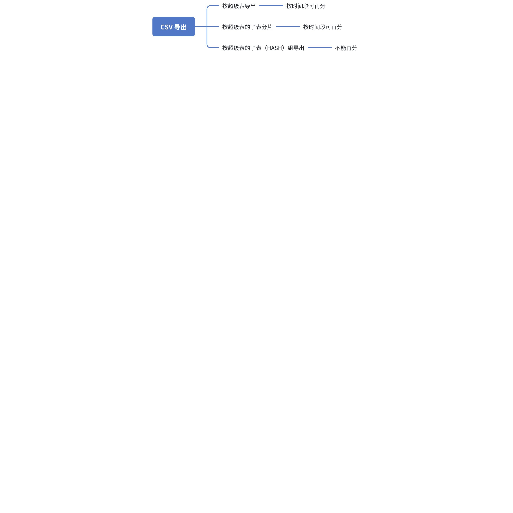

# taosBenchmark 重构（Funs Spec）

## 1. 背景

根据 10-25 日上午与 Jeff、肖总、胜亮、彦杰及陈肃开会讨论 [taosBenchmark 重构方案](https://taosdata.feishu.cn/wiki/ISR2wFl8biNzfFkKlT8clM8znBg) ，明确产品发展大方向后，整理出需求文档： [taosBenchmark 重构方案(需求)](https://taosdata.feishu.cn/wiki/IiPswA4flihv0OkbM5YciL6Fnph)，依此需求文档编写 Funs Spec。

## 2. 变更历史

| 日期 | 版本 | 负责人 | 主要修改内容 |
| --- | --- | --- | --- |
| 2024/10/27 | 0.1 | 段宽军 | 初稿 |
|  |  |  |  |

## 3. 定义

 无

## 4. 行为说明

### 4.1 对外交互接口

产品对外提供两种交互接口：
1. 命令行参数（子集）
2. 配置文件（全集）
命令行参数是配置文件的子集，选择最为常用的参数，同时命令行参数优先级高于配置文件

### 4.2 程序使用

#### 4.2.1 程序启动

对外提供三种启动方式
1. 命令行参数方式启动 
如 taosBenchmark -t 10 -n 1000 表示启动后创建 10 个子表，每个子表 1000 行数据，其它参数都为默认
1. 配置文件启动
如 taosBenchmark -f  insert.json 表示程序加载 insert.json 配置文件启动，程序读取配置文件中全部选项执行
1. 命令行 + 配置文件启动方式
如 taosBenchmark -f  insert.json -h 192.168.1.176 表示把配置文件中的 host 替换为命令行指定 host 后执行

#### 4.2.2 程序运行

程序执行过程中会输出任务相关信息及执行进度信息

#### 4.2.3 程序退出

程序执行遇到错误会自动退出并抛出错误信息
程序全部任务执行成功后输出任务情况及各项统计指标

#### 4.2.4 程序日志

默认日志输出在taos.cfg 中配置的日志目录下，文件名 benchmark.log
      日志模块实现使用引擎的日志模块
      默认情况下仅输出 info 和 warning 信息，可增加 -g 选项输出底层调试日志信息(debug 和 trace 级别)

### 4.3 需求实现

#### 4.3.1 提供丰富数据生成

| 需求编号 | 需求描述 | 配置文件 | 命令行 | 自动化测试需求用例 |
| --- | --- | --- | --- | --- |
| 1.1.1 | 生成指定范围随机数 | jobs->stable->columns/tags 指定 [min, max] 内容 示例： { "type": "INT", "name": "voltage", "max": 225, "min": 215 } 默认值： min: 对应数据类型的最小值 max: 对应数据类型的最大值 <callout emoji="bell" background-color="light-orange" border-color="light-orange"> 若类型配置不正确会报错并终止程序 </callout> | 无 | 1. 脚本验证生成数在[min-max] 范围内（包括边界） 1. Min max 配置为不符合预期的字符串类型，预期报错程序并退出 |
| 1.1.2 | 计数方式生成 | jobs->stable->columns/tags 指定 [function] 内容 函数原型： count(min, max, step, direction) 支持数值类数据类型 可按指定需求生成 count 计数 参数说明: min: 数值类型，表示 count 计数最小值（包含） max: 数值类型，表示 count 计数最大值（包含） step: 数值类型，表示每次计数步长 direction: 方向，可为 up | down | up & dwon | ~~无~~ | 1. 验证生成数据能按预期 step 增长 1. 验证生成数据一定在预期区间 [min~max] 范围内（包含） 1. 验证生成数据第一个值 offset 符合预期 1. 配置 min > max 的值，预期为程序报错并退出 1. 参数输入固定值计算并验证预期结果 |
| 1.1.3 | 正弦波生成 | jobs->stable->columns/tags 指定 [sin] 内容 函数原型： sin(x, T) 参数说明: x: 输入的 ts 时间戳变量 T: 周期，即一个周期内期望生成的点数 示例：表示此列数据会通过输入时间主列后通过 sin 函数计算出来，并在一个周期内生成 10 个数据点 { "type": "int", "name": "current", "function": "sin(x，10)"} | 无 | 1. 验证生成值范围在 [-1, 1] 区间 1. 验证输出周期 T 值的正确性，对函数输出的值进行记录，经过 T 个点后值又开始重复 |
| 1.1.4 | 方波数据生成 | jobs->stable->columns/tags 指定 [function] 内容 函数原型： square(x, T, min, max, offset) 参数说明: x: 输入的 ts 时间戳变量 T: 周期，即一个周期内期望生成的点数 min: 数值类型，表示最小值 max: 数值类型，表示最大值 offset : 开始第一个数的偏移, 可以调节开始时的形状 示例：表示此列数据使用方波函数依据输入时间主列生成周期为 30 个点范围在[1~100]之间的数据 { "type": "FLOAT", "name": "current", "function": "square(x, 30, 1, 100)"} | 无 | 1. 验证输出周期 T 值的正确性，对函数输出的值进行记录，经过 T 个点后值又开始重复 1. 统一使用 1.1.2 中函数参数合法性 CASE 验证 |
| 1.1.5 | 三角波数据生成 | jobs->stable->columns/tags 指定 [function] 内容 函数原型： triAngle(x, T , min, max, offset ) 参数说明: x: 输入的 ts 时间戳变量 T: 周期，即一个周期内期望生成的点数 min: 数值类型，表示最小值 max: 数值类型，表示最大值 offset : 开始第一个数的偏移, 可以调节开始时的形状 示例：表示此列数据使用三角函数依据输入时间主列生成周期为 30 个点范围在[1~100]之间的数据 { "type": "FLOAT", "name": "current", "function": "triAngle(x, 30, 1, 100)"} | 无 | 1. 验证输出周期 T 值的正确性，对函数输出的值进行记录，经过 T 个点后值又开始重复 1. 统一使用 1.1.2 中函数参数合法性 CASE 验证 |
| 1.1.6 | 锯齿波数据生成 | jobs->stable->columns/tags 指定 [function] 内容 函数原型： saw(x, T, min, max, offset) 参数说明: x: 输入的 ts 时间戳变量 T: 周期，即一个周期内期望生成的点数 min: 数值类型，表示最小值 max: 数值类型，表示最大值 offset : 开始第一个数的偏移, 可以调节开始时的形状 示例：表示此列数据使用锯齿波函数依据输入时间主列生成周期为 30 个点范围在[1~100]之间的数据 { "type": "FLOAT", "name": "current", "function": "saw(x, 30, 1, 100)"} | 无 | 1. 验证输出周期 T 值的正确性，对函数输出的值进行记录，经过 T 个点后值又开始重复 1. 统一使用 1.1.2 中函数参数合法性 CASE 验证 |
| 1.1.7 | 按表达式生成 | jobs->stable->columns/tags 项目下指定 [function] 内容 函数原型： expr = a operator function() operate() function operate b ... 参数说明： a, b 表示常数 function 可为 1.1.1 ~ 1.1.6 中的函数 operator : + - * / 四个符号 示例：表述式表示 0~60 范围内从0取一个方波值 * 2 后与 20 以内一个随机数* 100 ，再加上 120 的一个值作为此列生成值 { "type": "FLOAT", "name": "current", "function": "2*square(0,60,50,0)+100*random(20)+120"} <callout emoji="bell" background-color="light-orange" border-color="light-orange"> 表达式书写错误程序报错并终止 </callout> | 无 | 1. 函数 + 常数 + 表达式组合测试，根据预先计算结果进行验证 1. 在表达式书写错误测试，如两个操作符在一起，两个函数中间无操作符号等情况 |
| 1.1.8 | 指定 NULL 值占比 | jobs->stable->columns/tags 指定 [null] 内容，表示此列 NULL 值占百分比，生成百分比数为大体值，误差控制在 5 % 以内 范围【0~100】 1. 0 表示没有 NULL 值， 1. 100 表示全部为 NULL 值 示例：表示此列生成 NULL 值占比 70% { "type": "FLOAT", "name": "current", "null": 70} 异常： 输入值参数大于 100 按 100 算，小于 0 按 0 算 | 无 | 1. 生成完数据后在数据库中统计 NULL 值比例，验证百分比在预计误差范围 5%内 1. 验证边界值行为符合预期 1. 验证异常值，负值及大于 100 值，负值预期与 0 行为相同，大于 100 值预期与 100 行为相同 |
| 1.19 | 支持指定自定义值 | jobs->stable->columns/tags 项目下指定 [values] 内容，values 为数组类型，数组类型中的元素数据类型应与对应类数据类型一致，否则会报错，提示类型不匹配 每次随机从数组中抽取一个值使用 示例：表示此列值只从这四个数中随机抽取 { "type": "FLOAT", "name": "current", "values": [70,200,210, 222]} 异常情况： 1. 给定类型非数组类型，按没有配置 values 处理 1. 数组内数据类型与列数据类型不一致，按没有配置 values 处理 1. 数组内数据类型有多种，只选择和列一致数据类型，其它数据类型丢弃 | 无 | 1. 在最终数据库中验证，所有生成值都在给定的数组范围内 1. 验证 values 输入异常情况符合预期输出结果 |
| 1.2.1 | 字符串类型 | jobs->stable->columns/tags 项目下指定 [type] 内容，类型分别为 “binary varbinary nchar varchar ” 对于字符串数据类型，提供指定生成不同随机内容，指定通过 function 参数，提供 string 函数，如下 原型： string(list,n) 参数： n : 生成单词个数，以不超过字符串总长度为上限生成 list 表示生成 string 的单词集合名，可以为多个单词集合名，之间使用分号分隔，单词集合名可以为： all : 所有常用单词 2000 个左右 person : 人名 country : 国家名 addr-china-state : 中国省名 addr-america-state : 美国省名 addr-china-city : 中国城市名 addr-america-city : 美国城市名 road: 公路名 device: 设备名 workshop: 车间名 ... 以后待完善 示例1：country 列使用国家名集合，随机抽取一个 { "type": "binary", "name": "country", "len": 32， function="string(country, 1) "} 示例2：列 addr 使用州名 + 公路名两集合 组合生成，n配置为2 会尽可能一个集合抽取一个 { "type": "binary", "name": "addr", "len": 32， function="string(add-america-state;road, 2) "} <callout emoji="desert_island" background-color="light-orange" border-color="light-orange"> 提醒：所有数据类型命名与TDengine中命名保持一致 </callout> | 无 |
| 1.2.2 | 浮点数类型 | jobs->stable->columns/tags 项目下指定 [type] 内容，类型分别为 “float double ”，数据类型命名与 TDengine 中命名一致 | 无 |
| 1.2.3 | 数值类型 | jobs->stable->columns/tags 项目下指定 [type] 内容，类型可以为： tinyint, tinyint unsigned smallint, smallint unsigned bigint , bigint unsigned 数据类型命名与 TDengine 中命名一致 | 无 |
| 1.2.4 | 坐标数据 | jobs->stable->columns/tags 项目下指定 [type] 内容，类型可以为：geometry 数据类型命名与 TDengine 中命名一致 | 无 |
| 1.2.5 | JSON 数据 | jobs->stable->tags 项目下指定 [type] 内容，类型可以为 json 数据类型命名与 TDengine 中命名一致 此数据类型仅可用于 TAG 列 | 无 |
| 1.3.1 | 超级表名可配置 | jobs->stable->name 指定，字符串类型 默认值："meters" <callout emoji="desert_island" background-color="light-orange" border-color="light-orange"> 提醒：超级表名称使用的字符合法性由引擎验证 </callout> | 无 | 1. 在最终数据库中验证超级表名与配置文件中名称一致 |
| 1.3.2 | 指定子表数 | jobs->stable->childtable_count 指定，数值类型 默认值："1000" | -t 子表数量 参数 | 1. 在最终数据库中验证子表数与配置文件中一致 1. 在最终数据库中验证命令行参数的优先级高于配置文件 |
| 1.3.3 | 指定普通列 | jobs->stable->columns 指定, 数组类型 默认值（智能电表普通列）： {"type": "FLOAT", "name": "current", "count": 1, "max": 12, "min": 8 , "function"}, { "type": "INT", "name": "voltage", "max": 225, "min": 215 }, { "type": "FLOAT", "name": "phase", "max": 1, "min": 0 } 同时可以通过 count 参数批量指定生成列，生成列名为当前列名 + 序号，如果未配置列名，默认为 "c" | -b 普通列类型数组，逗号分隔 | 1. 在最终数据库中验证列信息与配置文件中一致 1. 在最终数据库中验证命令行参数的优先级高于配置文件 1. 验证批量建列 count 参数，通过验证生成表的 schema 信息与预期配置文件中定义的一致 |
| 1.3.4 | 指定 TAG 列 | jobs->stable->tags 指定，数组类型， 默认值（智能电表TAG 列）： {"type": "tinyint", "name": "groupid","max": 10,"min": 1}, {"type": "binary", "name": "location", "len": 16, "values": ["San Francisco", "Los Angles", "San Diego", "San Jose", "Palo Alto", "Campbell", "Mountain View","Sunnyvale", "Santa Clara", "Cupertino"] } 同时可以通过 count 参数批量指定生成列，生成列名为当前列名 + 序号，如果未配置列名，默认为 "t" | -A 标签列类型数组，逗号分隔 | 1. 在最终数据库中验证TAG列与配置文件中一致 1. 在最终数据库中验证命令行参数的优先级高于配置文件 1. 验证批量建列 count 参数，通过验证生成表的 schema 信息与预期配置文件中定义的一致 |
| 1.3.5 | 支持多个超级表 | jobs 下的 stable 为数组类型，可配置多个超级表作业组 | 无 | 1. 在 jobs 下配置多个超级表开始写入数据，最终数据库中可以查询到配置的多个超级表都已生成并写入预期数据 |
| 1.4.1 | 子表名前缀可配置 | jobs->stable->childtable_prefix 指定，数据类型 默认值："d" | 无 | 1. 在最终数据库中验证子表名前缀与配置文件中名称一致 |
| 1.4.2 | 指定每子表行数 | jobs->stable->insert_rows 指定，数值类型 默认值："10000" | -n 子表行数 参数 | 1. 在最终数据库中验证子表行数与配置文件中一致 1. 在最终数据库中验证命令行参数的优先级高于配置文件 |
| 1.4.3 | 指定写入起始时间 | jobs->stable->start_timestamp 指定，字符串及数值类型均可 当类型为字符串，内容为标准时间字符串时，会根据本机默认时区转为 timestamp 值，内容为 now 时，转化为当前时间 默认值：1800000000 单位：ms | -s | 1. 在最终数据库中验证写入起始时间与配置文件中一致 1. 在最终数据库中验证命令行参数的优先级高于配置文件 1. 使用 “now” 字符串输入，预期转化为当前时间，在最终数据库中验证 1. 使用标准时间字符串测试，在最终数据库中验证 |
| 1.4.4 | 指定时间增长步长 | jobs->stable->timestamp_step 指定，数值类型 默认值：1 单位：ms 步长为零时会有时间戳重复写入 | -S 参数 | 1. 在最终数据库中验证时间增长步长与配置的一致 1. 验证负数否按预期缩减 |
| 1.4.5 | 指定乱序 | jobs->stable 下 控制乱序规划两个参数 disorder_rate ： 指定乱序占百分比 取值 0~100： 0 ： 没有乱序 100：全部乱序 disorder_delay_hours: 指定乱序数据最晚到达时间，单位小时 如果为 0 表示不限定范围，任意 增加区间乱序功能 【30天 20% 90 天 10% 乱序 200 天 1% ....】 数组方式来定义乱序情况 单位可配置 | 无 | 1. 乱序结果在最终数据库中很难验证，小范围乱序引擎会处理成正序，所以只能做大体验证 1. 使用单元测试从函数级别验证生成的乱序数据符合预期 |

#### 

#### 4.3.2 自定义 CSV 导入

| 需求编号 | 需求描述 | 配置文件 | 命令行 | 自动化测试需求用例 |
| --- | --- | --- | --- | --- |
|  |
| 2.1.1 | 多 CSV 并行独立读取 | jobs->数组->source 下, 示例： { "from" : "csv", "options": { "dir": "/root/csv/", "csv_read_thread": 5 } } 表示处理 /root/csv/ 目录下的所有CSV 文件，启动 5 个线程并行读取 <callout emoji="bell" background-color="light-orange" border-color="light-orange"> 如果在 dir 中找到了超级表的 meta 数据文件，会优先加载并替代 job-> stable 中指定的 meta 数据 </callout> 读取 CSV 线程名为 “csv_read” 要确保一个CSV 文件只有一个线程读取 默认值为 ：1 | 无 | 1. 启动 taosbenchmark 后通过遍历 "readcsv" 线程个数并与配置文件中匹配一致 1. 在不配置此值情况下读取 "csvread" 线程数与默认值一致 |
| 2.1.2 | 单 CSV 支持串行读取 | jobs->数组->source 下, 示例： { "from" : "csv", "options": { "tag_file":"/csv/tag.csv", "tag_file_thread": 1, "col_file":"/csv/cols.csv", "col_file_thread": 1 } } 指定 tag 及 col 的 thread 数为 1即为串行读取 默认值：1 读取 csv tag 线程名为 “tag_fileread” 读取 csv col 线程名为 “tag_filecol” 要确保一个CSV 文件只有一个线程读取 | 无 |
| ~~2.1.3~~ | ~~ 单 CSV 支持并行~~~~处理~~ | ~~jobs->数组->source 下, 示例：~~ ~~{~~ ~~ "from" : "csv",~~ ~~ "options": {~~ ~~ "tag_file":"/csv/tag.csv",~~ ~~ ~~~~ "tag_file_thread": 2,~~ ~~ "col_file":"/csv/cols.csv",~~ ~~ ~~~~"col_file_thread": 5~~ ~~ }~~ ~~}~~ ~~指定 tag 及 col 的 处理线程数，并行处理时，会根据用户给定的线程数，分配一个线程用于从磁盘读取 CSV 文件，剩下线程用于处理 CSV 数据，如只有一个线程，那此线程即负责读取又负责处理数据~~ <callout emoji="bell" background-color="light-orange" border-color="light-orange"> ~~如处理 CSV 数据存在瓶颈，可加大此线程数~~ </callout> ~~默认值：1~~ | ~~无~~ |
| 2.1.4 | CSV文件是否自带时间列 | jobs->数组->source 下, 示例： { "from" : "csv", "options": { "col_file":"/csv/cols.csv", "firstcol_timestamp": "yes" } } firstcol_timestamp 指 "col_file" 指向的 csv 文件中是否包含时间主列，如果包含则填写 “yes”, 否则为 “no” 默认值：yes | 无 | 1. 这个参数是标识状态，暂无法验证 |
| 2.1.5 | CSV 原始时间戳写入 | jobs->数组->source 下, 示例： { "from" : "csv", "options": { "col_file":"/csv/cols.csv", "use_ts": "yes" } } 配置 "use_ts" 为 "yes" ，表示使用 CSV 中的时间列，此时写入数据时间为 csv 中的时间，写入行数与 CSV 中行数相同 <callout emoji="musical_score" background-color="light-orange" border-color="light-orange"> 如果配置了使用 csv 中的时间列，但 csv 中没有时间列，会提示错误 </callout> 默认值: "no" | 无 | 1. 最终数据库中验证写入的数据与 csv 中的相同，包括时间列 |
| 2.1.6 | CSV数据按生成时间戳写入 | jobs->数组->source 下, 示例： { "from" : "csv", "options": { "col_file":"/csv/cols.csv", "use_ts": "no" } } jobs->数组->stable 下, 指定生成时间列规则 { "start_timestamp":1500000000000, "timestamp_step": 1000, "insert_rows": 10000, } 配置 "use_ts" 为 "no" ，表示不使用 CSV 中的时间列，按用户自定的时间列生成规则生成时间列，此时写入行数与用户定义的“insert_rows” 行数相同 “use_ts” 配置为 "yes"时, 表示使用 CSV 中时间列，要确保 CSV 中第一列是时间列，如果第一列非时间列程序会报错 此时导入数据库中的行数与 CSV 中实际行数相同 默认值: "no" | 无 | 1. 最终数据库中验证写入的时间列数据与配置文件中生成时间列数据规则一致 |
| 2.1.7 | 支持 TSBS 导出的 CSV 数据集导入 | 不需要配置项指定为是 TSBS 导出的 CSV ，可以自动识别，并且上面的 CSV 读取选项都能生效 |  | 1. 预先从 TSBS 中导出基本的几个场景的 CSV 文件放入到 CSV 导入的 自动化测试 CASE 中，保证此功能持续有效 |
| 2.1.8 | 支持在处理 CSV 数据环节空转 | job->数据->source->下 source :{ "from" : "csv", "dryrun": "yes" } 空转选项，配置在 SOURCE 中，表示从 CSV 读取上来的数据处理环节进行空转，以展现前一环节 CSV 读取的速度 |  | 1. 这个功能也是内部实现功能 ，可以通过程序读取指定 大小 CSV 在空转选项下程序完成的会比较快来判断是否生效 |
|  |
| 2.2.1 | 处理 CSV 遇到错误 | root->global 全局控制变量 { "global": { "continue_if_fail": "yes" } } 可配置值： 1. "yes" : 忽略错误继续 1. "no"： 报错并终止程序 （默认） | 无 | 1. 使用格式错误的 CSV 文件，配置选项为 yes 和 no ，验证行为符合预期 1. 使用类型转化错误的 CSV 文件，配置选项为 yes 和 no ，验证行为符合预期 1. 写入过程制造引擎服务故障，配置选项为 yes 和 no ，验证行为符合预期 |
| 2.2.2 | 不支持 TAB | 程序处理，不提供选项 | 无 | N/A |
| 2.2.3 | 字符串使用双引号 | 程序处理，不提供选项 CSV 文件读取时可以兼容读取有（单和双）引号和无引号的字符串，但写入时只输出有双引号的格式 | 无 | 1. 检查输出的 CSV 文件中字符串列都使用双引号引用内容 |
| 2.2.4 | 支持转义字符 | 程序处理，不提供选项 | 无 | 1. 验证有转义符的双符号，单引号中有逗号的情况，确保不被识别为新的分隔符 1. 验证逗号做为转义符，确保不被识别为新的分隔符 1. 验证有单引号及双符号的转义符，确保能够正确识别字符串的边界 |
| 2.2.5 | NULL 值处理 | jobs->数组->sink 下, 示例： { "to" : "csv", "options": { "out_null": "null" } } out_null : 配置如何输出NULL 值 可配置值： 1. "null" : 以 “null” 字符串输出 1. "empty" ：两逗号相邻（默认） | 无 | 1. 数据生成器中配置某列都为NULL, 检查输出至 csv 文件中 NULL 值输出行为与当前配置一致 1. 验证这两种选项输出的 NULL 格式在 CSV 导入功能中都能识别 |
| 2.2.6 | 不处理二进制格式 | 程序处理，不提供选项 | 无 | N/A |
| 2.2.7 | dryrun | 空转选项，配置在 SOURCE 中，表示从 CSV 读取上来的数据处理部分进行空转，以展现 CSV 读取的速度 |  | 1. 这个功能也是内部实现功能 ，可以通过程序读取指定 大小 CSV 在空转选项下程序完成的会比较快来判断是否生效 |

#### 

#### 4.3.3 自定义 CSV 导出

| 需求编号 | 需求描述 | 配置文件 | 命令行 | 自动化测试需求用例 |
| --- | --- | --- | --- | --- |
| 2.3.1 | 单一文件 | jobs->数组->sink 下, 示例： { "to" : "csv", "options": { "file": "/root/meters.csv" } } 输出配置 "file" ，表示把数据源超级表数据输出到一个 csv 文件中，超级表的标签列与普通列保持一致格式输出在列最后 | 无 | 1. 使用文件系统检查配置的目标文件已生成，并且写入的数据与数据库中一致验证 |
| 2.3.2 | 多个文件（子表分隔） | jobs->数组->sink 下, 示例： { "to" : "csv", "options": { "dir": "/root/csvout/" } } 输出配置 "dir" ，表示把数据源超级表数据输出到指定文件夹下，csv 文件名按子表名命名输出 | 无 | 1. 使用文件系统检查配置的目标目录下按子表名称生成csv文件，并且每个CSV中写入的数据与数据库中对应子表数据一致验证 |
| 2.3.3 | 多个文件（限定文件数） | jobs->数组->sink 下, 示例： { "to" : "csv", "options": { "dir": "/root/csvout/"， "group_cnt": 10 } } 输出配置 "group_cnt" ，表示把子表分为指定的组数，每组写入到一个 csv 文件中 写入内容格式同需求 2.2.1 组文件名为超级表名 + 组ID号 + .csv | 无 | 1. 使用文件系统检查在指定的目录下生成的 csv 文件数量与设置的一致 1. 检查生成 CSV 文件的命名与预期软件设计的命名规则一致 |
| 2.3.4 | 按时间分文件写 | jobs->数组->sink 下, 示例： { "to" : "csv", "options": { "dir": "/root/csvout/"， "split_hours": 24 } } 配置 "split_hours" 后，会默认启动把超级表输出到一个文件的功能，然后拦截此文件写入，分散落盘到按时间分割的子文件中 文件会输出到 dir 目录下 单位：小时 默认值： 0 ，表示关闭此功能 | 无 | 1. 测试验证配置为 1小时， 24小时（1 day） 30*24 小时( 1 month) 363 * 24 小时（1 year） 验证配置的数据源可以按规则正确写入相应的 CSV 文件中 1. 配置为 0 及不配置，验证默认关闭有效 1. 配置不同大小的源数据及从 CSV 导入与使用数据生成器生成两种方式，验证分割的正确性 |
| 2.3.5 | 导出 csv taosX 能导入 | jobs->数组->sink 下, 示例： { "to" : "csv", "options": { "dir": "/root/csvout/", "out_meta": "yes" } } 输出配置 "out_meta" ，为“yes”，会在 “dir” 根目录下输出 meta 文件，meta 文件名默认为 超级表名 + _meta.json , 此 meta 格式 taosX 能识别 取值： yes : 输出 meta 文件 （默认） no : 不输出 meta 文件 | 无 | 1. 2.3.2 的导出，使用 taosX 可以全部导入 1. 2.3.3 的导出，使用 taosX 可以全部导入 1. 2.3.4 的导出，使用 taosX 可以全部导入 1. 验证 taosX 导入数据与 csv 文件中的一致 |
| 2.3.6 | 自己导出csv自己可导入 | N/A | N/A | 1. 2.3.1 的导出自己可导入 1. 2.3.2 的导出自己可导入 1. 2.3.3 的导出自己可导入 1. 2.3.4 的导出自己可导入 |
| 汇总 | CSV 导出选项对照关系 |  |  |  |


#### 4.3.4 目标写入

| 需求编号 | 需求描述 | 配置文件 | 命令行 | 自动化测试需求用例 |
| --- | --- | --- | --- | --- |
| 3.1.1 | 拼 SQL 写入 | jobs->数组->sink 下, 示例： { "to" : "TDengine", "data_format": "sql" } data_format : 配置组织数据的格式 可配置值： 1. sql : 拼文本的 SQL 方式 (默认) 1. stmt : stmt 快速写入格式 1. stmt2: stmt2 快速写入格式 1. sml_line : schemaless 的 line 格式 1. sml_telnet: schemaless 的 telnet 格式 1. sml_json: schemaless 的 json 格式 | -I 可配置值 | 1. 配置 2 个超级表，每个超级表 100 子表，使用 sql 数据格式编码，按支持的 native , websocket , rest 三种传输协议写入数据，写入完成后验证写入结果与配置参数一致 |
| 3.1.2 | Stmt/stmt2 写入 | jobs->数组->sink 下, 示例： { "to" : "TDengine", "data_format": "stmt/stmt2" } 参见 3.1.1 | -I 参数 | 1. 配置 2 个超级表，每个超级表 100 子表，使用 stmt/stmt2 数据格式编码，按支持的 native , websocket 两种传输协议写入数据，写入完成后验证写入结果与配置参数一致 |
| 3.1.3 | Schemaless 写入 (line,telnet,json) | jobs->数组->sink 下, 示例： { "to" : "TDengine", "data_format": "line/telnet/json" } 参见 3.1.1 | -I 参数 | 1. 配置 2 个超级表，每个超级表 100 子表，使用 sml 的三种数据格式编码，按支持的 native , websocket, rest 三种传输协议写入数据，写入完成后验证写入结果与配置参数一致 |
| 3.2.1 | 支持配置连接池 | 与肖总讨论当时考虑连接池，是基本线程中要处理读取 CSV 数据等功能，解耦线程与连接固定在一起，目前设计上读取 CSV 这些预处理是在另外一组线程中完成，所以此需求已不再适用 |  |  |
| 3.2.2 | 支持配置线程数 | jobs->数组->sink 下, 示例： { "to" : "TDengine", "insert_thread": 10 } insert_thread : 引擎写入线程池中线程数量 写入线程名称： "insert_thread" 默认值： 8 取值范围：[1~100] <callout emoji="bell" background-color="light-orange" border-color="light-orange"> 此值配置异常值后会恢复为默认值 </callout> | -T 参数 | 1. 通过遍历taosBenchmark 进程,检查线程名为 “insert_thread”的线程数与配置一致 1. 不配置此值的情况下，检查默认值符合预期 1. 配置为0，负值，超大值，预期为恢复为默认值 |
| 3.2.3 | 支持线程绑定vgroup写入 | jobs->数组->sink 下, 示例： { "to" : "TDengine", "thread_bind_vgroup": "yes" } thread_bind_vgroup : 是否线程绑定VGROUPS 写 默认值 ： "no" | 无 | 1. 此配置需要从日志中获取到对 子表进行 vgroups 分组的信息后才能确认功能生效 1. 测试子表数特别多情况下的绑定情况 1. 要关注配置为 yes 和 no 的性能性能变化，约有 20% 提升 |
| 3.2.4 | 支持配置空转选项 | jobs->数组->sink 下, 示例： { "to" : "...", "dryrun": "yes" } idling : 忽略写入动作，空转 默认值：“no” 一个在引擎侧 写CSV 一个在 CSV 处理侧及数据处理 | -w | 1. 自动化测试通过性能数据验证功能生效，打开和关闭之间有上百倍的性能差别 1. 输入数据源分别为 csv 和数据生成器下的空转功能能够正常统计出各项性能数据 |
| 3.2.5 | 可配置写入间隔时间 | jobs->数组->sink 下, 示例： { "to" : "TDengine", "options": { "insert_internal": 100 } } insert_internal : 配置每次写入间隔时间， 单位. : ms 默认值 ：0 | 无 | 1. 配置interlace_rows=1 , start_timestamp 为 “now”, 此值配置为 10 秒，从最终数据库中使用 diff(ts) 查询，查询到的值都应大于 10 或等于 10 秒为符合预期 |
| 3.2.6 | 写入失败可配置重试次数 | jobs->数组->sink 下, 示例： { "to" : "TDengine", "options": { "fail_retry": 10 } } fail_retry : 引擎写入失败后重试次数 默认值 ：3 | 无 | 1. 通过程序查找重试日志确认重试次数及功能有效 1. 制造连接 TDengine 不稳定的网络环境，在多次重试后，在TDegnine 服务已恢复情况下确认能够重试成功 |
| 3.2.7 | 重试失败后可配置操作 | 与 2.3.1 中共用一个全局选项 | 无 | 参见 2.3.1 |
| 3.2.8 | 配置写入队列个数大小 | { "to" : "TDengine", "options": { "maxQueueCount": "10000" } } 配置任务队列的最大任务数，超过此任务数后，数据准备线程不再推数据过来，等待写入线程组消费完再推 | 无 | 1. 把准备数据线程调整到比较大，写入线程调整到较小，通过日志过滤找到达到最大值的日志输出与配置文件中的相同即表明功能符合预期 |
| 3.3.1 | TDengine 服务器连接信息 | jobs->数组->sink 下, 示例： { "to" : "TDengine", "options": { "host": "127.0.0.1", "port": 6030, "user": "root", "password": "taosdata" } } 服务器连接信息 默认值 ： Host : localhost Port: 6030 user: root password : taosdata | -h host -p port -u user -P password | 1. 分别验证命令行与配置文件的方式都可以正常连接服务器 1. 使用命令行 + 配置文件的方式，预期为命令行方式指定的参数优先级高于配置文件 1. -P + 空验证交互方式功能的正确性 |
| 3.3.2 | 支持传输协议 | jobs->数组->sink 下, 示例： { "to" : "TDengine", "options": { "protocol": "native/rest/ws/wss/https" } } Protocol 协议取值： native : 调用本地引擎接口完成 rest : restful 传输协议 https: restful 的安全传输协议 ws: websocket 传输协议 wss: websocket 的安全传输协议 内容编码格式（data_format） + 传输协议(protocol) 共同组成数据传输 | 无 | 验证支持的以下组合场景数据传输的正确性： data_format + protocol 1. 拼 SQL + natvie 1. 拼 SQL + ws 1. 拼 SQL + wss 1. 拼 SQL + rest 1. 拼 SQL + https 1. stmt/stmt2 + native 1. stmt/stmt2 + ws 1. stmt/stmt2 + wss 1. sml + native 1. sml + ws 1. sml + wss 1. sml + restful 1. sml + https |
| 3.4.1 | 可指定数据库全部生成选项 | root 下配置数据库信息： "database": { "name": "test", "replica": 1, "vgroups": 2 } 支持的数据库全部选项可直接在此增加，透传给引擎创建数据库 | -d 数据库名 -v 指定vgroup -a 指定副本数 | 1. 遍历所有数据库创建选项传入，能够传递并创建 1. 使用支持的命令行创建数据库，验证行为正确性 1. 命令行与配置文件混合使用，验证命令行优先级高于配置文件 |
| 3.4.2 | 支持写入已存在数据库 | root 下配置数据库信息： "database": { "name": "test", "drop": "no" } 配置 drop 选项决定是否删除原来数据库，为 “no” 保留已存在数据库 | -Q 参数 | 1. 先使用特定选项创建一个数据库，然后再使用 taosBenchmark 配置 drop 选项为 no 写入新数据，根据不同特定选项判断当前数据库为第一次创建的数据库 1. 命令行与配置文件混合使用，验证命令行优先级高于配置文件 |
| 3.4.3 | 支持写入已存在子表 | jobs->数组->stable->child_table_exists 指定，BOOL 类型，取值: "yes": 子表已存在 "no": 子表不存在 （默认值） 如果要写入已存在子表数据，设置为 “yes” 即可 <callout emoji="camping" background-color="light-orange" border-color="light-orange"> 此项设置要与数据库当前状态一致，不一致程序会报错，如子表不存情况下设置为已存在 </callout> | 无 | 1. 先创建一个数据库并写入一部分数据，然后再使用 taosBenchmark 配置 drop 选项为 no， 同时配置此选项为 yes, 写入新数据，预期是可以向已存在数据库正确写入新数据 |
| 3.5.1 | 批写入 | jobs->数组->sink 下, 示例： { "to" : "TDengine", "options": { "batch": 1000 } } batch : 每一批请求的数据量 类型： 数值 默认值 ： 10000 放到 | -r 参数 | 1. 在 拼 sql 写入中，配置 batch 为 10w, 验证程序应该报错，提示这种模式下配置值过大 1. 配置 batch 值为1， 验证程序都能正确执行，通过日志确认批大小为预期的 1 来自动化验证 1. 不配置，在日志文件中验证默认值为 10000 |
| 3.5.2 | 交叉生成 | jobs->数组->sink 下, 示例： { "to" : "TDengine", "options": { "interlace_rows": 1 } } interlace_rows: 交叉写入的行数 类型： 数值 默认值 ： 0 | -i 参数 | 1. 配置interlace=1 , 写入 100 个子表，配置批大小为 100，写入过程中任意时刻验证所有子表的行数都相同，同时都在同步增长 |
| 3.6.1 | 整体性能参数 | 性能参数采用 json 格式记录，默认放置到当前目录下 result\ 目录中，每次运行成功都会生成结果文件，结果文件命名为： result_ + 当前时间 + .json ，json 文件第一部分会复制当前指定运行的配置文件内容，目的是保存测试运行配置参数，第二部分为记录结果，如下： { // 第一部分 测试配置信息 "database": { "name": "test", "drop": "yes", "vgroups": 2 }, "jobs": [ { "stable": { ... } }, // 第二部分 记录结果 "result": { "run":{ "cmd":"/root/taosBenchmark -f test.json -h td1 ", "start": "2024-10-20 11:00:00", "end": "2024-10-20 11:00:00" }, "perf_total":{ "Total spend time": 128, "Total write rows": 1000000, "Throughout rows/s": 200000, "Throughout meteric/s": 800000, "Response time ms": 60, "Error rate %": 0, "Conncurrent": 64, "Request Delay ms": { "min": 10, "avg": 200, "max": 2400, "p50": 180, "p90": 220, "p95": 280, "p99": 800 } }, "perf_engine": { "Total spend time": 80, "percent": 75, "Total write rows": 1800000, "Throughout rows/s": 300000, "Throughout meteric/s": 900000 }, "perf_frame": { "Total spend time": 48, "percent": 25 } } } perf_total 部分为整体性能参数输出 <callout emoji="bell" background-color="light-orange" border-color="light-orange"> Throughout 参数为核心参数，在调用引擎线程中计算，从线程启动开始写入数据至写入完成的用时，不包括初始化引擎及与引擎建立连接的时间 </callout> | 无 |
| 3.6.2 | 测试框架性能参数 | 见 3.7.1 perf_frame 部分 | 无 |
| 3.6.3 | 引擎性能参数 | 见 3.7.1 perf_engine 部分 | 无 |
| 3.6.4 | 两写入吞吐量指标 | 1. 数据都准备好开始写入吞吐量指标 指标输出名： Throughout(ready-write) 1. 数据边读边写方式的写入吞吐量指标 指标输出名： Throughout(reading-write) |  | 1. 准备一个小的csv数据集，能够在内存中缓存全部数据的，测试 ready-write 指标 1. 准备一个超过 2 G 的 CSV 数据集，无法在内存中缓存，只能用边读边写，测试指标 reading-write |
| 4.1.1 | 支持并发写单个超级表 | jobs 中只配置一个超级表，即可实现此功能 | 无 | 1. 在 jobs 中配置一个智能电表的超级表， 10 个子表，其它选项默认，执行写入，成功后验证数据库结果应与预期一致 。 |
| 4.1.2 | 支持并发写多个超级表 | jobs 中配置多个超级表，可并发多超级表写入 | 无 | 1. 在 jobs 中配置多个智能电表的超级表， 10 个子表，其它选项默认，执行写入，成功后验证数据库结果应与预期一致 。 |
| 4.1.3 | 可指定超级表全部生成选项 | 在 jobs->数组->stable 下配置生成超级表选项可实现 | 无 | 1. 遍历超级表全部创建选项传入，确认所有选项都可正确传递引擎生成超级表数据 |

## 5. 性能

taosBenchmark 写入性能代表公司所有产品最高写入性能

## 6. 兼容性

与老版本 taosBenchmark 实现了分部用户命令行参数及配置文件中命名项的沿用

## 7. 运维

无。

## 8. 使用场景

工具可以使用但并不限于以下场景：
1. 引擎性能基准测试场景
使用此工具纵向根据引擎的性能变化，记录引擎在不同时间段上的性能数据
1. POC 最高性能测试
在 POC 测试场景下，可以通过此工具对外提供的丰富选项及输出指标，对写入性能进行性能调优，以测试出写入的最高性能
1. 与 TSBS 及 taosX 多产品横向对比
通过 CSV 文件向 TSBS 及 TaosX 互通数据，相同数据在不同产品中进行横向性能对比

## 9. 约束和限制

主要功能可支持 linux max windows 平台

## 10. 常见错误和排查

引擎导致的错误由引擎日志排查
框架导致的错误查看框架日志

## 11. 可观测性

### 11.1 性能瓶颈可观测性

1. 通过设计一套背压检测系统，探测数据流转各环节数据积压情况，指示出瓶颈点，如读缓存空置情况，写缓存空置情况，消息队列中的满载情况。
2. 提供开关选项，在查找性能瓶颈下可开启，在性能基准测试中关闭

### 11.2 压测进度可观测性

通过对外输出展示压测任务完成进度百分比情况

### 11.3 性能指标可观测性

1. 测试执行过程中输出实时性能指标
2. 完成后输出整体性能指标

### 11.4 错误异常可观测性

1. 程序执行过程中遇到的错误可清晰提示，并对原因明确的给予纠正错误提示操作
2. 明确区分出测试框架错误还是引擎错误

## 12. 安装和卸载

无独立安装包，打包在 TDengine 客户端及服务器各类型安装包中

## 13. 文档

需要更新官网 taosBenchmark 用户手册

## 14. 参考文档

配置文件 + 测试结果记录的 json 文件样例：
```json
{
    "global": {
        "continue_if_fail": "yes"
    },

    "database": {
        "name": "test",
        "drop": "yes",
        "vgroups": 2
    },

    "jobs": [
        {
            "stable": {
                "name": "meters1",
                "child_table_exists": "no",
                "childtable_count": 4,
                "insert_rows": 100,
                "childtable_prefix": "d",
                "timestamp_step": 1000,
                "start_timestamp":1500000000000,
                "columns": [
                    {"type": "FLOAT", "name": "current", "max": 12, "min": 8 , "function":"sin(x，10)"},
                    { "type": "INT", "name": "voltage", "max": 225, "min": 215 },
                    { "type": "FLOAT", "name": "phase", "max": 1, "min": 0 }
                ],
                "tags": [
                    {"type": "tinyint", "name": "groupid","max": 10,"min": 1},
                    {"type": "binary",  "name": "location", "len": 16,
                        // only in dataGenerator
                        "values": ["San Francisco", "Los Angles", "San Diego",
                            "San Jose", "Palo Alto", "Campbell", "Mountain View",
                            "Sunnyvale", "Santa Clara", "Cupertino"]
                    }
                ]
            },

            "source": {
                // Option 1
                "from" : "csv",
                "options" : {
                    // Child Option 1
                    "dir": "/root/csvout/",
                    "dir_thread": 5,
                    
                    // Child Option 2
                    "tag_file":"/csv/tag.csv",
                    "tag_file_thread": 2,

                    "col_file" : "/csv/cols.csv",
                    "firstcol_timestamp": "yes",
                    "use_ts": "yes",
                    "col_file_thread": 5
                    
                },

                // Option 2
                "from" : "dataGenerator",
                "options" : {
                    "dg_thread": 2
                },

                "batch" : 1000,
                "interlace_rows": 10,
                "dryrun": "yes"
            },

            "sink": {
                // Option 1
                "to" : "csv",
                "options" : {  // CsvOptions
                    "file": "/root/meters.csv",
                    "dir": "/root/csvout/",
    
                    "split_hour": 24,
                    "group_cnt": 10,
                    "meta_filename": "meters_meta.json",
                },

                // Option 2
                "to" : "TDengine",
                "options": { // TDengine Options
                    "cfgdir": "/etc/taos",
                    "host": "127.0.0.1",
                    "port": 6030,
                    "user": "root",
                    "password": "taosdata",
                    "https": "yes",
            

                    "data_format" : "sql/stmt/stmt2/sml_line/sml_telnet/sml_json",
                    "transfer_protocol" : "native/rest/websocket",
                    "insert_thread" : 10,
                    "insert_internal": 100
                },

                "dryrun" : "no"

            }

        }
    ],

    "result": {
        "run":{
            "cmd":"/root/taosBenchmark -f test.json -h td1 ",
            "start": "2024-10-20 11:00:00",
            "end": "2024-10-20 11:00:00"
        },
        "perf_total":{
            "Total spend time": 1000,
            "Total write rows": 1000000,
            "Throughout rows/s": 200000,
            "Throughout meteric/s": 800000,
            "Response time ms": 60,
            "Error rate %": 0,
            "Conncurrent": 64,
            "Request Delay ms": {
                "min": 10,
                "avg": 200,
                "max": 2400,
                "p50": 180,
                "p90": 220,
                "p95": 280,
                "p99": 800
            }
        },
        "perf_engine": {
            "Total spend time": 800,
            "percent": 80,
            "Total write rows": 1800000,
            "Throughout rows/s": 300000,
            "Throughout meteric/s": 900000
        },
        "perf_frame": {
            "Total spend time": 200,
            "percent": 20
        }
    }   
}
```

无
