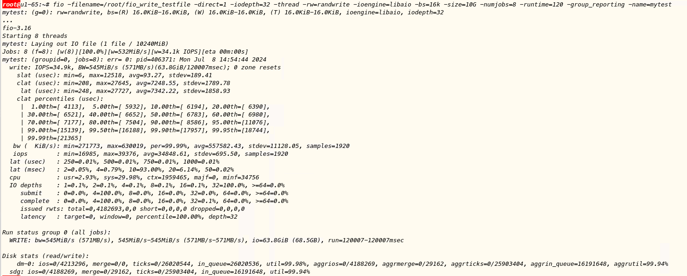
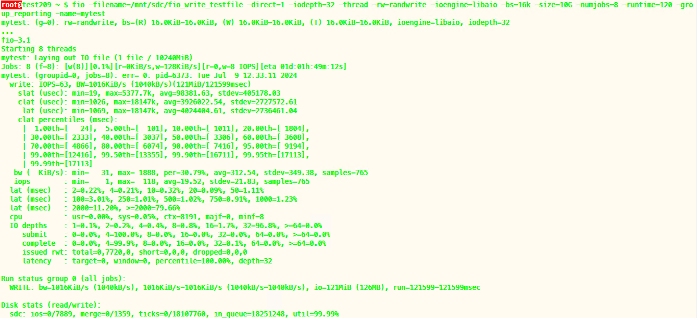

# TS-4785 [中核研究院] Create db 性能问题分析

### 1. 磁盘io性能导致的影响

分析对比了65，209几个机器上执行create db的耗时。

测试的sql：
Create database db vgroups 64;

测试结果：
在65上执行：2秒以内
在209上执行：70+ 秒

原因分析：
从日志中看，create vnode操作执行时间长。create vnode涉及很多个操作，但是并没有发现某个操作耗时特别长。并且发现这些操作中，很多都是磁盘操作，并且每个磁盘操作，在35和209上明显比在65上的耗时长。

对比2个机器的io性能，发现209的磁盘性能，明显比65差：
209的io：
clat (usec): min=1026, max=18147k, avg=3926022.54, stdev=2727572.61
65的io:
clat (usec): min=208, max=27645, avg=7248.55, stdev=1789.78

clat代表完成 io操作的耗时，完整的测试结果放在附录中。

另外，在192.168.1.54，192.168.1.35两台机器上也做了测试，54上建库很快，35上建库很慢，用同样的fio命令对比io性能，54的磁盘io性能好，35的磁盘io性能差。

### 2. 多线程导致的影响

Create vnode采用的是单线程执行。

改成多线程实现，采用16个线程，测试如下：
taos> create database test1 vgroups 64;
Create OK, 0 row(s) affected (27.590953s)

对比单线程实现，测试如下：
taos> create database test2 vgroups 64;
Create OK, 0 row(s) affected (104.771098s)

### 3. 结论

1. I/O 快的机器上建库速度没问题，在I/O慢的机器上有问题
2. 改成多线程实现，会加快执行速度，但是在I/O慢的机器上，仍然是个很长的时间

### 4. 附录

65的io测试结果：

209的io测试结果：

