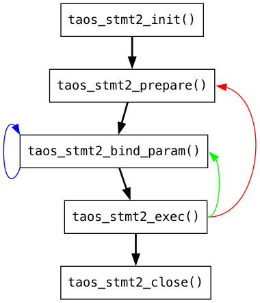

# stmt2 功能规格

## 1. 背景

需求来源于两个 jira: [TD-30813](https://jira.taosdata.com:18080/browse/TD-30813) [TD-30355](https://jira.taosdata.com:18080/browse/TD-30355)
设计 stmt2 API，简化 stmt API 编程以满足上面两个 jira 提出的需求。

## 2. 变更历史

| 日期 | 版本 | 负责人 | 主要修改内容 |
| --- | --- | --- | --- |
| 2024/07/31 | 0.1 | 金明磊 | 初稿 |
| 2024/08/05 | 0.2 | 金明磊 | 根据 8/1 日线下 review 结论修改 |
|  | 1.0 |  |  |

## 3. 定义

stmt2 API: 预处理语句版本 2 API。

## 4. 行为说明

**接口使用详细说明见**：[stmt2 API函数使用说明](https://taosdata.feishu.cn/wiki/HTKHw4Mhpi2aTvkU49gcoTr3nKd)

### 4.1 stmt2 API

之前版本的 stmt API 共有 24 个函数，简化后的 stmt2 API 共 10 个函数。
```c
typedef void TAOS_STMT2;

typedef enum {
  TAOS_FIELD_COL = 1,
  TAOS_FIELD_TAG,
  TAOS_FIELD_QUERY,
  TAOS_FIELD_TBNAME,
} TAOS_FIELD_T;

typedef struct {
  int64_t reqId;
  bool    singleStbInsert;
  bool    singleTableBindOnce;
  __taos_async_fn_t asyncExecFn;
  void    *userdata;  
} TAOS_STMT2_OPTION;

typedef struct {
  int       buffer_type;
  void     *buffer;
  uintptr_t buffer_length;
  int32_t  *length;
  char     *is_null;
  int       num;
} TAOS_STMT2_BIND;

typedef struct {
  int               count;
  char            **tbnames;
  TAOS_STMT2_BIND **tags;
  TAOS_STMT2_BIND **bind_cols;
} TAOS_STMT2_BINDV;

DLL_EXPORT TAOS_STMT2 *taos_stmt2_init(TAOS *taos, TAOS_STMT2_OPTION *option);
DLL_EXPORT int         taos_stmt2_prepare(TAOS_STMT2 *stmt, const char *sql, unsigned long length);
DLL_EXPORT int         taos_stmt2_bind_param(TAOS_STMT2 *stmt, TAOS_STMT2_BINDV *bindv, int32_t col_idx);
DLL_EXPORT int         taos_stmt2_exec(TAOS_STMT2 *stmt, int *affected_rows);
DLL_EXPORT int         taos_stmt2_close(TAOS_STMT2 *stmt);
DLL_EXPORT int         taos_stmt2_is_insert(TAOS_STMT2 *stmt, int *insert);
DLL_EXPORT int  taos_stmt2_get_fields(TAOS_STMT2 *stmt, TAOS_FIELD_T field_type, int *count, TAOS_FIELD_E **fields);
DLL_EXPORT void taos_stmt2_free_fields(TAOS_STMT2 *stmt, TAOS_FIELD_E *fields);
DLL_EXPORT TAOS_RES *taos_stmt2_result(TAOS_STMT2 *stmt);
DLL_EXPORT char     *taos_stmt2_error(TAOS_STMT2 *stmt);
```

#### 4.1.1 stmt2 句柄

```c
typedef void TAOS_STMT2;
```

对应之前版本的 TAOS_STMT 句柄，用户通过调用 taos_stmt2_init 函数，可以获取 stmt2 句柄，在后续的 API 中通过此句柄使用预处理语句功能；实例不再需要时，可以通过调用 taos_stmt2_close 函数释放此句柄。

#### 4.1.2 stmt2 枚举

```c
typedef enum {
  TAOS_FIELD_COL = 1,
  TAOS_FIELD_TAG,
  TAOS_FIELD_QUERY,
  TAOS_FIELD_TBNAME,
} TAOS_FIELD_T;
```

新增枚举类型 TAOS_FIELD_T，在调用 taos_stmt2_get_fields 函数时使用，用于区分 col, tag, query, tbname 四种类型，其中 query, tbname 两种类型只能获取个数，暂不支持具体元数据的获取。

#### 4.1.3 stmt2 结构体

```c
typedef struct {
  int64_t reqId;
  bool    singleStbInsert;
  bool    singleTableBindOnce;
  __taos_async_fn_t asyncExecFn;
  void    *userdata;  
} TAOS_STMT2_OPTION;

typedef struct {
  int       buffer_type;
  void     *buffer;
  int32_t  *length;      //buffer中每个元素长度
  char     *is_null;     //buffer中每个元素是否为null
  int       num;         //绑定的行数
} TAOS_STMT2_BIND;

typedef struct {
  int               count;    // 绑定行数 = num
  char            **tbnames;  //长度由？数量决定，preparesql可以得到
  TAOS_STMT2_BIND **tags;     //长度由？数量决定，preparesql可以得到
  TAOS_STMT2_BIND **bind_cols;//长度由？数量决定，preparesql可以得到
} TAOS_STMT2_BINDV;
```

前两个分别对应之前版本的 TAOS_STMT_OPTIONS 和 TAOS_MULTI_BIND，选项中新增异步发送功能，bind 结构中消除空洞，通过 length 数组中的长度数据表示每一项元素在 buffer 中占用的字节数量；其中 is_null 数组中，0 表示 Value，1 表示 NULL， 2 表示 NONE。
新增 TAOS_STMT2_BINDV 结构，可以一次绑定一批表，count 表示需要绑定的表数量，tags 与 bind_cols 分别表示待绑定的标签值与数据，与 tbnames 中的表名称一一对应。
如果指定了 asyncExecFn 选项，则 taos_stmt2_exec 执行时，会异步把请求（写入或查询）发送到服务端，然后返回，具体结果通过 asyncExecFn 回调函数通知应用。如果未指定此参数，则和之前版本一样，同步发送此请求，服务端返回结果后，taos_stmt2_exec 函数才会返回。
__taos_async_fn_t 的声明如下：
```c {wrap}
typedef void (*__taos_async_fn_t)(void *userdata, TAOS_RES *res, int code);
```

其中第一个参数是 TAOS_STMT2_OPTION 结构体中的 userdata，第二个参数  res 表示结果集，与函数 taos_stmt2_result 返回值一样，不可使用 taos_free_result 释放，
必须调用 taos_stmt2_close 释放。

#### 4.1.4 stmt2 函数

```c {wrap}
DLL_EXPORT TAOS_STMT2 *taos_stmt2_init(TAOS *taos, TAOS_STMT2_OPTION *option);
DLL_EXPORT int         taos_stmt2_prepare(TAOS_STMT2 *stmt, const char *sql, unsigned long length);
DLL_EXPORT int         taos_stmt2_bind_param(TAOS_STMT2 *stmt, TAOS_STMT2_BINDV *bindv, int32_t col_idx);
DLL_EXPORT int         taos_stmt2_exec(TAOS_STMT2 *stmt, int *affected_rows);
DLL_EXPORT int         taos_stmt2_close(TAOS_STMT2 *stmt);
DLL_EXPORT int         taos_stmt2_is_insert(TAOS_STMT2 *stmt, int *insert);
DLL_EXPORT int  taos_stmt2_get_fields(TAOS_STMT2 *stmt, TAOS_FIELD_T field_type, int *count, TAOS_FIELD_E **fields);
DLL_EXPORT int taos_stmt2_get_fields(TAOS_STMT2 *stmt, int *count, TAOS_FIELD_ALL **fields) 
DLL_EXPORT void taos_stmt2_free_fields(TAOS_STMT2 *stmt, TAOS_FIELD_E *fields);
DLL_EXPORT TAOS_RES *taos_stmt2_result(TAOS_STMT2 *stmt);
DLL_EXPORT char     *taos_stmt2_error(TAOS_STMT2 *stmt);
```

taos_stmt2_init：
使用指定的 option 选项（见 4.1.3 节）初始化 stmt2 实例，返回 stmt2 句柄，如果失败，返回 NULL。
taos_stmt2_prepare：
记录需要预处理的 SQL 语句，如果 stmt 或 sql 参数为空，返回 TSDB_CODE_INVALID_PARA，成功时返回 0。
taos_stmt2_bind_param：
绑定参数的具体值，如果不需要指定 tbname 或 tags，可将 bindv 结构中对应的值指定为 NULL，如果不需要指定绑定列则 col_idx 传入 -1 即可，如果 stmt 参数为空，返回 TSDB_CODE_INVALID_PARA，如果初始化后未调用 prepare 接口就直接绑定，返回 TSDB_CODE_TSC_STMT_API_ERROR，成功时返回 0。
指定表名只适用于 insert 类型的语句，查询语句中不支持表名参数化，如果绑定表名，则返回 TSDB_CODE_TSC_STMT_API_ERROR。
taos_stmt2_exec：
执行已绑定参数的 SQL 语句，如果不需要 affected_rows 或使用异步请求，可指定为 NULL，如果 stmt 参数为空，返回 TSDB_CODE_INVALID_PARA，如果未绑定参数，返回 TSDB_CODE_TSC_STMT_API_ERROR，成功时返回 0。
taos_stmt2_close：
关闭 stmt2，调用后 stmt2 句柄不再可用，如果 stmt 参数为空，返回 TSDB_CODE_INVALID_PARA，否则返回 0。
taos_stmt2_is_insert：
通过第二个参数返回当前绑定的是否写入语句，如果 stmt 或 insert 参数为空，返回 TSDB_CODE_INVALID_PARA，成功时返回 0。
~~taos_stmt2_get_fields~~~~：~~
~~返回当前待绑定参数的元数据信息，通过第二个参数 field_type 指定需要获取的数据类型，如果 stmt 或 count 参数为空，或 field_type 为未知值，返回 TSDB_CODE_INVALID_PARA，成功时返回 0。~~
taos_stmt2_get_fields：
返回当前所有绑定参数的元数据信息TAOS_FIELD_ALL，field_type包含TAOS_FIELD_COL，TAOS_FIELD_TAG, TAOS_FIELD_TBNAME, 返回的顺序即为？的顺序。目前支持所有insert的语法；select语法之支持返回参数数量count
```cpp
typedef struct TAOS_FIELD_ALL {
  char         name[65];
  int8_t       type;
  uint8_t      precision;
  uint8_t      scale;
  int32_t      bytes;
  uint8_t      field_type;
} TAOS_FIELD_ALL;

```

当sql类型为query时，则只返回绑定数据的数量，即'?'数量count
taos_stmt2_free_fields：
释放 taos_stmt2_get_fields 函数返回的元数据信息，无返回值。
taos_stmt2_result：
返回 TAOS_RES 句柄，供查询使用，不可使用 taos_free_result 释放。
taos_stmt2_error：
返回字符串类型的错误信息。
除最后三个函数及第一个初始化函数外，其它六个函数的返回值均为 int 类型，如果成功则返回 0，如果出错则返回非 0 值的错误码，具体错误信息可通过错误获取函数 taos_stmt2_error 得到。

### 4.2 示例程序

下面是一个使用 stmt2 API 的示例程序：
```c {wrap}
#include <stdio.h>
#include <stdlib.h>
#include <string.h>
#include "taos.h"

void do_query(TAOS* taos, const char* sql) {
  TAOS_RES* result = taos_query(taos, sql);
  int       code = taos_errno(result);
  if (code) {
    printf("failed to query: %s, reason:%s\n", sql, taos_errstr(result));
    taos_free_result(result);
    return;
  }
  taos_free_result(result);
}

void do_stmt(TAOS* taos) {
  do_query(taos, "drop database if exists db");
  do_query(taos, "create database db");
  do_query(taos, "create table db.stb (ts timestamp, b binary(10)) tags(t1 int, t2 binary(10))");

  struct {
    int64_t ts[2];
    char    b[16];
  } v;

  int32_t           b_len[2], t64_len[2];
  char              is_null[2] = {0};
  TAOS_STMT2_OPTION option = {0};
  char*             tbs[2] = {"tb", "tb2"};
  int               t1_val[2] = {0, 1};
  int               t2_len[2] = {3, 3};
  TAOS_STMT2_BIND   tags[2][2] = {{{0, &t1_val[0], NULL, NULL, 0}, {0, "a1", &t2_len[0], NULL, 0}},
                                  {{0, &t1_val[1], NULL, NULL, 0}, {0, "a2", &t2_len[1], NULL, 0}}};
  TAOS_STMT2_BIND   params[2][2] = {
        {{TSDB_DATA_TYPE_TIMESTAMP, v.ts, t64_len, is_null, 2}, {TSDB_DATA_TYPE_BINARY, v.b, b_len, is_null, 2}},
        {{TSDB_DATA_TYPE_TIMESTAMP, v.ts, t64_len, is_null, 2}, {TSDB_DATA_TYPE_BINARY, v.b, b_len, is_null, 2}}};
  TAOS_STMT2_BIND* tagv[2] = {&tags[0][0], &tags[1][0]};
  TAOS_STMT2_BIND* paramv[2] = {&params[0][0], &params[1][0]};
  TAOS_STMT2_BINDV bindv = {2, &tbs[0], &tagv[0], &paramv[0]};

  TAOS_STMT2* stmt = taos_stmt2_init(taos, &option);
  const char* sql = "insert into db.? using db.stb tags(?, ?) values(?,?)";
  int         code = taos_stmt2_prepare(stmt, sql, 0);
  if (code != 0) {
    printf("failed to execute taos_stmt2_prepare. error:%s\n", taos_stmt2_error(stmt));
    taos_stmt2_close(stmt);
    return;
  }
  
  int             fieldNum = 0;
  TAOS_FIELD_STB *pFields = NULL;
  code = taos_stmt2_get_stb_fields(stmt, &fieldNum, &pFields);
  if (code != 0) {
    printf("failed get col,ErrCode: 0x%x, ErrMessage: %s.\n", code,      taos_stmt2_error(stmt));
  } else {
    printf("col nums:%d\n", fieldNum);
    for (int i = 0; i < fieldNum; i++) {
      printf("field[%d]: %s, data_type:%d, field_type:%d\n", i,pFields[i].name, pFields[i].type,pFields[i].field_type);
    }

  int64_t ts = 1591060628000;
  for (int i = 0; i < 2; ++i) {
    v.ts[i] = ts++;
    t64_len[i] = sizeof(int64_t);
  }
  strcpy(v.b, "abcdefg");
  b_len[0] = (int)strlen(v.b);
  strcpy(v.b + b_len[0], "xyz");
  b_len[1] = 3;

  taos_stmt2_bind_param(stmt, &bindv, -1);

  if (taos_stmt2_exec(stmt, NULL)) {
    printf("failed to execute insert statement.error:%s\n", taos_stmt2_error(stmt));
    taos_stmt2_close(stmt);
    return;
  }

  taos_stmt2_close(stmt);
}

int main() {
  TAOS* taos = taos_connect("localhost", "root", "taosdata", "", 0);
  if (!taos) {
    printf("failed to connect to db, reason:%s\n", taos_errstr(taos));
    exit(1);
  }

  do_stmt(taos);
  taos_close(taos);
  taos_cleanup();
}
```

示例中用到的是核心的五个 API：
taos_stmt2_init
taos_stmt2_prepare
taos_stmt2_bind_param
taos_stmt2_exec
taos_stmt2_close
编译运行后可使用 select * from db.tb; 语句查看写入的数据。

#### 4.2.1 典型使用流程



上图是 API 典型的使用流程：
调用 taos_stmt2_bind_param 后，可以循环绑定参数，或进行下一步，调用 taos_stmt2_exec 以执行本次绑定的数据。
调用 taos_stmt2_exec 后，可以继续调用 taos_stmt2_bind_param 绑定参数，或调用 taos_stmt2_prepare 改变预处理语句。

### 4.3 API 升级

本节对之前版本的 24 个函数进行升级说明。

#### 4.3.1 初始化及关闭

之前版本初始化有三个函数：
taos_stmt_init(TAOS *taos)；
taos_stmt_init_with_reqid(TAOS *taos, int64_t reqid)；
taos_stmt_init_with_options(TAOS *taos, TAOS_STMT_OPTIONS* options)；
stmt2 版本统一使用：
taos_stmt2_init(TAOS *taos, TAOS_STMT2_OPTION *option)；
reqid 及其它选项统一通过第二个参数传入初始化函数。
关闭使用 taos_stmt2_close(TAOS_STMT2 *stmt)，代替之前版本的关闭函数 taos_stmt_close(TAOS_STMT *stmt)。

#### 4.3.2 数据绑定

标记预处理 SQL 语句使用 taos_stmt2_prepare，类似于之前版本的 taos_stmt_prepare，不同于之前版本的是，stmt2 允许在预处理语句中直接指定数据库名称，不再需要使用 use <dbname>; 语句指定。
之前版本的 
taos_stmt_set_tbname，
taos_stmt_set_tags，
taos_stmt_set_sub_tbname，
taos_stmt_set_tbname_tags，
taos_stmt_bind_param，
taos_stmt_bind_param_batch，
taos_stmt_bind_single_param_batch，
等七个函数，stmt2 版本统一使用：
DLL_EXPORT int         taos_stmt2_bind_param(TAOS_STMT2 *stmt, TAOS_STMT2_BINDV *bindv, int32_t col_idx);
之前版本的 taos_stmt_add_batch 函数直接去掉，不再需要单独显式调用。
之前版本的 taos_stmt_execute，使用 taos_stmt2_exec 代替。

#### 4.3.3 参数获取

之前版本的
taos_stmt_get_tag_fields，
taos_stmt_get_col_fields，
taos_stmt_num_params，
等三个函数，stmt2 版本统一使用：
taos_stmt2_get_fields(TAOS_STMT2 *stmt, TAOS_FIELD_T field_type, int *count, TAOS_FIELD_E **fields);
具体类型通过第二个参数 field_type 指定，如果是查询，则指定第四个参数 fields 为 NULL，通过第三个参数返回参数个数。
释放使用 taos_stmt2_free_fields 代替 taos_stmt_reclaim_fields。

#### 4.3.4 其它函数

taos_stmt_is_insert，使用 taos_stmt2_is_insert 代替。
taos_stmt_errstr，使用 taos_stmt2_error 代替。
taos_stmt_use_result，使用 taos_stmt2_result 代替。
taos_stmt_affected_rows_once，使用 taos_stmt2_exec 第二个参数返回。
taos_stmt_affected_rows，可根据 taos_stmt2_exec 第二个参数自行统计，不再提供这个 API。
taos_stmt_get_param，重复 API，可使用参数获取 taos_stmt2_get_fields 代替。 

## 5. 性能

对启动性能无影响，stmt2 API 的写入、查询性能不低于之前版本。

## 6. 兼容性

新增 API，不影响原有 API 的兼容性。

## 7. 运维

无。

## 8. 使用场景

对本特性被用到的使用场景与之前版本相同，主要应用在避免重复解析 SQL 语句的场景。

## 9. 约束和限制

约束：无
限制：stmt2 API 放宽了一些之前版本的限制，详见行为说明中 API 升级一节。

## 10. 常见错误和排查

stmt2 API 基本流程同之前的版本，在 API 数量上进行了简化，对于之前版本中去除的 API 迁移，请参考行为说明中 API 升级一节。

## 11. 可观测性

对 taos shell, taos Explorer， TDinsight 等基于 UI 或用户交互界面的产品组件无影响。

## 12. 安装和卸载

对安装和卸载脚本无要求。

## 13. 文档

不需要修改企业版文档
暂不需要修改官网文档（需要等 API 稳定后再公开到官网文档）

## 14. 参考文档

TD-30355


TD-30813

[参数绑定模块设计总结](https://taosdata.feishu.cn/docx/ULoZdtUsZokmryxoRT2cYHOynye)

## 15. 附录

主要基于 stmt 原有实现，简化 API 交互，提供异步操作方式，并修复之前优化引入的缺陷。
