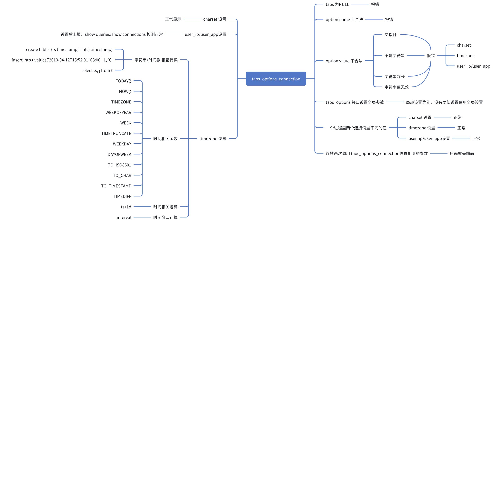

# taosc 支持连接级别设置

## 1. 背景

1. [TS-5385](https://jira.taosdata.com:18080/browse/TS-5385)
2. [TD-32642](https://jira.taosdata.com:18080/browse/TD-32642)

## 2. 变更历史

| 日期 | 版本 | 负责人 | 主要修改内容 |
| --- | --- | --- | --- |
| 2024/11/01 | 0.1 | 王明明 | 初稿 |
| 2024/11/06 | 0.2 | 王明明 | 增加详细行为说明，测试场景 |
| 2024/11/08 | 0.3 | 王明明 | 增加接口线程安全性，优先级说明 |
|  |  |  |  |

## 3. 定义

无

## 4. 行为说明

### 4.1 现有设置参数接口

```java
typedef enum {
  TSDB_OPTION_LOCALE,
  TSDB_OPTION_CHARSET,
  TSDB_OPTION_TIMEZONE,
  TSDB_OPTION_CONFIGDIR,
  TSDB_OPTION_SHELL_ACTIVITY_TIMER,
  TSDB_OPTION_USE_ADAPTER,
  TSDB_MAX_OPTIONS
} TSDB_OPTION;

int taos_options(TSDB_OPTION option, const void *arg, ...)
```

### 4.2 新增设置连接参数的接口

```java
typedef enum {
  TSDB_OPTION_CONNECTION_CLEAR = -1,     // means clear all option in this connection
  TSDB_OPTION_CONNECTION_CHARSET,        // charset, Same as the scope supported by the system
  TSDB_OPTION_CONNECTION_TIMEZONE,       // timezone, Same as the scope supported by the system
  TSDB_OPTION_CONNECTION_USER_IP,        // user ip
  TSDB_OPTION_CONNECTION_USER_APP,       // user app, max lengthe is 23, truncated if longer than 23
  TSDB_MAX_OPTIONS_CONNECTION
} TSDB_OPTION_CONNECTION;

/*
 description:
    Can be used to set extra connect options and affect behavior for a connection. This function may be called multiple times to set several options. 
    Call taos_connect() after taos_connect() or taos_connect_auth().
    The option argument is the option that you want to set; the arg argument is the value for the option.
 input:
    taos:   returned by taos_connect
    option: option name
    arg:    option value(string), if arg is NULL, means reset this option
 output:
    0        -     success
    others   -     fail, error msg can be got by taos_errstr(NULL)
*/
int taos_options_connection(TAOS *taos, TSDB_OPTION_CONNECTION option, const void *arg, ...)
```

接口说明：
1. 可用于设置额外的连接选项并影响连接的行为，可以多次调用此函数以设置多个选项。
2. 使用之前，需调用 taos_connect() 或 taos_connect_auth() 获取 TAOS* 类型的连接。
3. 选项参数是要设置的选项，option 参数是选项的名称，arg参数是选项的值。
  具体的选项名称如下：
   - TSDB_OPTION_CONNECT_CHARSET （arg 类型为 char *）设置连接的字符编码，取值参考操作系统。
   - TSDB_OPTION_CONNECT_TIMEZONE （arg 类型为 char *)  设置连接的时区，取值参考操作系统。
   - TSDB_OPTION_CONNECTION_USER_IP  （arg 类型为 char *)  设置连接的额外 用户 ip 信息。
   - TSDB_OPTION_CONNECTION_USER_APP  （arg 类型为 char *)  设置连接的额外 用户app 信息。
1. 多次调用 taos_options_connection 接口设置相同的配置时，以后面的为准。
2. 该接口是线程安全的，可以多线程同时设置，但是行为是未定义的。
3. taos_options_connection 接口设置的配置优先级高于 taos_options 接口设置的配置。
4. Windows 平台不支持设置链接级别的 timezone 配置。
5. 举例：
```cpp
const char *host = "localhost";
const char *user = "root";
const char *passwd = "taosdata";
const char *db = "db";
uint16_t    port = 0;
TAOS       *taos = taos_connect(host, user, passwd, db, port);
if (taos == NULL) {
  int errno = taos_errno(NULL);
  char *msg = taos_errstr(NULL);
  printf("%d, %s\n", errno, msg);
}
int code = taos_options_connection(taos, TSDB_OPTION_CONNECT_CHARSET, "gbk");
if (code != 0){
    char *msg = taos_errstr(NULL);
    printf("%d, %s\n", code, msg);
}
code = taos_options_connection(taos, TSDB_OPTION_CONNECT_TIMEZONE, "Asia/Singapore");
if (code != 0){
    char *msg = taos_errstr(NULL);
    printf("%d, %s\n", code, msg);
}
code = taos_options_connection(taos, TSDB_OPTION_CONNECTION_USER_IP, "192.168.1.90");
if (code != 0){
    char *msg = taos_errstr(NULL);
    printf("%d, %s\n", code, msg);
}
code = taos_options_connection(taos, TSDB_OPTION_CONNECTION_USER_APP, "client");
if (code != 0){
    char *msg = taos_errstr(NULL);
    printf("%d, %s\n", code, msg);
}

```

### 4.3 影响场景

charset 和 timezone 的设置只影响 taosc 侧的相关计算行为，对 taosd 侧做的计算不起作用。

#### 4.3.1 Timezone

```java
create table t(ts timestamp, c1 int, c2 timestamp, c3 nchar(32));
```

1. 写入
写入带时区的字符串，按照字符串里的时区解析字符串时间，然后写入
写入不带时区的字符串，按照连接里设置的时区（不设置时为系统时区）解析字符串时间，然后写入
```java
// timezone 为 UTC 时区
insert into t values('2013-04-12T10:52:01', 1, 3, '2013-04-12T10:52:01');

// timezone 为 UTC-8 时区
insert into t values('2013-04-12T10:52:01', 1, 3, '2013-04-12T10:52:01');
insert into t values('2013-04-12T10:52:01+08:00', 1, 3, '2013-04-12T10:52:01');
```

1. 查询
查询时间戳以字符串形式显示时，根据当前查询连接设置的时区解析时间戳。
```java
// timezone 为 UTC 时区
taos> select * from t;
           ts            |      c1     |          c2             |           c3          |
==========================================================================================
 2023-04-12 10:52:01.000 |           1 | 1970-01-01 00:00:00.003 |   2013-04-12T10:52:01
 2023-04-12 02:52:01.000 |           1 | 1970-01-01 00:00:00.003 |   2013-04-12T10:52:01 
 
 // timezone 为 UTC-8 时区
 taos> select * from t;
           ts            |      c1     |            c2           |           c3
==========================================================================================
 2023-04-12 18:52:01.000 |           1 | 1970-01-01 08:00:00.003 |   2013-04-12T10:52:01
 2023-04-12 10:52:01.000 |           1 | 1970-01-01 08:00:00.003 |   2013-04-12T10:52:01
```

1. 函数
   - 受影响函数：
      - TIMEZONE()  
TIMETRUNCATE()  
NOW()   
WEEK() 
WEEKOFYEAR() 
WEEKDAY() 
DAYOFWEEK() 
TO_ISO8601()  
TO_UNIXTIMESTAMP()   
TO_CHAR()  
TO_TIMESTAMP()
CASE(expr as timestamp)
      - 上面每个函数做计算时，都是根据连接设置的时区来处理，然后返回相应时区的结果(只对 taosc 侧的相关函数计算行为起作用，对 taosd 侧做的计算不起作用)
  ```java
  // client 端连接 timezone 为 UTC-8 时区， server 端 timezone 为 UTC 时区
   taos> select c3,WEEK(c3) from t;
             c3            |       WEEK(c3)
  ==================================================
      2013-04-12T19:52:01  |         4
      2013-04-12T19:52:01  |         4
   
   
   taos> select '2013-04-12T19:52:01', WEEK(2013-04-12T19:52:01) from t;
     '2013-04-12T19:52:01' |  WEEK(2013-04-12T19:52:01)
  ======================================================
      2013-04-12T19:52:01  |         5
      2013-04-12T19:52:01  |         5
  ```

  
   - 不受影响时间函数：
  ```java
  TIMEDIFF()
  ```

#### 4.3.2 Charset

```java
create table t(ts timestamp, i nchar(16), j binary(16));
```

1. 写入
写入字符串字面量时将根据设置的连接 charset 解析，如果字符串字面量的编码和 charset 设置的编码不一样，根据具体的字符串不同可能报错或者写入乱码。
```java
// charset 为 gbk
insert into t values('2013-04-12T10:52:01', "中国", "大幅");

// charset 为 utf-8
insert into t values('2013-04-12T10:53:01', "中国", "大幅");
```

1. 查询
查询时将根据设置的连接 charset 解析。
```java
//  charset 为 gbk
taos> select * from t;
           ts            |      i      |            j            |
==================================================================
 2023-04-12 10:52:01.000 |      中国    |         大幅             |
 2023-04-12 02:52:01.000 |      中国    |         乱码或报错        |
 
 // charset 为 utf-8
 taos> select * from t;
           ts            |      i      |            j            |
==================================================================
 2023-04-12 18:52:01.000 |     中国     |          乱码或报错       |
 2023-04-12 10:52:01.000 |     中国     |          大幅            |
```

#### 4.3.3 user_ip/user_app

影响如下 show 显示，增加 user_ip/user_app 列
Show queries
```java
taos> show queries;
           kill_id            |       query_id        |   conn_id   |            app             |     pid     |            user            |        end_point         |       create_time       |       exec_usec       | stable_query | sub_query |   sub_num   |           sub_status           |              sql               |     user_app            |      user_ip
===============================================================================================================================================================================================================================================================================================================================================================================
 80eb219b:6                   |   7093881124925931556 |  2162893211 | taos                       |      402055 | root                       | 127.0.0.1:45526          | 2024-11-06 15:07:02.031 |                722491 | false        | false     |           1 | 4:EXECUTING                    | select * from db.t1;           |      client1            |      192.168.1.2
Query OK, 1 row(s) in set (0.015912s)
```

Show connections
```java
taos> show connections;
   conn_id   |            user            |            app             |     pid     |           end_point            |       login_time        |       last_access       |        user_app          |        user_ip
===========================================================================================================================================================================================================================
  1308951853 | root                       | taos                       |      399953 | 127.0.0.1:46202                | 2024-11-06 14:47:32.421 | 2024-11-06 14:48:57.974 |        client1           |         192.168.12.2
  3918802458 | root                       | taos                       |      400046 | 127.0.0.1:52778                | 2024-11-06 14:48:48.853 | 2024-11-06 14:48:57.859 |        client1           |         192.168.12.2
Query OK, 2 row(s) in set (0.013963s)
```

## 5. 性能

UT 测试：自定义实现测 localtime_rz 和系统 localtime 性能比较。通过1000万次循环调用，统计用时。
系统测试：通过 taosBenchmark 写入 1 亿条数据，对比设置 timezone和不设置timezone 的写入/查询性能（其他三个配置没有性能问题）。

## 6. 兼容性

无影响。

## 7. 运维

无影响。

## 8. 使用场景

 举例：taosadapter里不同应用的连接可以设置不同的连接参数。

## 9. 约束和限制

charset 和 timezone 的设置只影响 taosc 的行为，对 taosd 不起作用。

## 10. 常见错误和排查 

无影响。

## 11. 可观测性

无影响。

## 12. 安装和卸载

需修改安装卸载脚本，将 timezone database 安装到 share 目录供 TD 使用。

## 13. 文档

连接器  ->  c/c++  ->  api 增加  taos_options_connection 的 API 说明

## 14. 参考文档

mysql:
[https://dev.mysql.com/doc/c-api/9.1/en/mysql-options.html](https://dev.mysql.com/doc/c-api/9.1/en/mysql-options.html)
[https://dev.mysql.com/doc/refman/8.4/en/set-variable.html](https://dev.mysql.com/doc/refman/8.4/en/set-variable.html)
 
postgreSql:
[https://www.postgresql.org/docs/current/sql-set.html](https://www.postgresql.org/docs/current/sql-set.html)
[https://doxygen.postgresql.org/fe-connect_8c_source.html](https://doxygen.postgresql.org/fe-connect_8c_source.html)

## 15. 附录

### 15.1 TEST CASE：




### 15.2 实现方案

#### 15.2.1 timezone 设置实现

1. 下载 timezone 库 https://github.com/eggert/tz.git，使用zic 工具转换时区数据文件到 share 目录下供加载使用
2. 修改 tz 库相关的代码实现 location 和 mktime 功能类似的有时区参数的替换函数，（需要实现多线程安全的函数，windows 版本也需考虑）。
3. location 和 mktime 替换函数，考虑使用线程局部变量 timezone，避免很多函数要修改函数签名（时间相关的操作都是字面量处理，和taosQuery() 在一个线程里，可以使用线程局部变量，简化实现方式）。
4. STscObj 结构增加 optionInfo 类型的变量，设置的时候绑定到 STscObj 上，taosQuery 开始的位置用 STscObj 上的 optionInfo 信息设置 timezone 线程局部变量，后面处理时间时候可以直接使用（如果timezone 局部变量为空，使用系统的timezone）。
```java
typedef struct {
  TIMEZONE     *tz;
  char          charset[TD_LOCALE_LEN];
  char          app[TSDB_APP_NAME_LEN];
  uint32_t      ip;
} optionInfo;
```

#### 15.2.2 Charset 设置实现

1. Charset 的实现同样使用线程局部变量 charset 来实现（在处理线程开始出将 charset 设置进去，内部使用时取出）。在每次做字符转换的时候将取出的 charset 传入 iconv_open函数

#### 15.2.3 user_ip/user_app 设置实现

1. 复用现有的上报逻辑，只需在 SClientHbReq 结构里增加相应字段，通过心跳里传递到mnode，供 show queries/ show connections 使用。

### 15.3 TD 相关场景梳理 (自测使用)

create table t(ts timestamp, i int, j timestamp);
insert into t values('2013-04-12T15:52:01+08:00', 1, 3);

taos> select * from t;
           ts            |      i      |            j            |
==================================================================
 2023-04-12 15:52:01.000 |           1 | 1970-01-01 08:00:00.003 |
 2023-04-12 23:52:01.000 |           1 | 1970-01-01 08:00:00.003 |
 2023-10-12 12:34:56.000 |           1 | 1970-01-01 08:00:00.003 |
Query OK, 3 row(s) in set (0.001343s)


字符串转时间戳
taosParseTime 字符串转为为时间戳  需要考虑 timezone，unixtimestap 转换为时间戳不需要考虑，因为存储的就是数字。
此处转换  string->tm->mktime->int64

时间戳转字符串
时间戳显示需要考虑 timezone. shellFormatTimestamp
此处转换  int64->localtime->tm->strftime->string


解析字符串到时间
parseTime -> parseTimestampOrInterval
today() 函数等

taosTimeAdd   ts+1n  +1y       

时间窗口 taosTimeCountIntervalForFill        不需要处理tz

taosTimeTruncate
addTimezoneParam
parseLocaltimeDst     

tz 影响时间函数：TIMEZONE()  TIMETRUNCATE()  NOW()   WEEK() WEEKOFYEAR() WEEKDAY() DAYOFWEEK() TO_ISO8601()  TO_UNIXTIMESTAMP()   TO_CHAR()  TO_TIMESTAMP()
tz 不影响的时间函数：TIMEDIFF()
